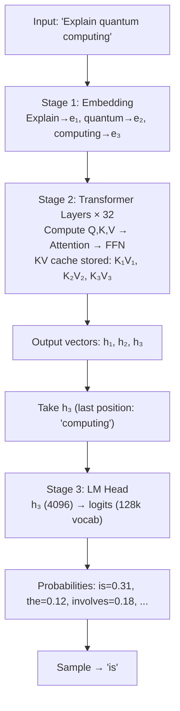
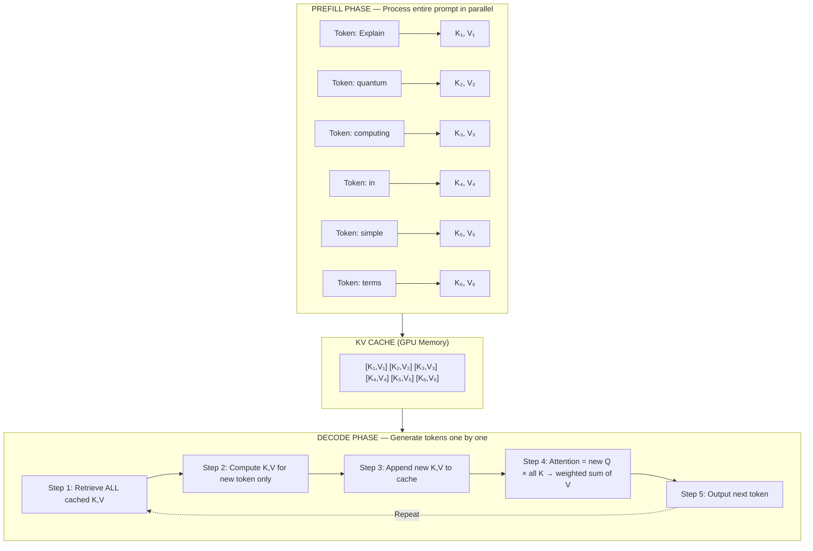
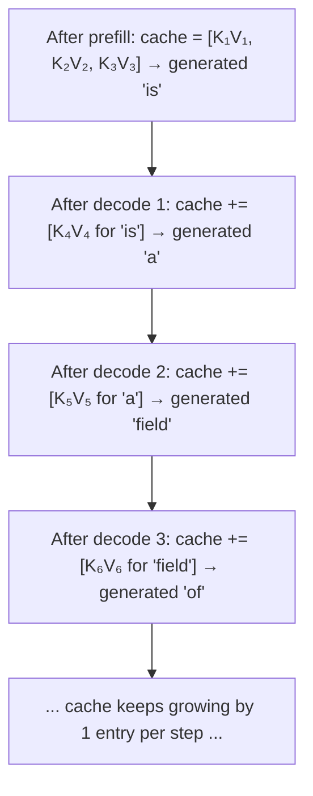
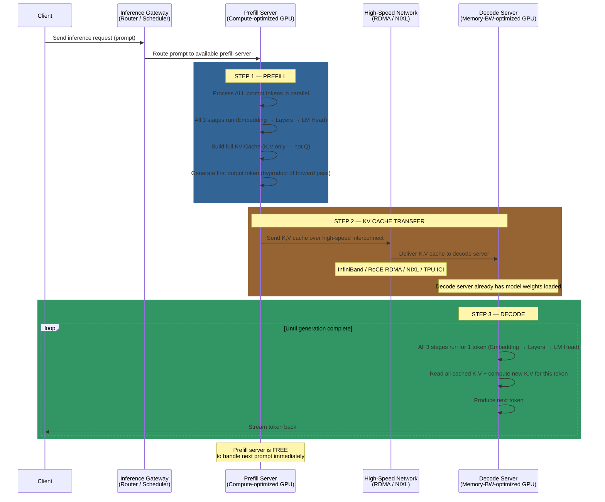
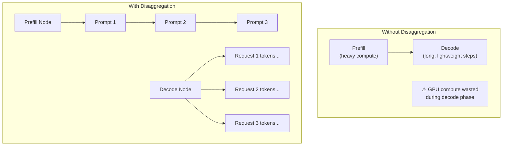
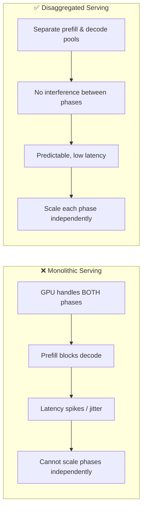

# Disaggregated Serving Concepts

## The 3 Stages of a Transformer Forward Pass

Before understanding disaggregated serving, it's essential to know what happens inside a single
forward pass through an LLM. Every forward pass consists of three stages.
Let's walk through each using the prompt `"Explain quantum computing"` as an example:

### Stage 1 — Embedding

Each input token is converted into a dense vector (e.g., 4096 dimensions).

**Example**: The 3 tokens in our prompt each become a vector:

- `"Explain"` → `e₁` (a vector of 4096 floats)
- `"quantum"` → `e₂` (a vector of 4096 floats)
- `"computing"` → `e₃` (a vector of 4096 floats)

These vectors capture the initial meaning of each token based on the model's learned vocabulary.

### Stage 2 — Transformer Layers (e.g., 32 layers for a 7B model)

Each layer does:

- Compute Q, K, V from the input vectors
- **Store K, V in the KV cache** (side effect)
- Perform self-attention: Q × Kᵀ → attention weights → weighted sum of V
- Pass through a feed-forward network (MLP)
- Output: a refined representation vector for each position

**Example**: Our 3 embedding vectors flow through all 32 layers. At each layer:

- Q₁,K₁,V₁ are computed for `"Explain"`, Q₂,K₂,V₂ for `"quantum"`, Q₃,K₃,V₃ for `"computing"`
- K₁,V₁, K₂,V₂, K₃,V₃ are **stored in the KV cache** (Q is used and discarded)
- Self-attention lets each token "look at" the others (e.g., `"computing"` attends to both `"Explain"` and `"quantum"` to build context)

After all 32 layers, we get 3 refined output vectors — one per input position:

- `h₁` (for `"Explain"`) — enriched with context from the full sequence
- `h₂` (for `"quantum"`) — enriched with context from the full sequence
- `h₃` (for `"computing"`) — **this is the one that matters for prediction**, because it's the last position and has "seen" the entire prompt via attention

### Stage 3 — LM Head (the prediction step)

The output vector at the **last position** is passed through a final linear projection
(the "LM head") that maps from hidden dimension to vocabulary size, producing a probability
distribution over the entire vocabulary. A token is then sampled from this distribution.

**Example**: `h₃` (the output vector for `"computing"`, size 4096) is projected:

```text
h₃ (4096 floats)
    ↓
LM Head: linear projection (4096 → 128,000 vocabulary entries)
    ↓
Logits (raw scores for every word):
    "the"=5.2, "is"=7.8, "a"=4.1, "was"=3.9, "involves"=6.3, ...
    ↓
Softmax → probabilities:
    P("the")=0.12, P("is")=0.31, P("a")=0.08, P("involves")=0.18, ...
    ↓
Sample → "is" (selected as the most probable next token)
```



> [!IMPORTANT]
> The KV cache and the next-token prediction are outputs of the **same** forward pass.
> The KV cache is a side effect of Stage 2; the predicted token comes from Stage 3.
> There is no separate step to "generate a token" — it's an inherent output of running the model.

### All 3 stages run in both prefill and decode

A common misconception is that prefill only does Stage 1+2 and decode only does Stage 3. In reality, **both phases run the full pipeline** — the difference is **how many tokens** are processed:

| | Prefill | Each Decode Step |
| --- | --- | --- |
| **Stage 1: Embedding** | Embed **all N** prompt tokens | Embed **1** new token |
| **Stage 2: Transformer Layers** | Compute Q,K,V for **all N** tokens; store K,V in cache | Compute Q,K,V for **1** token; read N cached K,V |
| **Stage 3: LM Head** | Run on **last position** → predict first output token | Run on **the 1 position** → predict next token |

---

## What is KV Cache

### The Problem It Solves

LLMs are **autoregressive** — they generate one token at a time. To produce each new token,
the model must "look back" at every previous token via the **self-attention** mechanism.
Without optimization, the model would **recompute attention for the entire sequence from scratch**
for every single new token, resulting in **O(n²) computational complexity** — prohibitively
slow for long sequences.

The **KV Cache** eliminates this redundancy by caching intermediate results, reducing per-token generation to **O(n)**.

### How Self-Attention Works (simplified)

In each Transformer attention layer, every input token is projected into three vectors:

| Vector | Role | Analogy |
| --- | --- | --- |
| **Query (Q)** | What this token is "looking for" | A search query |
| **Key (K)** | What this token "contains" (identity) | An index entry |
| **Value (V)** | The actual content to pass along | The document content |

To determine the next token, the model computes attention scores by taking the dot product
of the current token's **Query** against the **Keys** of all previous tokens, then uses
those scores as weights to sum the corresponding **Values**.

### How KV Caching Works

Instead of discarding the K and V vectors after computing them, the model **stores them in GPU memory**. The two phases work as follows:



**Key insight**: During decode, only ONE new token's K,V needs to be computed per step. All previous K,V vectors are simply retrieved from cache — no recomputation needed.

### Concrete Example: Step-by-Step Walkthrough

Using the input prompt `"Explain quantum computing"`:

**Prefill phase** — all 3 prompt tokens processed in one forward pass:

- Computes K₁,V₁ for `"Explain"`, K₂,V₂ for `"quantum"`, K₃,V₃ for `"computing"` → all stored in KV cache
- The same forward pass outputs a probability distribution over the vocabulary predicting what comes after `"computing"` → model samples `"is"` as the first generated token

> [!NOTE]
> The first generated token (e.g., `"is"`) is a **byproduct** of the prefill forward pass.
> The actual token depends on the model weights and sampling strategy
> (greedy, top-k, temperature, etc.).
> `"is"` is just one plausible continuation used here for illustration.

**Decode step 1** — the "new token" is `"is"` (just generated by prefill):

- Retrieve K₁,V₁, K₂,V₂, K₃,V₃ from cache ← no recomputation
- Compute **K₄, V₄ for `"is"`** ← this is the single new K,V being computed
- Append K₄,V₄ to cache
- Attention: Q(`"is"`) × [K₁, K₂, K₃, K₄] → weighted sum of [V₁, V₂, V₃, V₄] → output: `"a"`

**Decode step 2** — the "new token" is `"a"`:

- Retrieve K₁–K₄ from cache
- Compute **K₅, V₅ for `"a"`**
- Attention: Q(`"a"`) × [K₁...K₅] → output: `"field"`

**Decode step 3** — the "new token" is `"field"`:

- Retrieve K₁–K₅ from cache
- Compute **K₆, V₆ for `"field"`**
- Attention: Q(`"field"`) × [K₁...K₆] → output: `"of"`

...and so on until generation is complete.

**The pattern**: at each decode step, the "new token" is always the token generated in the **previous** step. The cache grows by exactly one entry per step:



### Why KV Cache Is Important

| Without KV Cache | With KV Cache |
| --- | --- |
| Recompute K,V for ALL tokens at every step | Compute K,V for only the NEW token |
| O(n²) total compute for n tokens | O(n) total compute for n tokens |
| Unusably slow for long sequences | Real-time, interactive generation |

### Only K and V Are Cached — NOT Q

In both local caching and disaggregated serving, only **K and V** are stored and transferred. **Q (Query) is never cached or transferred.** Here's why:

| Vector | Lifetime | Why |
| --- | --- | --- |
| **K (Key)** | Cached permanently | Future tokens need it to compute attention against this token |
| **V (Value)** | Cached permanently | Future tokens need it to gather information from this token |
| **Q (Query)** | Used once, then discarded | Only relevant when the token is being processed; each new token computes its own Q |

**Analogy**: K and V are like reference documents in a library — future researchers (tokens) need them. Q is like a search query — it's personal to each researcher and discarded after use.

### The Trade-Off: Speed vs. Memory

The KV cache trades **GPU memory** for **compute savings**. As the sequence (context window)
grows, cache size grows linearly. For large models with long contexts (100k+ tokens),
KV cache can consume **tens of gigabytes** of GPU memory.

Common optimization techniques:

| Technique | How it helps |
| --- | --- |
| **PagedAttention** (vLLM) | Manages cache in non-contiguous memory blocks, like OS virtual memory |
| **Quantization** | Reduces K,V precision (e.g., FP16 → INT8) to halve memory usage |
| **Offloading** | Spills cache to CPU RAM, SSD, or remote storage when GPU memory is full |
| **Prefix Caching** | Shares the same KV cache across requests with identical prompt prefixes (e.g., shared system instructions) |

> [!NOTE]
> KV cache state is why inference is **stateful** and why traditional load balancers fail —
> a request routed to a pod that already has relevant KV entries cached will be served
> much faster than one routed to a cold pod.

---

## What is Disaggregated Serving

### The Problem with Monolithic Serving

In traditional (monolithic) LLM serving, a single GPU instance handles **both** the prefill
and decode phases of every request. This creates problems because the two phases have
fundamentally different computational profiles:

| Property | Prefill Phase | Decode Phase |
| --- | --- | --- |
| **What it does** | Processes the entire input prompt | Generates output tokens one by one |
| **Bottleneck** | **Compute-bound** (massive parallel math) | **Memory-bandwidth-bound** (constant KV cache reads) |
| **Parallelism** | Highly parallel (all prompt tokens at once) | Sequential (one token at a time) |
| **Duration** | One-shot, proportional to prompt length | Iterative, proportional to output length |
| **Key metric** | Time to First Token (TTFT) | Time per Output Token (TPOT) |

**Why prefill is compute-bound**: Stage 2 processes **all N tokens in parallel** — massive matrix multiplications across thousands of tokens. The GPU's compute cores (FLOPS) are the bottleneck.

**Why decode is memory-bandwidth-bound**: Stage 2 processes just **1 token**, but must **read**
the entire KV cache (all N previous K,V pairs) and the full model weights from GPU memory.
The math is tiny; the memory reads are enormous.

```text
Prefill:  lots of math, data already loaded     → compute-bound
Decode:   tiny math, must load tons of data      → memory-bandwidth-bound
```

When both phases share the same GPU, a long prefill request **blocks** decode steps for other in-flight requests, causing latency spikes (jitter) and unpredictable performance.

### How Disaggregated Serving Works

Disaggregated serving separates prefill and decode onto **independent, separately scalable pools** of servers:



**Step-by-step flow:**

1. **Request arrives** → The Inference Gateway / scheduler receives the request
2. **Prefill** → The scheduler routes the prompt to an available **prefill server**,
   which runs all 3 stages on all prompt tokens in parallel, builds the KV cache,
   and produces the first output token as a byproduct
3. **KV Cache Transfer** → The K,V cache (not Q) is transferred from the prefill server
   to a **decode server** over a high-speed network (RDMA via InfiniBand/RoCE, NIXL,
   or TPU interconnects). The decode server must already have the model weights loaded.
   This is the critical step — slow transfer negates the benefits
4. **Decode** → The decode server runs all 3 stages for each subsequent token, one at a time,
   reading the cached K,V from memory and appending new entries, streaming tokens back
5. **Prefill server freed** → The prefill server is now free to handle the next incoming prompt immediately

> [!NOTE]
> **Why does prefill "generate the first output token"?** A Transformer's forward pass always
> does two things at once: (1) compute K,V vectors for every input token (which we save as
> the KV cache), and (2) output a probability distribution predicting the **next token** after
> the input sequence. The first generated token is a **natural byproduct** of the same
> computation that builds the KV cache — not an extra step. This is why **TTFT (Time to First
> Token)** directly measures prefill latency: it's the time until that single forward pass
> completes.

### What Happens After Prefill Completes

#### Prefill node: freed immediately

Once prefill finishes and the KV cache is transferred, the prefill node is **completely done**
with that request. It immediately picks up the next incoming prompt.
In production with many concurrent users, prefill nodes are rarely idle.

#### Decode node: long-running but lightweight per step

The decode node handles all remaining token generation, but the nature of the work is very different from prefill:

| | Prefill | Each Decode Step |
| --- | --- | --- |
| **Tokens processed** | Thousands to millions at once | Just 1 |
| **Compute per step** | Massive (the "heavy lifting") | Tiny |
| **Bottleneck** | Compute (FLOPS) | Memory bandwidth (reading KV cache + weights) |
| **Duration** | One big burst | Many small steps over a long time |

#### Why this division is efficient



- **Prefill GPU**: compute power fully utilized — always crunching prompts
- **Decode GPU**: memory bandwidth fully utilized — always streaming tokens
- Neither wastes its strength on the other's workload type

#### Decode nodes batch multiple requests (continuous batching)

A decode node doesn't handle just one request at a time. It **batches decode steps from many
in-flight requests** simultaneously (this is called **continuous batching** in vLLM). Since each
individual decode step is computationally lightweight, the GPU can process token-generation
steps for dozens or hundreds of requests in parallel, significantly improving throughput.

### Why Disaggregated Serving Is Important



1. **Eliminates Prefill/Decode Interference**

- In monolithic serving, a long prefill blocks decode for other requests → latency spikes
- With disaggregation, decode servers generate tokens uninterrupted

1. **Independent Scaling**

- Scale prefill servers for prompt-heavy workloads (e.g., long document summarization)
- Scale decode servers for output-heavy workloads (e.g., code generation)
- No need to over-provision both capabilities on every server

1. **Hardware Optimization**

- Prefill servers: prioritize high-compute GPUs (more FLOPS)
- Decode servers: prioritize high-memory-bandwidth GPUs (faster KV cache access)

1. **Better SLO Guarantees**

- **TTFT** (Time to First Token): controlled by scaling prefill pool
- **TPOT** (Time per Output Token): controlled by scaling decode pool
- Each metric can be tuned independently

1. **Higher Overall Throughput**

- Prefill servers don't sit idle during long decode phases
- Decode servers don't get blocked by heavy prefill work
- Better GPU utilization across the fleet

> [!WARNING]
> **Key trade-off**: Disaggregated serving adds **KV cache transfer latency**. If the network
> between prefill and decode servers is slow, the transfer overhead can outweigh the benefits.
> High-speed interconnects (InfiniBand, RoCE RDMA, NIXL) are essential. This is most beneficial
> for large models and long prompts where prefill is expensive.

---

## End-to-End Summary

> When processing a large file with 1M words, it goes through the **prefill** phase first:
> all 3 stages (embedding → transformer layers → LM head) run on all input tokens in parallel,
> producing the KV cache and the first output token. This happens on a dedicated prefill node.
>
> Once complete, the **K,V cache** (not Q) is transferred over high-speed interconnect
> (RDMA/NIXL) to a dedicated decode node, **which already has the model weights loaded**.
>
> The decode node then runs all 3 stages again for **each subsequent token**, one at a time,
> reading the cached K,V from memory and appending new entries, until generation is complete.
> The prefill node is freed immediately to handle the next prompt.
