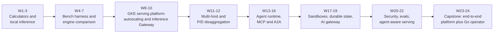

# AI Infra: Zero to Hero in 26 Weeks

*A learning and interview-prep plan for a Kubernetes engineer moving into AI Infra (inference + agentic platforms)*

> [!NOTE]
> Resources were gathered through web research in late Sep 2026. The AI infra ecosystem changes monthly.
> Items marked ⚠️ come from a single source or have an unconfirmed URL path. Check them when you reach that week
> (see [Appendix C](#appendix-c--claims-to-verify-when-you-get-there)).

---

## 0. How the plan works

### Weekly rhythm (~3.5 hrs)

| Session | Time | Content |
|---|---|---|
| **Weekday** (~2 hr) | 30 min | 📄 **Paper**: read for systems insight and skip the math. Write a 5-bullet summary |
| | 60 min | 📘 **Concept**: docs, blogs, videos |
| | 30 min | 🧪 **Short lab** (usually Mac Mini or a quick GCE check) |
| **Weekend** (~1.5–2.5 hr) | 60–120 min | 🛠️ **Main lab**: moves the portfolio project forward |
| | 20 min | ✍️ **Note** for your GitHub notes repo |
| | 10 min | 🎤 **Interview drill**: answer one of the week's questions out loud in ≤ 3 min |

### Environments

| Env | Role | Machine you drive it from |
|---|---|---|
| **GKE** | Main platform: serving, autoscaling, gateways, LWS, agents in production | Work laptop |
| **GCE GPU VM** | Low-level deep dives with no K8s in the way: drivers, profiling, NCCL, raw engine benchmarks | Work laptop |
| **Mac Mini (Apple Silicon)** | Local dev loop: Ollama / llama.cpp / MLX, agent and MCP development, `kind` for control-plane logic | Other machine |

> [!IMPORTANT]
> **GPU quota check (do it in Week 1):** request quota now for L4 (weeks 2–10), 8×H100 / A3 (weeks 7, 11, 12)
> and TPU v6e (optional). A3 Ultra / A4 with RDMA is needed for real prefill/decode disaggregation in week 12,
> and quota approval can take days.

### The portfolio project

A single GitHub repo, something like `ai-platform-lab`, that grows every week:



Suggested repo layout:
```
ai-platform-lab/
├── calculators/        # Python: memory / KV / roofline / cost math
├── bench/              # load profiles, inference-perf configs, results/*.md
├── deploy/gke/         # kustomize/helm: vllm, gateway, lws, llm-d, agents
├── deploy/gce/         # VM bootstrap scripts
├── operator/           # Go (kubebuilder): ModelDeployment -> AgentPlatform CRDs
├── agents/             # Python: ReAct loop, ADK/LangGraph agents, MCP servers
├── evals/              # trajectory evals
└── docs/               # ADRs, architecture diagrams, milestone write-ups
```

**Languages:** Python for model, serving and agent code. Go for K8s controllers and operators.

---

## 1. Phase map and milestones

| Phase | Weeks | Theme | Milestone deliverable |
|---|---|---|---|
| **1. Foundations** | 1–3 | How LLMs run on hardware | **M1:** calculator + local inference report (predicted vs measured tok/s) |
| **2. Serving engine internals** | 4–7 | vLLM/SGLang, batching, caching, parallelism | **M2:** bench harness + engine comparison report on GCE |
| **3. K8s AI platform** | 8–10 | GKE serving, autoscaling, Inference Gateway | **M3:** GKE serving platform v1 (+ Go `ModelDeployment` operator v0) |
| **4. Scale-out inference** | 11–12 | Multi-host, DRA, Kueue, P/D disaggregation | **M4:** multi-host + disaggregated serving, cost/perf report |
| **5. Agentic foundations** | 13–16 | Agents, runtimes, MCP, A2A | **M5:** agent runtime on your platform, with MCP tools and A2A |
| **6. Agentic platform services** | 17–19 | Sandboxes, durable state, AI gateway | **M6:** sandboxed, durable, budgeted agents |
| **7. Production agentic** | 20–22 | Security, observability/evals, agent-aware serving | **M7:** secure, observable platform + agent workload benchmark |
| **8. Capstone** | 23–24 | End-to-end integration | **M8:** demo + architecture doc + `AgentPlatform` operator |
| **9. Interview polish** | 25–26 | System design, deep dives, stories | **M9:** interview kit (cheat sheet, 8 stories, 6 mock designs) |

Weeks 11, 12 and 17 are the heaviest. If a week overruns, spill into the next weekend. Weeks 23–24 have built-in slack.

---

## 2. Week-by-week plan

### Phase 1: Foundations

#### Week 1: LLMs for systems people

- **Goal:** Explain transformer inference as a systems workload. Know what tokens, attention, the KV cache and prefill vs decode are, and why decode is memory-bound.
- **📄 Paper:** [Attention Is All You Need (2017)](https://arxiv.org/abs/1706.03762). Focus on the architecture figure and attention; skip the training sections.
- **📘 Resources:**
  - [kipply: Transformer Inference Arithmetic](https://kipp.ly/transformer-inference-arithmetic/) (the most important read this week)
  - [Karpathy: Deep Dive into LLMs like ChatGPT](https://www.youtube.com/watch?v=7xryibdW3IE) (watch at 1.5×, first ~1 hr)
  - [How to Scale Your Model (JAX scaling book)](https://jax-ml.github.io/scaling-book): Roofline chapter
- **🧪 Weekday lab (Mac):** install Ollama, run an ~8B model and note tokens/s. Request GPU quotas.
- **🛠️ Weekend lab (Mac):** create the project repo. Write `calculators/llm_math.py`.
  It takes model config (layers, hidden size, KV heads, head_dim, precision) and returns weight bytes,
  KV bytes/token, max concurrent sequences for a given GPU, and FLOPs/token.
- **✍️ Deliverable:** note "LLM inference for K8s people". Repo init + calculator.
- **🎤 Interview Qs:**
  1. What is the KV cache, and why does it exist?
  2. Why is prefill compute-bound and decode memory-bandwidth-bound?
  3. Compute the KV cache size for Llama-3-8B at 8K context.
  4. What are GQA/MQA, and why do infra people care?

#### Week 2: GPU hardware, the memory hierarchy and rooflines

- **Goal:** Read a GPU spec sheet like a node spec. Profile a real inference run.
- **📄 Paper:** [FlashAttention (2022)](https://arxiv.org/abs/2205.14135). The takeaway is that HBM↔SRAM movement, not FLOPs, is the bottleneck.
- **📘 Resources:**
  - [Modal GPU Glossary](https://modal.com/gpu-glossary) (SMs, tensor cores, HBM, and the Performance section)
  - [Horace He: Making Deep Learning Go Brrrr](https://horace.io/brrr_intro.html)
  - NVIDIA L4 / H100 / [B200](https://www.nvidia.com/en-us/data-center/dgx-b200/) datasheets ⚠️; GKE docs: "Collect and view DCGM metrics"
- **🧪 Weekday lab (GCE L4 VM):** `nvidia-smi -q`, `nvidia-smi dmon`, `dcgmi dmon -e 1001,1002,1004,1005`.
- **🛠️ Weekend lab (GCE L4):** `pip install vllm`, serve an 8B model, then run `nsys profile` over 10 requests.
  Find the attention and GEMM kernels. Compare the measured batch-1 decode tok/s with your calculator's
  prediction (L4: ~121 TFLOPS BF16, ~300 GB/s).
- **✍️ Deliverable:** note "GPU for K8s engineers" + `bench/results/w2-roofline.md`.
- **🎤 Interview Qs:**
  1. What is arithmetic intensity, and what is the ridge point of an H100?
  2. What does DCGM "SM active" vs "DRAM active" tell you?
  3. Why is GPU utilization a bad autoscaling metric?
  4. Compare NVLink and InfiniBand/RoCE bandwidth, and what that means for tensor parallelism placement.

#### Week 3: Quantization, model formats and local inference

- **Goal:** Understand precision vs memory vs quality tradeoffs. Know the model formats and local engines.
- **📄 Paper:** [AWQ (MLSys'24 Best Paper)](https://arxiv.org/abs/2306.00978). Alternatives: GPTQ, LLM.int8.
- **📘 Resources:**
  - [A Visual Guide to Quantization](https://newsletter.maartengrootendorst.com/p/a-visual-guide-to-quantization)
  - [vLLM quantization docs](https://docs.vllm.ai/en/latest/features/quantization.html) and [LLM Compressor](https://docs.vllm.ai/projects/llm-compressor/en/latest/)
  - [llama.cpp](https://github.com/ggml-org/llama.cpp), [mlx-lm](https://github.com/ml-explore/mlx-lm), [Ollama blog: MLX backend](https://ollama.com/blog)
- **🧪 Weekday lab (Mac):** run the same 8B model as GGUF Q8_0 vs Q4_K_M (`llama-bench`) and as MLX 4-bit (`mlx_lm.generate`).
- **🛠️ Weekend lab (GCE L4):** make FP8 and W4A16 versions with llm-compressor. Serve each with vLLM and compare memory, throughput and a quick `lm-eval` gsm8k score.
- **✍️ Deliverable:** **🏁 M1**: `docs/m1-foundations.md` with predicted vs measured tok/s across precisions and hardware.
- **🎤 Interview Qs:**
  1. How much memory does a 70B model need at FP16 / FP8 / INT4?
  2. What does weight-only quantization do for decode latency, and why?
  3. How would you validate a quantized model before rolling it out?
  4. What is FP8 KV cache, and what does it buy you?

### Phase 2: Serving engine internals

#### Week 4: Continuous batching, PagedAttention and the vLLM V1 engine

- **Goal:** Explain the vLLM architecture end to end: API server → EngineCore → scheduler → KV block manager → model runner.
- **📄 Paper:** [PagedAttention / vLLM (SOSP'23)](https://arxiv.org/abs/2309.06180).
  Background: [Orca (OSDI'22)](https://www.usenix.org/conference/osdi22/presentation/yu), the origin of continuous batching.
- **📘 Resources:**
  - [Aleksa Gordić: Inside vLLM](https://www.aleksagordic.com/blog/vllm/) (the best single deep dive)
  - [vLLM V1 blog](https://blog.vllm.ai/2025/01/27/v1-alpha-release.html)
- **🧪 Weekday lab (GCE L4):** watch `vllm:num_requests_running`, `vllm:num_requests_waiting` and KV usage under load on `/metrics`.
- **🛠️ Weekend lab (GCE L4):** start `bench/`. Script `vllm bench serve` sweeps at request rates 1/2/4/8/inf. Plot throughput vs TTFT/ITL to find the "knee".
- **✍️ Deliverable:** note "How vLLM works (V1)" + a latency-throughput curve.
- **🎤 Interview Qs:**
  1. Continuous vs static batching: what problem does each solve?
  2. How does PagedAttention reduce fragmentation? Draw the analogy to OS paging.
  3. What happens when the KV cache is full (preemption, recompute vs swap)?
  4. Why does the throughput-latency curve have a knee?

#### Week 5: Benchmarking methodology, SLOs and chunked prefill

- **Goal:** Measure inference like an SRE: TTFT, ITL/TPOT, E2E latency and **goodput**. Understand how prefill interferes with decode.
- **📄 Paper:** [Sarathi-Serve (OSDI'24)](https://arxiv.org/abs/2403.02310).
- **📘 Resources:**
  - [DistServe blog](https://haoailab.com/blog/distserve/) (the goodput definition)
  - [kubernetes-sigs/inference-perf](https://github.com/kubernetes-sigs/inference-perf); NVIDIA AIPerf (replaces GenAI-Perf)
  - vLLM docs: Production Metrics, Benchmarking CLI
- **🧪 Weekday lab (GCE):** define 3 load profiles in `bench/profiles/`: chat (short in, medium out), RAG (long in, short out), agentic (growing multi-turn prefix).
- **🛠️ Weekend lab (GCE):** run the profiles against different `--max-num-batched-tokens` budgets for
  chunked prefill. Show p99 TTFT/ITL behavior when long prompts arrive. Compute goodput against
  SLOs TTFT p90 < 500 ms and ITL p90 < 50 ms.
- **✍️ Deliverable:** `bench/README.md` (methodology) + note "Measuring LLM serving".
- **🎤 Interview Qs:**
  1. Define TTFT, TPOT, ITL and goodput. Which matter for chat vs batch vs agents?
  2. p50 TTFT is fine but p99 spikes when long prompts arrive. Diagnose and fix it.
  3. How do you build a fair benchmark to compare two engines?

#### Week 6: Prefix caching, SGLang and speculative decoding

- **Goal:** Understand KV reuse across requests and techniques that trade compute for latency.
- **📄 Paper:** [SGLang / RadixAttention](https://arxiv.org/abs/2312.07104). Optional: [Speculative Decoding (Leviathan et al.)](https://arxiv.org/abs/2211.17192).
- **📘 Resources:** [SGLang repo](https://github.com/sgl-project/sglang) + [docs](https://sglang.readthedocs.io/); vLLM docs on automatic prefix caching and speculative decoding.
- **🧪 Weekday lab (GCE):** toggle vLLM `--enable-prefix-caching` using a shared-system-prompt workload and measure the TTFT change.
- **🛠️ Weekend lab (GCE):** run SGLang vs vLLM on your 3 profiles. Try speculative decoding (n-gram or EAGLE draft) at batch 1 vs high concurrency.
- **✍️ Deliverable:** `bench/results/w6-engines.md`.
- **🎤 Interview Qs:**
  1. Radix tree vs hash-block prefix caching: what are the tradeoffs?
  2. When does speculative decoding help or hurt (batch size, acceptance rate)?
  3. Why does prefix caching change how you should load balance?

#### Week 7: Parallelism and MoE for inference ("training for inference people")

- **Goal:** Know the vocabulary TP/PP/DP/EP/CP. Know when each is used in serving, and what NCCL does.
- **📄 Paper:** [Megatron-LM (2019)](https://arxiv.org/abs/1909.08053): tensor parallelism. Optional: skim the infra sections of the [DeepSeek-V3 report](https://arxiv.org/abs/2412.19437).
- **📘 Resources:**
  - [HF Ultra-Scale Playbook](https://huggingface.co/spaces/nanotron/ultrascale-playbook) (read the TP/PP/EP sections only)
  - vLLM docs: Expert Parallel / Data Parallel deployment
  - [nccl-tests](https://github.com/NVIDIA/nccl-tests)
- **🧪 Weekday lab (GCE multi-GPU VM, 4×L4 or 8×H100):** run `all_reduce_perf -b 8 -e 8G -f 2 -g N` and read busbw.
- **🛠️ Weekend lab (GCE):** serve a model with `--tensor-parallel-size 1/2/4` and compare TTFT/ITL.
  Serve a small MoE (e.g. Qwen3-30B-A3B) with and without `--enable-expert-parallel`.
- **✍️ Deliverable:** **🏁 M2**: `docs/m2-engine-internals.md` (engine comparison, TP scaling, recommendations).
- **🎤 Interview Qs:**
  1. Why keep TP inside one NVLink domain?
  2. TP vs PP vs EP for a 671B MoE model on 2×8 H100s: tradeoffs and failure blast radius?
  3. What does an all-reduce do, and where does it happen in a transformer layer?
  4. How does MoE change memory vs compute per token?

### Phase 3: K8s AI platform

#### Week 8: Serving LLMs on GKE (drivers, node pools, cold start, KServe)

- **Goal:** Productionize single-node serving on K8s and cut model cold start.
- **📄 Paper:** [Evaluating Kubernetes Performance for GenAI Inference (ICPE'26)](https://arxiv.org/abs/2602.04900).
- **📘 Resources:**
  - GKE docs: "Run GPUs in Standard node pools" (`gpu-driver-version`), "Serve Gemma using GPUs on GKE with vLLM", GKE Inference Quickstart (`gcloud container ai profiles …`)
  - vLLM docs: Run:ai Model Streamer (`--load-format runai_streamer`)
  - [KServe](https://kserve.github.io/website/) (`LLMInferenceService`)
- **🧪 Weekday lab (GKE):** use `gcloud container ai profiles list` and `benchmarks list` to pick a config. Create an L4 node pool.
- **🛠️ Weekend lab (GKE):** deploy vLLM 3 ways and measure pod-ready time: (a) pull from HF, (b) GCS FUSE CSI with file cache ⚠️, (c) `runai_streamer` from GCS. Also enable image streaming.
- **✍️ Deliverable:** `deploy/gke/vllm/` + note "Cold start for LLM pods".
- **🎤 Interview Qs:**
  1. A 140 GB model takes 10 minutes to start. Walk through every layer you'd optimize.
  2. GKE-managed drivers vs the GPU Operator: when would you choose each?
  3. How do readiness and startup probes differ for an LLM server?

#### Week 9: Autoscaling, observability and cost per token

- **Goal:** Scale on the right signals, see everything, and compute unit economics.
- **📄 Paper:** [Efficiently Scaling Transformer Inference (Pope et al., MLSys'23)](https://arxiv.org/abs/2211.05102): latency vs throughput vs cost.
- **📘 Resources:**
  - GKE docs: "Best practices for autoscaling LLM inference workloads on GPUs", [custom ComputeClasses](https://cloud.google.com/kubernetes-engine/docs/concepts/compute-classes)
  - [KEDA docs](https://keda.sh/docs/)
  - vLLM `examples/observability/prometheus_grafana`
- **🧪 Weekday lab (GKE):** scrape vLLM `/metrics` with Managed Prometheus. Build a dashboard: TTFT/ITL p50/p90/p99, queue depth, KV usage, DCGM SM/DRAM.
- **🛠️ Weekend lab (GKE):** set up HPA on `vllm:num_requests_waiting`, then on KV usage (check the metric
  name ⚠️). Then KEDA with `minReplicaCount: 0`. Add a ComputeClass fallback: L4 spot → L4 on-demand → A100.
  Load-test with inference-perf. Compute **$ per 1M tokens at SLO** for L4 vs A100 and FP8 vs BF16.
- **✍️ Deliverable:** `docs/adr-autoscaling.md` + cost table.
- **🎤 Interview Qs:**
  1. Which metrics would you autoscale an LLM service on, and why not CPU or GPU utilization?
  2. Is scale-to-zero worth it for LLMs? How do you hide cold start?
  3. Derive cost per 1M output tokens for a deployment.
  4. What does the ideal inference dashboard contain?

#### Week 10: Gateway API Inference Extension, model-aware routing and multi-LoRA

- **Goal:** Replace round-robin with inference-aware routing. Serve many adapters on one base model.
- **📄 Paper:** [S-LoRA (2023)](https://arxiv.org/abs/2311.03285).
- **📘 Resources:**
  - [Gateway API Inference Extension](https://gateway-api-inference-extension.sigs.k8s.io/) + [repo](https://github.com/kubernetes-sigs/gateway-api-inference-extension)
  - GKE docs: "About GKE Inference Gateway" ⚠️; Kubernetes blog "Introducing Gateway API Inference Extension" (Jun 2025)
- **🧪 Weekday lab (GKE):** read the EPP (endpoint picker) scorer code/docs: queue, KV-utilization and prefix scorers.
- **🛠️ Weekend lab (GKE):** deploy vLLM with 2–3 dynamic LoRA adapters. Create an `InferencePool` (v1, GA),
  the EPP, `InferenceObjective` priorities and an HTTPRoute. A/B test against a plain Service using the agentic
  profile (prefix-heavy), comparing TTFT p90 and prefix-cache hit rate.
- **🛠️ Go stretch:** `operator/` with kubebuilder. A `ModelDeployment` CRD renders the vLLM Deployment, InferencePool and HPA.
- **✍️ Deliverable:** **🏁 M3**: `docs/m3-gke-platform.md` (architecture diagram, A/B results, operator v0).
- **🎤 Interview Qs:**
  1. Why is round-robin bad for LLMs? Explain the tension between cache hits and load balance.
  2. How does an endpoint picker decide? What are the failure modes if the EPP is down?
  3. How would you serve 5,000 LoRA fine-tunes on one base model?
  4. How would you implement priority and criticality (online vs batch) on a shared pool?

### Phase 4: Scale-out inference

#### Week 11: Multi-host serving with LWS, Kueue and DRA

- **Goal:** Serve models larger than one node. Understand gang semantics, quota and topology-aware GPU allocation.
- **📄 Paper:** skim the deployment/EP sections of the [DeepSeek-V3 Technical Report](https://arxiv.org/abs/2412.19437) (what frontier multi-node serving looks like).
- **📘 Resources:**
  - [LeaderWorkerSet](https://lws.sigs.k8s.io/) + vLLM's LWS deployment page
  - [Kueue](https://kueue.sigs.k8s.io/)
  - [GKE DRA concepts](https://cloud.google.com/kubernetes-engine/docs/concepts/dynamic-resource-allocation)
    and the [DRA prep guide](https://cloud.google.com/kubernetes-engine/docs/how-to/prepare-gke-infrastructure-for-dra-workloads)
  - Optional: GKE Ray Operator (KubeRay) for contrast
- **🧪 Weekday lab (GKE):** set up a Kueue ClusterQueue/LocalQueue with a GPU `nominalQuota` plus a cohort for borrowing.
- **🛠️ Weekend lab (GKE, 2× A3 or 2× 4×L4; heavy week):** deploy a 70B-class model with an LWS of size 2
  (TP within a node, PP across nodes) under Kueue. Kill a worker and watch the group restart.
  Stretch: a DRA `ResourceClaimTemplate` with the NVIDIA DRA driver.
- **✍️ Deliverable:** `deploy/gke/lws/` + note "Multi-host inference on K8s" (you have prior LWS notes; build on them).
- **🎤 Interview Qs:**
  1. Why do multi-host inference groups need gang semantics? How does LWS provide them?
  2. One GPU in a TP=8 group throws Xid errors mid-generation. What happens, and how do you design recovery?
  3. DRA vs device plugins: what does DRA enable for AI workloads?
  4. How would you share GPU capacity between teams with guaranteed quota plus borrowing?

#### Week 12: Disaggregated prefill/decode and distributed KV cache

- **Goal:** Understand the current state of the art: P/D split, KV transfer, tiered and shared KV cache, and llm-d.
- **📄 Paper:** [DistServe (OSDI'24)](https://arxiv.org/abs/2401.09670). Pair with [Splitwise](https://arxiv.org/abs/2311.18677).
- **📘 Resources:**
  - [llm-d](https://llm-d.ai/) + [repo guides](https://github.com/llm-d/llm-d) (inference-scheduling, pd-disaggregation, wide-ep, tiered KV)
  - [NVIDIA Dynamo](https://github.com/ai-dynamo/dynamo)
  - [LMCache](https://docs.lmcache.ai/)
  - [Mooncake](https://github.com/kvcache-ai/Mooncake) ⚠️
- **🧪 Weekday lab (GKE L4):** deploy llm-d's inference-scheduling path and add LMCache CPU offload. Measure multi-turn TTFT.
- **🛠️ Weekend lab (GKE A3 Ultra/A4 with RDMA; heavy week):** run the pd-disaggregation path and compare with aggregated serving at equal GPU count. Size the P:D ratio for your chat vs RAG profiles.
- **✍️ Deliverable:** **🏁 M4**: `docs/m4-scale-out.md` (multi-host + P/D results, cost/perf, recommendations per workload).
- **🎤 Interview Qs:**
  1. When is disaggregation worth it? How do you size P:D?
  2. What does KV transfer cost for a 2K-token prompt on a 70B model over 400G? Do the math.
  3. Design a GPU → CPU → SSD KV cache tier. What are the eviction and sharing policies?
  4. How do llm-d, Dynamo and the Gateway API Inference Extension relate to each other?

### Phase 5: Agentic foundations

#### Week 13: Agent fundamentals (tool calling, the ReAct loop, memory)

- **Goal:** Understand the workload you'll host: the loop, tool calls, and why context grows every turn.
- **📄 Paper:** [ReAct (ICLR'23)](https://arxiv.org/abs/2210.03629).
- **📘 Resources:**
  - [Anthropic: Building effective agents](https://www.anthropic.com/engineering/building-effective-agents)
  - [OpenAI: A practical guide to building agents (PDF)](https://cdn.openai.com/business-guides-and-resources/a-practical-guide-to-building-agents.pdf)
  - Structured outputs / JSON-schema tool calling docs
- **🧪 Weekday lab (Mac):** make a tool-calling request to Ollama (qwen3 or llama3.1) with a JSON-schema tool.
- **🛠️ Weekend lab (Mac):** write `agents/react_loop.py` from scratch (~150 lines) with 3 tools
  (read-only shell, http_get, calculator). Log tokens and latency per turn and plot prompt growth.
  Then point it at your GKE vLLM endpoint.
- **✍️ Deliverable:** note "Agents from an infra lens" + a prompt-growth chart.
- **🎤 Interview Qs:**
  1. Workflows vs agents: when would you choose each?
  2. How does agent traffic differ from chat traffic at the serving layer?
  3. Why do agent loops make prefix caching critical?

#### Week 14: Agent frameworks and runtimes

- **Goal:** Know the landscape and what a production agent runtime must provide.
- **📄 Paper:** [Parrot (OSDI'24)](https://www.usenix.org/conference/osdi24/presentation/lin-chaofan) ⚠️ slug: serving LLM *applications*, not isolated requests.
- **📘 Resources:**
  - [Google ADK](https://google.github.io/adk-docs/)
  - LangGraph docs ⚠️ (may have moved under docs.langchain.com)
  - [OpenAI Agents SDK](https://openai.github.io/openai-agents-python/)
  - [Microsoft Agent Framework](https://github.com/microsoft/agent-framework) (successor to AutoGen)
  - [kagent](https://kagent.dev) (CNCF Sandbox; agents as CRDs)
  - Google Agent Runtime (formerly Vertex AI Agent Engine) ⚠️
- **🧪 Weekday lab (Mac):** rebuild the week-13 agent in ADK.
- **🛠️ Weekend lab (GKE):** containerize the ADK and LangGraph versions and deploy them on GKE backed by
  your vLLM + Inference Gateway. Compare sessions, streaming, resume and human-in-the-loop.
  Optionally install kagent.
- **✍️ Deliverable:** `docs/adr-agent-runtime.md`: "what a runtime needs" checklist + framework comparison.
- **🎤 Interview Qs:**
  1. List the responsibilities of an agent runtime (state, resume, tools, auth, sandbox, streaming, HITL, tracing, quotas, rollout).
  2. Agents as CRDs (kagent) vs agents as app code: what are the tradeoffs?
  3. How do you do versioned rollout or canary of an agent?

#### Week 15: Model Context Protocol (MCP) in depth

- **Goal:** Host MCP servers as production services: transports, auth, statelessness, gateways and registries.
- **📄 Reading (in place of a paper):** the [MCP specification](https://modelcontextprotocol.io/specification).
  Read the latest version (2026-07-28 ⚠️) and diff it against 2025-11-25.
  Focus on [authorization](https://modelcontextprotocol.io/specification/2025-11-25/basic/authorization) and streamable HTTP.
- **📘 Resources:**
  - [MCP Registry (preview)](https://registry.modelcontextprotocol.io)
  - [agentgateway](https://agentgateway.dev)
  - [Envoy AI Gateway](https://aigateway.envoyproxy.io) ⚠️
- **🧪 Weekday lab (Mac):** write an MCP server with the Python SDK over stdio and connect it to your agent.
- **🛠️ Weekend lab (GKE):** switch it to streamable HTTP and deploy 3 replicas behind agentgateway.
  Add OAuth (any OIDC IdP) and per-client tool filtering. Test session affinity (`Mcp-Session-Id`) vs
  stateless behavior.
- **✍️ Deliverable:** `agents/mcp/` + note "Running MCP servers on K8s".
- **🎤 Interview Qs:**
  1. Design an enterprise MCP gateway/registry: discovery, OAuth on-behalf-of, per-tool authz, audit, rate limits.
  2. stdio vs streamable HTTP: what are the operational implications?
  3. How do you scale stateful MCP sessions horizontally?

#### Week 16: A2A and multi-agent systems

- **Goal:** Agent-to-agent communication, discovery and trust boundaries.
- **📄 Reading:** [A2A spec](https://a2a-protocol.org) (v1.0, Linux Foundation) + [repo](https://github.com/a2aproject/A2A).
- **📘 Resources:** A2A vs MCP comparisons; agentgateway A2A proxying.
- **🧪 Weekday lab (Mac):** publish an Agent Card for your researcher agent.
- **🛠️ Weekend lab (GKE):** a planner agent calls a researcher agent over A2A. They run in separate
  namespaces with NetworkPolicy/mTLS, and discovery goes through `/.well-known/`. Trace a full multi-agent request.
- **✍️ Deliverable:** **🏁 M5**: `docs/m5-agent-runtime.md` (agents + MCP + A2A running on your inference platform).
- **🎤 Interview Qs:**
  1. MCP vs A2A: which problem does each solve?
  2. How do you enforce trust between agents from different teams or tenants?
  3. What failure modes are unique to multi-agent systems (loops, fan-out storms)?

### Phase 6: Agentic platform services

#### Week 17: Sandboxed code execution (heavy week)

- **Goal:** Run untrusted agent-generated code safely, quickly and densely.
- **📄 Paper:** [Firecracker (NSDI'20)](https://www.usenix.org/conference/nsdi20/presentation/agache).
  Also read the short [gVisor: The True Cost of Containing (HotCloud'19)](https://www.usenix.org/conference/hotcloud19/presentation/young).
- **📘 Resources:**
  - [kubernetes-sigs/agent-sandbox](https://github.com/kubernetes-sigs/agent-sandbox) (CRDs: `Sandbox`, `SandboxTemplate`, `SandboxClaim`, `SandboxWarmPool`)
  - GKE Agent Sandbox and GKE Sandbox docs ⚠️
  - [gVisor](https://gvisor.dev), [Kata](https://katacontainers.io), [E2B](https://e2b.dev)
- **🧪 Weekday lab (GKE):** create a GKE Sandbox (gVisor) node pool and install agent-sandbox.
- **🛠️ Weekend lab (GKE):** a Python `SandboxTemplate` + `SandboxWarmPool`. Wire it up as the agent's
  `run_code` tool. Measure claim → first exec, cold vs warm, and try hibernate/resume.
  Stretch (GCE with nested virtualization): compare Kata or Firecracker cold start and density.
- **✍️ Deliverable:** note "Agent sandboxes: gVisor vs Kata vs Firecracker" + measurements.
- **🎤 Interview Qs:**
  1. Design a code-execution sandbox service: sub-second start, 10k concurrent, snapshot/resume, egress control.
  2. gVisor vs Kata vs Firecracker: isolation, overhead and density tradeoffs?
  3. How do warm pools and snapshots change your cost model?

#### Week 18: State, memory and durable execution

- **Goal:** Agents that run for hours, survive crashes, and never double-execute side effects.
- **📄 Paper:** [MemGPT (2023)](https://arxiv.org/abs/2310.08560).
- **📘 Resources:**
  - LangGraph persistence/checkpointers (Postgres)
  - Temporal + OpenAI Agents SDK integration ⚠️
  - Dapr Agents ([docs.dapr.io](https://docs.dapr.io)) ⚠️
  - pgvector
- **🧪 Weekday lab (GKE):** add a LangGraph Postgres checkpointer to your agent.
- **🛠️ Weekend lab (GKE):** run the same long task with (a) the LangGraph checkpointer and (b) Temporal
  (LLM calls and tools as activities). Kill pods mid-task and verify resume with no repeated LLM calls or
  side effects (use idempotency keys). Add pgvector long-term memory.
- **✍️ Deliverable:** `docs/adr-durable-agents.md`.
- **🎤 Interview Qs:**
  1. Design durable execution for multi-day agents with human approvals.
  2. How do you make tool calls idempotent? What is "exactly-once" for agents?
  3. Design agent memory: session vs long-term, per-user isolation, poisoning defense, GDPR deletion.

#### Week 19: AI gateways, token budgets and caching

- **Goal:** One front door for all model traffic, with tenant budgets, failover and smart caching.
- **📄 Paper:** [Autellix (2025)](https://arxiv.org/abs/2502.13965): program-level scheduling and fairness for agents.
- **📘 Resources:**
  - [agentgateway](https://agentgateway.dev)
  - [Envoy AI Gateway](https://aigateway.envoyproxy.io) ⚠️ (token rate limiting, QuotaPolicy)
  - [kgateway](https://kgateway.dev)
  - [LiteLLM](https://docs.litellm.ai) ⚠️
- **🧪 Weekday lab (GKE):** put Envoy AI Gateway (or agentgateway) in front of vLLM plus one hosted model.
- **🛠️ Weekend lab (GKE):** two tenants with per-tenant token budgets (one gets throttled), plus provider failover. Try a semantic cache and measure the false-hit rate on agent tool-call turns.
- **✍️ Deliverable:** **🏁 M6**: `docs/m6-platform-services.md` (sandbox + durable + gateway).
- **🎤 Interview Qs:**
  1. Design an LLM gateway with per-tenant token budgets, multi-provider failover and cache-aware routing.
  2. Why is semantic caching dangerous for agents?
  3. Rate limiting by requests vs tokens: how do you implement token-based limits when output length is unknown?

### Phase 7: Production agentic

#### Week 20: Multi-tenancy, identity and agent security

- **Goal:** Least agency, strong identity, and containment of prompt injection.
- **📄 Reading:** [OWASP Top 10 for Agentic Applications (2026) + LLM Top 10 (2025)](https://genai.owasp.org).
- **📘 Resources:** [SPIFFE/SPIRE](https://spiffe.io); RFC 8693 token exchange; MCP authorization spec.
- **🧪 Weekday lab (GKE):** give each agent its own KSA mapped through Workload Identity Federation.
- **🛠️ Weekend lab (GKE):** plant an indirect prompt injection in a fetched web page. Show containment through
  tool allow-lists (gateway CEL/OPA policy), egress NetworkPolicy and human approval for write tools.
- **✍️ Deliverable:** note "Threat model for an agent platform".
- **🎤 Interview Qs:**
  1. Design a multi-tenant platform for customer-supplied agents: isolation, identity, quotas, noisy neighbors.
  2. How do you propagate user identity through agent → tool (on-behalf-of) safely?
  3. Which defenses against prompt injection actually work at the platform layer?

#### Week 21: Observability and evals for agents

- **Goal:** Trace trajectories, and gate releases with evals.
- **📄 Paper:** [τ-bench (2024)](https://arxiv.org/abs/2406.12045), including the pass^k reliability metric.
- **📘 Resources:**
  - OTel GenAI semantic conventions ⚠️ (Development status; pin versions)
  - [Langfuse](https://langfuse.com)
  - [Arize Phoenix](https://github.com/Arize-ai/phoenix)
  - [SWE-bench](https://www.swebench.com)
- **🧪 Weekday lab (GKE):** instrument the agent with OTel GenAI spans, send them to an OTel Collector, then to Langfuse (Helm).
- **🛠️ Weekend lab:** build a 20-task trajectory eval in `evals/`: correct tool order, step count, cost, plus an LLM-as-judge score. Run it in CI when the model or prompt changes.
- **✍️ Deliverable:** `evals/README.md` + note "Agent observability".
- **🎤 Interview Qs:**
  1. Design observability and evals for agent trajectories (schema, PII, offline/online, regression gates).
  2. What SLOs would you set for an agent platform?
  3. What is pass^k, and why does it matter more than pass@1 for production?

#### Week 22: Serving agentic workloads (where inference meets agents)

- **Goal:** Tune the inference platform for agent traffic: long contexts, multi-turn KV reuse, fan-out bursts.
- **📄 Paper:** [Continuum (2025)](https://arxiv.org/abs/2511.02230): KV cache TTL across tool calls. Optional: KVFlow ⚠️.
- **📘 Resources:** [llm-d](https://llm-d.ai) prefix-aware EPP; vLLM prefix caching docs; your week 10 and 12 setups.
- **🧪 Weekday lab:** generate a synthetic agent trace: 30-turn sessions, 50 concurrent sessions, fan-out of 5 sub-agents.
- **🛠️ Weekend lab (GKE):** replay the trace against vLLM ×3 with round-robin vs prefix-aware EPP (+ LMCache).
  Measure TTFT, prefix hit rate, GPU-hours per task and queueing during bursts. Add step caps and per-task budgets.
- **✍️ Deliverable:** **🏁 M7**: `docs/m7-agentic-serving.md` (the benchmark showing agent-aware serving wins).
- **🎤 Interview Qs:**
  1. One request fans out to 50 sub-agent calls. How do you prevent cost blow-ups and cascading failures?
  2. Session affinity vs load balance for multi-turn agents: design the router.
  3. Why do long tool pauses hurt KV cache efficiency, and what are the fixes?

### Phase 8: Capstone

#### Week 23: Integration and the Go operator

- **📄 Paper:** [Llumnix (OSDI'24)](https://arxiv.org/abs/2406.03243): live migration of requests and KV.
- **Goal:** one `AgentPlatform` CRD (tenant, models, tools/MCP servers, sandbox template, token budget).
  Your Go operator reconciles it into the ModelDeployment, InferencePool, gateway policy,
  SandboxWarmPool and agent Deployment.
- **Lab (GKE):** implement and test with `envtest`, then do an end-to-end run.
- **Deliverable:** operator v1 + `docs/architecture.md` with a full diagram.

#### Week 24: Demo, hardening and write-up

- **📄 Paper:** [Mooncake (FAST'25 Best Paper)](https://arxiv.org/abs/2407.00079).
- **Lab:** chaos tests (kill a GPU node, the EPP, a sandbox node, a Temporal worker). Produce an end-to-end benchmark and cost report. Record a 5-minute demo video.
- **Deliverable:** **🏁 M8**: polished README, architecture doc, demo, blog post.

### Phase 9: Interview polish

#### Week 25: System design reps

- **Re-read:** Pope et al. + DistServe.
- **Do:** 3 timed mock designs (45 min each, whiteboard) from [Appendix B](#appendix-b--interview-kit): 2 inference, 1 agentic. Record yourself. Compare against the framework.
- **Deliverable:** 3 written design docs in your notes repo.

#### Week 26: Deep dives and stories

- **Do:** drill the numbers cheat sheet ([Appendix A](#appendix-a--key-numbers-cheat-sheet)) until you can
  derive them cold. Write **8 STAR stories** from milestones M1–M8, each with a measured result
  (e.g. "cut cold start from X to Y", "prefix-aware routing cut p90 TTFT by Z%"). Do 3 more mock designs.
- **Deliverable:** **🏁 M9**: interview kit (cheat sheet, stories, 6 mock designs).

---

## Appendix A: Key numbers cheat sheet

*Approximate. Re-derive them yourself; interviewers care about the method.*

| Quantity | Formula / value |
|---|---|
| Weight memory | params × bytes (FP16 = 2, FP8 = 1, INT4 ≈ 0.5). 8B FP16 ≈ 16 GB; 70B FP16 ≈ 140 GB / FP8 70 GB / INT4 35 GB |
| KV cache per token | 2 × layers × kv_heads × head_dim × bytes. Llama-3-8B ≈ 128 KiB (8K ctx ≈ 1 GiB); Llama-3-70B ≈ 320 KiB (8K ≈ 2.5 GiB) |
| Max concurrency | (HBM − weights − overhead) / (KV per token × avg context) |
| Decode TPOT floor | bytes read per step (weights + KV) / HBM BW. 8B FP16 on H100 ≈ 5 ms; real systems ≈ 1.5–2× that |
| Prefill FLOPs | ≈ 2 × params × prompt tokens. 2K prompt on 8B ≈ 32 TFLOP ≈ 30–70 ms on H100 |
| Ridge point | H100 ≈ ~300 FLOPs/byte, so decode needs large batches to become compute-bound |
| GPUs | L4 24 GB / ~300 GB/s · A100 80 GB / ~2 TB/s · H100 80 GB / 3.35 TB/s / ~1 PFLOP BF16 · H200 141 GB / 4.8 TB/s · B200 ~192 GB / ~8 TB/s |
| Interconnect | NVLink (H100) ~900 GB/s/GPU vs 400G NIC ~50 GB/s. KV for 2K tokens on 70B ≈ 640 MB ≈ 13 ms over 400G |
| Typical SLOs | Chat: TTFT p50 < 500 ms, p99 < 1–2 s; TPOT 20–50 ms. Code completion: TTFT < 200 ms. Agents: job completion time. Batch: $/token |

## Appendix B: Interview kit

### Framework for LLM-serving system design

1. **Workload:** model (dense/MoE, GQA/MLA), token distributions, QPS and burstiness, context length, LoRA, multi-turn/agent patterns.
2. **SLOs:** TTFT/TPOT p50/p99. Optimize **goodput**, and include $/1M tokens and availability.
3. **Back-of-envelope:** weights, KV per token, concurrency per GPU, TPOT floor, number of GPUs.
4. **Engine:** continuous batching, paged KV, chunked prefill, prefix cache, quantization, spec decoding, TP/PP/EP.
5. **Cluster:** inference-aware routing (GAIE/llm-d), P/D disaggregation, autoscaling on queue/KV signals, cold start (streaming weights), gang scheduling (LWS/Kueue/DRA).
6. **Reliability and ops:** failure domains (a TP group fails as a unit), draining streams, model canaries, observability, multi-region capacity.
7. **Tradeoffs:** batch size (latency vs throughput), TP degree vs replicas, quantization vs quality, cache affinity vs load balance.

For **agentic designs**, add runtime (state/resume), tool infra (MCP gateway), sandboxing, identity and on-behalf-of, budgets and loop caps, and trajectory evals.

### Mock design bank

**Inference**

1. A multi-tenant LLM platform on K8s serving 20 models (7B–400B) with per-tenant SLOs and quotas.
2. How many H100s for 70B at 500 QPS, 1.5K in / 300 out, p99 TTFT < 1 s, TPOT < 40 ms?
3. A load balancer for LLM traffic (prefix-, KV- and queue-aware).
4. Prefix/KV caching for 32K+ multi-turn contexts with GPU/CPU/SSD tiers.
5. Serve 5,000 LoRA adapters on one base model.
6. A benchmarking and observability plan to compare vLLM vs SGLang vs TRT-LLM fairly.
7. Failure handling for TP=8 groups (Xid errors, draining, gang rescheduling).

**Agentic**

1. A multi-tenant platform for customer-supplied agents.
2. A code-execution sandbox service (10k concurrent, sub-second start).
3. An enterprise MCP gateway/registry.
4. Durable execution for multi-day agents with human approvals.
5. An AI gateway with token budgets, failover and cache-aware routing.
6. Agent observability and eval pipeline.
7. Fan-out protection: budgets, circuit breakers, backpressure.
8. Agent memory with isolation, poisoning defense and deletion.

### Books and long-form references

- [AI Engineering, Chip Huyen (2025)](https://github.com/chiphuyen/aie-book): read alongside Phases 5–7
- [Designing Machine Learning Systems, Chip Huyen](https://github.com/chiphuyen/dmls-book): optional
- *Generative AI System Design Interview*, Aminian & Sheng ([ByteByteGo](https://bytebytego.com)): weeks 25–26
- [How to Scale Your Model](https://jax-ml.github.io/scaling-book/): the "numbers" book
- [BentoML LLM Inference Handbook](https://bentoml.com/llm/) ⚠️ path
- [NVIDIA: Mastering LLM Techniques – Inference Optimization](https://developer.nvidia.com/blog/mastering-llm-techniques-inference-optimization/)
- [Karpathy: Zero to Hero](https://karpathy.ai/zero-to-hero.html): optional depth for Phase 1

## Appendix C: Claims to verify when you get there

| Week | Claim |
|---|---|
| 2, 9 | GKE managed DCGM may not work alongside DRA GPU drivers. vLLM KV metric name (`gpu_cache_usage_perc` vs `kv_cache_usage_perc`) |
| 3 | Ollama MLX backend details; mlx-lm maintenance pace |
| 5 | GenAI-Perf deprecated in favor of AIPerf; inference-perf v1.0 status |
| 8 | Run:ai Model Streamer repo move (`dsx-ai-factory/model-streamer`); GCS FUSE `gcsfusecsi-serving` profile / Rapid Cache (GKE ≥ 1.35.1) |
| 10 | GAIE `endpointPickerRef` optional since v1.5; `InferenceModel` replaced by `InferenceObjective` |
| 11 | LWS version and DisaggregatedSet API; GKE version needed for GA DRA |
| 12 | llm-d latest release (reported v0.9), CNCF Sandbox date; Dynamo 1.0 DGDR; Mooncake GitHub org |
| 14 | Google "Agent Runtime" rename (formerly Vertex AI Agent Engine); Microsoft Agent Framework GA |
| 15 | MCP spec 2026-07-28 contents (stateless core, `Mcp-Method` headers); MCP under AAIF / Linux Foundation |
| 17 | Exact GKE Agent Sandbox docs path; agent-sandbox Kata support |
| 18–19 | Temporal / Dapr Agents doc paths; Envoy AI Gateway v1.0 features |
| 21 | OTel GenAI semconv repo and agent span names |
| 22 | KVFlow arXiv ID |
