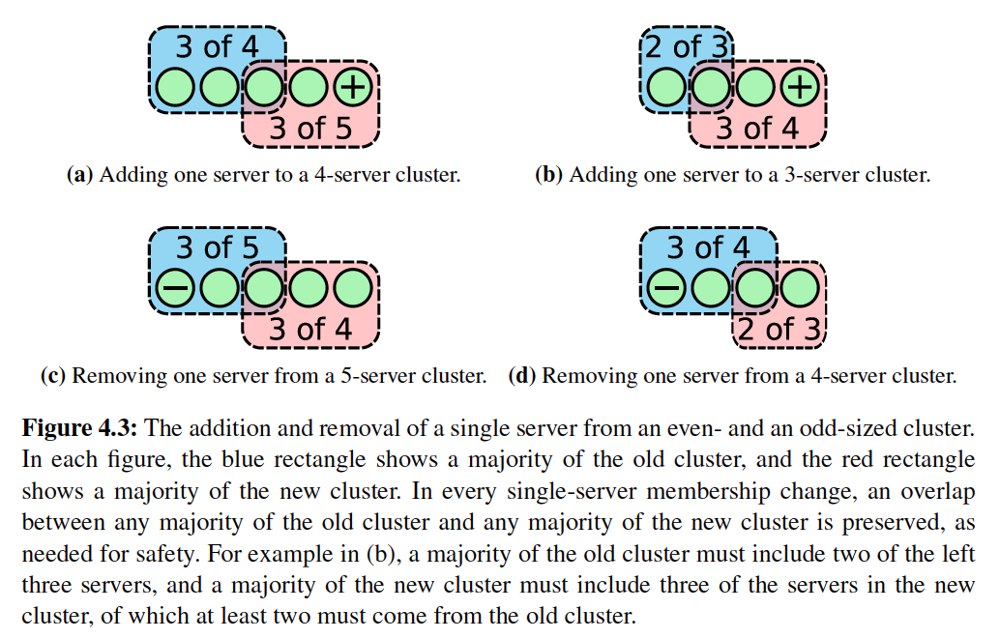
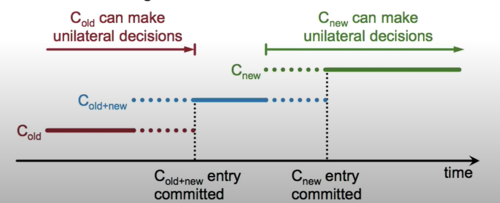

# Deep dive into config change in distributed system

## Safety

From above diagram, it is possible S1 and S2 form the majority of C-old, and S3, S4, S5 form the majority of C-new. We need to avoid two leaders from both C-old and C-new to be elected within the same term.

### Add or remove one server at a time

If add or remove one server at a time, this prevents cluster from splitting into two independent majorities. Which means it is not possible to have two leaders within the same term.

#### Workflow

- leader receives the request to change membership
- leader appends C-new to its log
- leader replicates C-new to all followers
- configuration compltes once the C-new log entries are committed

---
It is possible leader crashes before the C-new gets committed. In this case, a new leader will be elected, client could retry the configuration change since it does not receive the response from previous leader.

### Add or remove arbitrary servers at a time

This has been covered in [distributed-system](./distributed-system.md). I just copy and paste the content here for reference.

The solution is mentioned in 4.3 of the [paper](https://github.com/ongardie/dissertation/blob/master/stanford.pdf) which uses two phases.

- Client sends a config change request to leader
- Leader enters the joint consensus phase
  - Store the C[old,new] as log entry and replicate to all 5 servers
  - Config change log entry is applied immediately on receipt
  - Need joint consensus from both C[old] servers and C[new] servers in order to commit a log entry and select a new leader. (If we had 3 servers, now adding 9 new servers, joint consensus needs 2/3 + 5/9 to reach majorit)
- Once C[old,new] log entries are committed, leader creates a log entry C[new] and replicates to all servers
- Once C[new] log entries are committed, old config becomes irrelevant, cluster is under new config now

## Availability

### Add or remove one server at a time

#### Catching up new servers

When a new server is added, it starts with empty log entries:

a. Leader needs to replicate all its log to the new member which might cause the leader overloaded.

b. As memtioned in [etcd-blog](https://etcd.io/docs/v3.4.0/learning/design-learner/), increasing the quorum immediately when a new member joins would cause a lot of problems.

c. If we have s1, s2, s3 and now we add s4, s3 could be isolated from network partition before s4 catches up leader's log. There is a period of time the cluster could not reach commitment.

Solution:

- The new server joins as **non-voting** member, called learner in etcd. Before learner gets promoted to voting member, the quorum is not changed. E.g. if adding one server to a three servers cluster, the quorum stays 2 until learner gets promoted.
- Leader replicate logs in rounds, each round replicates the logs that the leader currently has. Leader waits a fixed number of rounds, if last round lasts less than election timeout, then leader promote leaner to be voting member.
- Leader aborts the configuration change if new server is unavailable or too slow to catch up the log

#### Removing current leader

Leader needs to wait until C-new is committed to step down. In two servers cluster case, s1(leader) and s2. If s2 does not have C-new and s1 steps down, s2 will never be elected as a new leader.

#### Disruptive servers

### Add or remove arbitrary servers at a time

## Reading materials

- [raft paper](./consensus-raft.pdf)
- etcd learner design: <https://etcd.io/docs/v3.4.0/learning/design-learner/>
