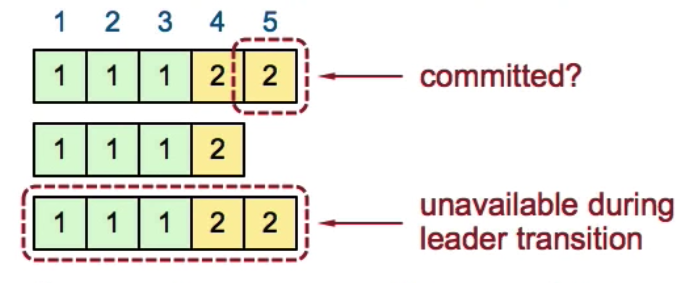

# Raft distributed consensus

## Faults it handles

- crash fault: stop working, or resume working after restart
- network fault: communication interrupted, delayed, partitioned

## Leader election

Term: Election + Normal operation under a single leader

- Term ID is increment only
- 0/1 leader per term
- Each server maintain the current term on disk

Heartbeats and Timeouts

- Servers start up as follower
- Leaders must send `heartbeats`(empty AppendEntries RPCs) to maintain authority
- Followers expect to receive RPCs from leader
  - If no RPCs from leader with `electionTimeout`(100-500ms), follower starts a new election

Election basics when a server starts an election:

- Increment curent term
- Change to `candidate` state
- Vote for self
- Send `RequestVote` RPCs to all other servers, retries until
  - Receive votes from majority(`n /2 + 1`) of servers
    - Become leader
    - Send `heartbeats` to all other servers
  - Receive RPC from a valid leader
    - Step down to `follower` state
  - No one wins election
    - Increment term, start new election

Election safety: At most one leader per term

- Each server gives one vote per term

Election liveness: Some candidate must eventually becomes a leader

- Each server choose `electionTimeout` randomly between [t, 2t]

## Normal operation

Log structure:


Each server has its own copy of log and persistent on disk

Workflow:

- Client sends command to leader
  - If command is sent to follower, the command will be redirected to leader
- Leader appends command to its own log
- Leader sends `AppendEntries` RPCs to follower (log replication), and wait for responses from majorities so that it means the log is commited
- Once new entry of log is committed
  - Leader passes commands to its state machine(program), return result to client
  - Leader notifies followers of committed entities in following `AppendEntries` RPCs
  - Followers pass commited commands to their state machines(programs)
- If followers crashed or slow to response the `AppendEntries` RPC, leader will keep retrying (*If major servers within the cluster have moved to next term, leader will try to send `AppendEntries` RPC to those followers who are behind*)

## When leader changes

When leader changes, logs among servers might not be identical. Leader's log is the only truth, and eventually leader makes followers log identical to its log.


If there is network partition at term 3 (S1 - S3 is one group, S4 - S5 is one group) and leader at term 3 is S2. The committed entry `5` needs to be present in the logs of all future leaders, otherwise `5` might be missing if leader becomes S5 at term 4 onward.

Log consistency:

- If log entries on different servers have same index and term, they store the same command and logs are identical in all preceding entries
- If the given entry is commited, all preceding entries are also committed

Because of above properties, there is an `AppendEntries` consistency check:

- Each `AppendEntries` RPC must contain the preceding index and term
- Follower must contain matching entry, otherwise reject the request

Safety requirement:

- If a leader has decided that a log is committed, that entry will be present in logs of all future leaders
- Leaders never overwrite its log entries
- Only entries in leader's log can be committed
- Only commited entries could be applied to state machine

Pick the best leader:


(Term2, Index5) are committed entries. But if S3 becomes unavailable, new leader needs to be picked from S1 and S2. If new leader is S2 which does not have (Term2, Index5), there will be a problem that the committed entries will be lost. So, leader election needs to pick the server which has "most complete" log.

Voters deny the vote if:
`lastTermOfVoter > lastTermOfCandidate || (lastTermOfVoter == lastTermOfCandidate && lastIdxOfVoter > lastIdxOfCandidate)`

This guarantees S4 and S5 will be elected as the new leader from the following:


However, the following case will still mess things up, since S5 could still be elected as leader at Term5. Entry 3 is not safely committed. So we have to adjust the committed rules.


For a leader to decide an entry is committed:

- Must be stored on majority of servers
- At least one new entry from leader's term must also be stored on majority of servers


If entry 4 is committed, then S5 cannot be elected as leader at term 5.

## How to make log entries identical after leader changes

- Leader deletes extraneous entries of followers
- Leader fills in missing entries of followers

``` text
- keeps nextIdx for each follower, nextIdx initialized to leader's last index + 1
- leader sends the preceding log index and term with the appendEntries RPC for consisitency check
- If fails, decrement the nextIdx and try again
- If succeeds, increment the nextIdx and append next entry
- For extraneous entries, follower overwrites inconsistent entry and deletes all subsequent entries(inconsistent)
```

## When old leader gets reconnected

Old leader holds an old term, so the RPC calls from old leader will be rejected if receivers hold newer term, then old leader steps down to be a follower

## If client request times out

If client just simply reissues the command, it would result in the command gets executed twice. So we ask client to embed a unique id with each command, leader could use it to check if the command has been logged in the log entry. If yes, then just return the response from previously executed command

## Configuration changes


If we had 3 servers at the beginning, and now want to add 2 more servers at the same time. There are several factors we need to consider:

- Config changes(e.g adding two new servers, the number of serves become from 3 to 5) are not applied to all servers at the same time
- It is possible s1 and s2 are the majority of old config and s3, s4, s5 are the majority of new config. So that it is possible there are two leaders at the same term. And we want to avoid of that.

The solution is mentioned in 4.3 of the [paper](https://github.com/ongardie/dissertation/blob/master/stanford.pdf) which uses two phases.


- Client sends a config change request to leader
- Leader enters the joint consensus phase
  - Store the C[old,new] as log entry and replicate to all 5 servers
  - Config change log entry is applied immediately on receipt
  - Need joint consensus from both C[old] servers and C[new] servers in order to commit a log entry and select a new leader. (If we had 3 servers, now adding 9 new servers, joint consensus needs 2/3 + 5/9 to reach majorit)
- Once C[old,new] log entries are committed, leader creates a log entry C[new] and replicates to all servers
- Once C[new] log entries are committed, old config becomes irrelevant, cluster is under new config now

---
Above solution works, but Raft is now using a simpler solution described in 4.2 of the [paper](https://github.com/ongardie/dissertation/blob/master/stanford.pdf)

See [deep-dive-config-change](./resources/deep-dive-config-change.md) for more details.

## Reading materials

- <https://raft.github.io/#implementations>
- <https://eli.thegreenplace.net/2020/implementing-raft-part-0-introduction/>
- <https://www.micahlerner.com/2020/05/08/understanding-raft-consensus.html>
- <https://github.com/etcd-io/etcd/tree/master/raft>
- <https://github.com/ongardie/dissertation/blob/master/stanford.pdf>