# Explore OAuth

## What is OAuth

OAuth is a industry-standard protocol for authorization. It is for authorization, instead of authentication.

### Terminologies

- Resource: The resources need to be protected. e.g. Photos on Google Drive.
- Resource Owner: The entity capable of granting access to a protected resource. e.g. You as a user owns the photos on Google Drive.
- Resource Server: The server which is hosting the resources. e.g. Google Drive.
- Client: The application wants to access the protected resources on behalf of the resource owner. e.g. The app which
  wants to access your photos on Google Drive.
- Authorization server: The component takes care of the authorization, issues the access token to client, usually is
  implemented by the resouce server side if it supports OAuth.

## How OAuth works

### Authorization code flow

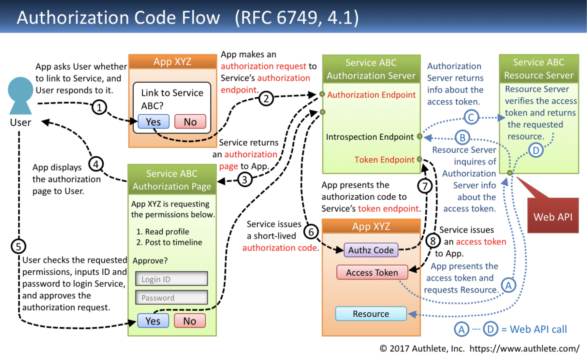

#### Authorization code flow Request to get auth token

``` text
GET {Authorization Endpoint}
  ?response_type=code             // - Required
  &client_id={Client ID}          // - Required
  &redirect_uri={Redirect URI}    // - Conditionally required
  &scope={Scopes}                 // - Optional
  &state={Arbitrary String}       // - Recommended
  &code_challenge={Challenge}     // - Optional
  &code_challenge_method={Method} // - Optional
  HTTP/1.1
HOST: {Authorization Server}
```

#### Authorization code flow Response with auth token

``` text
HTTP/1.1 302 Found
Location: {Redirect URI}
  ?code={Authorization Code}  // - Always included
  &state={Arbitrary String}   // - Included if the authorization
                              //   request included 'state'.
```

#### Authorization code flow Request to get access token using auth token

``` text
POST {Token Endpoint} HTTP/1.1
Host: {Authorization Server}
Content-Type: application/x-www-form-urlencoded
grant_type=authorization_code  // - Required
&code={Authorization Code}     // - Required
&redirect_uri={Redirect URI}   // - Required if the authorization
                               //   request included 'redirect_uri'.
&code_verifier={Verifier}      // - Required if the authorization
                               //   request included
                               //   'code_challenge'.
```

#### Authorization code flow Response with access token

``` text
HTTP/1.1 200 OK
Content-Type: application/json;charset=UTF-8
Cache-Control: no-store
Pragma: no-cache
{
  "access_token": "{Access Token}",    // - Always included
  "token_type": "{Token Type}",        // - Always included
  "expires_in": {Lifetime In Seconds}, // - Optional
  "refresh_token": "{Refresh Token}",  // - Optional
  "scope": "{Scopes}"                  // - Mandatory if the granted
                                       //   scopes differ from the
                                       //   requested ones.
}
```

### Implicit flow

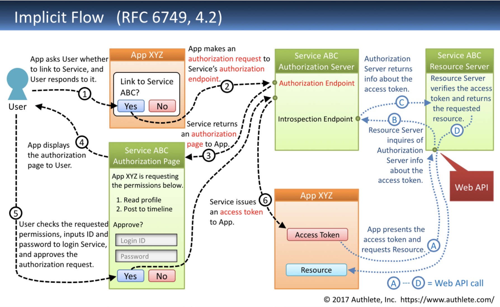

#### Implicit flow Request to get access token

``` text
GET {Authorization Endpoint}
  ?response_type=token          // - Required
  &client_id={Client ID}        // - Required
  &redirect_uri={Redirect URI}  // - Conditionally required
  &scope={Scopes}               // - Optional
  &state={Arbitrary String}     // - Recommended
  HTTP/1.1
HOST: {Authorization Server}
```

#### Implicit flow Response with access token

``` text
HTTP/1.1 302 Found
Location: {Redirect URI}
  #access_token={Access Token}       // - Always included
  &token_type={Token Type}           // - Always included
  &expires_in={Lifetime In Seconds}  // - Optional
  &state={Arbitrary String}          // - Included if the request
                                     //   included 'state'.
  &scope={Scopes}                    // - Mandatory if the granted
                                     //   scopes differ from the
                                     //   requested ones.
```

### Resource owner password credentials flow

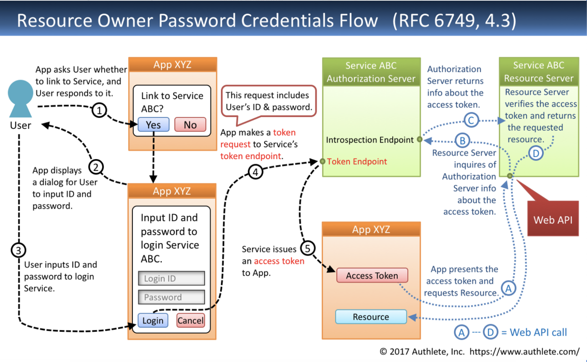

#### Resource owner password credentials flow Request to get access token

``` text
POST {Token Endpoint} HTTP/1.1
Host: {Authorization Server}
Content-Type: application/x-www-form-urlecoded
grant_type=password    // - Required
&username={User ID}    // - Required
&password={Password}   // - Required
&scope={Scopes}        // - Optional
```

#### Resource owner password credentials flow Response with access token

``` text
HTTP/1.1 200 OK
Content-Type: application/json;charset=UTF-8
Cache-Control: no-store
Pragma: no-cache
{
  "access_token": "{Access Token}",    // - Always included
  "token_type": "{Token Type}",        // - Always included
  "expires_in": {Lifetime In Seconds}, // - Optional
  "refresh_token": "{Refresh Token}",  // - Optional
  "scope": "{Scopes}"                  // - Mandatory if the granted
                                       //   scopes differ from the
                                       //   requested ones.
}
```

### Client credentials flow

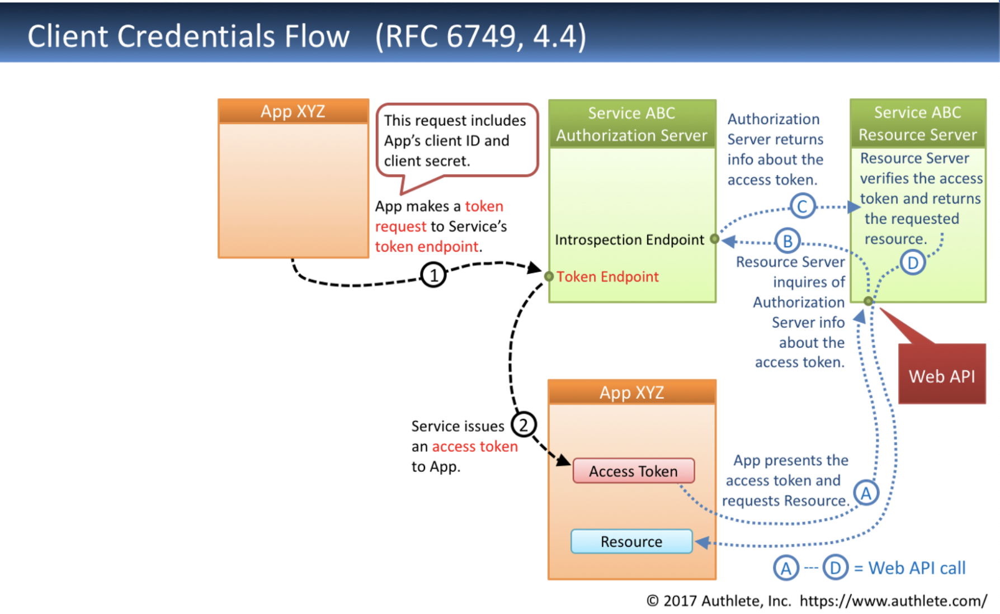

#### Client credentials flow Request to get access token

``` text
POST {Token Endpoint} HTTP/1.1
Host: {Authorization Server}
Authorization: Basic {Client Credentials}
Content-Type: application/x-www-form-urlecoded
grant_type=client_credentials  // - Required
&scope={Scopes}                // - Optional
```

#### Client credentials flow Response with access token

``` text
HTTP/1.1 200 OK
Content-Type: application/json;charset=UTF-8
Cache-Control: no-store
Pragma: no-cache
{
  "access_token": "{Access Token}",    // - Always included
  "token_type": "{Token Type}",        // - Always included
  "expires_in": {Lifetime In Seconds}, // - Optional
  "scope": "{Scopes}"                  // - Mandatory if the granted
                                       //   scopes differ from the
                                       //   requested ones.
}
```

### Refresh token flow

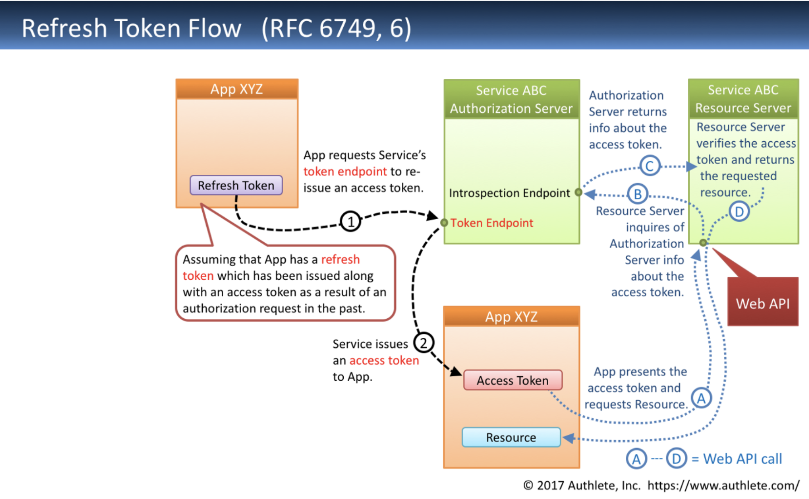

#### Refresh token flow Request to get the new access token

``` text
POST {Token Endpoint} HTTP/1.1
Host: {Authorization Server}
Content-Type: application/x-www-form-urlecoded
grant_type=refresh_token        // - Required
&refresh_token={Refresh Token}  // - Required
&scope={Scopes}                 // - Optional
```

#### Refresh token flow Response with new access token

``` text
HTTP/1.1 200 OK
Content-Type: application/json;charset=UTF-8
Cache-Control: no-store
Pragma: no-cache
{
  "access_token": "{Access Token}",    // - Always included
  "token_type": "{Token Type}",        // - Always included
  "expires_in": {Lifetime In Seconds}, // - Optional
  "refresh_token": "{Refresh Token}",  // - Optional
  "scope": "{Scopes}"                  // - Mandatory if the granted
                                       //   scopes differ from the
                                       //   original ones.
}
```

### Which flow you should choose

- If the app has no human interaction, e.g. a cron job, then using `client credential flow`
- `Resource owner credentials flow` is not secure, because users do not want to provide the username and password of a
  service to your app. The app will have the "access to all" previleges.
- `Authorization code flow` with PKCE is more secure by comparing with `Implicit flow`. `Implicit flow` was originally
  invented for javascript app. Please read this [link](https://medium.com/oauth-2/why-you-should-stop-using-the-oauth-implicit-grant-2436ced1c926)
  for more details about why implicit flow is NOT recommended any more.

And this [link](https://www.authlete.com/developers/pkce/#2-pkce-authorization-request) describes how `Authorization flow` with PKCE works.

#### What is PKCE

It is possible that a malicious process from the client side intercept the authorization token and use that token to ask
for the access token. So that we need to have a mechanism to protect it. We call it PKCE(proof key for code exchange).

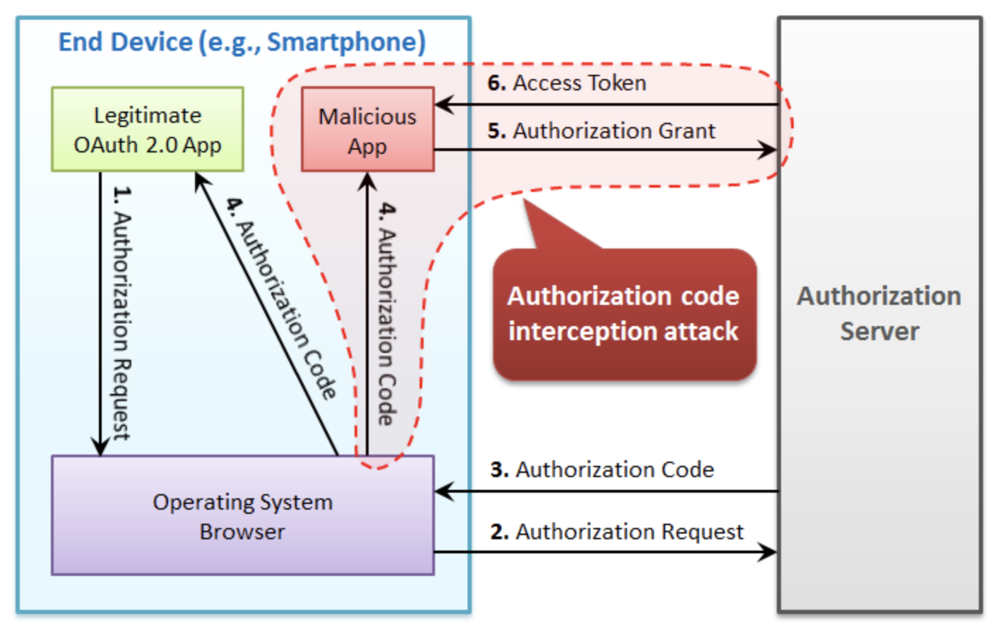

##### Below are the steps of PKCE

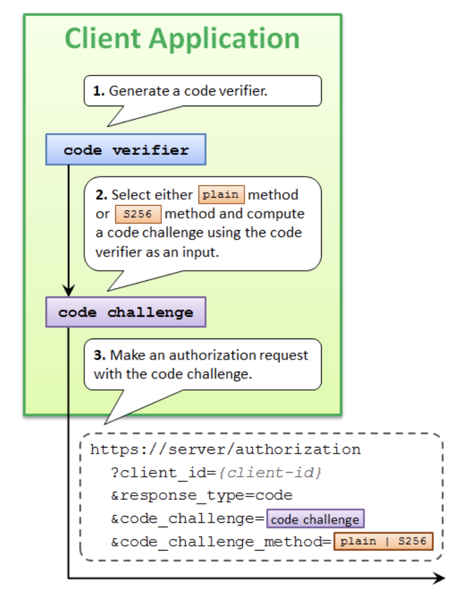

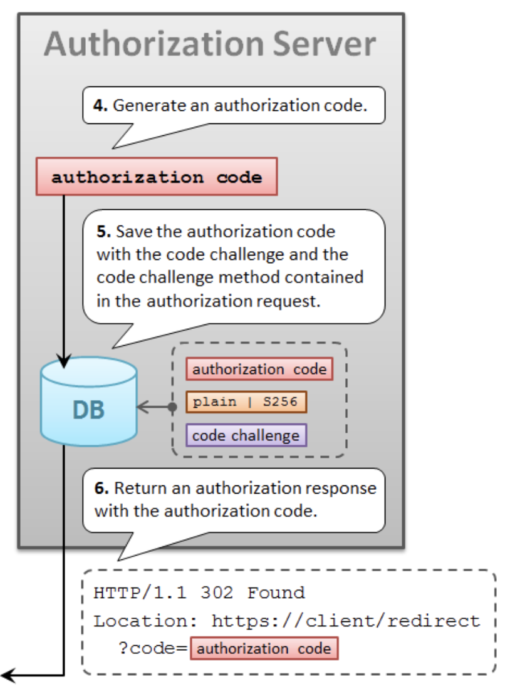

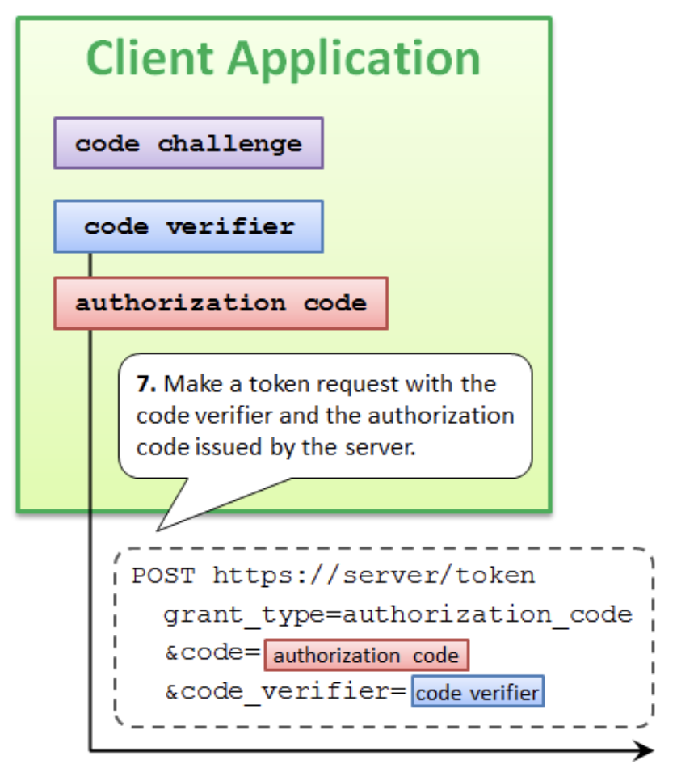

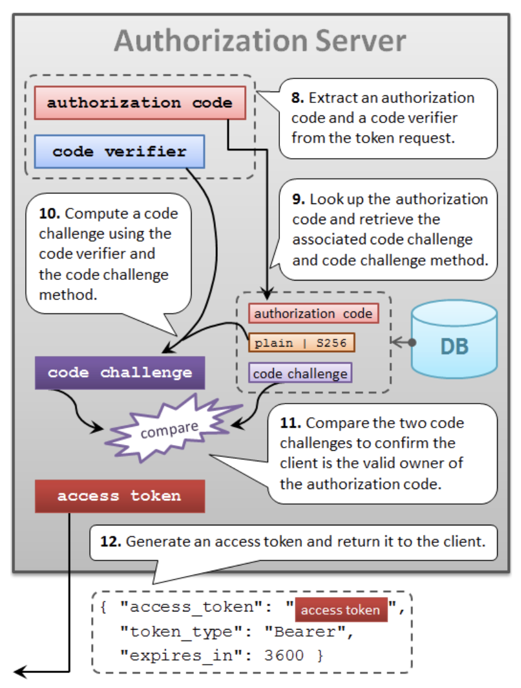

## How login via Google, Github, Twitter, FB works in a third party app

There are a lot of web app uses this feature, like `medium.com` which allows user to login via Github. The idea is behind
the scene is that `medium.com` wants to get the user profile, so it does the `OAuth` to the user profile provider. Since
user will be redirected to the profile provider to login first, so from user point of view it is login via Github.

## What flow should I use

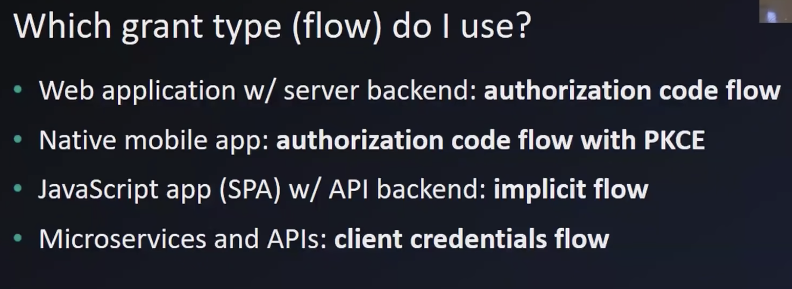

## References

- <https://www.youtube.com/watch?v=3pZ3Nh8tgTE&ab_channel=JavaBrains>
- <https://darutk.medium.com/the-simplest-guide-to-oauth-2-0-8c71bd9a15bb>
- <https://darutk.medium.com/diagrams-and-movies-of-all-the-oauth-2-0-flows-194f3c3ade85>
- <https://auth0.com/docs/authorization/which-oauth-2-0-flow-should-i-use>
- <https://medium.com/oauth-2/why-you-should-stop-using-the-oauth-implicit-grant-2436ced1c926>
- <https://blog.postman.com/pkce-oauth-how-to/>