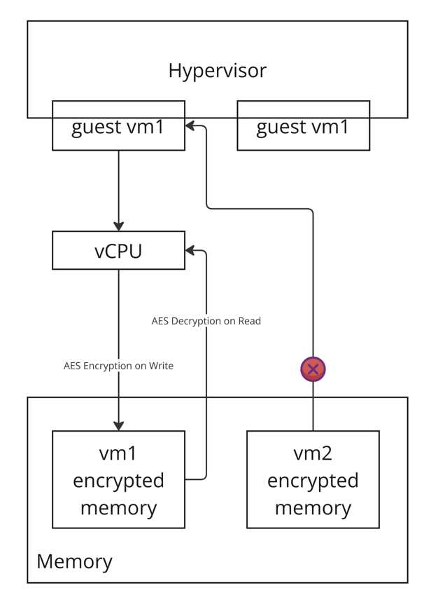

# Explore Confidential VMs

## What are Confidential VMs and Why we need Confidential VMs

What: A Confidential VM is a type of virtual machine (VM) that provides an extra layer of security by encrypting all the data
and code running within it (). This means that even if the VM's host server is compromised, the data inside the VM
remains protected.

Why: Confidential VMs are essential for organizations that handle sensitive data, such as financial institutions,
healthcare providers, and government agencies. They provide a high level of security and privacy, ensuring that
sensitive information is protected from unauthorized access.

## Confidential VM Encryption types

### Runtime memory encryption

The following diagram is based on AMD-SEV technology. But it's worth to note that some workload need to load data from
the disk. E.g., Accessing the LLMs. In this case, purely memory encryption might not be enough.

### Storage-level encryption at rest

When data is stored on local SSD or HD, it is usually encrypted. Cloud Service Provider like Google or Amazon has their
own KMS for managing the encryption keys. And they ofen use TPM/vTPM to ensure the encryption key is securely stored and
managed.

## What about hosting a LLM in a confidential VM

* At Rest (Disk): Model is encrypted on disk and decrypted when loaded into memory.
* In Memory: Model is encrypted in memory by the Confidential VM.  Decryption happens during runtime as needed for processing.

Thus, the total operations are:

* 2 Encryptions:
  * Encryption at rest (disk).
  * Encryption in memory by the Confidential VM.
* 2 Decryptions:
  * Decryption when loading from disk to memory.
  * Decryption during runtime for computation.

## Compare Confidential VM with Shielded VM

Confidential VMs primarily focus on securing data in use. They employ hardware-based encryption techniques, often using
technologies like Intel SGX and AMD SEV, to encrypt the VM's memory while it's running.link This means even if the host
system or hypervisor is compromised, the data within the Confidential VM remains protected.

Shielded VMs focus on ensuring the integrity of the boot process and the operating system kernel. They use features like
secure boot, measured boot, and virtual TPMs to protect against attacks that target the initial stages of the VM's
startup. This helps prevent malicious software from being loaded or tampering with the operating system before it's
fully loaded.

## Google's Confidential VM

<https://cloud.google.com/confidential-computing/confidential-vm/docs/confidential-vm-overview>

### Technologies compatible with Google Cloud

## Azure's Confidential VM

<https://learn.microsoft.com/en-us/azure/confidential-computing/confidential-vm-overview>

## Amazon's Nitro Enclaves

<https://docs.aws.amazon.com/enclaves/latest/user/nitro-enclave.html>

AWS Nitro Enclaves is an Amazon EC2 feature that allows you to create isolated execution environments, called enclaves,
from Amazon EC2 instances. Enclaves are separate, hardened, and highly-constrained virtual machines. They provide only
secure local socket connectivity with their parent instance. They have no persistent storage, interactive access, or
external networking. Users cannot SSH into an enclave, and the data and applications inside the enclave cannot be
accessed by the processes, applications, or users (root or admin) of the parent instance. Using Nitro Enclaves, you can
secure your most sensitive data, such as personally identifiable information (PII), and your data processing
applications.

Key points:

* It's a VM for isolated execution.
* No persistent volume, No interactive access(SSH), no external networking.

## Comparison among Google(CVM), Microsoft(CVM) and Amazon(Nitro Enclaves)

## References

* <https://gufranmirza.com/blogs/confidential-virtual-machine-architecture-cvm-1>
* <https://medium.com/cloud-security/azure-confidential-vms-fb820899885a>
* <https://aws.amazon.com/blogs/security/confidential-computing-an-aws-perspective/>