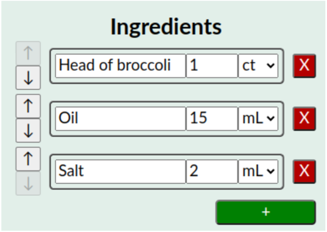
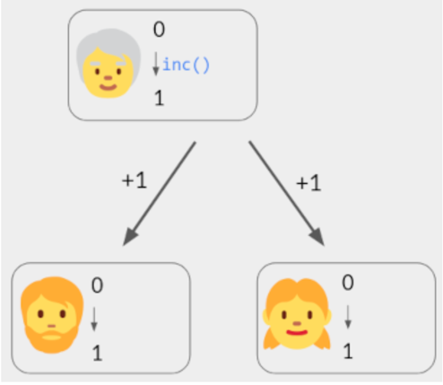

# Conflict-free Replicated Date Types

---
tags:- CRDT
---

## What is CRDT

In many system, some date needs to be replicated and stored distributively. Examples are:

* Mobile apps that store data on local device, and that need to sync that data on other devices belonging to the same
  user. (Calendar app)
* Distributed database, which maintain multiple replicas of the data.
* Collaboration software, such as Google Docs, in which multiple users can concurrently make changes to the same file.

All above need to handle the concurrent distributed data modifications and achieve data consistency.

There are two possible ways:

* Strongly consistent replication: In this model, the replicas coordinate with each other to decide when and how to
  apply the modifications. This approach enables strong consistency models such as serializable transactions and
  linearizability. However, waiting for this coordination reduces the performance of these systems; moreover, the CAP
  theorem tells us that it is impossible to make any data changes on a replica while it is disconnected from the rest of
  the system (e.g. due to a network partition, or because it is a mobile device with intermittent connectivity).
* Optimistic replication: In this model, users may modify the data on any replica independently of any other replica,
  even if the replica is offline or disconnected from the others. This approach enables maximum performance and
  availability, but it can lead to conflicts when multiple clients or users concurrently modify the same piece of data.
  These conflicts then need to be resolved when the replicas communicate with each other.

Conflict-free Replicated Data Types (CRDTs) are used in systems with optimistic replication, where they take care of
conflict resolution.

Moreover, an important characteristic of CRDTs is that they support decentralised operation: they do not assume the use
of a single server, so they can be used in peer-to-peer networks and other decentralised settings. In this regard CRDTs
differ from the algorithms used by Google Docs, Trello, and Figma, which require all communication between users to flow
via a server.

## Examples

* One user deletes the first ingredient (“Head of broccoli”).
* Concurrently, a second user edits “Oil” to read “Olive Oil”.

We could try broadcasting the non-collaborative version of these operations: Delete ingredient 0; Prepend "Olive " to
ingredient 1. But if another user applies those operations literally in that order, they’ll end up with “Olive Salt”

And the correct result should be:

---

(Semantics)

* The first user increases the amount of salt to 3 mL.
* Concurrently, the second user clicks a “Halve the recipe” button, which halves all amounts.

We’d like to preserve both users’ edits. Also, since it’s a recipe, the ratio of amounts is more important than their
absolute values. Thus you should aim for the following result:

## Algorithm

### OP-Based CRDTs (Commutative replicated data type)

* Per-user state: The current count, initially 0.
* Operation inc(): Broadcast a message +1 to all devices. Upon receiving this message, each user increments their own
  state. (The initiator also processes the message, immediately.)

It is commutative replicated data type, because the order how messages get received does not matter. `-1+2 = 2-1`.

It is assumed that when a user broadcasts a message, it is eventually received by all collaborators, without duplication
(i.e., exactly-once). For example, each user could send their messages to a server; the server stores these messages and
forwards them to other users, who filter out duplicates.

Algorithms in this style are called op-based CRDTs. They work even if the network has unbounded delays or delivers
messages in different orders to different users.

#### Synchronization Workflow

**Key Principles**:

* Commutative Operations: Updates are represented as operations that can be applied in any order without affecting the
  final state, ensuring consistency despite concurrent modifications and network delays.
* Asynchronous Propagation: Operations are disseminated independently among replicas, often using gossip protocols or
  other decentralized mechanisms, promoting scalability and resilience.
* Eventual Consistency: Replicas converge to the same state over time as operations propagate and are applied, even if
  temporary inconsistencies exist due to network partitions or delayed updates.

**Workflow**:

* Local Update: A node initiates a change to its local CRDT replica by generating an operation.
* Operation Propagation: The operation is sent to other nodes in the system, typically using a gossip protocol or
  similar mechanism.
* Operation Verification (Optional): Some CRDTs incorporate steps to verify operation validity before applying them,
  enhancing security and data integrity.
* Operation Application: Receiving nodes apply the operation to their local replicas. Commutative nature ensures
  convergence regardless of application order.
* Convergence: As operations propagate and are applied, replicas eventually reach the same consistent state, even if
  they receive updates in different sequences.

**Advantages of Operation-Based Synchronization**:

* Reduced Network Traffic: Propagating operations instead of full states often minimizes bandwidth usage, especially for
  frequent updates to large datasets.
* Enhanced Fault Tolerance: Asynchronous propagation and commutativity make operation-based CRDTs resilient to node
  failures and network partitions, promoting high availability.
* Scalability: Gossip-based dissemination can efficiently handle large numbers of nodes without centralized coordination,
  enabling distributed systems to grow.
* Decentralization: Operation-based CRDTs don't rely on central coordinators for synchronization, aligning well with
  distributed architectures and unreliable networks.

See here to understand [when gossip protocol stops](../something-about-gossip-protocols/readme.md#when-does-gossip-protocol-stops)

### State-Based CRDTs (convergent replicated data types)

* A per-user state. Implicitly, this state encodes the set of operations that the user is aware of, but it is allowed to
  be a lossy encoding.
* For each operation (e.g. inc()), a function that updates the local state to reflect that operation.
* A merge function that inputs a second state and updates the local state to reflect the union of sets of operations

A replica receives updates(operations) from user, apply them locally and sends its full local state to other replicas.
Replicas receives the full state from another replica and call merger function to merge with its local state.

#### Synchronization Workflow

* Local Update: A node performs a local update on its replica of the CRDT state.
* State Generation: The node generates a new complete state of the CRDT, reflecting the recent update. This state might
  include all data elements and their versions or other state-specific information.
* Synchronization Trigger:
  * Various factors can trigger synchronization:
    * Periodically at set intervals to ensure eventual consistency.
    * After a local update, depending on the specific CRDT implementation.
    * Upon receiving a synchronization message from another node.
* State Exchange:
  * The node transmits the current state to a subset of other nodes in the network, often using gossip protocols or
    direct connections.
  * The state may be compressed or optimized for efficient transmission, depending on the chosen CRDT type.
* Merge on Receiving Nodes:
  * Receiving nodes merge the received state with their own local state.
  * The merge operation is specific to the CRDT type and ensures conflict resolution while applying the update.
* Convergence:
  * As nodes continuously synchronize and merge states, all replicas eventually converge to a consistent state.
  * This process might involve multiple rounds of state exchange and merging until every node has the same information.

### Convergence Detection

TBA

## References

* <https://mattweidner.com/2023/09/26/crdt-survey-1.html>
* <https://crdt.tech/>