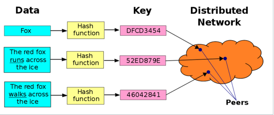
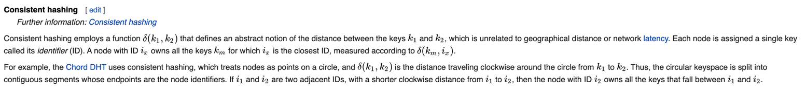
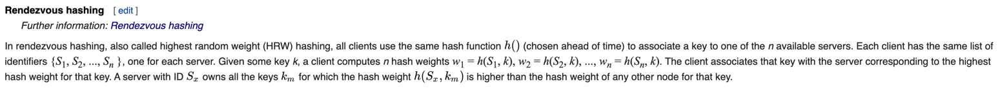

# Distributed hash table

## Structure

- **Keyspace**: Something like 160-bit of string.
- **Keyspace partitioning**: Decide which obj is assigned to which node within a set of nodes (Consistent hashing or Rendezvous
  hashing)
- **Overlay network**: Connects the nodes, allowing them to find the owner of any given key in the keyspace

### Workflow

Assume we want to index a file with given `filename` and `data` in DHT.

- SHA-1 hash value of the `filename` is generated, which produces 160-bit string as the key `k`.
- Send the message `put(k, data)` to **any** node participating DHT.
- The message is forwarded from node to node via the `overlay network` until it reaches the single node responsible for
  the key `k`.
- That node stores the key `k` and `data`.
- On read, any client does SHA-1 hash of the `filename` to get the key `k`.
- Send the message `get(k)` to **any** node participating DHT.
- The message is forwarded from node to node via the `overlay network` until it reaches the single node responsible for
  the key `k`.
- The data is retrieved.

### Consistent hashing

Using f(k, nodeID) to calculate which node is closest.

### Rendezvous hashing

Using f(k, nodeID) to calculate the weight against all servers, then pick the one has highest score(height).

## References

- <https://en.wikipedia.org/wiki/Distributed_hash_table>
- <https://en.wikipedia.org/wiki/Rendezvous_hashing>
- <https://en.wikipedia.org/wiki/Consistent_hashing>