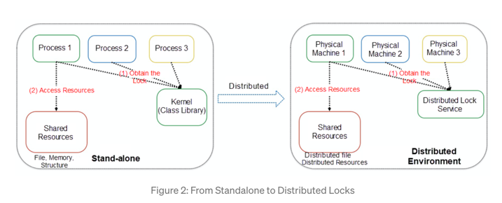
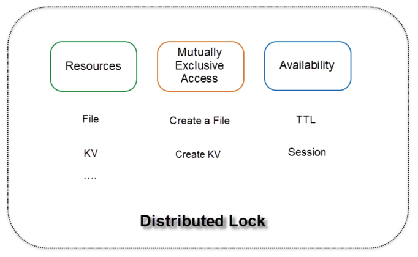
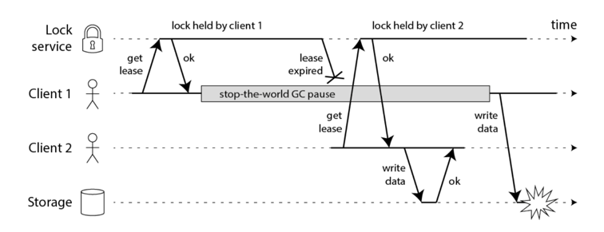
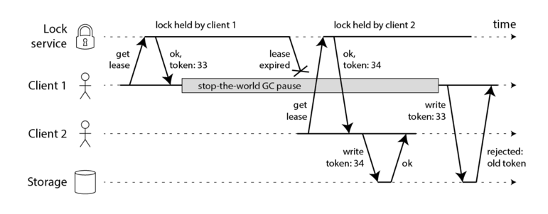
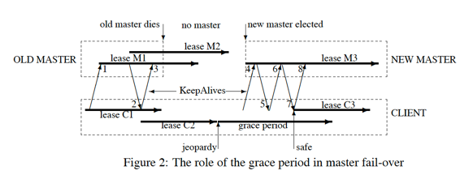

# Distributed lock

## What do we need the distributed lock for

- **Efficiency**: Without having a lock, several nodes might end up with doing the same work.
- **Correctness**: Without having a lock, several nodes might write data to the same place concurrently and cause the corrupted
  result.

## From standalone to distributed locks



- standalone lock: kernel or class lib provides the lock to several processes on the same machine.
  - kernel has the god eye and can know if a process is alive.
  - when process fails, kernel can release the lock resources held by the process.
- distributed lock: distributed lock service provides the lock to several machines.

``` text
Lock = Resource + Concurrency Control + Ownership Display
```

Distributed lock needs to have:

- Resources: File or KVs
- Mutually Exclusive Access: Create a file or create a KV
- Availability(similar to standalone lock, if holder crashes or times out the lock needs to be released): TTL or Session



## Types of distributed lock

- Distributed system based on asynchronous replication, such as MySQL or Redis.
  - Possible to have lock loss
  - Fine-grained lock service through TTL
  - Viable to short-term tasks
- Distributed consensus system(Paxos or Raft), such as ZooKeeper, etcd or consul.
  - No lock loss
  - Coarse-grained lock through lease or session
  - Viable to long-running tasks

## GC breaks distributed lock

The following code is broken when GC(Garbage collection) kicks in:

```javascript
// THIS CODE IS BROKEN
function writeData(filename, data) {
    var lock = lockService.acquireLock(filename);
    if (!lock) {
        throw 'Failed to acquire lock';
    }

    try {
        var file = storage.readFile(filename);
        var updated = updateContents(file, data);
        storage.writeFile(filename, updated);
    } finally {
        lock.release();
    }
}
```



- GC pause could happen at any time.
- GC could last unpredictable length of time. Usually it is short, but we can not guarantee.
- Not only GC, but there are other factors which would cause the same failure similar to GC-Pause. I.e., CPU error, memory
  error, network delay(they all could cause the process pause.)

## Fencing: Solve the GC breaks everything problem



- Every time a client wants to get a lock, lock service will return a fencing token(an incremental only token).
- If a request with smaller fencing token wants to write data, it will be rejected.
  - This requires storage server to verify the token.(Making the existing storage products to implement this logic is hard.)

## Timing

- Why do we need timing in distributed lock service? If some process uses longer time, the node dies or network partition
  causes the lock is under locked states for an unexpected longer time, we want to release it which allows other clients
  continue to consume it.
- Time skew exists in all distributed system.
- Distributed consensus algorithms which use async model have no assumptions about time.

### Problems with bad timing

- Client 1 acquires lock on nodes A, B, C. Due to a network issue, D and E cannot be reached.
- The clock on node C jumps forward, causing the lock to expire.
- Client 2 acquires lock on nodes C, D, E. Due to a network issue, A and B cannot be reached.
- Clients 1 and 2 now both believe they hold the lock.

### Solve the bad timing issue

- lock-delay(this is mentioned in Google's chubby paper): If a lock becomes free because the holder has failed or become
  inaccessible(lock times out), the lock server will prevent other clients from claiming the lock for a period. This period
  is called `lock-delay`. In above case, when client 2 tries to claim C which will be rejected.

## Distributed locks of Alibaba cloud storage

### Strict mutual exclusion

For standalone lock, it is easy for a process to hold the lock. But for distributed lock, the lock holder needs to tell
the lock server it is still holding the lock. So that, we could guarantee the mutual exclusion in distributed lock.

In both Alibaba and Google Chubby, this is done by maintain a `session` with TTL between the lock holder and lock server.

#### How to keep the session alive in order to hold the lock

- Client periodically sends a heartbeat to server to renew the lease of the session(In Google Chubby, this heartbeat is
  called `KeepAlive`).

Ideally we want to renew the session lease when it is about to expire. If client has a local TTL, it could either estimate
if there has enough time to perform critical operations, or know if it is about the time to renew the session lease.

- Challenge: Client and lock server might have time skew(NTP jumps).
- Solution:
  - Server TTL start time is later than client TTL start time in normal case. Client will expire earlier than server, so
    client's heartbeat will be sent before server TTL expires.
  - Single source of truth is server time. Only lock server could terminate the session if it expires.
  - Use system time(timestamp is always increasing) instead of wall time.

#### How to keep the session on failover

This is the solution from Google's chubby.



- Local TTL expires, the state of client is called jeopardy, client does not know if it is lock server terminates the session,
  or it is a failure from lock server. Client temporarily disable local cache and report this event to application.
- Now client enters grace period. Basically it gives client some time to wait for the recovery of lock server.
- If no lock server response after grace period, system treats the lock is **really expires**, otherwise the heartbeat will
  continue.

## Summary

- Lock is a resource + concurrent control + ownership display
- Client uses heartbeat and session mechanism to hold a distributed lock. If session expires, other client could claim the
  lock again.
- Use fencing(increasing only token) to prevent lock is released by previous lock holder.
- Use grace period to handle the lock server failover case.

## References

- <https://www.youtube.com/watch?v=v7x75aN9liM&ab_channel=TechDummiesNarendraL>
- <https://redis.io/topics/distlock>
- <https://martin.kleppmann.com/2016/02/08/how-to-do-distributed-locking.html>
- <https://alibaba-cloud.medium.com/the-technical-practice-of-distributed-locks-in-a-storage-system-4128936efe97>