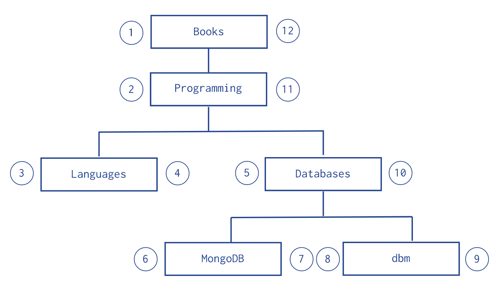
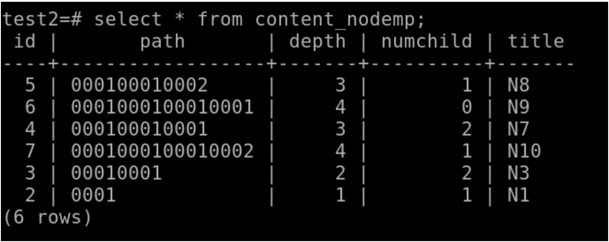

# How tree is stored in database

A struct(golang), class(java) could be easily stored in NoSQL database as key-value pairs, or row-columns in SQL database.
How about tree ? How a tree structure could be flattened and stored in database.

## Adjacency list | Store parent ref or children ref

In database, we store the node along with the ref to its parent node or its children node.

### Adjacency list Example of MongoDB


``` MongoDB
db.categories.insertMany( [
   { _id: "MongoDB", children: [] },
   { _id: "dbm", children: [] },
   { _id: "Databases", children: [ "MongoDB", "dbm" ] },
   { _id: "Languages", children: [] },
   { _id: "Programming", children: [ "Databases", "Languages" ] },
   { _id: "Books", children: [ "Programming" ] }
] )
```

``` MongoDB
db.categories.insertMany( [
   { _id: "MongoDB", parent: "Databases" },
   { _id: "dbm", parent: "Databases" },
   { _id: "Databases", parent: "Programming" },
   { _id: "Languages", parent: "Programming" },
   { _id: "Programming", parent: "Books" },
   { _id: "Books", parent: null }
] )
```

### Adjacency list Example of SQL database


---

Using this pattern is good for **write-heavy** application. Because insert a new node or update a node is pretty
straightforward. But when we want to read the tree, e.g. read the entire tree, it needs some recursive queries from root
to leaf. Multiple queries on read is not that efficient.

## Nested set

The Nested Sets pattern identifies each node in the tree as stops in a round-trip traversal of the tree. The application
visits each node in the tree twice; first during the initial trip, and second during the return trip. The Nested Sets pattern
stores each tree node in a document; in addition to the tree node, document stores the id of node’s parent, the node’s initial
stop in the left field, and its return stop in the right field.

### Nested set Example of MongoDB



``` MongoDB
db.categories.insertMany( [
   { _id: "Books", parent: 0, left: 1, right: 12 },
   { _id: "Programming", parent: "Books", left: 2, right: 11 },
   { _id: "Languages", parent: "Programming", left: 3, right: 4 },
   { _id: "Databases", parent: "Programming", left: 5, right: 10 },
   { _id: "MongoDB", parent: "Databases", left: 6, right: 7 },
   { _id: "dbm", parent: "Databases", left: 8, right: 9 }
] )
```

### Nested set Example of SQL database


---

Using this pattern is good for **read-heavy** application. Because read the tree or a subtree is just a range query like below:

``` MongoDB
var databaseCategory = db.categories.findOne( { _id: "Databases" } );
db.categories.find( { left: { $gt: databaseCategory.left }, right: { $lt: databaseCategory.right } } );
```

However write is expensive, since all the `left` and `right` numbers need to be re-calculated again.

## Materialized Path

The Materialized Paths pattern stores each tree node in a document; in addition to the tree node, document stores as a
string the id(s) of the node’s ancestors or path. Although the Materialized Paths pattern requires additional steps of
working with strings and regular expressions, the pattern also provides more flexibility in working with the path, such
as finding nodes by partial paths.

### Materialized Path Example of MongoDB


``` MongoDB
db.categories.insertMany( [
   { _id: "Books", path: null },
   { _id: "Programming", path: ",Books," },
   { _id: "Databases", path: ",Books,Programming," },
   { _id: "Languages", path: ",Books,Programming," },
   { _id: "MongoDB", path: ",Books,Programming,Databases," },
   { _id: "dbm", path: ",Books,Programming,Databases," }
] )
```

### Materialized Path Example of SQL database




---

This pattern is pretty balanced between read and write. If we want to insert a new node, its path would be the parent's
path + node's value. If we want to read the entire tree or substree, it is just a `LIKE` query in SQL database

``` SQL
SELECT * FROM “content_nodemp” WHERE (“content_nodemp”.”path”::text LIKE ‘00010001%’ AND “content_nodemp”.”depth” >= 2
```

or a `find` query in MongoDB

``` MongoDB
db.categories.find( { path: /,Programming,/ } )
db.categories.find( { path: /^,Books,/ } )
```

## References

- <https://medium.com/@spybugg/storing-and-retrieving-tree-structures-in-relational-databases-using-python-django-7480f40c24b>
- <https://docs.mongodb.com/manual/applications/data-models-tree-structures/>
