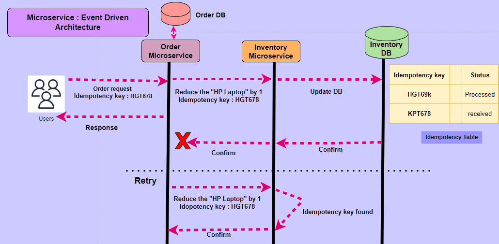

# Idempotency

## What is idempotency

A property that ensures an operation can be performed multiple times without changing the result beyond the initial one.
Like you press `<>` button in elevator multiple times, the door will just open once.

## Why do we need idempotency in distributed system

* Order processing: In e-commerce application, the order creation request could potentially fail but can be retried automatically. However,
  we do not want the order placement to be performed multiple times in the system.
* Inventory management: Among microservices, an API request might fail and retry to update the inventory. We do not want
  the duplicate requests to inaccurately update the inventory database.
* Payment processing: Venmo money transfer. If we encounter any network issue or client failure, we do not want to
  perform the money transfer more than once.

## How do we guarantee the idempotency in distributed system



* Using a dedicated data store (`idempotency table`) to maintain the transaction metadata. `key` is unique idempotency
  key.
* A mechanism in place that functions as lock or mutex is needed to that `idempotency table`.
* We have strong ACID requirements for this use case, so most of time we use relational database.

### How to generate idempotency key in distributed system

#### Stripe

<https://stripe.com/docs/api/idempotent_requests>

```text
Stripe’s idempotency works by saving the resulting status code and body of the first request made for any given
idempotency key, regardless of whether it succeedes or fails. Subsequent requests with the same key return the same
result, including 500 errors.

A client generates an idempotency key, which is a unique key that the server uses to recognize subsequent retries of the
same request. How you create unique keys is up to you, but we suggest using V4 UUIDs, or another random string with
enough entropy to avoid collisions. Idempotency keys are up to 255 characters long.
```

```shell
curl https://api.stripe.com/v1/customers \
  -u sk_test_4eC39HqLyjWDarjtT1zdp7dc: \
  -H "Idempotency-Key: KG5LxwFBepaKHyUD" \
  -d description="My First Test Customer (created for API docs at https://www.stripe.com/docs/api)"
```

#### Sendle

<https://developers.sendle.com/reference/using-idempotency-keys#generating-an-idempotency-key>

```text
So instead of using something like the customer number and/or order ID, you should either:

* Generate a new UUID whenever the order details change.
* Create a hash of the Order ID, Customer ID, and all the requested parameters together – so the key will change
  whenever the order details are changed.
```

## What database to use for idempotency table

For managing an idempotency table in a database, you'll want to choose a database that provides strong support for
transactions, consistency, and efficient indexing. The choice of database often depends on the specific requirements of
your application, the scale of operations, and your team's familiarity with certain technologies. Here are several
database options that are commonly used for idempotency tables:

* **Relational Databases (SQL):**
  * **Examples:** MySQL, PostgreSQL, Oracle, Microsoft SQL Server.
  * **Characteristics:**
    * ACID-compliant transactions for strong consistency.
    * Support for indexing, which is crucial for efficient lookups in the idempotency table.
    * Well-established and widely used in various applications.

* **NoSQL Databases:** Leader-based or Consistency level configurable (we need strong consistency)
  * Redis

* **Distributed Databases:**
  * **Examples:** Google Cloud Spanner, CockroachDB.
  * **Characteristics:**
    * Support for distributed transactions across multiple nodes.
    * Consistency and high availability across geographically distributed data centers.
    * Suitable for applications with global reach.

## References

* <https://www.cockroachlabs.com/blog/idempotency-in-finance/>
* <https://medium.com/@debasisdasnospdii/idempotency-in-scalable-distributed-architectures-example-e23a12c70048>
* <https://betterprogramming.pub/architecting-distributed-systems-the-importance-of-idempotence-138722a6b88e>
* <https://www.cockroachlabs.com/blog/idempotency-and-ordering-in-event-driven-systems/>