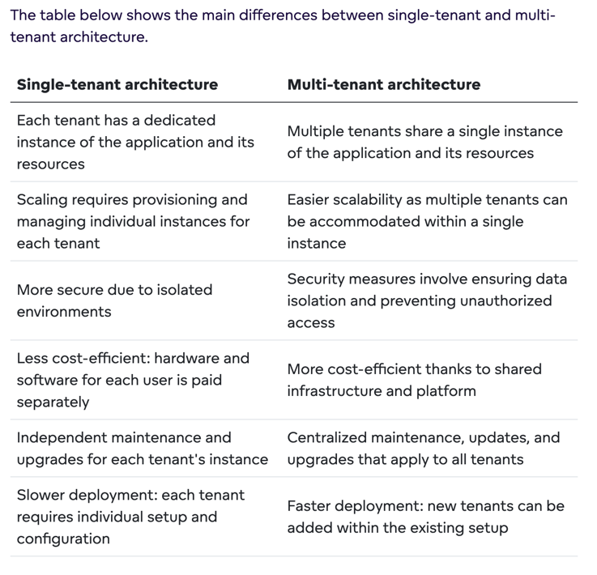
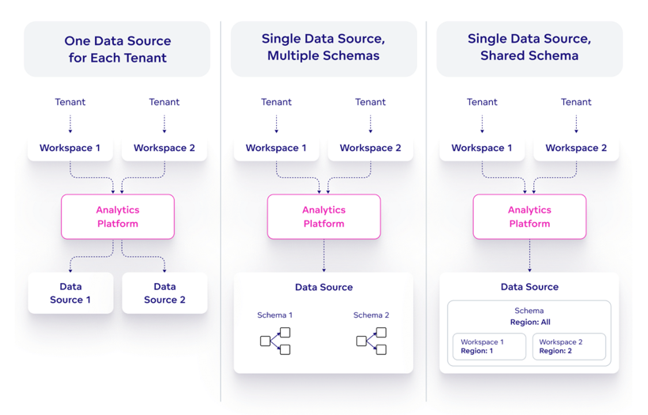
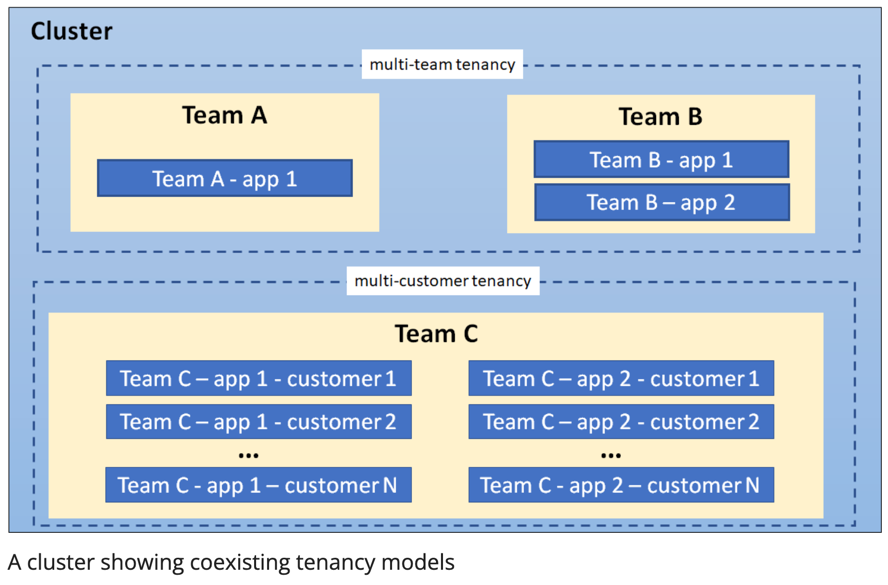
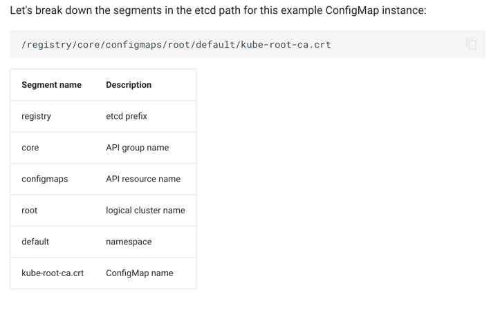
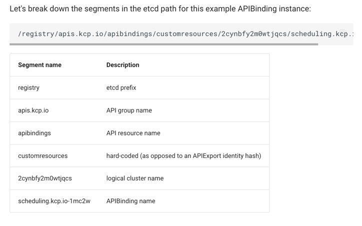
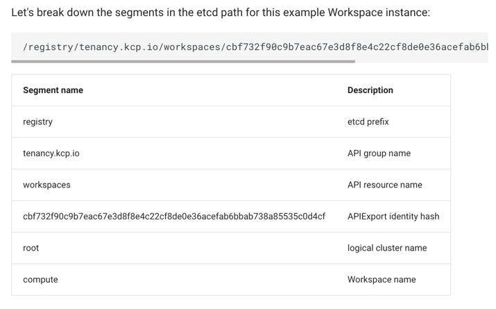

# Multi-tenancy

## What is multi-tenancy

Modern companies are looking for more efficient and cost-effective ways to manage their data and resources. Multitenancy
enables multiple customers to share a single software instance.

Multitenancy is a software architecture that serves multiple users by delivering a single instance of the software.
Different users can access the data, configuration and other specific functionalities of a given instance.

* Single tenancy provides an isolated environment deployed separately for each tenant.

* Multitenancy uses a shared platform to serve multiple tenants; these tenants receive defined user roles and access
  rights to their dedicated environments to manage their interface.

## Difference between single-tenant and multi-tenant

## Key Features of Multi-tenancy

Each multi-tenant solution should have the following features:

* Shared infra: Serve multiple customers with a single instance, while maintaining tenant isolation.

* Tenant isolation: Each tenant is restricted by their assigned role in order to access or manage their dedicated
  environment.

* Customization: Each tenant can has its own configurations.

* Scalability: System can accommodate growth without been overwhelmed or experiencing degradation in performance.
  Multi-tenant architecture should be able to handle increasing numbers of tenants and automatically allocate resources
  as needed.

* Centralized management/maintenance: Helps to manage multiple tenants from a single point of control via a single interface.

## Types of Multi-tenancy

* Separate data source for each tenant

* Single data source, multiple schemas

* Single data source, shared schema

## Advantages and Disadvantages of Multi-tenancy

### Advantages

* Scalability: Single instance of a system can be easily scale up/out.
* Cost saving & Increased efficiency: Multi-tenant can share resources like compute, storage.
* Easy Maintenance/Management: Easily fan-out the updates.
* Customization: Each tenant can have its own configurations.
* Tenant privacy: Tenant isolation.

### Disadvantages

* Potential security issue if incorrectly implemented
* Implementing additional logic for tenant separation, data filtering and tenant identification
* System outage wil have impact on all tenants

## Multi-tenancy Architecture in K8S

### Use Cases & Tenancy Models

* Multiple teams: Share a cluster between multiple teams within an organization, members of the teams often have direct
  or indirect access to Kubernetes resources. The Kubernetes policies such as RBAC, quotas, and network policies are
  essential to safely and fairly share clusters.
* Multiple customers: A Software-as-a-Service (SaaS) vendor running multiple instances of a workload for customers. The
  customers do not have access to the cluster; Kubernetes is invisible from their perspective and is only used by the
  vendor to manage the workloads.

### Control Plane Isolation

We want different tenants cannot access or affect each others' K8S API resources.

#### Namespaces

In a multi-tenant environment, a Namespace helps segment a tenant's workload into a logical and distinct management unit.
A object can be represented by namespacedName, using RBAC, Users and Service Accounts can be restricted to a namespace.

#### Access controls

The most important type of isolation from the control plane is authorization. RBAC is commonly used to enforce authorization
for both users and workloads(service-accounts). In multi-team environment, RBAC must be used to restrict tenants' access
to the appropriate namespaces.

#### Quotas

Quotas prevent a single tenant from consuming greater than their allocated share of resources hence minimizing the
“noisy neighbor” issue, where one tenant negatively impacts the performance of other tenants' workloads.

Ref: [Resource Quota Design](https://github.com/kubernetes/design-proposals-archive/blob/main/resource-management/admission_control_resource_quota.md)

### Data Plane Isolation

Data plane isolation ensures that pods and workloads for different tenants are sufficiently isolated.

#### Network isolation

Network policy provided by CNI or ServiceMesh(L7) can restrict the Pod-to-Pod communication.

#### Storage isolation

Pods can claim a volume(PVC) using dynamic provisioning or static provisioning. The Pod cannot access the volume attached
to another pod. Pod runs in Linux sandboxes, ensuring its processes, network resources, and filesystem are separated from
other pods.

#### Sandboxing containers

Sandboxing provides a way to isolate workloads running in a shared cluster. It typically involves running each pod in a
separate execution environment such as a virtual machine or a userspace kernel. Part of the reason this type of isolation
is necessary is because containers are processes running on a shared kernel; they mount file systems like /sys and /proc
from the underlying host, making them less secure than an application that runs on a virtual machine which has its own
kernel.

#### Node isolation

Node isolation is another technique that you can use to isolate tenant workloads from each other. With node isolation,
a set of nodes is dedicated to running pods from a particular tenant and co-mingling of tenant pods is prohibited.

### Implementations

#### Namespace per tenant

* Multi-team tenancy
  * <https://github.com/clastix/capsule>
  * <https://github.com/loft-sh/kiosk>
* Multi-customer tenancy
  * <https://github.com/cloud-ark/kubeplus>

#### Virtual control plane per tenant

Another form of control-plane isolation is to use Kubernetes extensions to provide each tenant a virtual control-plane
that enables segmentation of cluster-wide API resources.

Ref: [Virtual Cluster Paper](https://github.com/kubernetes-sigs/cluster-api-provider-nested/blob/main/virtualcluster/doc/vc-icdcs.pdf)
from cluster-api-provider-nested

## Multi-tenancy Architecture in ETCD

ETCD is the key-value store, it implements the multi-tenancy by using [namespaces](https://pkg.go.dev/go.etcd.io/etcd/clientv3/namespace).
A namespace allows to add a prefix for all keys, so it logically isolate data from different tenants. Once a prefix is
added, [ETCD RBAC](https://etcd.io/docs/v3.5/op-guide/authentication/rbac/) can be applied.

### Implementation of multi-tenancy in etcd

There are two main approaches to implementing multi-tenancy in etcd using namespaces:

* Per-tenant namespace: In this approach, each tenant is assigned a unique namespace. This is the simplest approach to
  implement multi-tenancy, but it can be difficult to manage if there are a large number of tenants.

* Shared namespace: In this approach, all tenants share a single namespace. This approach is more scalable than the
  per-tenant namespace approach, but it requires more careful management to ensure that tenants do not conflict with each other.

### How does KCP make changes to ETCD to fulfil its multi-tenancy

More details can be found [here](https://docs.kcp.io/kcp/main/developers/etcd-structure/)

## References

* <https://www.gooddata.com/blog/what-multitenancy/>
* <https://romanglushach.medium.com/kubernetes-multi-tenancy-challenges-benefits-and-best-practices-for-enterprises-26c6aa76f0d7>
* <https://kubernetes.io/docs/concepts/security/multi-tenancy/>