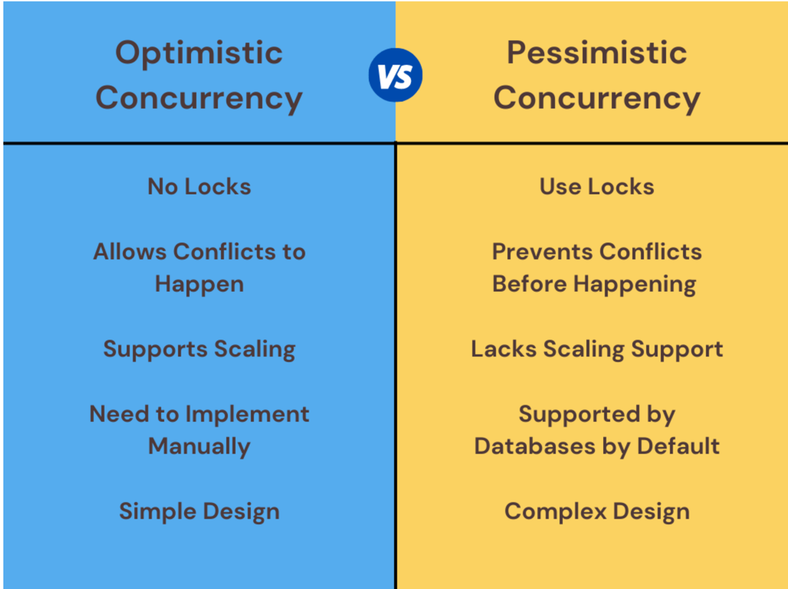

# Optimistic vs Pessimistic concurrency control

## Use case

In inventory management, we have only 3 units in stock. User A adds 2 units into shopping cart, and User B adds 3 units
into shopping carts at the same time.

## Optimistic concurrency control

### What it is

A concurrency control mechanism that allows concurrent execution of transactions without acquiring locks upfront. The
conflicts are detected during commit phase, and appropriate actions such as aborting, retrying are taken.

### When to use

* Conflicts between transactions will happen infrequently and allows transactions to happen in an un-synchronized manner.
* Application has requirements to scale or serve multiple users simultaneously.

### How to implement

* [MVCC](https://www.youtube.com/watch?v=iM71d2krbS4&ab_channel=CameronMcKenzie)
* Timestamp ordering
* Snapshot isolation
* [CRDT](../conflict-free-replicated-data-types/readme.md)

## What is Pessimistic concurrency control

### What it is

A concurrency control mechanism that assumes conflicts are likely to occur and takes a pessimistic approach by acquiring
locks upfront to prevent conflicts.

This approach has three lock modes:

* Shared(Read lock): Allow multiple readers, but cannot write.
* Exclusive(Mutex): Only the user acquires the lock can read or write the resource, no other locks can be applied.
* Update(Write lock): If another user holds a read lock, current user can still acquire write lock to write.

### When to use

* Suitable for applications with heavy data conflicts
* Does not have critical scaling requirement before using it.

### How to implement

- [2PL](https://www.youtube.com/watch?v=A6GDLuJgPRc&ab_channel=CS186Berkeley)
- [Multiple Granularity Locking](https://en.wikipedia.org/wiki/Multiple_granularity_locking)
- [Distributed Lock](../distributed-lock/readme.md)

## Comparison

## References

* <https://cult.honeypot.io/reads/optimistic-vs-pessimistic-concurrency/>