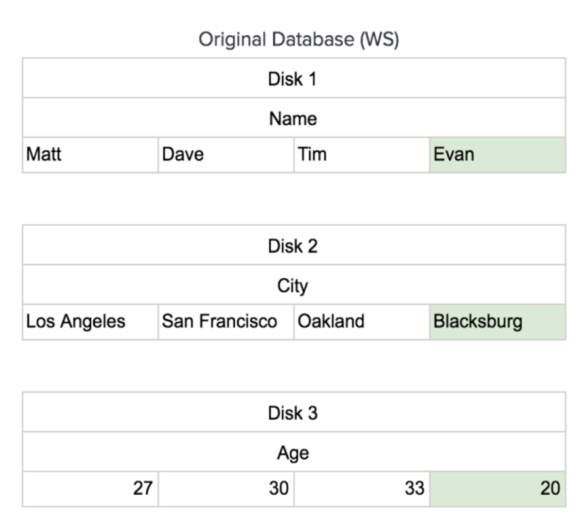

# Row vs Column oriented databases

## Row oriented databases

- Common databases: Postgres, MySQL.
- Data is stored row by row. The first column of a row is stored next to the last column of previous row.

  

- Write: New record is appended. Row oriented data store is commonly used by OLTP style application.

  

- Read: Can easily read entire row or multiple rows, but slow on selecting columns since it has to load unnecessary columns
  into memory.

## Column oriented databases

- Common databases: Redshift, BigQuery, Snowflake.
- Rows of each column is stored together.

  

- Write: New record needs to be split out and inserted into proper position.

  |   |   |   |
  |---|---|---|
  |Jane|Vancouver|33|

  - If data is on a single disk, write needs to load all data into memory.

  

  - If data is split out and distributed, write is more efficient.

  

- Read: read from single disk or continuous memory address which is very efficient. Column oriented data store is commonly
  used by OLAP style application.

- Has a write store which data could be appended on write, and then read-optimized to a read store which could sort data
  in arbitrary order.

  

  

## References

- <https://dataschool.com/data-modeling-101/row-vs-column-oriented-databases/>
