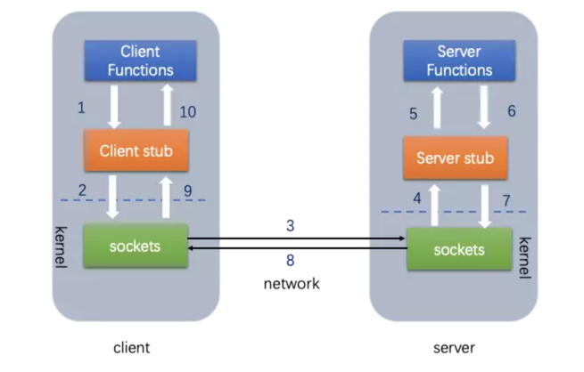
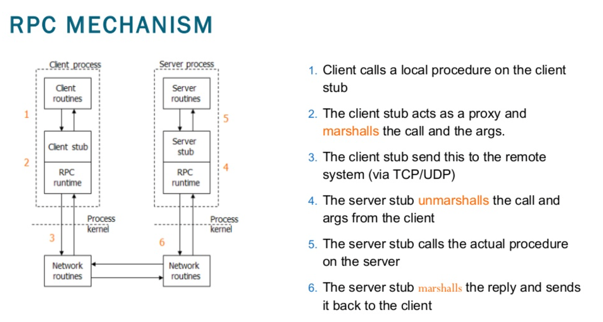

# RPC vs REST

## REST

REST: (Resource) Representational State Transfer

- Resource: username, password, newsfeed, etc.
- Representational: JSON, XML, JPEG.
- State Transfer: POST, GET, PUT, DELETE (using HTTP verb).

### 6 architecture constrains

- Uniform interface
- Client-Server: The client application and server application MUST be able to evolve separately without any dependency on
  each other.
- Cacheable: In REST, caching shall be applied to resources when applicable, and then these resources MUST declare
  themselves cacheable. Caching can be implemented on the server or client-side.
- Stateless: The server will not store anything about the latest HTTP request the client made. It will treat every request
  as new. No session, no history.
- Layered system: REST allows you to use a layered system architecture where you deploy the APIs on server A, and store
  data on server B and authenticate requests in Server C, for example.
- Code on demand: Usually server returns static representations of resources in the form of XML or JSON. But when you
  need to, you are free to return executable code to support a part of your application.

## RPC

- Remote procedure(function) call
- Runs on TCP/UDP

**IMPORTANT**: gRPC runs on HTTP/2

## Lab

### Goals

- Implement sample microservices using gRPC
- Deploy on K8S

### Steps

- Implement the grpc service logic by following [GRPC basic tutorial](https://grpc.io/docs/languages/go/basics/). The sample
  code is under [repo](https://github.com/danniel1205/grpc-service)
- Implement the grpc client logic, the sample code is under [repo](https://github.com/danniel1205/grpc-client)
- Create a kind cluster `kind create cluster --image kindest/node:v1.20.2`
- Deploy both grpc-service and grpc-client on the kind cluster. The YAML examples under the Github repo mentioned above.

## References

- [Simple explanation of REST(Chinese)](https://www.zhihu.com/question/28557115)
- [What is RPC(Chinese)](https://www.jianshu.com/p/7d6853140e13)
- [REST API Tutorial](https://restfulapi.net/)
- [APIs 101: Everything you need to know about API design](https://cloud.google.com/blog/products/api-management/google-cloud-api-design-tips)
- [gRPC vs REST: Understanding gRPC, OpenAPI and REST and when to use them in API design](https://cloud.google.com/blog/products/api-management/understanding-grpc-openapi-and-rest-and-when-to-use-them)
- [REST API Caching](https://www.youtube.com/watch?v=faxKtgl0-QY&ab_channel=TutorialsPoint%28India%29Ltd.TutorialsPoint%28India%29Ltd.Verified)
- [GRPC basic tutorial](https://grpc.io/docs/languages/go/basics/)
- [grpc go microservices on K8S](https://itnext.io/grpc-go-microservices-on-kubernetes-bcb6267e9f53)