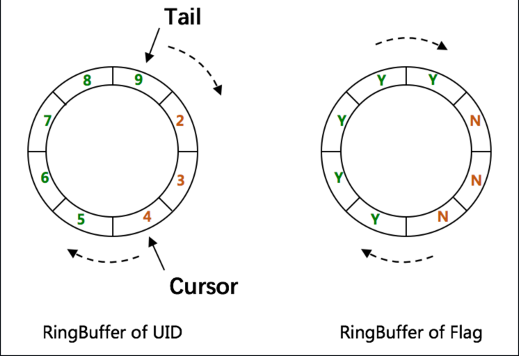

# UUID

## Snowflake ID

```text
 1 bit  |  41 bits   |  10 bits  |  12 bits
------------------------------------------------
Sign bit | Timestamp | Machine ID | Sequence Number
```

* Sign bit: Usually unused and is 0 by default.
* Timestamp: The delta from a fixed starting time in millisecond level. 41 bits can be used for 69 years.
* Machine ID: In twitter, 5 bit datacenter ID + 5 bit worker ID.
* Sequence Number: Incrementing, used to ensure uniqueness for IDs generated by the same machine at the same time. 4096
  Sequence numbers can be generated within 1 millisecond.

Core concept: Combine timestamp, machine ID and sequence ID together.

### Baidu UIDGenerator based off Snowflake ID

```text
 1 bit  |  28 bits   |  22 bits  |  13 bits
------------------------------------------------
Sign bit | Delta second | Machine ID | Sequence Number
```

* Delta second: Unit in second. Can support 8.7 years.
* Machine ID: Maximum value is 4.2 million. Use a built-in database's incrementing ID for worker id assigning.
  * **Cons**: 22 bits support ~ 4 million numbers, that means either machine # has to be less than 4 million. Or the total
    machine restart times have to be less than 4 million.(A newly restarted instance will have a new record)
* Sequence Number: Maximum value is 8192.
  * Synchronized to ensure thread safe.
  * If current ID is within the same second as previous one, sequence number increases.
  * If there has already been 2^13 - 1 IDs generated within the same second, wait for next second.
  * In new second, sequence number starts from 0.

#### Using RingBuffer to increase the sequence number generation performance



* Two RingBuffers, one for UID and another one is for status.
* Size of RingBuffer is 2^n, n >= # of bit of sequence number field.
* Tail Pointer: Represents the latest produced UID. If tail catches cursor, no put is allowed.
* Cursor: Represents the latest already consumed UID. If cursor catches tail, no take is allowed.

## UUID best practices

### Timestamp granularity

* Source: UUID v1 - v6 utilize Gregorian epoch timestamp. v7 utilizes Unix epoch, and other modern system has
  customizable epoch.
* Precision: Milliseconds, microseconds, nanoseconds or beyond. (Have to take system clock granularity into account)
* Length: How long a UUID will be valid.

### Monotonicity and Counters

* Time-based UUID is naturally monotonic.
* Batch generated UUIDs need also be monotonic.
* Snowflake IDs have 12bits sequence number to make sure the monotonicity.

### Distributed UUID generation

* Centralized registry: All nodes consult a central registry and confirm the generated value is unique.
* Node IDs: A pseudo-random Node ID value is placed within the UUID layout. MAC address should not be used for node ID.
  MAC addresses pose inherent security risks and SHOULD not be used within a UUID.

### Collision resistance

// TODO: How to handle UUID collision

### Unguessability

Implementations SHOULD utilize a cryptographically secure pseudo-random number generator (CSPRNG) to provide values that
are both difficult to predict ("unguessable") and have a low likelihood of collision ("unique").

### Sorting

UUIDv6 and UUIDv7 are designed so that implementations that require sorting (e.g. database indexes) SHOULD sort as
opaque raw bytes, without need for parsing or introspection.

Time ordered monotonic UUIDs benefit from greater database index locality because the new values are near each other in
the index. As a result objects are more easily clustered together for better performance. The real-world differences in
this approach of index locality vs random data inserts can be quite large.

---

See more details [here](https://datatracker.ietf.org/doc/html/draft-peabody-dispatch-new-uuid-format)

## References

* <https://en.wikipedia.org/wiki/Snowflake_ID>
* <https://github.com/baidu/uid-generator/blob/master/README.md>
* <https://datatracker.ietf.org/doc/html/draft-peabody-dispatch-new-uuid-format>
