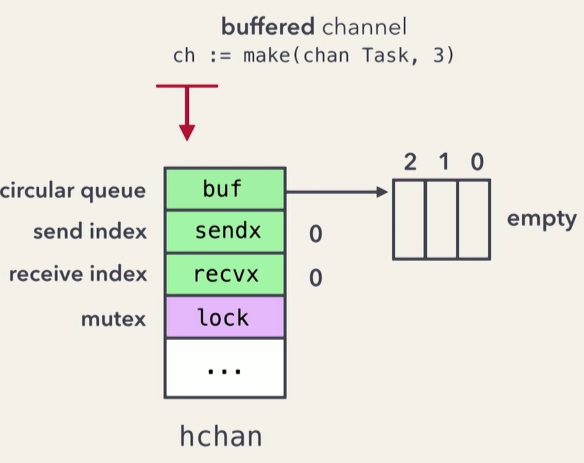
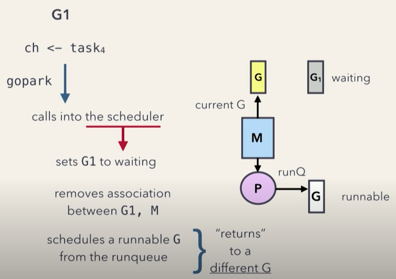
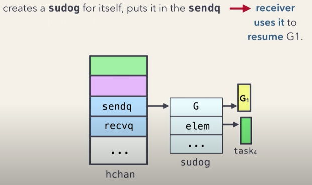
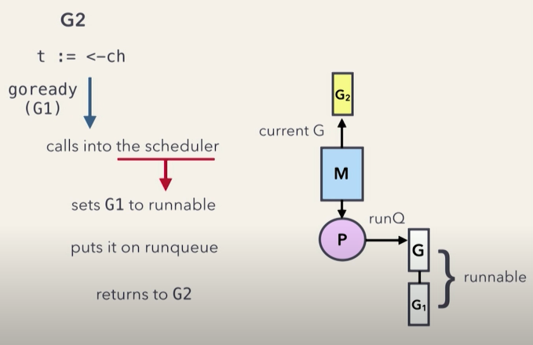

# Go channels

For communication, synchronization between goroutines.

- <https://www.youtube.com/watch?v=KBZlN0izeiY>
- <https://github.com/golang/go/blob/master/src/runtime/chan.go#L253>

## What happens when create a channel

``` golang
// Buffered channel
ch := make(chan int, 3)
// UnBuffered channel
ch := make(chan int)
```

Allocate an hchan struct on the `heap` returns a pointer of it



## Sends and receives

### What happens when sending data to channel

1. Acquire the lock
2. Enqueue (A memory copy)
3. Release the lock

### What happens when receiving data from channel

1. Aquire the lock
2. Dequeue (A memory copy)
3. Release the lock

Making a memory copy makes the goroutine memory safe. (No shared memory except for hchan)

### Senders

#### If there are waiting receivers

- Dequeue receiver and pass value directly to receiver
- Golang calls `goready` to invoke the waiting receiver

``` golang
if sg := c.recvq.dequeue(); sg != nil {
    // Found a waiting receiver. We pass the value we want to send
    // directly to the receiver, bypassing the channel buffer (if any).
    send(c, sg, ep, func() { unlock(&c.lock) }, 3)
    return true
}
```

#### If there are no waiting receivers

##### What happens when buffer is not full

Enqueue the value into buffer

``` golang
if c.qcount < c.dataqsiz {
    // Space is available in the channel buffer. Enqueue the element to send.
    qp := chanbuf(c, c.sendx)
    if raceenabled {
        raceacquire(qp)
        racerelease(qp)
    }
    typedmemmove(c.elemtype, qp, ep)
    c.sendx++
    if c.sendx == c.dataqsiz {
        c.sendx = 0
    }
    c.qcount++
    unlock(&c.lock)
    return true
}
```

##### What happens when buffer is full



- Create `sudog` instance with current `goroutine` info and enqueue into `sendq`

``` golang
gp := getg()
mysg := acquireSudog()
mysg.releasetime = 0
if t0 != 0 {
    mysg.releasetime = -1
}
// No stack splits between assigning elem and enqueuing mysg
// on gp.waiting where copystack can find it.
mysg.elem = ep
mysg.waitlink = nil
mysg.g = gp
mysg.isSelect = false
mysg.c = c
gp.waiting = mysg
gp.param = nil
c.sendq.enqueue(mysg)
```



- Golang calls `gopark` to put current `goroutine` to be `waiting`
- Dequeue next `goroutine` from `runQ` to process

The `goroutine` is blocked, but no OS thread, so that OS thread can still process other `goroutines`

### Receivers

#### If there are waiting senders

``` golang
if sg := c.sendq.dequeue(); sg != nil {
    // Found a waiting sender. If buffer is size 0, receive value
    // directly from sender. Otherwise, receive from head of queue
    // and add sender's value to the tail of the queue (both map to
    // the same buffer slot because the queue is full).
    recv(c, sg, ep, func() { unlock(&c.lock) }, 3)
    return true, true
}
```

- Dequeue the waiting sender
- Either pass the value directly to receiver OR enqueue the value to buffer, receiver reads the value from the head of buffer
- Golang calls `goready` to invoke the waiting sender



#### If there are no waiting senders

- If buffer is not empty, read from the buffer
- If buffer is empty, and no waiting senders
  - Create `sudog` instance with current `goroutine` info and enqueue into `recvq`
  - Golang calls `gopark` to put current `goroutine` to be `waiting`
  - Dequeue a `goroutine` from `runQ` to process
