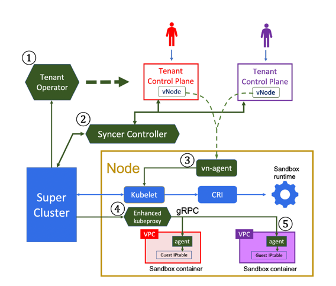

# Virtual Control Plane implementation: A Multi-Tenant Framework for Cloud Container Services

---
tags:- cluster-api-provider-nested, virtualCluster, multi-tenancy, k8s
---

## What problem does it try to solve

K8S is barely satisfactory in supporting multi-tenancy, and lacks strong isolation mechanism. Current solution with
Namespace + RBAC + Network policy is insufficient to satisfy the multi-tenant requirements in production.

### The problem of sharing control plane

* Performance interference: One tenant can crowd out others by issuing large number of queries against large amount of
  resources.
* Lack of API support: The namespace object is a cluster scoped object, while the namespace List API cannot filter the
  result based on the tenant identity. Once tenants are granted permission to list the namespaces to find their own
  ones, they can see all namespaces in the cluster.
* Management inconvenience: The least permission principle makes tenants cannot freely manage some of the resources
  like: CRDs, Namespaces, etc.

## How does it solve those problems

* Each tenant is assigned a dedicated Kubernetes control plane, which is referred to as a tenant control plane.
* A syncer controller to populate objects from the tenant control planes to the super cluster, and update the object
  statuses back to the tenant control planes.
* Kata sandbox container is used to provide a VM standard container runtime isolation.
* A virtual node agent to proxy all log and exec requests from the tenant control planes to the Pods running in the
  super cluster.

### Architecture

### Components details

#### Super Cluster

The actual K8S cluster where tenants will run workload on. The control plane of super cluster is hidden from tenants,
they only operate against the dedicated virtual control plane.

#### Tenant Operator

* Tenant Operator runs on super cluster and reconciles on `VirtualCluster` CRD to do lifecycle management of virtual
  control plane. E.g., Provision a virtual control plane.
* The `VirtualCluster` CRD describes the tenant control plane specifications such as the apiserver version, resource
  configurations, etc.
* Tenant Operator stores the access information of each tenant control plane on super cluster, so that Syncer Controller
  can use it to access tenant's control plane.

#### Syncer Controller

* Syncer populates the tenants object used in Pod provision, such as namespaces, pods, services, secrets, etc., to super
  cluster.(downward sync) Get the state from super cluster, then pushes to tenant control plane.(upward sync)
* Syncer will add prefix to namespace (`namespace/name` --> `<VCName+hash(VCObjectUID)>-namespace/name`). This is to
  all objects unique on super cluster.
* A work queue for Pods is shared by all tenants. It uses `weighted round-robin` algorithm + sub queue per-tenant to
  address queuing unfairness problem.
* Syncer creates a virtualNode object in tenant's control plane whenever a Pod is created/running on a physical node in
  super cluster. The binding/mapping between Pod and vNode is tracked in syncer as well. vNode object will be removed by
  syncer if there is no binding Pods.

##### Why uses a single centralized syncer for all tenants

* Tenants' CRUD operations against a object (Pod) are generally infrequent. A single syncer should be sufficient.
* Using a syncer per-tenant model will flood super cluster's apiserver whenever the syncer controller restarts or super
  cluster's apiserver restarts. (Syncer's `List&Watch` mechanism will invoke `List` API call against apiserver.)

##### How to handle the data inconsistency

* Eventual consistency model
* Periodically scan the synced objects' status in super cluster and resend objects to work queue again for
  reconciliation.

Q&A:

* What resources syncer propagates in addition to pods, services, secrets ? How about deployments, RBACs?
  * <https://github.com/kubernetes-sigs/cluster-api-provider-nested/tree/main/virtualcluster/pkg/syncer/resources>
* Where does Syncer run?
  * On super cluster

#### Virtual node agent

* kubelet in super cluster has been registered with super cluster's apiserver. Tenant control plane apiserver cannot
  talk to the kubelet in super cluster directly. We need a proxy.
* It runs on every physical node to proxy tenants' kubelet API requests.
* Once a Pod is scheduled in the super cluster, the syncer will create a virtual node object in the tenant apiserver.
  To intercept the kubelet API requests, the virtual node points to the vn-agent in the physical node instead of the
  kubelet.
* Virtual node agent runs in super cluster.

#### Enhanced kubeproxy

The kubeproxy daemon enforce the routing policy to access a set of endpoints of a service in the cluster. The
kubeproxy daemon updates the host IPtable whenever the service endpoints change. This mechanism is broken when
containers are connected to a virtual private cloud (VPC) because the network traffics might completely bypass the
host network stack through a vendor-specific network interface. To enable cluster IP type service in such an
environment, we enhance the kubeproxy by allowing it to directly inject or update the network routing rules in each Kata
container’s guest OS. More specifically, the Kata agent running inside the guest OS opens a secure gRPC connection with
the kubeproxy through which the service routing rules can be applied in the IPtable of the guest OS.

## References

* <https://github.com/kubernetes-sigs/cluster-api-provider-nested/blob/main/virtualcluster/doc/demo.md>
* <https://github.com/kubernetes-sigs/cluster-api-provider-nested/tree/main/virtualcluster>