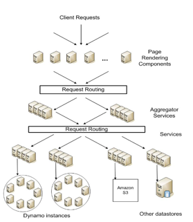
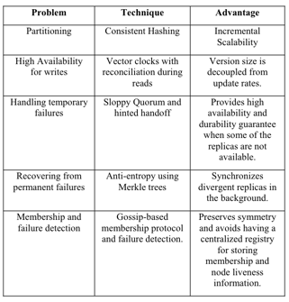
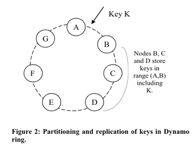
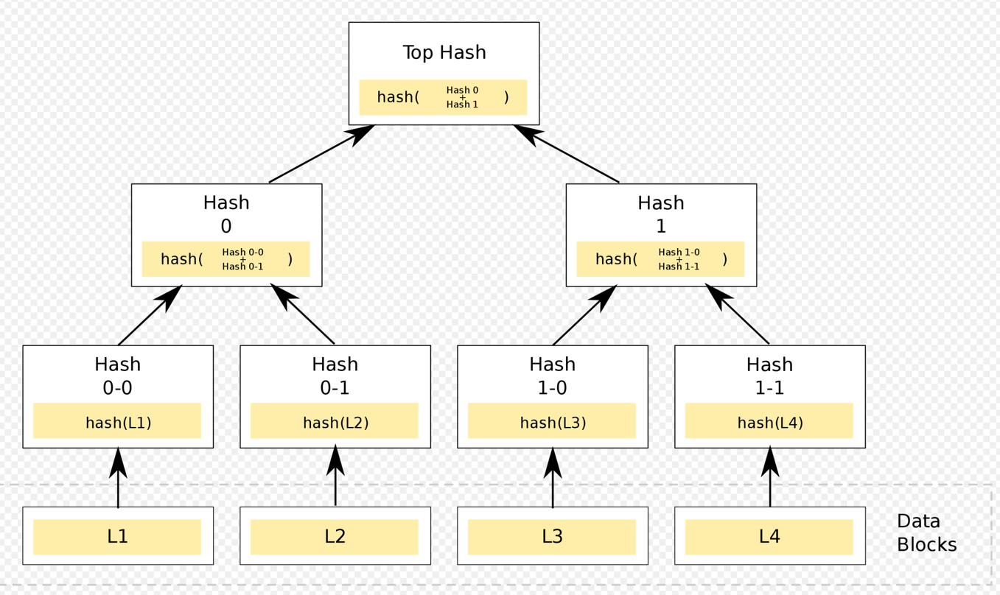

# Dynamo

[Paper](resources/amazon-dynamo-highly-available-key-value-store.pdf)

## What is Dynamo

A highly available key-value storage system that some Amazon's core services use to provide an "always-on" experience. It
does not mean to provide a fit-all solution.

**Note**: Dynamo is not the same as DynamoDB which is a leader based key-value database.

## Why does Amazon need Dynamo

- Some use cases require **high availability** over **strong consistency**. Shopping cart service needs to be always
  available(both read and write) even there are failures.
- Traditional relational DB is not good enough in Amazon's case:
  - Replication technology is limited.
  - Most of the services only store and retrieve data by primary key, do not need complex querying.
- Failures are unavoidable in distributed system, i.e., node failures or network partitions.

## What are the requirements and assumptions

- Simple read and write that is identified by a key. No operations span multiple data items and no need for relational
  schema.
- AID not ACID for database guarantees. Dynamo targets for applications running with weaker consistency.
- Dynamo wants read and write operations to continue even during network partitions and resolves updated conflicts using
  conflict resolution mechanisms.
- Dynamo assumes the environment is trusted. (This seems not fit in current distributed system assumptions: Zero-trust).

## Design considerations

- If we sacrifice consistency to guarantee high availability, and there are conflicts on writes, when to solve those conflicts
  and who resolves the conflicts(application or Dynamo).
  - About when: Dynamo decides to resolve conflicts on read in order to ensure that writes are never rejected.
  - About who:
    - If data store: Because of lacking the knowledge of application, only "last write wins" could be used.
    - If application: Application could implement its own method.
- Incremental scaling: Adding or removing node incrementally. This is to make sure quorum based algorithm could still work.
- Every node has the same role and responsibility, this is a leader less system.
- Every node maintains enough routing information locally to route a request efficiently. Act as `zero-hop` DHT(Usually
  a DHT overlay network could provide log(n) complexity on traffic routing).

## Design details

### APIs and keyspace

- get(key) --> object[] // 1+ objects(with conflicting versions along with context).
- put(context, key, object)
- Dynamo uses MD5 to generate 128-bit key.

Context has the information such as the version of the object.

### Partitioning algorithm

- Consistent hashing
- Each node has multiple virtual nodes assigned to multiple points.
  - **Why virtual nodes are good**: when a node becomes unavailable or becomes available again the load handled by this node
    is evenly dispersed to/from remaining available nodes.

### Replication

- A key is hashed and assigned to a node, the node called coordinator.
- The coordinator is taking charge of the replication of data.
- `preference list` is a list of nodes that is responsible for storing a particular key.

From above diagram, if a key `k` is assigned to `Node B` and replicated to `Node C` and `Node D`. Nodes `[B,C,D]` are a
preference list. `Node B` is called coordinator. In order to handle failure case, the `preference list` has more nodes than
the replication factor.

### Data versioning and conflict handling

- Dynamo provides eventual consistency + Async replication, so it would cause data inconsistency on `get()` and divergent
  versions on `put()`.
- Dynamo allows multiple version of an object and uses `vector clock/version` to handle multiple versions of the same object.
  See [here](../../system-design/5-replication/how-to-handle-concurrent-write.md) for more details.
- Use LRU mechanism(needs to store the timestamp) to truncate the `vector clock/version` if it grows bigger.

### Read and write flow

#### Client to node load balancing

- Generic load balancer
- Partition-aware client lib to send traffic directly to a node.
- The node is usually the first in `preference list`.
  - If current node is not the first in the `preference list`, the node will redirect the request to a proper node.
  - This is implicitly saying each node is storing a copy of the `preference list`.
  - If the first node or top ranked nodes are unavailable, the next highest ranked node is picked.

**Note**: Facebook's shard manager(Aka: [Akkio](../../how-facebook-xxx-series/managing-data-store-locality-at-scale-with-akkio/readme.md))
solves this in a generic way.

#### Quorum mechanism for consistency

- Set `R`, `W` that `R + W > N`. `R` is minimum number of nodes need to participate in a successful read operation. `W` is
  the minimum number of nodes need to participate in a successful write operation. `N` is the number of replicas.
- Flows on `put()`:
  - Coordinator node generate a new version with vector clock and write to local.
  - Coordinator node replicates the write to the N highest ranked reachable nodes, if at least `N-1` nodes respond then
    the write is considered successful.
- Flows on `get()`:
  - Coordinator node requests all existing versions of data for that key from the N highest ranked reachable nodes, wait
    for `R` responses before returning the result to the client. If there are multiple versions, the coordinator node returns
    all the versions to client who needs to reconcile the versions and send back the reconciled data(This is called
    `read repair`).

### Handle temporary failure: Hinted handoff

- If replica factor is 3, the data on `Node A` is replicated to `Node B` and `Node C`.
- If `Node A` is temporarily unavailable, `Node B` might become the new coordinator.
- On write, a replica will be written to `Node D`. The data written to `Node D` will have some metadata indicates that
  `Node A` was the intended recipient of the replica. See more details on [`sloppy quorum`](../../system-design/5-replication/readme.md)
- `Node D` will have the data stored in a separate local database, once `Node A` is back, `Node A` will send the replica
  back to `Node A` and delete its local replica when the delivery is successful.

### Handle permanent failure: Replica sync

It is possible that a coordinator node is permanently down before it sends out the data replication requests, and in this
case data will be lost. Dynamo tries to mitigate this issue by using an anti-entropy process to keep replicas are in-sync.

**Anti-entropy**: A background process looks for diffs in the data between replicas, and copy the data from one to another.

**Merkle tree**: Since the replicas are distributed, how could we minimize the data transfer when comparing two data
replicas? Dynamo uses `merkle tree` to solve the problem.

- Leaf is labeled the hash of data block.
- Non-leaf node is labeled with the hashes of its respective children.
- By comparing the hash, we could know if two trees are identical. In worst case, we need to traverse the entire tree.
- The **disadvantage** is that the tree needs to be recalculated once we have a new node joined or removed. TIME CONSUMING.

### Membership and failure detection

- Membership change is an immutable history record which needs to be persisted.
- Gossip-based protocol propagates membership changes to all nodes and maintains an eventually consistent view of membership.

#### Flow of membership change

- Node Alpha wants to join the cluster.
- Alpha chooses its set of tokens(virtual nodes) and persist the mapping on disk. `Alpha: {token1, token2, token3, ...}`
- Gossip-based protocol will make sure Alpha's info is propagated to all other nodes.
- How does Alpha know which node to pass the gossip to?
  - Dynamo defines some nodes as `seeds` which are externally/globally discoverable nodes.
  - So that, the new node could know where to initially send the gossip.

As a result, each node knows the key range handled by its peers, so it could redirect the request to proper node directly.

#### Failure detection

The reason of having failure detection is that we do not want to send requests to those nodes which are down already.

- Usually raft based system has the concept of heart-beat, which is a periodical request to check if remote node can respond.
- Dynamo does not have heart-beat, when it receives write/read request from the client, the inter-node communication
  will make sure each node knows which peers are not responsive. Then Dynamo uses gossip-based protocol to propagate the
  information to other nodes.

### Adding/Removing storage nodes

- When a new node is added, or an existing node is removed, data will be shifted from some nodes to another set of
  nodes. Consistent hash ring makes sure this data shift is as minimal as possible.
