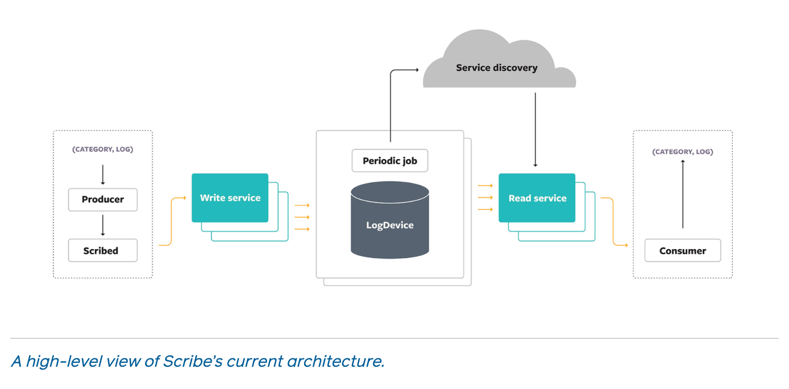
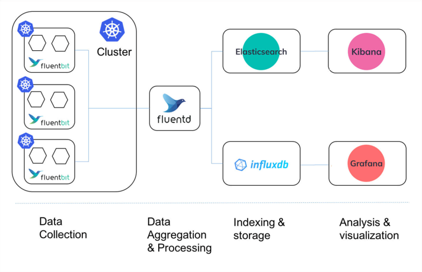

# Scribe: Transporting petabytes per hour via a distributed, buffered queueing system

TL;DR: This system is mainly for transporting logs from Point A to Point B within Facebook. Point A is where logs are produced,
and Point B is where logs will be processed.

## Why Scribe

The same reason as other open source solutions, i.e., [Fluentd](https://www.fluentd.org/), that we need a solution to
collect, aggregate, deliver those large amount of logs from source to another place for log processing. This kind of solution
needs to handle high data throughput, needs to be high available and scalable.

## User stories

- Collect machine syslog and deliver to downstream log processing pipelines.
- Collect container logs and deliver to downstream machine learning pipelines.

## Design details

### Producer libs

- Write logs to `Scribed` or to `Write Service` directly.

### Scribed

- A daemon process running on each machine.
- Use local disk in addition to memory for buffering logs.
- Eventually will dump logs to `Write Service`.

### Write Service

- A fleet of backend-server (replicas).
- Do not preserve or attempt to fix the relative order of logs it receives. Logs from single source could land in different
  storage back-end instances. Logs from different sources could land in a single storage back-end instance in any order.
- Place related logs to a subset of clusters. I.e., Storage back-end has 5 clusters, `Write Service` puts container logs
  from all machines to 3 clusters.
- Tolerate a minimal amount of data loss to gain the low latency with high throughput. This is configurable.

### Storage back-end

- Multiple storage clusters. Each storage cluster is a set of machines that host Scribe’s storage components.
- Is actually [LogDevice](https://engineering.fb.com/2017/08/31/core-data/logdevice-a-distributed-data-store-for-logs/).
  - A log is a LogDevice record.
  - LogDevice organizes records into sequences called partitions.
  - A Scribe category is backed by multiple partitions spread across multiple LogDevice clusters.
  - Each log has retention period in LogDevice.

### Read Service

- Based on streaming Thrift and follows the reactive stream specification.
- Also act as load balancer layer for multi-tenant read.
- Read from multiple storage back-end clusters, `Read Service` does not guarantee the strict order. Provide rough order
  to ensure the output logs are within N minutes of one another. Use [Stylus](https://research.fb.com/publications/realtime-data-processing-at-facebook/)
  to do the strict ordering.

## Availability

- Producer buffers logs in memory to handle the case with `Scribed` is unavailable(i.e., restart).
- `Scribed` buffers logs on local disk to handle failures which prevent logs to be sent to `Write Service`.
- LogDevice replicates each records.
- Allow user to choose whether to wait for un-delivered logs or proceed without it.

## Scalability

- Auto-scale the number of LogDevice partitions based on the log volume.
- Introduce `Bucket` to enables multiple independent consumer processes to collectively consume the logs from a single
  Scribe category. This sounds like a `Consumer Group` notion in `Kafka`, maybe I need to dig deeper since the original
  blog does not elaborate that part.

## Compare with Fluentd/Fluentbit

- Fluentbit is more like the `scribed` running on each node to collect logs.
- Fluentd:
  - It does not persist logs, but has [buffer](https://docs.fluentd.org/buffer)(`in-memory` or `file`) to temporarily
    store the input. If a buffer chunk becomes full, then it gets "shipped" to the destination.
  - It has storage plugin, but only for storing fluentd input/filter/output states, NOT for log persistent.
  - Push model to destination.
- Scribe:
  - Persist logs in `LogDevice`.
  - Pull model: Support consumers to subscribe and pull logs.

## Follow up

The original blog just has some high level introduction on what this system is without too many details. We could deep dive
further on the following aspects:

- When logs are received by consumers, are those logs sorted?
  - Are those logs sorted when they are stored in storage back-end cluster(LogDevice)? Consumers do a k-way merge when they
    read from `Read Service`.
- How does `Scribe` decide which storage back-end cluster to put a batch of logs? Is it a good idea to use
  [`Akkio`](../managing-data-store-locality-at-scale-with-akkio/readme.md)?
- When adding a new storage back-end cluster, how does the logs moved from one cluster to another?

## References

- <https://engineering.fb.com/2019/10/07/data-infrastructure/scribe/>
- <https://engineering.fb.com/2017/08/31/core-data/logdevice-a-distributed-data-store-for-logs/>
- <http://flume.apache.org/releases/content/1.9.0/FlumeDeveloperGuide.html>
- <https://logz.io/blog/fluentd-vs-fluent-bit/>