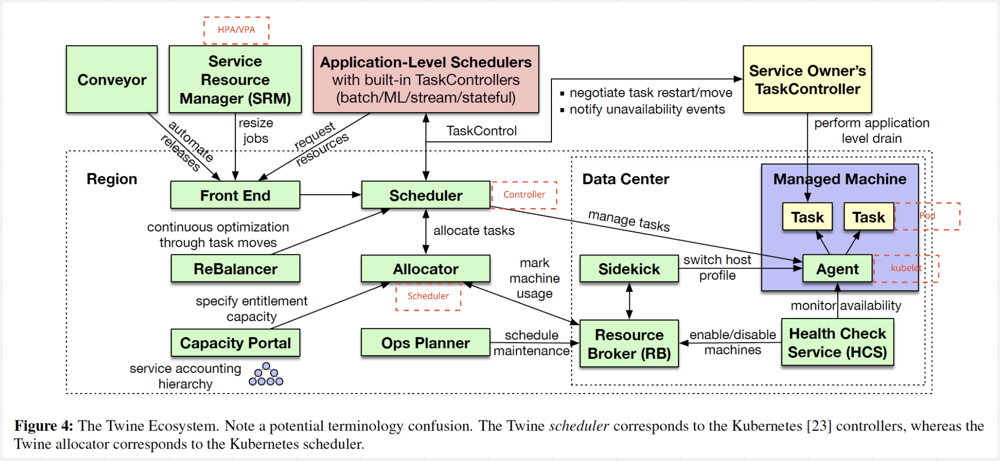
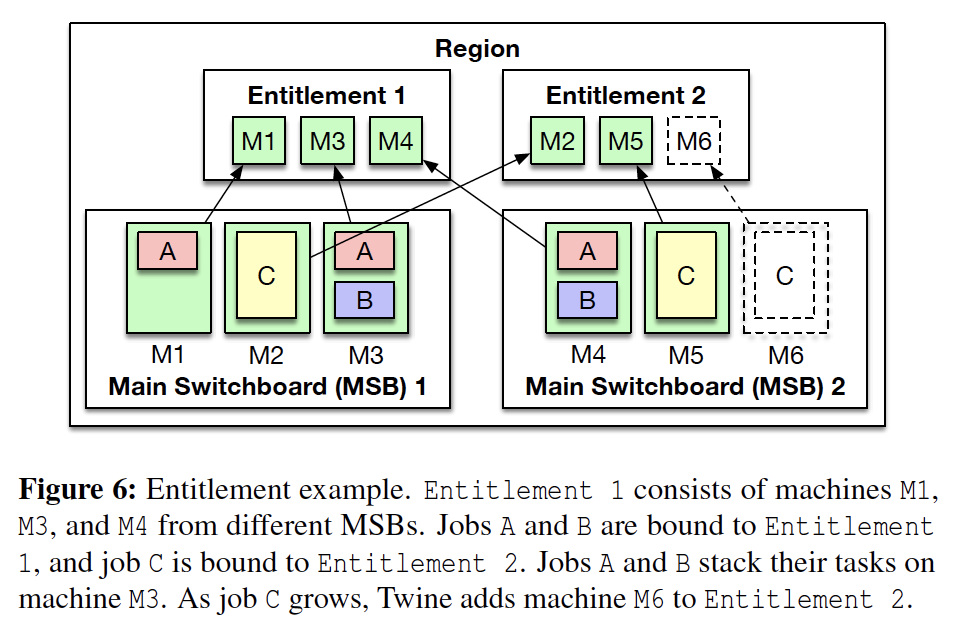
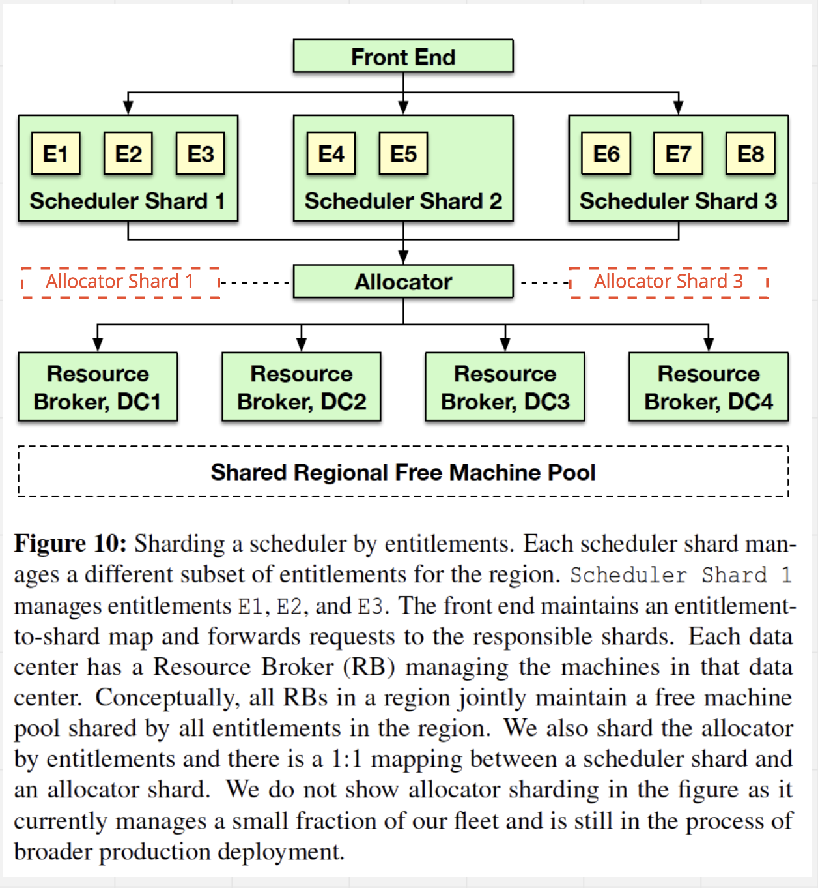
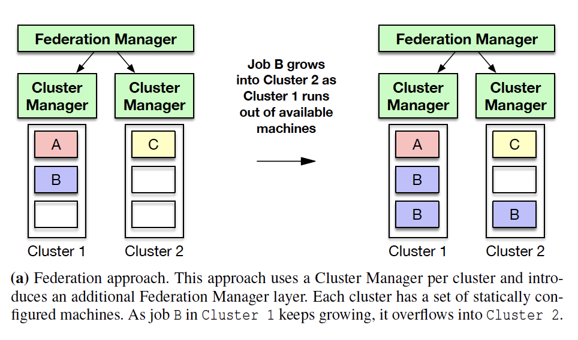
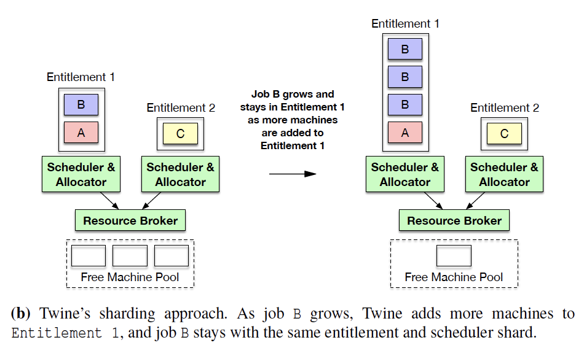

# Twine: A Unified Cluster Management System for Shared Infrastructure

## What is Twine

- A cluster management system helps to convert dedicated machines cross data centers/regions into a large scale shared
  infrastructure.
- Single control plane
  - LCM of millions of machines.
  - LCM of containerized applications across clusters.

[Paper](resources/Twine-A-Unified-Cluster-Management-System-for-Shared-Infrastructure-v2.pdf)

## Why does Facebook need Twine

### Limitations from existing system(K8S)

- Focus on isolated single cluster. (**TODO**: K8S Cluster Federation and Multi cluster service)
- Does not consult an application when performing the LCM operations.
  - K8S has the configuration of [`priorityClass`](https://kubernetes.io/docs/concepts/configuration/pod-priority-preemption/) for `Pod`,
    but it does not it does not have a way to dynamically consult the `Pod` if it is good time to perform the LCM.
- Does not have a way for applications to specify the preferred hardware and OS settings.
- Prefer big machines with more CPUs and memory in order to stack workloads and increase utilization.
  - Cluster API has the concept of `MachineDeployment`, but all `Machine` has the same setting.

## Twine architecture

### Task (Pod)

One instance of an application deployed in a container.

### Job (Deployment)

A group of tasks of the same application.

### Entitlement (Cluster)

- An abstraction represents a group of machine to host jobs. It looks similar to the concept of cluster in K8S.
- Machines could be from different datacenters in a region.
- Twine binds job to an entitlement.

### Agent (Kubelet)

Run on every machine to manage tasks. Like `kubelet`.

### Scheduler (Controller manager)

- Cooperate with `Agent`, `Allocator`, `ResourceBroker` and `TaskController` to manage the lifecycle of `Task` and `Job`
  as the central orchestrator.

### Allocator (Scheduler)

- Assign machine to entitlement.
- Assign tasks to machine.
- Talk to `ResourceBroker` to get machine information.
- Use multiple threads for `Job` allocation and optimistic concurrency control to handle the conflicts(Two threads try
  to handle the same job). And use `two phase commit` to commit an allocation.
- Use the in-memory `write-through` cache to speed up the repeated `Job` allocation.

### TaskController (K8S does not have)

- The API allows applications to collaborate with the cluster management system when deciding which operations to proceed and which
  to postpone.
- Handles three options:
  - Move a `Task` from one machine to another.
  - Stop a `Task` and restart later.
  - Do nothing and keep the `Task` running.

### ReBalancer

- Asynchronously and continuously to improve the decision of `Allocator`.

### Resource Broker

- Store machine information.
- Handle machine unavailability events and notify `Allocator` and `Scheduler`.

### Health Check Service

- Monitor machines.
- Updates machine status in `Resource Broker`.

### Sidekick

- Apply host profiles to the machines as needed.
- All machines share the same host profile in one entitlement. It looks like `MachineDeployment` in K8S Cluster API makes
  all machines have the same flavor.

### Service Resource Manager (HPA/VPA)

Auto-scale jobs in response to load changes.

## How is a job deployed

- Front end handles a request which wants to deploy a `Job`.
  - The request contains `entitlementID`, `allocationPolicy` and other necessary inputs.
- Front end sends the request to `Scheduler`.
- `Scheduler` consults `Allocator` on where to deploy the `Task` within a `Job`.
  - If no such `entitlement` instances exist:
    - `Allocator` gets the `entitlement` capacity from `Capacity Portal`.
    - `Allocator` assigns the free `machine` to an `entitlement` by marking the `machine` status in `ResourceBroker`.
    - `Sidekick` watches on the event of updating `machine` status then switch the host profile for that particular `machine`.
  - `Allocator` returns the `machine` information(should be a list, because a Job has multiple Tasks) back to `Scheduler`.
- `Allocator` notifies the `Agent` on a particular `machine` to start the `Task`(containerized application).

## How is a task redeployed

Machine failure/maintenance or rolling update might make a task to be redeployed.

### The redeployment is caused by machine unavailability

- `HealthCheckService` will detect the unavailability and send an event to `ResourceBroker`.
- `ResourceBroker` notifies `Scheduler` and `Allocator`.
- `Scheduler` disables the affected `Task`'s service discovery so that no clients could send requests to it.
- `Scheduler` consult `TaskController` of that `Job` to see if a move operation is allowed.
- `TaskController` responses with the decision.
  - If yes:
    - `Scheduler` will consult `Allocator` to deallocate the affected `Task` from the unavailable machine by evict its
      cache entry.
    - `Scheduler` will consult `Allocator` to allocate a new machine for the affected `Task`.
    - The following steps are the same as the [job deployment](#How is a job deployed)
  - If no: Nothing to be done.
- `Scheduler` re-enable the service discovery.

### The redeployment is caused by rolling update

An example is to update the container image of a Job. A new task will be created, an old task will be terminated.

- `Scheduler` consult `TaskController` of that `Job` to see if a stop operation is allowed.
- `TaskController` responses with the decision.
  - If yes:
    - `Scheduler` will disable the service discovery.
    - `Scheduler` will consult `Allocator` to deallocate the affected `Task` from the unavailable machine by evict its
      cache entry.
    - `Scheduler` will instruct `Agent` to stop the `Task`.
    - `Scheduler` will consult `Allocator` to allocate a machine for the updated `Task`.
    - The following steps are the same as the [job deployment](#How is a job deployed).
    - `Scheduler` will re-enable the service discovery.
  - If no: Nothing to be done. The current task will be up and running.

## How does a machine get moved from one entitlement to another

**Note:**This is from my personal understanding

- A `machine` needs to be drained before the reassignment.
  - `Scheduler` consults `TaskController` to get the acknowledgement. Otherwise, this will be a no-op.
  - [Optional] `Scheduler` and `Allocator` redeploy the `task`s to different `machine.
  - `Scheduler` stops the service discovery on all `Task`s from that `machine`.
  - `Scheduler` instructs `Agent` to stop all containers.
  - `Scheduler` notifies `Allocator` the `machine` is drained.
  - `Allocator` updates `ResourceBroker` by un-marking the `machine` from the `entitlement` and mark the `machine` to be available.

## How does auto scaling work

Service Resource Manager is the components to use historical data of a service and predict the traffic, so that it could
automatically send resize job request to front end in order to fulfill the horizontal auto scaling.

## How does Twine control plane manage one million machines

### Shard the core components

- Shard the `Scheduler` to handle a subset of `entitlement`.
- Shard the `Allocator` to have 1:1 mapping to `Scheduler`.
- Each shard of `Allocator` talks to all `ResourceBroker`s to allocate.
- Each of above stateful component has its own separate external persistent store for metadata.

### Application level scheduler to offload core scheduler

- Plugin model to support `Application-level scheduler` which allocates and LCM tasks without involving Twine.
  (This sounds like the aggregated API server + custom controller in K8S)

## FB Sharding VS K8S Federation

| Comparison         | Twine     | K8S  |
| ----------------------- | --------------------------------------- | --------------------- |
| Machine allocation      | Dynamic                                 | Static                |
| Job metadata management | Within same `Scheduler` and `Allocator` | Split and distributed |

## Availability

Single regional control plane could not handle the HA well. Twine has the following design principles:

- All components are sharded.
- All components are replicated(leader based).
- Decouple the application running from the lifecycle of Twine components, so that Twine components failure will not
  affect applications.
- Rate-limiting and circuit breaker(this is added by myself) to prevent destructive operations.
- Twine manages its own components as Twine job(except for `Agent`).
- Twine manages its dependencies as Twine job(E.g., ZooKeeper).
