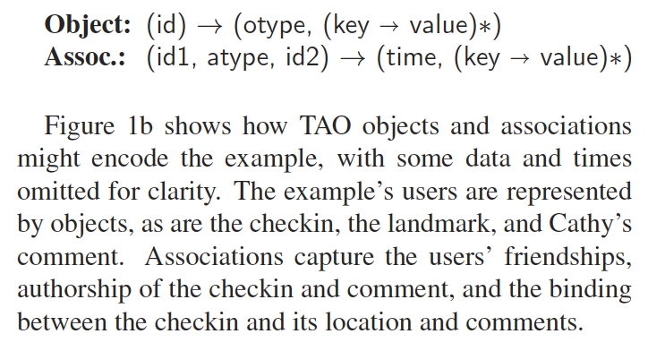
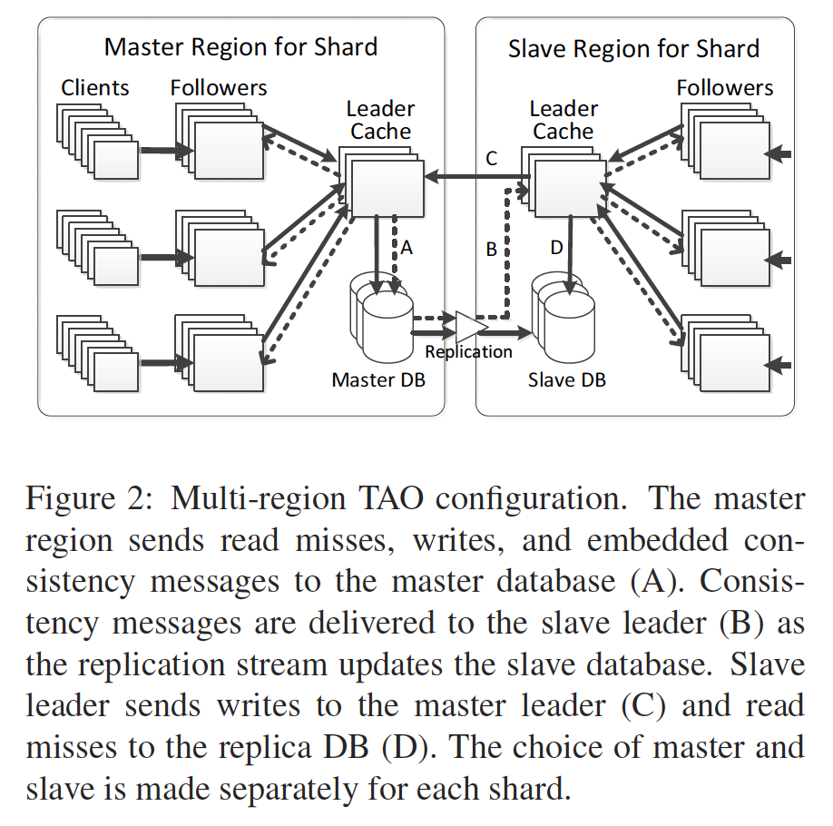
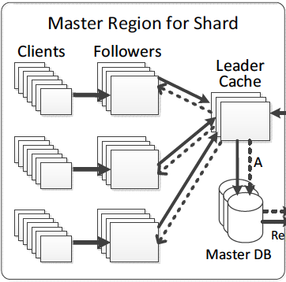
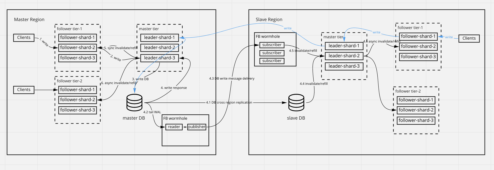

# TAO: Facebook’s Distributed Data Store for the Social Graph

## What is TAO

- Distributed datastore for social graph
- Read optimized
- MySQL for persistent storage
- Graph-aware cache
- Not strong consistency

[Paper](resources/TAO-Facebook-Distributed-Data-Store-For-The-Social-Graph.pdf)

## Why does Facebook need TAO

Facebook was originally built by storing the social graph in MySQL(Data model uses `node` and `edge` to represent the
social graph), querying it from PHP, and caching results in `memecache` as `look-aside cache`.

There are several reasons Facebook wants to use TAO:

- Move the control logic of cache from client to cache. `memecache` puts the control logic in the client side. Clients
  do not communicate with each other. Making cache to have the control logic would help to handle failure cases.
- Existing `memecache` solution does not have good support of `read-after-write` consistency in replica cache.
- Existing `memecache` uses `objID` as the key, serialized edge list as the value. Updating edges is inefficient.

Instead of rewriting existing `memecache` based solution, it might be a good idea to invent TAO for social graph usage.

## Data models and APIs



- Object ID: 64bits.
- `(key -> value)*` is the labels for nodes or edges.

```text
assoc_add(id1, atype, id2, time, (k→v)*)
Adds or overwrites the association (id1, atype,id2), and its inverse (id1, inv(atype), id2) if defined.

assoc_delete(id1, atype, id2)
Deletes the association (id1, atype, id2) and the inverse if it exists.

assoc_change_type(id1, atype, id2, newtype)
Changes the association (id1, atype, id2) to (id1, newtype, id2), if (id1, atype, id2) exists.

assoc_get(id1, atype, id2set, high?, low?)
Returns all of the associations (id1, atype, id2) and their time and data, where id2 ∈ id2set and high ≥ time ≥ low (if specified).
The optional time bounds are to improve cacheability for large association lists (see § 5).

assoc_count(id1, atype)
Returns the size of the association list for (id1, atype), which is the number of edges of type atype that originate at id1.

assoc_range(id1, atype, pos, limit)
Returns elements of the (id1, atype) association list with index i ∈ [pos,pos+limit).

assoc_time_range(id1, atype, high, low, limit)
Returns elements from the (id1, atype) association list, starting with the first association where time ≤ high, returning
only edges where time ≥ low.
```

## Architecture



## Two tiers of caching

### Why does TAO have two tiers

- Too few cache shards could not hold large volume of data.
- Too many cache shards bring in overhead of all-to-all shards connections.
- Need a coordinator to handle the cache updates/invalidation. Also guarantees the `read-after-write` consistency.

### How does two tiers work

- All shards are split into two levels: Leader tier and Follower tier.
- Members of leader tier talk to storage layer.
- Members of follower tier send read miss or write to leader tier.
- Clients talk to follower tier only.

#### Single region



##### Single region read

- Client sends read requests to follower (could be one shard or multiple shards in the case of loading a home page).
- If cache hit, then return to client.
- If cache miss, follower redirects requests to the leader shards (could be one or multiple).
  - If cache hit, then return to client.
  - If cache miss, the leader shard(s) read data from storage. On the way back to client, the follower shard(s) who take(s)
    the original requests are updated.

##### Single region write

- Client sends write requests to follower.
- Follower redirects the write requests to one of the leader member.
- Leader writes to storage layer **synchronously**.
- On a successful write, leader invalidates/refills the follower member who takes the original request **synchronously**.
  Leader invalidates/refills other follower members **asynchronously**. (This guarantees the `read-after-write` consistency).

#### Multi region



##### Multi region read

Same as single region, read miss will eventually be redirected into local region DB.

##### Multi region write

- Slave region writes will be redirected to master region(shown in blue line)
- Master region writes will be replicated to slave region:
  - Cache invalidation/refill is done via `Facebook wormhole`(shown in step 4.2).
  - DB replication is done by DB layer(shown in step 4.1).

## How does TAO handle large volume data

- Partition RAM
- Direct-mapped 8-way associative cache (#TODO: What is this?).
- Data compression in cache(similar to Twitter index compression).
- DB sharding(Objects in one table, Associations in one table, then do horizontal sharding).
- Manual tuning shards due to consistent hashing is not 100% balanced.
- Do not cache all Associations
  - Application domain knowledge to tune the cacheability.
  - Leverage the timestamp to predict what needs to be cached.

## How does TAO handle consistency

- Eventual consistent(only guarantee the `read-after-write` consistency)
- Using `sync` to guarantee the `read-after-write`
- Using `asnc` to propagate to other followers or slave leader.
- Using `vesion#` as the optimistic concurrent control for race condition.

There is one case that data is inconsistent between slave DB and slave region cache:

- Cache eviction is done at 00:00
- DB replication on writes is done at 00:03
- Client reads data at 00:01, and cache miss causes data to be loaded from DB at 00:02.

## How does TAO handle failures

### DB failure

- Master DB is down, one of the salves DB will be promoted.
- Slave DB is down, cache miss in slave region will be redirected to leader cache in master region. The leader cache takes
  care of the refills and invalidation of slave region follower caches(inter-regionally).

### Leader cache failure

- Follower redirects read miss to DB directly.
- Follower redirects write to another member in leader tier.

### Follower cache failure

- Failover to another follower tier for both reads and writes. (follower tier is replicated.)

### Refill and invalidation failure

- Leader persist the refill and invalidation message to disk and retry at a later time.
- Refill and invalidation could be retried in bulk.
