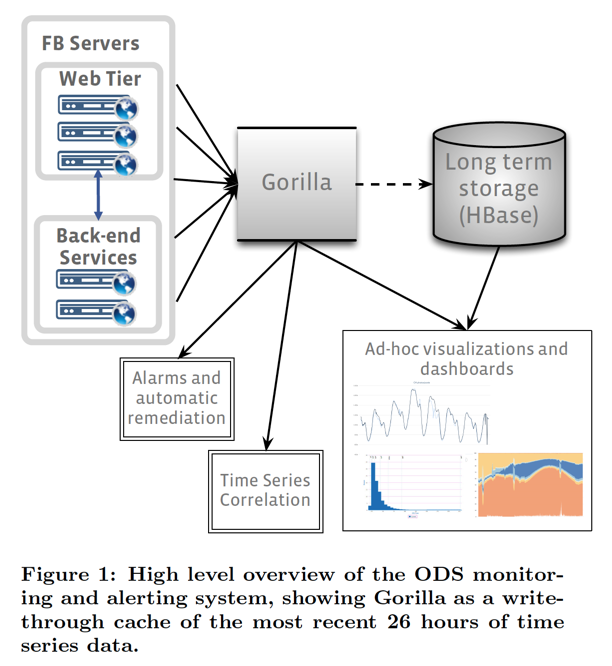
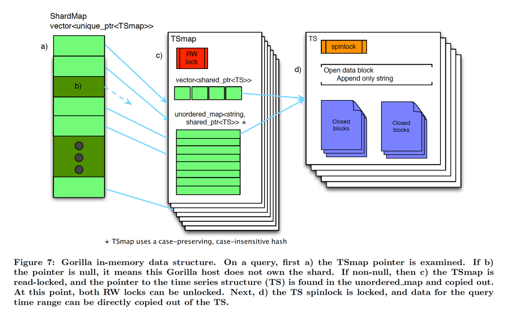

# Gorilla: A Fast, Scalable, In-memory Time Series Database

## Requirements

* Writes dominate: Write rate might easily exceed tens of millions of data point per second.
* State transitions: Support fine-grained aggregations over short-time windows. The ability to display state transitions
  within tens of seconds is particularly prized as it allows automation to quickly remediate problems.
* High availability
* Fault tolerance: Data needs to be replicated to survive from failure or disaster.

## Why in-memory

Facebook had existing data store called Operational Data Store (A TSDB + A query service + detection and alerting system).
The old TSDB is built atop HBase, and it's already in production. Completely replacing the old design which was already
in production is impossible. So, Facebook needs Gorilla to act as a write-though cache between clients and long term
storage.

## In-memory data structures

The primary data structure in Gorilla's implementation is a Timeseries Map (TSmap).

### TSMap

* Array of pointers to Timeseries: This allows for efficient paged scans through all the data.
* A map from time series names to Timeseries pointer: This allows constant time lookup for a particular timeseries.
* A read-write spin lock for concurrency control. 1-byte spin lock on each time series.

On deletion of a time series, an array entry is tombstoned, and the index is placed in a free pool which is re-used when
new time series are created. The actual timeseries file blocks can be garbage collected later in background.

### ShardMap

There are multiple TSMap instances (data is partitioned, each shard contains about 1 million entries). So we need to
know which TSMap to access from a time series name.

* A map from time series names to ShardID is maintained. (Given there are only low thousands of shards in Facebook's case).
  ShardID is basically the array index in the diagram above.
* An array of TSMap pointers is maintained. The array index is basically the shardID.
* A read-write spin lock is maintained for concurrency control.

### Time series

* A sequence of closed blocks for data oder than **2 hours**. (Immutable)
* Single open data block that holds the most recent data. The new time series data (time + value) is compressed, and
  appended.

Data is copied into the output remote procedure call structure on read. `output = read_copy(ts_name)`. Data decompression
is done by client.

### Query workflow

1. Time series name is passed in, and a map lookup returns the ShardID.
2. Check if ShardID(index of TSMap pointers array) is null.
   1. If null, it means this Gorilla host does not own that shard.
   2. If not null, the TSMap pointer is found and TSMap is read locked. Once TSMap is fround, the time series structure
     is copied out. At this point, TSMap read lock can be release.
3. Time series data structure spinlock is locked for data retrieving.

## On disk structures

Gorilla stores data in a distributed files system. Not using a database is because there is no requirements to support
database query language.

One host owns multiple shards of data, and each shard is a directory on disk. That directory contains: Key lists,
append-only logs, complete block files, and checkpoint files.

* Key list: a map from time series string key to shardMap array index.
* Append-only log: Data points are streamed in the append-only log in a compressed format. All time series values within
  a shard are interleaved. **This is not a write-ahead-log**. Data is buffered up to 64KB before flushed to disk file.
* Every 2 hours, Gorilla copies the compressed data from memory to disk.
* Once the block files is complete, Gorilla touches a checkpoint file and deletes the corresponding logs.
  * If the checkpoint file is missing (caused by a crash), the new process knows the block file is incomplete, so it reads
    from the log file.

## Handling failures

* Two independent Gorilla instances in separate data center regions.
* Writes are streamed to all two instances. (No attempt to guarantee consistency)
* Read will be retried to healthy instance on failure. If failure is longer than a threshold, read will be just redirected.
* [ShardManager](https://engineering.fb.com/2020/08/24/production-engineering/scaling-services-with-shard-manager/) is
  used to manage shards.
  * On node failure, shard will be reassigned/moved to other nodes.
  * Write client buffers 1 minute of data during the shard movement. (Data Loss: Old data will be discarded to make room
    for new data)
  * On new node where shard will be put: Gorilla shard reads data from the distributed files system. The new node begins
    accepting writes.
* If read goes to the new node while it is still loading data from the distributed files system, the data(most recent)
  returned to client will be marked as partial. Client tries to read the data from another instance to make sure the data
  is complete. If all Gorilla instances return partial data, error code will be returned with incomplete data.

Gorilla leverages existing legacy HBase's TSDB for data persistence. So, in worst case data still can be retrieved from
TSDB. As a in-memory layer, Gorilla also leverages GlusterFS (a distributed file system) to persist time series data to
be fault tolerant.