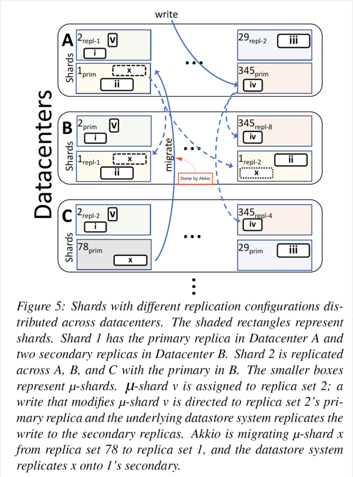
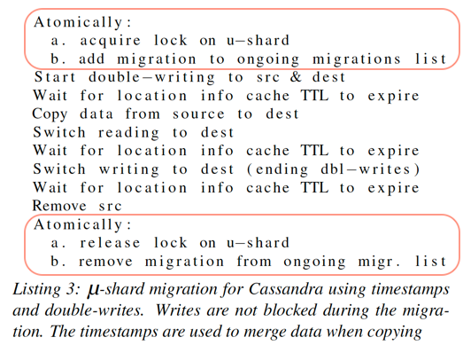

# Manage datastore locality at scale with Akkio

[Paper](resources/Sharding-the-Shards-Managing-Datastore-Locality-at-Scale-with-Akkio.pdf)

Akkio is a locality management service layered between client applications and distributed datastore system.

## Why does Facebook need Akkio

### What does large scale application usually have

- Large amount of clients around the globe.
- Web servers(stateless).
- Distributed storage for large amount of data.
  - **Replicated data**.
  - **Sharded data**.
  - Above provides fault tolerance, load distribution and scaling.
- Low access latency(locality).
  - Put/move data closer to where the request is initiated.

Facebook wants fault tolerance, data locality and less data migration overhead.

### What are the potential solutions and considerations

- Replicate data to guarantee fault tolerance.
  - What replica factor should be used and where to put those replicas? Full replica costs and low replica factor makes
    it difficult to decide where to place the copy.
- Keeping the data closer to clients for data locality.
  - Data access pattern is dynamic. This would cause the very costy cross datacenter data migration.
  - Having an effective caching layer(close to clients) is complicated.
    - For data read, if cache miss the average data read latency will be high if target data is not located in the local
      datacenter.
    - For data write, remote data store access latency would also be high.
    - Caching could not fit all consistency requirements.
- Shard the data to reduce the data migration overhead.
  - Data assigned to a shard is **decided by datastore** via `key ranges` or `key hashing`, it does not have the knowledge
    of applications(access pattern).
  - Usually a shard holds 10s GBs of data and 10s-100s shards are assigned to a node. -- High granularity and high overhead.

## What does Akkio do

- Define a concept of `u-shard`:
  - Bytes to several MB in size.
  - Allow application to decide what data belongs to a u-shard (prefixing keys with common identifier or separate
    partition key).
- Tracking client application data access pattern, so that it knows where to put replicated u-shard.
- Based on the access pattern, it decides when and where to migrate u-shard in order to provide data locality.
- Tells client application where to access u-shard.

## Akkio design guidelines

- An additional layer to map `u-shard-id` to data storage servers.
- Keep most of the operations asynchronous (unless they are on critical path).
- Decouple control plane(Akkio) and data plane(data storage).

## Akkio architecture

### Requirements for both application and data storage

- It is the responsibility of applications:
  - To partition data into `u-shard`.
  - To identify `u-shard`.
  - Bind `u-shard-id` for data access.
- It is the responsibility of data store:
  - Not span `u-shard` across two shards.
  - Minimal amount of support for data consistency during migration.

### Location service

- Deployed in each datacenter.
- Tracks `u-shard` locations. Maps `u-shard-id` to `location-handle`.
  - Persist location information in data store(leader-based replication model and uses Paxos for distributed consensus).
  - Uses datacenter level cache layer to cache the location information.

Why `Location service` is per datacenter based? The total amount of data to be stored is relatively small(several hundreds GBs).

#### Location service workflow on read

- Akkio client lib has an API `getLocation(u-shard-id)`, returns `location handle`(need to identify where the `u-shard`
  is located).
- Caller(of Akkio client lib) calls `getLocation(u-shard-id)` to get the locations where to access the `u-shard`.
- Caller(of Akkio client lib) in turns calls data store APIs by passing in the `location handle`.

#### Location service workflow on write

- After a `u-shard` migration, `Data placement service` will call `Location service` to update the records accordingly.
- This will only happen after migration is successfully done.

More details in [Data placement service](#data-placement-service)

### Access counter service

- Deployed in each datacenter.
- Track where `u-shard`s are accessed from.
- Track how frequent the `u-shard`s are accessed.
- For each application service, have **single counter per `u-shard` per datacenter.
- Enhancement could be done to let multiple application service to share the same counter, so that we could save some
  space.

Why `Access counter service` is per datacenter based? The total amount of data to be stored is relatively small(several
hundreds GBs, i.e., 200GBs per datacenter).

### Access counter service workflow on write

- Client talks to `Access counter service` on each access of a `u-shard` to record the access.
- This call is `async`.
- Updates the time-window based counter

### Access counter service workflow on read

The only one who will read from `Access counter service` is `Data placement service`. See more details from
[Data placement service](#data-placement-service).

### Data placement service

- One DPS per backend data store system and deployed in each datacenter.
- Mapping `u-shard` to `location handle`.
- Migrate `u-shard` from one datacenter to another(*Facebook's concept, `u-shard`s are migrated between `replica set collections`).
- `createUshard()` API to create a new `u-shard`.
- `evaluatePlacement()` API to:
  - Check is migration is allowed
  - Check if migration is in progress
  - Determine the optimal placement
  - Start migrate

#### ZippyDB as data store

- Replica set: The same idea as the replicaSet in K8S.
- Replication configurations(customizable by service owners):
  - Number of replicas of the shard.
  - Topology of those replicas(datacenters, clusters, racks, etc.).
  - ...
- Replica set collection: All replica sets that have the same replication configuration.
  - Identified by a UUID(`location handle`).
- Configurator(Facebook's configuration service, not covered in this paper): Manages the replication configurations.

#### How is optimal placement determined

The goal is to find `location handle` so that client knows where to access data. A scoring mechanism is used in Akkio.

For example, `u-shard-x` maps to `location-handle-a`. The replica set of `location-handle-a` is across `DC-1` and `DC-2`.
We have another `location-handle-b` which is across `DC-2` and `DC-3`.

- Count the number of access of `u-shard-x` from the originated data centers over the last X days (Access DB).
  - DC-1: 100
  - DC-2: 0
  - DC-3: 800
- `location-handle-a` covers `DC-1` and `DC-2`. `location-handle-b` which covers `DC-2` and `DC-3`.
- `location-handle-a`: 100
- `location-handle-b`: 800
- In above case, we found the winner.
- If above is a tie(`location-handle-a` and `location-handle-b` have the same score), then continue to next.
- Generate another per datacenter score based on CPU usage, Storage space, etc to find winner.
- If still a tie, just randomly pick one.

The candidates like `location-handle-a` and `location-handle-b` are fetched from Facebook Configuration Service.

#### How does new u-shard is created

- ViewState service wants to write new data with a new `u-shard-id`.
- A call to Akkio client library on `getLocation(u-shard-id)`.
- `getLocation(u-shard-id)` returns `UNKNOWN`.
- Akkio client library calls DPS on `createUshard()`.
- DPS determines the optimal `replica set collection` for the new data identified by `u-shard-id`.
- DPS determines the closest datacenter where data store has server running on.
- DPS instructs data store to write data to that data store server(this will be primary, and the data replication will
  be handled by data store).
- `createUshard()` returns status of the write with `location handle` of the `u-shard`.
- DPS updates the `u-shard` records in `Location service`.

#### How does u-shard migrated

There are three requirements for data migration:

- Strong consistent of `u-shard` data.
- System is reliable during migration.
- Well migration failure handling.

These are what will happen if migration happens:

- ViewState service notices that the data access latency is higher than a threshold.
- ViewState service calls `evaluatePlacement()` by passing in the `u-shard-id`.
- ZippyDB case:

  

- Cassandra case:

  
  - Acquire the lock to prevent other DPS instance to migrate the same `u-shard`
  - Update `Location DB` record:
    - write requests --> source and destination(backend always write to destination first to avoid inconsistency when
      writing to source succeeds but destination fails).
    - read requests --> source.
  - (Wait for location info in cache TTL, the paper says this step is to make sure no stale data in cache. But it sounds
    weird to me since we could write-through or write-invalidate to make cache consistency)
  - Copy data(from before the start of double-writing) to destination.
      - timestamp is used to merge conflicts in destination.(write to an old key is happening at the same time of data copying)
  - Update `Location DB` record:
    - write requests --> source and destination. (no change)
    - read requests --> destination.
  - (Wait for location info in cache TTL)
  - Update `Location DB` record:
    - write requests --> destination.
    - read requests --> destination. (no change)
  - Remove data from source

##### Lesson learned from data migration

- Lock to prevent concurrent migration.
- Double-write is better than ACL when setting R/O and then back to R/W.
- Data(minimum unit) copy from source to destination needs to be atomic. No partial succeeds or failure.
- Switch reading traffic first then writing traffic. (For consistency).
- Use write-invalidate or write-through cache is better than waiting for TTL.

#### How does DPS handle failure

- Global Zookeeper assigns monotonically increasing sequence number to each DPS server instance.
  - dc-1, server-1, dps-1, alive
  - dc-2, server-2, dps-2, alive
  - Above records are stored in Zookeeper(this is my guess)
- dps-1 starts migration
- The migration status is kept in `Location DB`
  - dps-1, u-shard-1, started
- dps-1 is crashed
- Global Zookeeper detects the crash:
  - dc-1, server-1, dps-1, non-responsive
  - dc-2, server-2, dps-2, alive
- A new dps starts, global Zookeeper records are updated.
  - dc-1, server-1, dps-1, non-responsive
  - dc-1, server-2, dps-3, alive
  - dc-2, server-2, dps-2, alive
- dps-3 queries `Location DB` to update `dps-1, u-shard-1, started` to be `dps-3, u-shard-1, restarted|resumed`.
- dps-3 restart or resume the migration.
