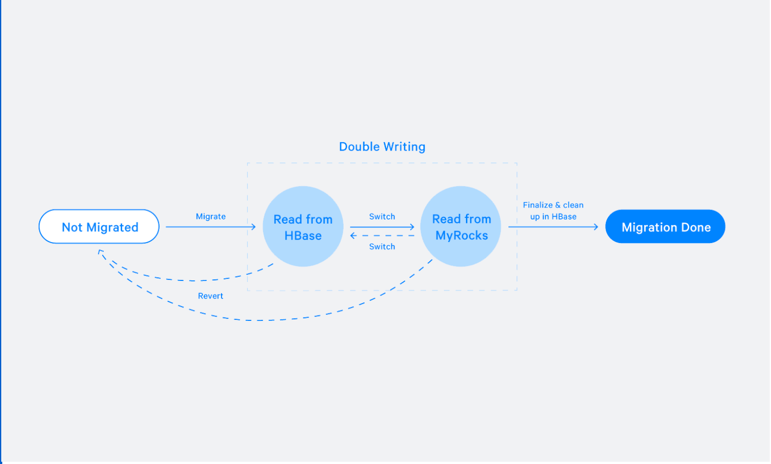

# Migrating Messenger storage to optimize performance

## Background

In 2018, the data store backed by the Facebook messenger was HBase + HDFS. Facebook decided to migrate to their own database
project called `MyRocks`(underneath is `RocksDB`).

## Challenges

- Live migration, we need to keep the messenger service up and running during the migration.
- Petabytes of data needs to be migrated.
- Some schemas have been changed, so we need to do schema conversion on the fly.

## Two migration flows

The main keyword of migration is **double-writing**. The similar idea was used by
[Akkio](../managing-data-store-locality-at-scale-with-akkio/readme.md#how-does-u-shard-migrated)

### Normal migration

- Has an assumption: No data is written during the migration.
- Has three states: `not-migrated`, `double-writing`, `done`.
- Flow:
  - For each account:
    - Remember the data position in old system.
    - Start migration.
    - Once migration is done, check if data position has changed.
      - If yes, migration is marked as failed, and will be retried.
      - If not, proceeds to next step.
    - Enter `double-writing` state. Allow writes to both old and new system.
      - During the `double-writing`, there are two validations:
        - Data integrity: Check if data written into HBase is the same as the data written into MyRocks.
        - API validation: Issue read requests against both old and new system check if the responses are the same.
    - Post migration checks and enter `done` state.

### Buffered migration

- The main reason we need the buffered migration is that some messenger accounts are used by enterprise with bot integrated.
  So the crucial assumption(No data is written during migration) can hardly guaranteed.
- Why normal migration flow does not work? The data position would always change, migration will keep retrying.
- Flow:
  - Set a migration start time.
  - Take a snapshot of the data.
  - Copy the snapshot to a buffer tier(Could use HBase or RocksDB).
  - Write traffic is sent to both old system and is queueing up by using a third party service called `Iris`.
  - Migrate the snapshot to new system.
  - Once the migration is done, drain the data from the `Iris` queue to allow new system catches up.
  - Post migration checks and enter `done` state.

## References

- <https://engineering.fb.com/2018/06/26/core-data/migrating-messenger-storage-to-optimize-performance/>