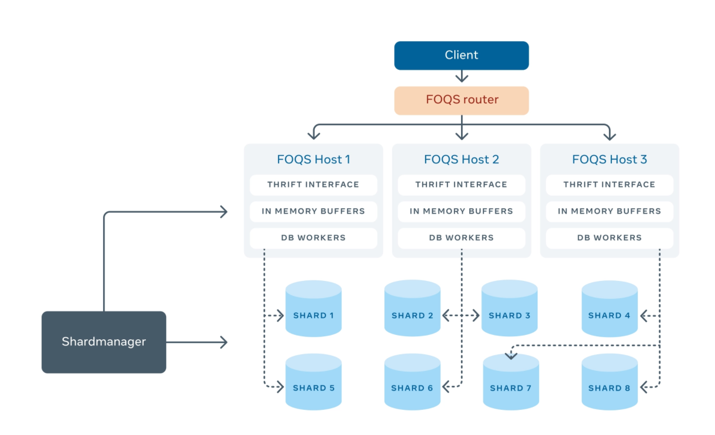
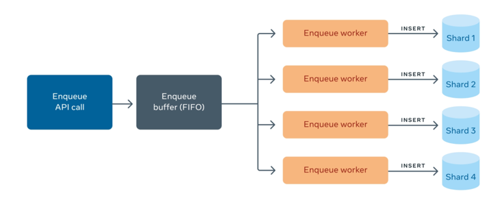
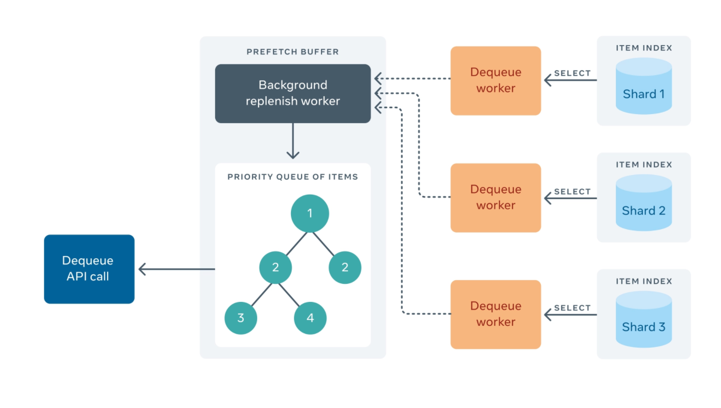
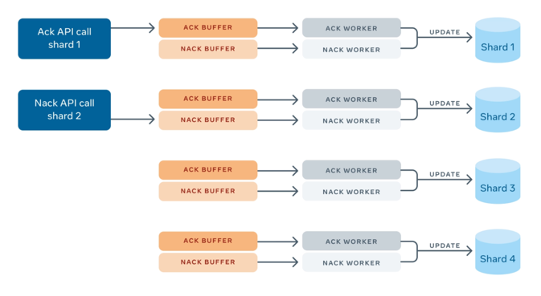
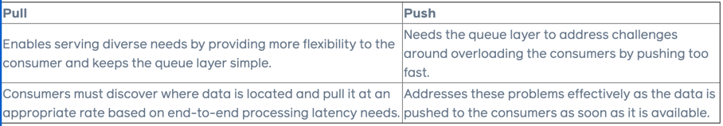

# FOQS: Scaling a distributed priority queue

A fully managed, horizontally scalable, multitenant, persistent distributed priority queue built on top of **sharded MySQL**.
See here for more details on [designing a distributed delay queue](../../system-design/topics/distributed-delayed-job-queueing-system/readme.md).

## Why FOQS

Facebook's distributed systems and microservices benefit from running the workload asynchronously：

- Effective resource utilization.
- Improve system reliability.
- Allow services to schedule compute to execute on a future time.

## User stories

- To support Facebook's [Asynchronous computing](https://engineering.fb.com/2020/08/17/production-engineering/async/)
- To support video encoding service(Netflix has the similar use case to encode videos asynchronously).
- To support the translation service of i18n. ([Design i18n](../../system-design/topics/i18n-service))

## Design Details

- Expose **Thrift** APIs
  - Enqueue
  - Dequeue
  - Ack
  - NAck
  - GetActiveTopics(Consumer could then dequeue(pull model) the item)
- Using [Shard Manager](https://engineering.fb.com/2020/08/24/production-engineering/scaling-services-with-shard-manager/)
  (Advanced version of [Akkio](../managing-data-store-locality-at-scale-with-akkio/readme.md)) to manage the shards of a
  queue. Shard Manager is running on [Twine](../cluster-management-system/readme.md).
  - A queue is sharded and distributed, and where to put the shard is managed by **Shard Manager**.

### Item

This is similar to `Task` from [Design distributed delayed job queuing system](../../system-design/topics/distributed-delayed-job-queueing-system/readme.md).
Facebook has the following properties:

- ID
- Namespace(string)
- Topic(string)
- Priority(int32)
- Payload(bytes): What to be executed.
- Metadata(bytes): May be used for filtering or delivery routing.
- Dequeue delay(timestamp): When to execute.
- Lease duration: How long to wait for `ack` or `nack`.
- TTL: How to hold in the queue.

### Enqueue

- FOQS node buffers item.
- Worker threads insert item into MySQL as a row.
- **Shard Manager** decides which shard the item needs to be inserted.
- Circuit breaker to handle the failure case.

### Dequeue

- Each shard maintains an index of sorted ready-to-deliver items.
- Prefetch buffer does k-way merge to build priority queue on all ready-to-deliver items.
- Consumer pulls the item.
- Could have another queue to hold the items waiting for `ack` or `nack`(Not covered in original blog):
  - `ack` or `nack` will delete the item from this queue.
  - If no `ack` or `nack` comes before expiration, the item is dequeued and add back to original queue for redelivery.
- Alt:
  - When an item is dequeued by a consumer, it updates item's `Dequeue delay` to be `Lease duration` in MySQL.
  - When `ack` or `nack` comes in, it updates the item in MySQL to indicate the item has been delivered. See more details
    [here](#ack-and-nack)

### ACK and NACK

- A worker pulls items from this ack buffer and deletes those rows from the MySQL shard.
- A worker pulls items from the nack buffer. Rather than deleting the item, it updates the row with a new `Dequeue delay`
  time and metadata (if the client updated it).

If the ack or nack operations get lost for any reason, such as MySQL unavailability or crashes of FOQS nodes, the items
will be considered for redelivery after their leases expire.

### Pull vs Push

Facebook uses Pull model which is similar to [designing a distributed delay queue](../../system-design/topics/distributed-delayed-job-queueing-system/readme.md).

### Checkpoint

FOQS uses MySQL and looks like there is a background threads keep querying on MySQL to understand what items are ready to
be delivered, and what items exceed the lease. This is so INEFFICIENT. In ths blog, it suggests using a lower bound to narrow
down the query: `WHERE <checkpoint> <= timestamp_column AND timestamp_column <= UNIX_TIMESTAMP()`.

Personal suggestion: Using conditional variable like what Java does for the delayed queue would be a good idea.

### Disaster Readiness

- Data replication.
- Leader based MySQL cluster.
- Smart enqueue forwarding: Redirect enqueue request to a host which has enough capacity.
- Global rate limiting across all regions.

## References

- [Original Blog Post](https://engineering.fb.com/2021/02/22/production-engineering/foqs-scaling-a-distributed-priority-queue/)