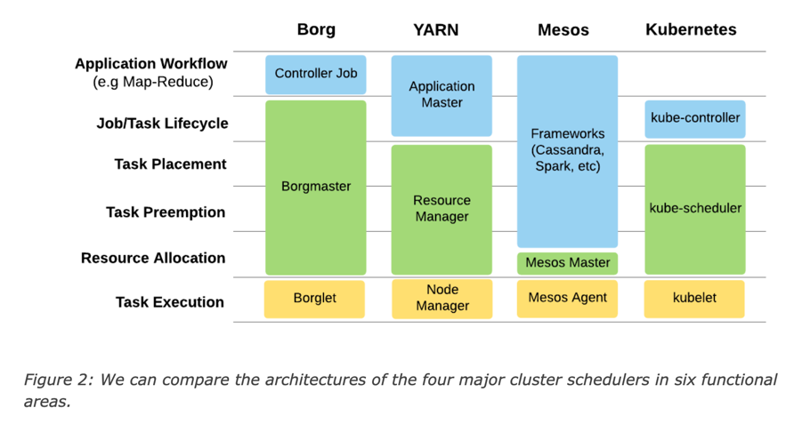

# Peloton: Uber’s Unified Resource Scheduler for Diverse Cluster Workloads

## Why does Uber needs a unified resource scheduler

- Resources are underutilized due to several dedicated clusters.
- In order to handle the peak hours, some resources are over provisioned.

Uber wanted to turn those resources into a shared pool and have a unified scheduler to schedule various workloads.

### User stories

- As an operator, I want to put similar or same priority workloads on the same cluster, so they could be managed together
  or be preempted easily.
- As an operator, I want to utilize the additional DR capacity to run some workloads until there is a failover. Uber had
  active-active structure in the past, so there is always a mirrored capacity.
- As an operator, I want the online workload to be able to utilize the offline batch job's cluster resource during peak
  hours, so that I do not have to buy extra hardware.
- As an operator, I want to run stateful and stateless workload on the same cluster, because they are often complementary
  in terms of the disk usage. The stateful workload needs intensive disk IO, but stateless does not.

### Type of workloads in Uber


## Why does not adopt existing framework



- At the time when the article was published, K8S might not have enough support for large size of clusters. Quote from the
  original article:

  ```text
  Kubernetes hasn’t been able to scale to the large clusters that Uber requires, i.e. 10,000-plus, nor does it support
  elastic resource sharing. It is also not the ideal scheduler for batch workloads due to the high-churn nature of batch jobs.
  ```

- K8S does not have good support for batch jobs.

## Use cases

### Apache Spark


### TensorFlow


### Other cases

- Autonomous vehicle workloads
- Marketplace
- Maps
- etc.

## Architecture


- Daemons: Job Manager(stateless), Resource Manager(leader-based stateful), Placement Engine, Host Manager(stateless).
  Peloton maintains its own LCM and HA.
- Peloton guarantees that all tasks or jobs are run **at least once**.

### Peloton manages multiple Mesos clusters


This architecture looks like the K8S Cluster API architecture, one management cluster manages multiple workload clusters.
However, Cluster API is only for managing clusters, it does not provide a way to LCM/schedule tasks on multiple clusters.

## Elastic resource management

There are two resource allocation mechanisms:

- priority-based quota.
- hierarchical max-min fairness.

### Resource pools

- All resources in a cluster can be divided into hierarchical resource pools based on organizations and teams.
- Allow sharing resource between teams, orgs.
- Four basic controls for each resource dimension(CPU, Memory, Disk IO, etc).
  - Reservation: A minimal guarantee of resources for a resource pool.
  - Limit: The maximum resources a resource pool could consume.
  - Share: Relative weight a resource pool is entitled to allocate when there are free resources.
  - Entitlement: The definition of resource a resource pool could consume at that time.


### Resource pool preemption

- Inter resource pool preemption: [min-max-fairness](https://en.wikipedia.org/wiki/Max-min_fairness) across all resource
  pools.
- Intra resource pool preemption: Preempt based on job priorities.

## Integrate with K8S

### Peloton as K8S scheduler plugin


### Peloton talks to both Mesos & K8S

Uber has chosen this option in 2019.


### Why Uber wants to migrate to K8S

- Mesos does not have a good extensibility to support inter service AuthN and AuthZ.
- K8S has lots of features Uber needs out of the box(I.E., sidecar container, init container, security plugin, etc).

### Concerns Uber has about K8S

- Nodes scaling limitation.
- Uber needs large volume of batch workloads to be running(1m/1k containers launched day/sec)/
- Uber needs customized networking setup.
- Uber needs customized scheduler.

## References

- <https://eng.uber.com/resource-scheduler-cluster-management-peloton/>
- <https://eng.uber.com/open-sourcing-peloton/>
- <https://www.youtube.com/watch?v=USgbj87Ztlk&ab_channel=CNCF%5BCloudNativeComputingFoundation%5D>
- <https://youtu.be/91c3iUI2K7M>
