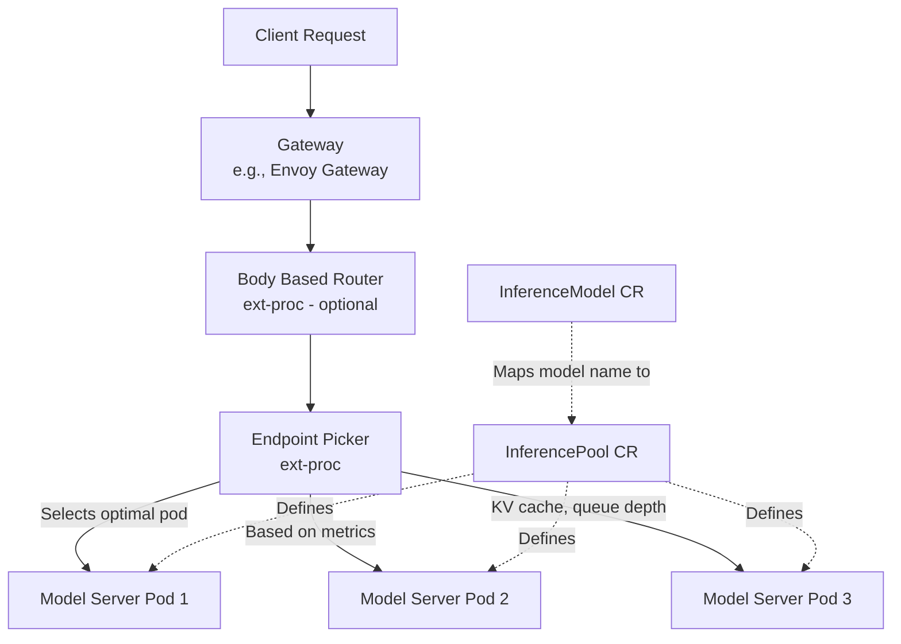
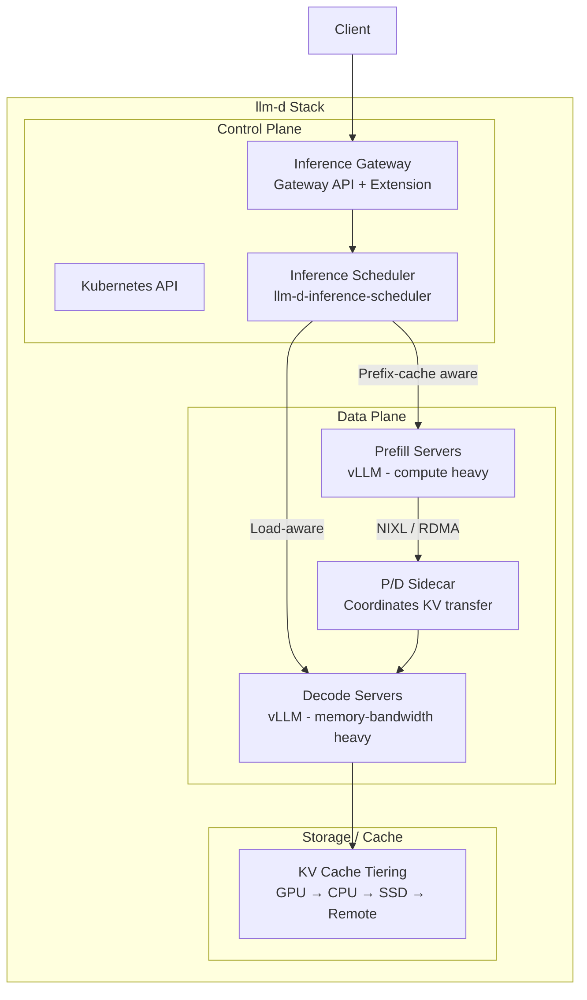
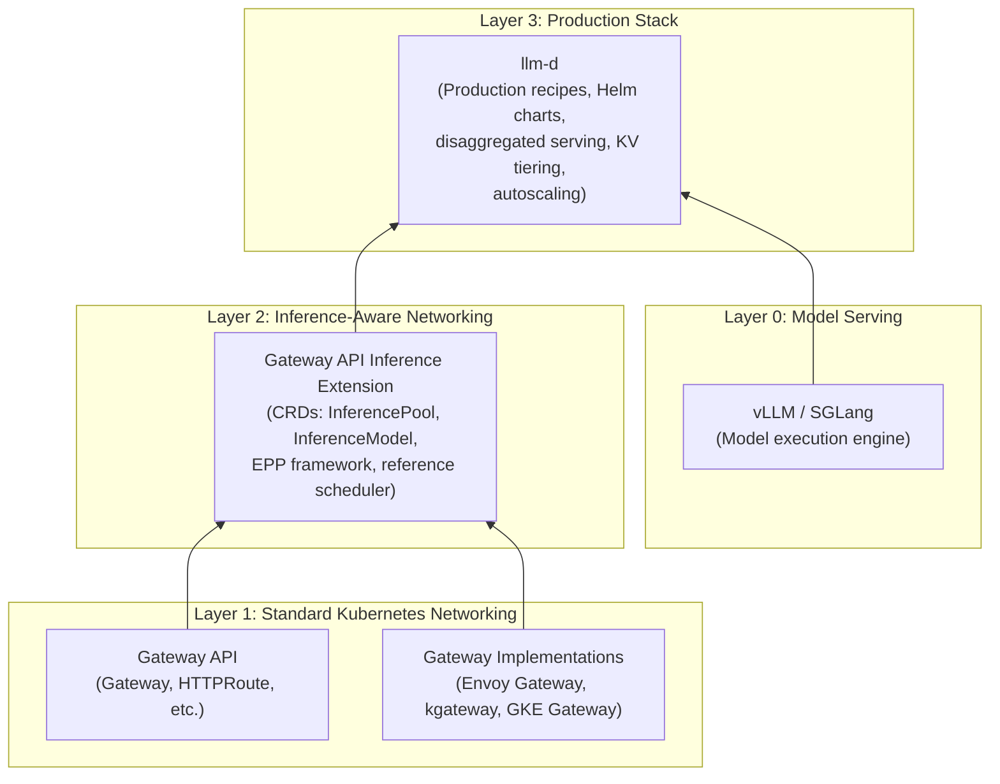

# Learning Notes: Inference Gateway, Gateway API Inference Extension, and llm-d

## Background: Key AI Inference Concepts

Before diving into the infrastructure components, it is better to read and understand the following concepts:

- [Key AI Inference Concepts](<../ai/ai-inference-concpets/readme.md>)

---

## 1. Inference Gateway (IGW)

### What is it

An **Inference Gateway** is a specialized proxy/load-balancer that has been coupled with
an **Endpoint Picker (EPP)**. It provides optimized routing and load balancing specifically
for Kubernetes self-hosted generative AI workloads (currently focused on LLMs).

> [!IMPORTANT]
> "Inference Gateway" is not a standalone product — it is the **functional state** that an existing gateway (Envoy Gateway, kgateway, GKE Gateway, etc.) achieves once enhanced with inference-aware extensions.

### Why is it needed

Traditional Kubernetes networking (Ingress, Services, standard load balancers) was built
for **stateless web traffic** and uses simple algorithms like round-robin or
least-connections. AI inference workloads are fundamentally different:

| Characteristic | Traditional Web Traffic | AI Inference Traffic |
|---|---|---|
| **State** | Stateless | Highly stateful (KV cache, loaded adapters) |
| **Resource usage** | CPU-bound, lightweight | GPU-bound, memory-intensive |
| **Request duration** | Milliseconds | Seconds to minutes |
| **Request cost** | Roughly uniform | Highly variable (short vs. long prompts) |
| **Hardware** | Commodity CPUs | Scarce, expensive GPUs/accelerators |

A standard load balancer is "blind" — it doesn't know if a pod's KV cache is 95% full,
whether a LoRA adapter is loaded, or how deep the request queue is. It might route a heavy
request to an already saturated GPU pod.

### Problems it addresses

1. **Intelligent Endpoint Selection** — Consults the EPP which uses real-time model server metrics (KV cache utilization, queue depth, loaded adapters) to pick the optimal pod
2. **Model-Aware Routing** — Routes based on model name rather than just HTTP path; supports LoRA adapter routing
3. **Serving Priority & Criticality** — Enables criticality-based prioritization (e.g., interactive chat > background batch jobs)
4. **Efficient GPU Utilization** — By understanding actual server state, avoids hotspots and KV cache evictions
5. **Safe Model Rollouts** — Supports traffic splitting, A/B testing, and blue-green deployments for models
6. **End-to-End Observability** — Provides metrics around service objective attainment for inference workloads

---

## 2. Gateway API Inference Extension

### What is it

The **Gateway API Inference Extension** is an official Kubernetes project
(`kubernetes-sigs/gateway-api-inference-extension`) that provides the **standardized
framework, CRDs, and reference implementation** to make Kubernetes networking AI-aware.
It's the "blueprint" that turns a standard gateway into an Inference Gateway.

It extends any gateway supporting both [ext-proc](https://www.envoyproxy.io/docs/envoy/latest/configuration/http/http_filters/ext_proc_filter) (Envoy External Processing) and Gateway API.

> [!NOTE]
> **Status**: The project is GA (v1.4.0 as of March 2026). Repository has 636 stars and 277 forks.

### Key CRDs and Concepts

| Resource | Purpose |
|---|---|
| **InferencePool** | Replaces `Service` — defines a group of model-serving pods with inference-aware routing logic |
| **InferenceModel** | Maps a client-facing model name to a backend InferencePool; supports traffic splitting between model versions |
| **Endpoint Picker (EPP)** | ext-proc server implementing the Inference Scheduler; selects optimal pod using real-time metrics |
| **Body Based Router (BBR)** | Optional ext-proc that parses the request body to extract the model name for routing |

### Why is it needed

Without this extension, every organization deploying AI on Kubernetes would need to build its own:

- Custom model-aware load balancer
- Metrics collection from model servers
- Routing logic based on KV cache state
- Model lifecycle management (rollouts, A/B testing)

### Problems it addresses

1. **Standardization** — Vendor-neutral, Kubernetes-native API for inference traffic (works with Envoy Gateway, NGINX Gateway Fabric, GKE Gateway, Istio, etc.)
2. **Separation of Concerns** — Platform teams define `InferencePools`; ML teams define `InferenceModels`; the gateway handles the networking
3. **Optimized Tail Latency** — Real-time KV cache + queue depth awareness → requests go to the least-loaded, best-cached pod
4. **Safe Model Rollouts** — Declarative traffic splitting between model versions via `InferenceModel`
5. **Multi-tenancy** — Criticality bands and fairness between workloads sharing the same pool of model servers
6. **Extensibility** — Modular architecture; the Inference Scheduler is pluggable (as demonstrated by llm-d)

---

## 3. llm-d

### What is it

**llm-d** is a high-performance, Kubernetes-native, open-source **distributed inference
serving stack** optimized for production deployments. It was created by Red Hat, Google,
IBM Research, NVIDIA, and CoreWeave, and accepted as a **CNCF Sandbox project** in
March 2026.

> [!TIP]
> Think of llm-d as a production-grade "recipe" that combines vLLM + Inference Gateway +
> advanced optimizations (disaggregated serving, KV cache tiering, intelligent scheduling)
> into a tested, deployable stack.

### Architecture

### Why is it needed

While vLLM/SGLang handle efficiently running LLMs on a **single** accelerator, and the
Gateway API Inference Extension handles **routing**, neither alone solves the full
production serving challenge:

| Challenge | vLLM alone | IGW alone | llm-d |
|---|---|---|---|
| Single-node inference | ✅ | ❌ | ✅ |
| Intelligent routing | ❌ | ✅ | ✅ |
| Prefill/Decode disaggregation | Partial | ❌ | ✅ |
| KV cache tiering (GPU→CPU→SSD) | Partial | ❌ | ✅ |
| Wide Expert Parallelism (DeepSeek-R1) | Partial | ❌ | ✅ |
| Workload autoscaling with SLO awareness | ❌ | ❌ | ✅ |
| Production Helm charts + benchmarks | ❌ | ❌ | ✅ |

### Problems it addresses

1. **Disaggregated Serving (Prefill/Decode)**
  - **Prefill** (processing the input prompt) is compute-heavy
  - **Decode** (generating tokens) is memory-bandwidth-heavy
  - llm-d splits these into independent, separately scalable pod pools
  - Reduces Time to First Token (TTFT); makes Time per Output Token (TPOT) more predictable
  - KV cache transfer between prefill → decode via NIXL over RDMA

2. **Cache-Aware Routing**
  - Tracks KV prefix cache state across all worker nodes
  - Routes requests to the instance that already has the relevant prefix cached
  - Avoids costly recomputation of cached prefixes

3. **Wide Expert Parallelism**
  - Deploy very large MoE models (e.g., DeepSeek-R1) across many accelerators
  - Uses Data Parallelism + Expert Parallelism over fast interconnects

4. **Tiered KV Cache Offloading**
  - GPU memory → CPU memory → Local SSD → Remote filesystem
  - Improves prefix cache hit rate by expanding available cache capacity

5. **Workload Variant Autoscaling**
  - Measures capacity of each model server instance
  - Derives load functions accounting for different request shapes and QoS
  - Calculates optimal mix of prefill/decode/latency-tolerant instances
  - SLO-aware cost optimization

6. **Multi-accelerator Support**
  - NVIDIA A100+, AMD MI250, Google TPU v5e+, Intel Gaudi/GPU Max
  - Vendor-neutral, avoids lock-in

---

## How They All Relate

| Layer | Component | Role |
|---|---|---|
| **Layer 0** | vLLM / SGLang | Runs the model on accelerators |
| **Layer 1** | Gateway API + Implementations | Standard K8s HTTP routing |
| **Layer 2** | Gateway API Inference Extension | Makes the gateway model-aware (CRDs + EPP) |
| **Layer 3** | llm-d | Full production stack: disaggregation, caching, autoscaling, tested guides |

> [!IMPORTANT]
> **Key distinction**: The Gateway API Inference Extension is the **specification and
> framework** (Kubernetes SIG project). llm-d is a **production-grade stack** that *uses*
> the extension's pluggable architecture and adds vLLM optimizations, disaggregated serving,
> KV cache tiering, and autoscaling on top.

## References

- [Gateway API Inference Extension repo](https://github.com/kubernetes-sigs/gateway-api-inference-extension)
- [Gateway API Inference Extension docs](https://gateway-api-inference-extension.sigs.k8s.io/)
- [llm-d repo](https://github.com/llm-d/llm-d)
- [llm-d website](https://www.llm-d.ai)
- [llm-d Inference Scheduler](https://github.com/llm-d/llm-d-inference-scheduler)
- [llm-d announcement blog](https://llm-d.ai/blog/llm-d-announce)
