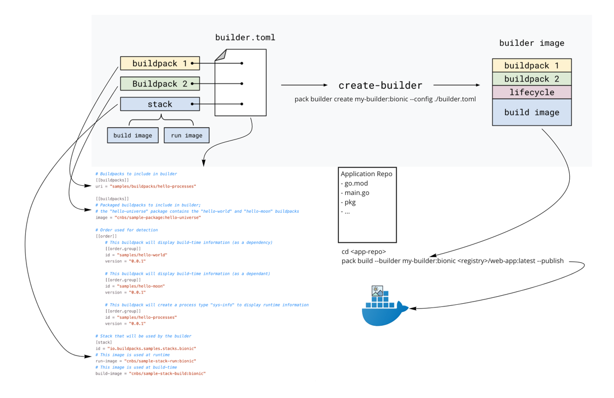

# Explore Buildpacks

Official doc is [here](https://buildpacks.io/)

## Components

### Buildpack

A buildpack is something you’ve probably leveraged without knowing, as they’re currently being used in many cloud platforms.
A buildpack’s job is to gather everything your app needs to build and run, and it often does this job quickly and quietly.

That said, while buildpacks are often a behind-the-scenes detail, they are at the heart of transforming your source code into a runnable app image.

- What is a [Buildpack](https://buildpacks.io/docs/concepts/components/buildpack/#what-is-a-buildpack)
- [Buildpack API](https://buildpacks.io/docs/reference/spec/buildpack-api/)

---

A buildpack must contain three files:

- buildpack.toml
- [bin/detect](https://buildpacks.io/docs/reference/spec/buildpack-api/#bindetect): Executable file
  (`bin/detect PLATFORM_DIR BUILD_PLAN`). This entrypoint is used to determine if a buildpack should run against a given
  codebase.
- [bin/build](https://buildpacks.io/docs/reference/spec/buildpack-api/#binbuild): Executable file
  (`bin/build LAYERS_DIR PLATFORM_DIR BUILD_PLAN`). This entrypoint transforms a codebase. It will often resolve dependencies,
  install binary packages, and compile code.
- [buildpack.toml](https://buildpacks.io/docs/reference/spec/buildpack-api/#buildpacktoml): Contains metadata of this
  buildpack.

#### Build Plan

The Build Plan is a document the buildpacks can use to pass information between the detect and build phases. The build
plan is passed (by the lifecycle) as a parameter to the detect and build binaries of the buildpack.

- During the detect phase, the buildpack(s) may write something it requires or provides (or both) into the Build Plan.
- During the build phase, the buildpack(s) may read the Buildpack Plan (a condensed version of the Build Plan, composed by
  the lifecycle) to determine what it should do, and refine the Buildpack Plan with more exact metadata (eg: what version
  dependency it requires).

### Lifecycle

[Official doc](https://buildpacks.io/docs/concepts/components/lifecycle/#what-is-the-lifecycle)

The lifecycle orchestrates buildpack execution, then assembles the resulting artifacts into a final app image.

### Stack

[Official doc](https://buildpacks.io/docs/concepts/components/stack/#what-is-a-stack)

A stack is composed of two images that are intended to work together:

- The build image of a stack provides the base image from which the build environment is constructed. The build environment
  is the containerized environment in which the lifecycle (and thereby buildpacks) are executed.
- The run image of a stack provides the base image from which application images are built.

### Builder

A builder is an image that contains all the components necessary to execute a build. A builder image is created by taking
a build image and adding a lifecycle, buildpacks, and files that configure aspects of the build including the buildpack
detection order and the location(s) of the run image.

## An App’s Brief Journey from Source to Image

