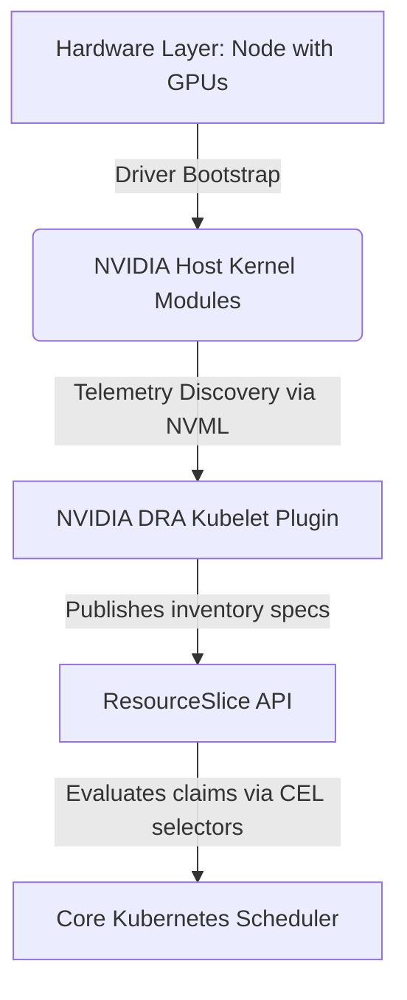

# Explore DRA

**Dynamic Resource Allocation (DRA)** is a Kubernetes framework
(which reached General Availability in 2026) designed to standardize
and extend how specialized hardware—like GPUs, TPUs, FPGAs, and
high-performance Network NICs—is requested, allocated, and shared
among Pods.

Think of it as the **Persistent Volume (PV/PVC) system, but for
hardware accelerators** instead of storage.

---

## What Problems Does DRA Solve

Before DRA, Kubernetes relied on **Device Plugins** to handle
GPUs. Device Plugins have several limitations that DRA solves:

### 1. Beyond "Integer Counting"

* **The Problem:** Device Plugins only understand counts (e.g.,
  `requests: nvidia.com/gpu: 1`). They cannot distinguish between a
  cheap older GPU and a premium newer one, nor do they understand
  VRAM sizes.
* **The DRA Solution:** DRA allows you to request resources using
  **attributes and parameters** (e.g., "I need a GPU with at
  least 24Gi of VRAM and NVLink support").

### 2. Resource Fragmentation

* **The Problem:** Traditional device plugins allocate whole
  physical devices to a single Pod, leading to idle GPU cycles if the
  workload only needs a fraction of it.
* **The DRA Solution:** DRA supports dynamic sharing and slicing
  (like NVIDIA MIG) on the fly. It can allocate a slice of a GPU
  precisely tailored to a Pod's needs and release it when done.

### 3. Decoupled Scheduling

* **The Problem:** In the older Device Plugin model, the
  `kube-scheduler` is blind to device specifics. It treats GPUs as simple
  integer counters. The actual device selection happens *after* the
  Pod lands on a Node, when the local Kubelet calls the Device Plugin.
  If the specific device types or topology don't match, the Pod fails
  at the Node level (unexpected by the scheduler).
* **The DRA Solution:** DRA decouples the resource state from
  the Node and integrates it directly into the central scheduling flow:
  * **Centralized Visibility (`ResourceSlices`):** DRA drivers
    publish available hardware attributes (VRAM, compute profiles,
    interconnects) as cluster-wide `ResourceSlice` objects.
  * **Global Smart Decisions:** The `kube-scheduler` evaluates the
    `ResourceClaim` against these central `ResourceSlices` *before*
    picking a Node. It knows exactly which devices are where,
    enabling smart, attribute-aware scheduling at a global scale.
  * **CDI Integration:** Once the central system allocates the
    resource, the Node’s Kubelet uses the standard **Container
    Device Interface (CDI)** to mount the resolved device paths,
    rather than trying to discover them locally at runtime.

### 4. Topology-Aware Alignment

* **The Problem:** For massive GenAI training, placing a Pod on a
  node with the right GPU is not enough; that GPU must also be physically
  close to the specific Network Card (NIC) connecting nodes.
* **The DRA Solution:** DRA enables joint scheduling of multiple
  resource types (GPU + NIC) to ensure optimal hardware topology.

---

## Key Concepts of DRA

* **`ResourceClaim`:** Similar to a PVC. It defines *what* a
  specific Pod needs.
* **`ResourceClaimTemplate`:** A blueprint manifest containing
  device requirements used by Kubernetes controllers to dynamically spin up
  a unique `ResourceClaim` tied directly to a Pod's lifecycle.
* **`DeviceClass`:** Acts as an administrative blueprint.
  DeviceClasses define device categories using CEL (Common Expression
  Language) filters (e.g. `gpu.nvidia.com`). These are created and
  managed by **Cluster Administrators** or **Vendor Drivers** (not
  by core DRA itself).
* **`ResourceSlice`:** Acts as the cluster's hardware inventory
  registry. The third-party DRA driver running on the node (via NVML
  queries) discovers physical hardware attributes (such as `Tesla T4`
  or `Turing` architecture) and automatically populates and publishes
  this data as a `ResourceSlice` to the API Server.

---

### How GPU Attributes get populated

Understanding how these components fit together is critical when
planning cluster architectures:

### DRA vs. GPU Operator: What is the difference

* **NVIDIA GPU Operator:** Handles **Driver Lifecycle Management**.
  It compiles and loads the actual physical NVIDIA kernel driver modules
  onto the host OS and prepares the container runtimes.
* **DRA Driver:** Handles **Resource Scheduling & Allocation**.
  It detects the loaded drivers, reads GPU attributes, and manages
  how workloads claim slices of that hardware.

