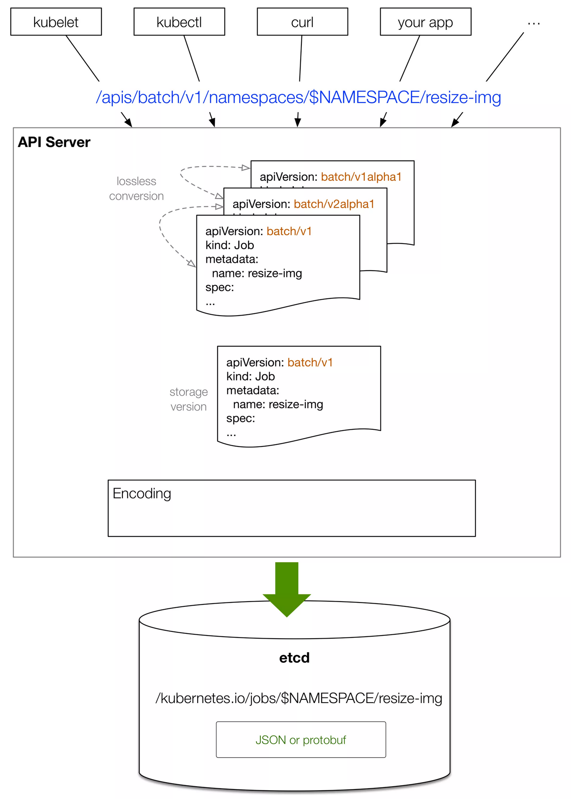

# Explore ETCD

## What is ETCD
https://etcd.io/

- A distributed key-value data store which stores the state of the system and objects
- Use Raft protocol to  coordinate the data access in distributed setup
- You can influence the way the API Server is using etcd via a number of options at start-up time. --etcd-servers List
  of etcd servers to connect with (scheme://ip:port)
- Kubernetes stores its objects in etcd either as a JSON string or in Protocol Buffers(“protobuf” for short) format

## Flow from kubectl apply -f pod.yaml to object in etcd

- Get the version from http path (e.g. v1 or v1beta1)
- Create the empty object using Scheme in the right version
- JSON or protobuf decoder converts the payload into object
- Write requests are all applied to ectd leader node

## Flow from kubectl get pods

- Get request is sent to kube-apiserver
- kube-apiserver uses the ETCD client lib to talk to etcd cluster.
  [Implementation](https://github.com/kubernetes/apiserver/blob/master/pkg/storage/storagebackend/factory/etcd3.go#L110)
- ETCD3 client performs a quorum read by default to make sure always the latest value gets returned. ETCD2 needs to pass
  in a flag `quorum-read=true` to achieve the quorum read

## Lab

- Using footloose to build the vm-like clusters
- Using Ansible to configure the clusters
    - Install pre requisites
    - Install etcd
- Bring up a kind cluster using the external etcd cluster

## References

- <https://blog.scottlowe.org/2020/04/23/setting-up-etcd-with-etcdadm/>
- <https://github.com/weaveworks/footloose>
- <https://blog.scottlowe.org/2020/04/23/setting-up-etcd-with-etcdadm/>