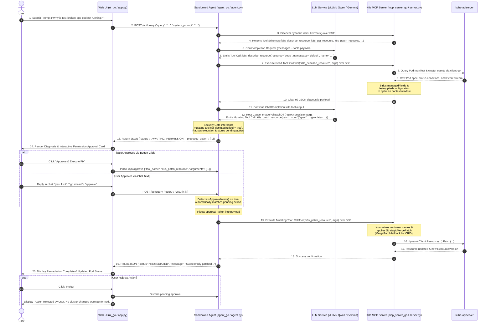
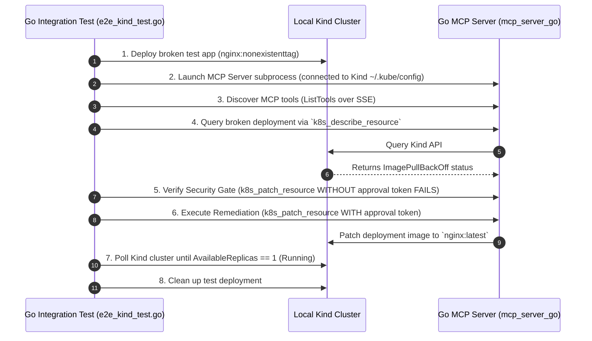

# Gemma Autonomous Kubernetes Troubleshooting Agent in gVisor Sandbox with MCP

This repository contains the complete implementation for hosting a **Gemma LLM (vLLM)** on **GKE**, running a **Sandboxed Agent in gVisor**, and using a **Model Context Protocol (MCP) Server** for Kubernetes troubleshooting with a **Human-in-the-Loop (HITL)** approval gate.

Both **Python** and **Go (Golang)** implementations are provided for all components.

---

## Architecture Overview

```
+-----------------------------------------------------------------------------------+
| GKE Cluster (Google Kubernetes Engine)                                            |
|                                                                                   |
|  +---------------------------+       +-----------------------------------------+  |
|  | User Interface            |       | gVisor Sandbox Node Pool                |  |
|  | (Go + HTMX / Streamlit)   |       |   Agent Pod (RuntimeClass: gvisor)      |  |
|  +-------------+-------------+       +--------+--------------------+-----------+  |
|                |                              |                    |              |
|                | 1. HTTP /chat, /approve      |                    |              |
|                +----------------------------->|                    |              |
|                                               |                    |              |
|                                               | 2. ChatCompletions | 3. Tool Calls|
|                                               v (with Tools)       v (SSE / JSON) |
|  +---------------------------+       +-----------------+  +--------------------+  |
|  | LLM Service (GPU)         |<------+                 |  | K8s MCP Server     |  |
|  | (vLLM / Qwen / Gemma)     |                         |  | (Go / Python)      |  |
|  +---------------------------+                         +--+---------+----------+  |
|                                                                     |             |
|                                                                     | 4. K8s API  |
|                                                                     v             |
|                                      +-----------------------------------------+  |
|                                      | Kubernetes API Server (kube-apiserver)  |  |
|                                      +-----------------------------------------+  |
+-----------------------------------------------------------------------------------+
```

---

## End-to-End Troubleshooting Sequence & Interaction Flow



---

## Directory Structure

```
.
├── Makefile                      # Build, test, Docker, and vendor automation
├── go.work                       # Workspace linking sub-modules
├── scripts/
│   └── run_integ_test.sh         # Kind lifecycle, MCP background server & test runner
├── deploy/
│   ├── 01-gemma-vllm.yaml         # vLLM Gemma 2 9B GPU Deployment & Service
│   ├── 02-mcp-rbac.yaml           # ServiceAccount, ClusterRole, ClusterRoleBinding
│   ├── 03-mcp-server.yaml         # Custom K8s MCP Server Deployment & Service
│   ├── 04-agent-gvisor.yaml       # Sandboxed Agent Pod (runtimeClassName: gvisor) & Service
│   ├── 05-ui.yaml                 # Web UI Deployment & Service
│   └── 06-test-broken-app.yaml    # Test app with typo image for E2E testing
├── mcp_server_go/                 # Go MCP Server (Official go-sdk + dynamic client)
│   ├── main.go
│   ├── main_test.go               # Unit tests using fake K8s client
│   ├── go.mod
│   ├── Dockerfile
│   └── cmd/test_client/           # Standalone Mock Agent test client
├── agent_go/                      # Go Sandboxed Agent Core & REST API Service
│   ├── main.go
│   ├── main_test.go               # Unit tests for tool routing & mock LLM loop
│   ├── go.mod
│   └── Dockerfile
├── ui_go/                         # Go Web Interface (net/http + HTMX)
│   ├── main.go
│   ├── main_test.go               # Unit tests for HTMX handlers & state transitions
│   ├── go.mod
│   └── Dockerfile
├── tests/
│   └── integration/               # Automated E2E test suite against local Kind cluster
│       ├── e2e_kind_test.go
│       └── go.mod
├── mcp_server/                    # Python MCP Server (FastMCP + kubernetes SDK)
├── agent/                         # Python Sandboxed Agent core & MCP client loop
└── ui/                            # Python Streamlit UI with HITL approval card
```

---

## Testing & Quality Assurance

### 1. Unit Tests (In-Memory Fast Tests)

All unit tests execute in-memory using `httptest` and `k8s.io/client-go/fake`:

```bash
make unit-test
```

---

### 2. Programmatic Integration Tests (Local Kind Cluster)

The automated integration test suite ([`tests/integration/e2e_kind_test.go`](tests/integration/e2e_kind_test.go)) runs against your local `kind` cluster:



#### Run the Integration Test:
```bash
# Automatically creates Kind cluster, compiles & runs MCP server, runs E2E tests, and cleans up:
make integ-test
```

---

## Step-by-Step Deployment Guide

### Step 1: Provision GKE Cluster with gVisor & NVIDIA GPU

```bash
export PROJECT_ID="your-gcp-project-id"
export REGION="us-central1"
export CLUSTER_NAME="gemma-agent-cluster"

# 1. Create Base GKE Cluster
gcloud container clusters create ${CLUSTER_NAME} \
    --project=${PROJECT_ID} \
    --region=${REGION} \
    --release-channel=regular \
    --num-nodes=1 \
    --machine-type=e2-standard-4

# 2. Create gVisor Sandbox Node Pool (for isolated Agent pod)
gcloud container node-pools create gvisor-pool \
    --cluster=${CLUSTER_NAME} \
    --region=${REGION} \
    --sandbox="type=gvisor" \
    --machine-type=e2-standard-4 \
    --num-nodes=1

# 3. Create GPU Node Pool for vLLM (Targeting a specific zone to avoid regional stockouts)
gcloud container node-pools create gpu-pool \
    --cluster=${CLUSTER_NAME} \
    --region=${REGION} \
    --node-locations=us-central1-b \
    --accelerator="type=nvidia-l4,count=1,gpu-driver-version=default" \
    --machine-type=g2-standard-4 \
    --num-nodes=1

# 4. Connect kubectl
gcloud container clusters get-credentials ${CLUSTER_NAME} --region=${REGION}
```

### Step 2: Deploy Gemma LLM on GPU (Hugging Face Auth)

`google/gemma-2-9b-it` is a gated model on Hugging Face. Accept the license on [Hugging Face](https://huggingface.co/google/gemma-2-9b-it), generate a Read Token, and store it in a Kubernetes Secret:

```bash
# Create Hugging Face token secret
kubectl create secret generic hf-token-secret \
    --from-literal=hf_token="YOUR_HUGGINGFACE_READ_TOKEN"

# Deploy vLLM Gemma Service
kubectl apply -f deploy/01-gemma-vllm.yaml
kubectl get pods -l app=gemma-vllm -w
```

### Step 3: Build & Push All Docker Images (One Command)

Build and push the Go MCP Server, Sandboxed Agent, and Web UI images with a single Make command:

```bash
make docker-all PROJECT_ID=${PROJECT_ID}
```

*(Or build locally without pushing: `make docker-build PROJECT_ID=${PROJECT_ID}`)*

### Step 4: Deploy All Services to GKE (One Command)

Deploy RBAC, MCP Server, Sandboxed Agent (gVisor), and Web UI:

```bash
make deploy-all
```

---

## How to Trigger the Agent

There are **three flexible ways** to trigger the Agent to do its job:

### Method 1: Interactive Web UI (Recommended)
1. Port-forward the Web UI to your local machine:
   ```bash
   kubectl port-forward svc/k8s-agent-ui 8501:8501
   ```
2. Open `http://localhost:8501` in your browser.
3. Type your question (e.g., *"Why is my test-broken-app deployment crashing?"*) and review the diagnosis & Human Permission approval card.

### Method 2: Via REST API / Curl
1. Port-forward the Agent service:
   ```bash
   kubectl port-forward svc/k8s-agent-service 8090:8090
   ```
2. Send troubleshooting queries via HTTP POST:
   ```bash
   curl -X POST http://localhost:8090/api/query \
     -H "Content-Type: application/json" \
     -d '{"query": "Why is test-broken-app deployment failing in default namespace?"}'
   ```

### Method 3: Direct CLI Execution inside gVisor Sandbox Container
Trigger one-shot CLI troubleshooting directly inside the isolated gVisor pod:
```bash
kubectl exec -it deployment/k8s-agent -c agent -- /k8s-agent-go "Diagnose test-broken-app in default namespace"
```
