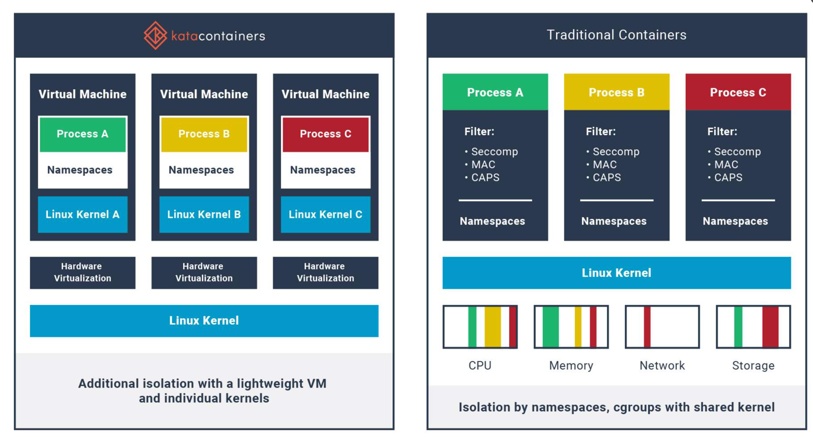
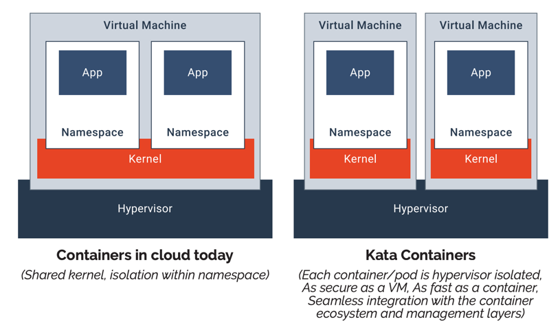
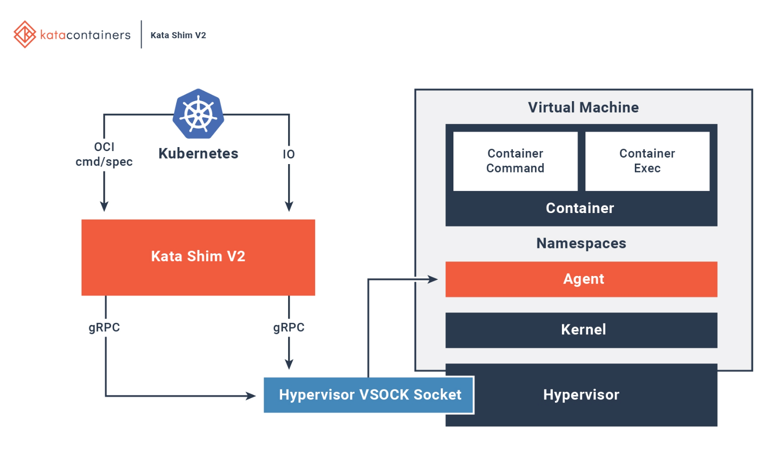

# Explore Kata Container

## That is Kata Container

A standard implementation of lightweight Virtual Machines (VMs) that feel and
perform like containers, but provide the workload isolation and security
advantages of VMs.







<https://github.com/kata-containers/kata-containers>

## What is the lifecycle of a kata container

### Kata container image

A Kata Container Image is a special type of container image that is specifically
designed to work with the Kata Container runtime.A Kata Container Image includes
additional metadata that tells the Kata runtime how to create and configure the
virtual machine environment. This is different from a standard container image,
which only includes the application's code and dependencies.

### Kata runtime

#### Virtual Machine Management

Setting up, configuring, and maintaining the lightweight virtual machines (VMs)
that house Kata Containers.

When a new Kata Container needs to be created, the Kata Runtime uses the
hypervisor to create a fresh virtual machine. The Kata Runtime takes care of
configuring the VM with the proper settings – deciding on the amount of CPU and
memory the VM should have, setting up the network, and ensuring it has the right
operating system and tools to support Kata Containers. It essentially sets the
stage for containers to run securely and efficiently within the VM.

These can include libvirt (a popular virtualization API library for Linux) or
virtio (a set of drivers and protocols for virtualized devices). These APIs
provide a way for the Kata Runtime to interact with the hypervisor and manage
virtual machines in a secure and efficient manner.

#### Container Lifecycle Management

Kata runtime can leverage containerD or CRI-O to lifecycle manage the container
lifecycle. And checks the container status as well.

#### Resource Allocation

Kata runtime uses the following methods for resource allocation:

* cgroups: grouping process, limiting the resources, track resources usage
* virtualization: while creating the vm, kata runtime allocate the resources for
  that particular vm.

#### Network Configuration

* Isolated network stack
* NAT
* Network policy

#### Security enforcement

* Virtualization
* Secure Boot
* Intrusion detection

## Try out kata container on a GKE cluster

<https://github.com/kata-containers/kata-containers/blob/main/tools/packaging/kata-deploy/README.md>

### Create a GKE cluster

Follow <https://cloud.google.com/kubernetes-engine/docs/how-to/creating-a-regional-cluster>
to create a standard GKE cluster. *Note*: The autopilot cluster might have some
constrains on running `privileged container`. (Kata's daemonset runs privileged
container)

### Install Kata components

<https://github.com/kata-containers/kata-containers/blob/main/tools/packaging/kata-deploy/README.md#vanilla-kubernetes-cluster>

One of the YAML file is called `kata-deploy.yaml`, after applying the YAML into
your K8S cluster, it does the following things:

* Install the `containerd-shim-kata-v2` on each node. (In my case, my container
  runtime is containerd).
* Add kata runtime configurations in containerd configuration.

```yaml
---
# kata-deploy.yaml
apiVersion: apps/v1
kind: DaemonSet
metadata:
  name: kata-deploy
  namespace: kube-system
spec:
  selector:
    matchLabels:
      name: kata-deploy
  template:
    metadata:
      labels:
        name: kata-deploy
    spec:
      serviceAccountName: kata-deploy-sa
      hostPID: true
      containers:
        - name: kube-kata
          image: quay.io/kata-containers/kata-deploy:latest
          imagePullPolicy: Always
          lifecycle:
            preStop:
              exec:
                command: ["bash", "-c", "/opt/kata-artifacts/scripts/kata-deploy.sh cleanup"]
          command: ["bash", "-c", "/opt/kata-artifacts/scripts/kata-deploy.sh install"]
          # NOTE: Please don't change the order of the environment variables below.
          env:
            - name: NODE_NAME
              valueFrom:
                fieldRef:
                  fieldPath: spec.nodeName
            - name: DEBUG
              value: "false"
            - name: SHIMS
              value: "clh cloud-hypervisor dragonball fc qemu qemu-coco-dev qemu-runtime-rs qemu-sev qemu-snp qemu-tdx stratovirt qemu-nvidia-gpu qemu-nvidia-gpu-snp qemu-nvidia-gpu-tdx"
            - name: DEFAULT_SHIM
              value: "qemu"
            - name: CREATE_RUNTIMECLASSES
              value: "false"
            - name: CREATE_DEFAULT_RUNTIMECLASS
              value: "false"
            - name: ALLOWED_HYPERVISOR_ANNOTATIONS
              value: ""
            - name: SNAPSHOTTER_HANDLER_MAPPING
              value: ""
            - name: AGENT_HTTPS_PROXY
              value: ""
            - name: AGENT_NO_PROXY
              value: ""
            - name: PULL_TYPE_MAPPING
              value: ""
            - name: INSTALLATION_PREFIX
              value: ""
            - name: MULTI_INSTALL_SUFFIX
              value: ""
          securityContext:
            privileged: true
          volumeMounts:
            - name: crio-conf
              mountPath: /etc/crio/
            - name: containerd-conf
              mountPath: /etc/containerd/
            - name: host
              mountPath: /host/
      volumes:
        - name: crio-conf
          hostPath:
            path: /etc/crio/
        - name: containerd-conf
          hostPath:
            path: /etc/containerd/
        - name: host
          hostPath:
            path: /
  updateStrategy:
    rollingUpdate:
      maxUnavailable: 1
    type: RollingUpdate
```

## What are the differences between Kata container vs Firecracker

## References

* <https://arunprasad86.medium.com/kata-containers-an-overview-7ed95dacfb7a>


