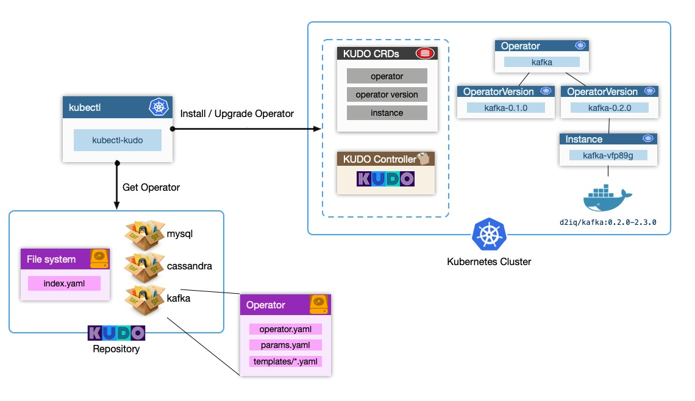

# Explore KUDO

## What is KUDO

<https://kudo.dev/docs/what-is-kudo.html#overview>



<https://www.youtube.com/watch?v=j2A8vl0m2hs>
<https://www.youtube.com/watch?v=XNi8uO0PwPo>

## Try out KUDO

<https://kudo.dev/docs/developing-operators/getting-started.html#getting-started>

---
Install KUDO CLI

<https://kudo.dev/docs/cli.html#setup-the-kudo-kubectl-plugin>

``` bash
brew tap kudobuilder/tap
brew install kudo-cli
```

---
Create kind cluster

``` bash
kind create cluster --name kudo-cluster
```

---
Install cert manager

``` bash
kubectl apply --validate=false -f https://github.com/jetstack/cert-manager/releases/download/v0.15.1/cert-manager.yaml
```

---
KUDO init

``` bash
kubectl kudo init
$KUDO_HOME has been configured at /Users/xiaoming/.kudo
✅ installed crds
✅ installed namespace
✅ installed service account
✅ installed webhook
✅ installed kudo controller
```

---
Install nginx operator

``` bash
kubectl kudo install ./first-operator

operator default/first-operator created
operatorversion default/first-operator-0.1.0 created
instance default/first-operator-instance created

kubectl get pods
NAME                                READY   STATUS    RESTARTS   AGE
nginx-deployment-5cd7cc4b76-7pmbr   1/1     Running   0          5m56s
nginx-deployment-5cd7cc4b76-q84qw   1/1     Running   0          5m56s
```

## What is next

- Try out Apache ZooKeeper (TBA)