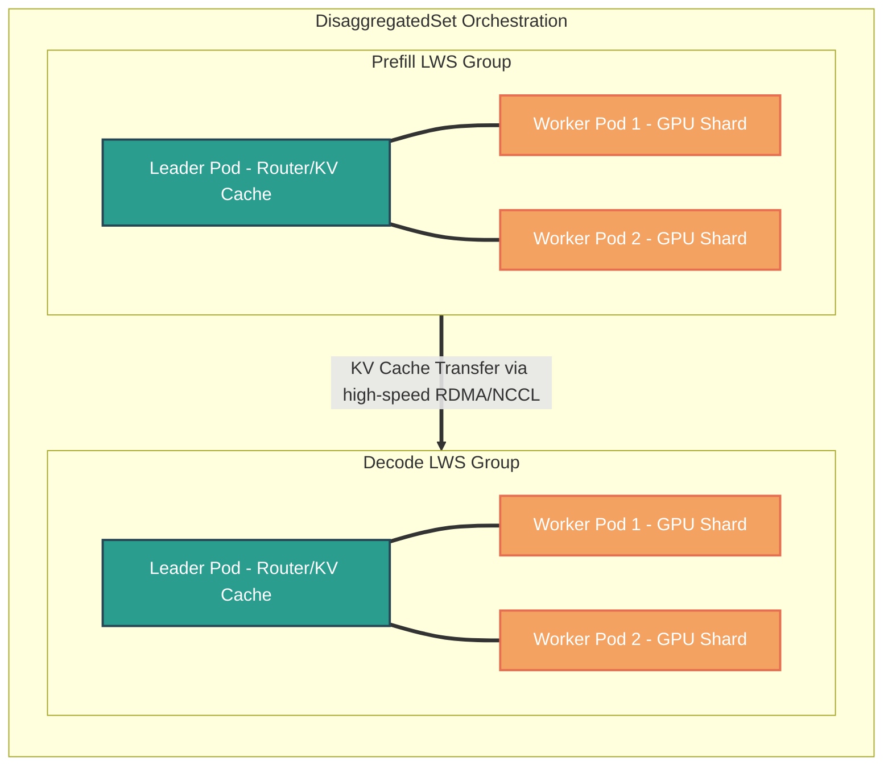

# Kubernetes LeaderWorkerSet (LWS) & DisaggregatedSet (DS)

This guide explores the architecture, motivation, and alternatives for orchestrating large-scale distributed AI/ML inference workloads on Kubernetes using **LeaderWorkerSet (LWS)** and **DisaggregatedSet (DS)**.

---

## What are LeaderWorkerSet & DisaggregatedSet in short?

*   **LeaderWorkerSet (LWS)** is a Kubernetes Custom Resource Definition (CRD) designed to deploy and manage a group of pods as a single, tightly-coupled unit of replication (a "super pod"). It supports dual-template configurations, coordinated scaling and upgrades, topology-aware scheduling, and all-or-nothing failure recovery.
*   **DisaggregatedSet (DS)** is a higher-level CRD built on top of LWS to orchestrate multi-role disaggregated inference architectures. It manages and coordinates multiple underlying LeaderWorkerSets as a single logical application, automating coordinated rollouts and network routing between decoupled stages (such as prefill and decode).

---

## 1. High-Level Architectural Overview

Modern Large Language Models (LLMs) and foundational AI models have grown too large to fit on a single GPU or even a single physical node. They require sharding across multiple accelerators and nodes using tensor parallelism, pipeline parallelism, or expert parallelism. 

Kubernetes native primitives (like Deployments and StatefulSets) are designed for independent, interchangeable containers. LWS and DS introduce native support for **tightly-coupled multi-node topologies**.

---

## 2. Deep Dive: What They Are

### A. LeaderWorkerSet (LWS)
**LeaderWorkerSet** is a custom Kubernetes API designed to manage a group of pods as a single **unit of replication** (a "super pod"). It typically consists of one **Leader** pod and a predefined number of **Worker** pods.

*   **Dual-Template Spec:** It allows you to define separate pod specifications for the leader and the workers. The leader pod can be configured to handle request orchestration, routing, and caching, while worker pods are dedicated entirely to raw model tensor computation.
*   **Deterministic & Synchronized Lifecycle:** 
    *   **Parallel Creation (Gang Scheduling):** All pods in the group are created in parallel, satisfying the "gang" (all-or-nothing) scheduling and startup needs of distributed ML frameworks.
        > [!NOTE]
        > **Example:** Contrast how a standard Kubernetes **StatefulSet** behaves versus LWS when starting a 4-GPU model shard:
        > *   **StatefulSet (Default):** By default, a StatefulSet creates pods sequentially (`pod-0`, then `pod-1`, etc.). For distributed serving, this serial startup is extremely slow. Even if configured to start in parallel, if the cluster only has 3 GPUs available, 3 pods will start, lock those 3 expensive GPUs, and wait indefinitely for the 4th `Pending` pod to join their initialization handshake (e.g., `init_process_group` in PyTorch or NCCL). Eventually, the running pods will time out and crash, wasting GPU cycles.
        > *   **LWS (Parallel/Atomic Grouping):** LWS creates all 5 pods in the group (1 leader + 4 workers) in parallel to enable fast startup. **Crucially, the core LWS controller does not natively implement gang scheduling.** Under the default Kubernetes scheduler, LWS pods are still scheduled independently, meaning a group can still get partially scheduled if resources are tight. To achieve **true all-or-nothing (gang) scheduling**, you must pair LWS with an external queue manager/scheduler. The standard approach is to use **CNCF Kueue** (which uses Kubernetes *Scheduling Gates* to hold the group in a suspended state until the entire group is admitted). Alternatively, you can use batch schedulers like **Volcano** or the default **kube-scheduler Coscheduling plugin**, though these require custom admission webhooks to map LWS pods to the scheduler's `PodGroup` CRDs.
    *   **Subresource Scaling:** Exposes a standard `scale` subresource, integrating seamlessly with Horizontal Pod Autoscalers (HPA) to scale the number of *groups* (replicates of the "super pod") up or down dynamically.
        > [!NOTE]
        > **Example:** Suppose you deploy a sharded LLM where each shard requires **1 Leader** (to route requests and cache state) and **4 Workers** (each running a slice of the model on a GPU), meaning the group size is 5 pods.
        > *   Initially, you set `spec.replicas = 2` in your LWS spec (deploying 2 groups, totaling 10 pods).
        > *   Under high traffic load, a standard Kubernetes **HPA (Horizontal Pod Autoscaler)** detects high queue lengths or GPU utilization and triggers a scale-up.
        > *   The HPA updates the LWS replicas from `2` to `3`.
        > *   LWS atomically spins up **one entire new group** (1 leader + 4 workers) in parallel. It does *not* add single detached worker pods; instead, it replicates the entire multi-node cluster structure as a single unit.
    *   **Coordinated Failure Recovery:** If one pod in the group fails, the entire group is restarted by default to prevent orphaned worker pods from hanging indefinitely.
        > [!TIP]
        > **Why is this heavy operation the default, and is it configurable?**
        > Yes, this behavior is fully configurable via `spec.leaderWorkerTemplate.restartPolicy`.
        > *   **The "Why":** Distributed ML frameworks (such as JAX, PyTorch Distributed, or NCCL-based runtimes) establish a static communication ring at startup. If a single worker (a model shard) crashes or is evicted, the communication ring is broken. The remaining healthy workers cannot dynamically recover—they will either hang indefinitely or hard-crash. A full group restart is the safest path to force a clean re-initialization of the distributed ring.
        > *   **Configuration Options:**
        >     *   `RecreateGroupOnPodRestart` (Default): Recreates the *entire group* if any pod fails (either container crash, pod eviction, or node failure), ensuring a clean state.
        >     *   `None`: Restarts **only** the specific failed pod/container. Other pods in the group are left untouched. *Use this only if your model serving runtime explicitly supports dynamic, hot-pluggable worker re-joining.*
        >     *   `RecreateGroupAfterStart`: Similar to the default, but LWS will not trigger a group-wide restart if some pods are still in the `Pending` phase (e.g., during initial startup while pulling heavy model container images), preventing unnecessary start-up restart loops.

### B. DisaggregatedSet (DS)
**DisaggregatedSet** builds on top of LWS to orchestrate complex, multi-role inference architectures. It is the de facto API for managing **Prefill-Decode Disaggregation**.

*   **Prefill-Decode Split:** LLM inference has two phases:
    1.  **Prefill:** Processes the input prompt (compute-bound, highly parallelizable, finishes fast).
    2.  **Decode:** Generates tokens one-by-one (memory-bandwidth bound, sequential, slow).
    By running these two phases on separate physical nodes/accelerators, we prevent compute-intensive prefill runs from hijacking GPUs and spiking Inter-Token Latency (ITL) for existing decode streams.
*   **N-Dimensional Coordinated Rollouts:** Updates multiple underlying LeaderWorkerSets (e.g., prefill LWS and decode LWS) in lockstep, ensuring that the required capacity ratio between phases is maintained throughout the update process.
    > [!NOTE]
    > **Example:** Suppose you tune a disaggregated LLM serving platform to operate at a **1:2 capacity ratio** of Prefill to Decode groups to optimize GPU usage. Your production state is:
    > *   `prefill-lws`: 4 active groups (running Model v1).
    > *   `decode-lws`: 8 active groups (running Model v1).
    >
    > You decide to roll out an upgrade to **Model v2**.
    > *   **The Uncoordinated Danger:** If you upgraded the two LWS groups independently (like standard K8s rolling updates), the Prefill tier might update faster than the Decode tier. If a new **Prefill v2** pod finishes prompt processing and attempts to transfer its KV-cache to a **Decode v1** pod, the request will fail or crash due to internal cache format incompatibilities. Additionally, your system's capacity ratio would skew, leading to massive queue bottlenecks or idle GPUs.
    > *   **The DisaggregatedSet Solution:** The DisaggregatedSet controller performs a coordinated lockstep rollout. It takes down **1 Prefill group** and **2 Decode groups** concurrently, updates them to v2, and waits for them to be fully `Ready`. During this rolling transition:
    >     1.  The **1:2 capacity ratio** is strictly preserved across the active cluster.
    >     2.  **Revision-Aware Routing** is enforced: `Prefill v1` pods only route KV-caches to `Decode v1` pods, and `Prefill v2` pods only route to `Decode v2` pods, guaranteeing zero request failures during updates.
*   **Automated Networking:** Automatically creates and configures [headless services](https://kubernetes.io/docs/concepts/services-networking/service/#headless-services) for each role, facilitating discovery and revision-aware routing between the decoupled stages.
    > [!NOTE]
    > **Example:** How does a Prefill pod discover exactly where to send its processed KV-cache?
    > *   **The Need for Direct Connection:** Unlike standard web apps where a request is routed randomly to *any* backend via a standard load balancer (ClusterIP), a Prefill pod needs a direct, point-to-point connection to a specific Decode pod to stream the generated KV-cache bytes over high-speed RPC or RDMA.
    > *   **Headless Service Role:** DisaggregatedSet automatically provisions a [headless service](https://kubernetes.io/docs/concepts/services-networking/service/#headless-services) (e.g., `my-llm-decode-svc`) for the Decode tier. Because the service has no virtual IP (`clusterIP: None`), querying the DNS name returns the direct, individual IP addresses of all active Decode pods (e.g., `10.244.1.12`, `10.244.2.34`) rather than a single load-balanced proxy IP. This allows the Prefill tier to choose and stream cache directly to individual Decode workers.
    > *   **Revision-Aware Routing:** During an active rolling upgrade of **Model v2**, DisaggregatedSet automatically manages separate revision-aware endpoints:
    >     *   `my-llm-decode-svc-v1` targeting old Decode v1 pod IPs.
    >     *   `my-llm-decode-svc-v2` targeting new Decode v2 pod IPs.
    >     A `Prefill v2` pod queries `my-llm-decode-svc-v2` to resolve only `Decode v2` pod endpoints. This guarantees cache transfers never cross versions, preventing memory misalignment errors.

---

## 3. Why They Are Needed: The Problems They Solve

| Problem in AI Inference | How standard K8s fails | How LWS & DS solve it |
| :--- | :--- | :--- |
| **All-or-Nothing (Gang) Startup** | Pods scale independently. If only 7 of 8 slots are available, 7 pods start and wait indefinitely, consuming valuable idle GPU resources. | Guarantees that a group is scheduled and started together. Under-resourced groups remain pending without partially occupying GPUs. |
| **Tightly-Coupled Failure Domains** | Standard controllers replace only the single failed pod. The remaining model shards hang because the communication ring (NCCL/JAX) is broken. | Automatically restarts the *entire group* (leader + workers) to re-establish the synchronization ring clean from scratch. |
| **Hardware Topology Blindness** | Standard schedulers place pods randomly across the cluster, leading to high inter-node communication latency. | Supports topology-aware placement (e.g., co-locating a group's pods within the same node, rack, or high-bandwidth network fabric). |
| **Resource & Execution Interference** | Running prefill and decode on the same GPU causes queue blocking, driving up Inter-Token Latency (ITL) and tail latencies. | DisaggregatedSet splits prefill and decode into separate groups, enabling dedicated scaling and hardware matching (e.g., A100s for Prefill, L4s for Decode). |

---

## 4. Kubernetes Alternatives: A Comparative Matrix

When designing a distributed inference serving platform on Kubernetes, here is how the different primitives compare:

| Feature / Capability | ReplicaSet / Deployment | StatefulSet | Job / JobSet | LeaderWorkerSet (LWS) |
| :--- | :--- | :--- | :--- | :--- |
| **Primary Design Goal** | Stateless application scaling | Persistent/stateful databases | Batch processing & training | Distributed multi-host serving |
| **Group Abstraction** | None (all pods identical) | Individual identity (`pod-0`, `pod-1`) | Coordinated execution to completion | "Super Pod" (Leader + Workers) |
| **Dual-Template Spec** | No | No | No | **Yes** |
| **All-or-Nothing Restart** | No | No | Yes (if configured) | **Yes** |
| **HPA & Service Integration**| Native | Complex | Poor | **Native** |
| **Use Case Suitability** | Simple single-GPU/CPU serving | Not ideal (poor group lifecycle) | Batch/Training only | **Best for Multi-Host/LLM serving** |

---

## 5. Historical Evolution & Industry Workarounds

To appreciate LWS and DS, it is helpful to look at how the industry solved these issues before these custom resources existed.

### A. Legacy K8s Workarounds
*   **Bespoke StatefulSet + Shell Glue:**
    Teams deployed a standard `StatefulSet` paired with a headless service. Every pod's entrypoint script parsed its hostname index (e.g., `web-0` became the leader, `web-1` through `web-N` became workers).
    *   *The Catch:* If `web-2` crashed, K8s replaced only `web-2`. The leader (`web-0`) and other workers would enter a deadlocked state because JAX or PyTorch's distributed ring was broken. Operators had to write custom watcher sidecars to manually delete the entire StatefulSet to trigger a restart.
*   **Homegrown Operators:**
    Companies built and maintained proprietary controllers (using Kubebuilder) that matched their specific distributed inference patterns, leading to fragmented ecosystems and massive engineering maintenance debt.

### B. Non-Kubernetes & HPC Ecosystems
*   **Slurm / HPC Schedulers:**
    In academic and scientific clusters, [Slurm](https://slurm.schedmd.com) has been the gold standard for decades. Slurm natively implements gang scheduling (`#SBATCH --nodes=N`) and is deeply topology-aware. It allocates compute resources as an atomic block, setting up coordination environment variables automatically.
*   **Bare-Metal / Virtual Machine Clusters:**
    Many AI teams bypassed container orchestration altogether. They used Ansible/Terraform to provision clusters of raw GPU VMs, booted them up, manually registered them into a standalone [Ray](https://ray.io/) cluster or [Triton Inference Server](https://github.com/triton-inference-server/server) cluster, and managed fault tolerance with external systemd daemons or manual ops alerts.

---

## 6. Real-World Application: vLLM serving at scale

Modern distributed inference engines like **vLLM** leverage LeaderWorkerSet to orchestrate shards across multiple nodes. When coupled with **DisaggregatedSet**, vLLM can run in a highly optimized configuration where:
1.  Incoming queries hit a routing layer.
2.  The prompt is routed to the **Prefill LWS** pool.
3.  Once the initial prompt is processed, the resulting **KV-cache** is transferred via high-speed connectors (e.g., RDMA or ZeroMQ) to the **Decode LWS** pool.
4.  The Decode LWS pool generates the subsequent tokens, guaranteeing low inter-token latency and isolated throughput performance.

---

## FAQ: Prefill-Decode Disaggregated Networking

### Q1: Why does a Prefill pod need a direct, point-to-point connection to a specific Decode pod to transfer the KV-Cache? Why not use a standard K8s load balancer?
In disaggregated LLM serving, a single user request is split into two phases (Prefill and Decode). The handoff between these phases is highly stateful and occurs at a millisecond scale within the active connection lifecycle of a single query:
1. **Request Pairing:** At request admission, the serving framework's router/scheduler assigns a specific **Prefill pod** and a specific **Decode pod** to handle the execution.
2. **Strict Session State:** The generated KV-Cache represents the exact attentional state of *that specific user query*. Only the assigned Decode pod holds the active token generation stream for that query.
3. **Load Balancer Failure:** If the Prefill pod routed the KV-cache packets through a standard round-robin load balancer (like a standard ClusterIP service), the packets would get distributed randomly. If they landed on a different Decode pod, they would be discarded as unassigned context, while the correctly assigned Decode pod would stall forever waiting for its context.
4. **VRAM Physical Coordination:** Modern engines (like vLLM using PagedAttention) divide VRAM into physical blocks. The Prefill and Decode pods must directly negotiate virtual-to-physical block maps beforehand.

### Q2: If the KV-Cache is so large, how does point-to-point transfer remain efficient?
If transferring the KV-cache takes longer than it would to simply recompute the prefill on the Decode node, disaggregation loses its performance benefit. To ensure transfer times remain in the low milliseconds:
* **RDMA (Remote Direct Memory Access):** Using RoCE v2 or InfiniBand, the Prefill GPU can write the KV-Cache directly into the remote Decode GPU's VRAM, entirely bypassing both CPUs, operating system kernels, and standard TCP network layers.
* **Bypassing K8s Proxies:** In the absence of hardware RDMA, frameworks establish long-lived direct point-to-point TCP sockets (via gRPC or ZeroMQ) directly to the target pod IP, bypassing proxy sidecars (like Envoy) and K8s service load-balancers (`kube-proxy`) to eliminate extra serialization hops.

### Q3: Does a user's entire chat session (multi-turn conversation) have to stick to the same Prefill and Decode pods?
**No.** Between independent conversational turns (e.g., User types Prompt 1, gets Answer 1, then types Prompt 2), the system behaves statelessly:
1. **Prompt Concatenation:** To maintain conversation memory, the application concatenates the entire chat history into a brand-new combined prompt for Turn 2.
2. **New Independent Request:** Turn 2 is scheduled as an entirely new request. It can be dispatched to a completely different Prefill pod and a completely different Decode pod based on cluster load.
3. **Stateful Handoff (Within the Turn):** Even though Turn 2 uses a completely new pair of pods, *during the handoff phase of Turn 2*, the new Prefill pod still requires a direct point-to-point connection to the newly assigned Decode pod to stream that turn's new KV-Cache.

### Q4: Is the KV-Cache completely re-calculated from the entire history on every turn?
**Yes, conceptually.** Because standard self-attention is stateless, each turn must process the entire combined history to evaluate the context, generating the corresponding KV-cache.
* **Radix Cache Optimization:** Advanced engines (like vLLM) optimize this by caching previous KV-cache blocks in GPU memory (Radix Attention). If a new turn is routed to a pod that still holds the previous turn's cache blocks, it can re-use them and only compute the KV-cache for the newly appended prompt. However, the complete combined KV-cache is still what's ultimately delivered to the Decode pod to run generation.

