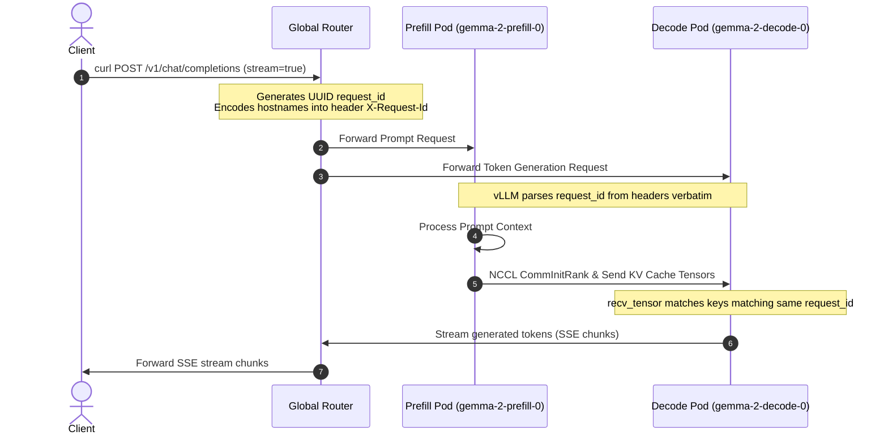

# Summary of Gemma 2 Disaggregated Serving Deployment on GKE

This document summarizes the changes, configurations, and customized hacks applied to successfully run disaggregated serving for **Gemma 2 (2B-IT)** using **vLLM (v0.23.0)** and **LeaderWorkerSet (LWS)** on a GKE cluster.

---

## 1. Overview of the Request Flow

In disaggregated serving, the model's computation is split:
*   **Prefill Engine (Producer):** Processes input tokens (context prompt) and outputs the Key-Value (KV) cache tensors.
*   **Decode Engine (Consumer):** Receives the KV cache from the prefill engine and autoregressively generates output tokens.



---

## 2. Key Manifest Configurations (Standard vLLM)

To support vLLM's experimental disaggregated KV-transfer feature on our L4 GKE pool, the following configurations were applied to [gemma-serving-lws.yaml](file:///usr/local/google/home/daniellguo/git-repos/tech-notes/k8s/explore-leaderworkerset/resources/gemma-serving-lws.yaml):

| Parameter | Type | Value / Scope | Purpose |
| :--- | :--- | :--- | :--- |
| `--enforce-eager` | CLI Option | Both Engines | Disables `torch.compile` and CUDAGraphs. This is required because vLLM's current disaggregated KV-transfer hooks must run inside eager mode execution blocks. |
| `NCCL_P2P_DISABLE` | Env Var | `"1"` | Disables GPU Peer-to-Peer memory copy. Since L4 GPU instances reside on separate VM nodes in GKE, standard TCP sockets must be used. |
| `NCCL_NET_GDR_LEVEL` | Env Var | `"0"` | Disables GPUDirect RDMA. Forces NCCL traffic over standard VM network cards rather than high-performance RDMA interconnects. |
| `NCCL_SOCKET_IFNAME` | Env Var | `"eth0"` | Binds NCCL traffic to GKE pod default ethernet adapters. |

---

## 3. Customized Hacks & Workarounds

During deployment, we encountered two critical blockages that required specialized workarounds:

### Hack 1: Disabling Request ID Randomization (`VLLM_DISABLE_REQUEST_ID_RANDOMIZATION="1"`)
> [!IMPORTANT]
> **The Issue:**
> By default, vLLM's internal `InputProcessor` independently appends a random 8-character suffix to incoming request IDs (e.g., `req-1234` becomes `req-1234-a78b4f1b`). Because the Router sends the request to the prefill and decode engines as separate API requests, the two engines randomized their request IDs differently (e.g., Prefill received `req-1234-f8b1` and Decode received `req-1234-2e9a`).
> As a result, the Decode engine waited on keys matching its own suffix, which the Prefill engine never sent, causing a permanent hang.
>
> **The Hack:**
> We injected the environment variable `VLLM_DISABLE_REQUEST_ID_RANDOMIZATION="1"` into both engines. This bypasses the suffix generation code inside `/usr/local/lib/python3.12/dist-packages/vllm/v1/engine/input_processor.py` and forces both engines to reuse the router's incoming `X-Request-Id` header verbatim.

### Hack 2: Hostname Routing inside Request ID (Router Config)
> [!NOTE]
> **The Setup:**
> Since vLLM requires the decode engine to know the IP address and port of the prefill engine to connect and initialize the NCCL peer channel, we encode this networking metadata directly into the request ID.
> 
> The global router constructs the Request ID format as:
> `chatcmpl-___prefill_addr_<prefill_ip>:14579___decode_addr_<decode_ip>:14579_<uuid>`
> 
> This custom metadata string is parsed by the vLLM engines' `P2pNcclConnector` at runtime to automatically resolve peer networking coordinates without requiring external discovery registries.

---

## 4. Verification Output

We verified the deployment with a streaming request to port-forwarded localhost:

```bash
curl -N http://localhost:8080/v1/chat/completions \
  -H "Content-Type: application/json" \
  -d '{
    "model": "google/gemma-2-2b-it",
    "messages": [
      {"role": "user", "content": "What is quantum computing? Explain in 2 sentences."}
    ],
    "stream": true
  }'
```

**Clean text streamed successfully:**
> "Quantum computing harnesses the principles of quantum mechanics to perform computations. It uses qubits, which can be 0, 1, or both simultaneously, enabling it to solve specific problems exponentially faster than classical computers."
