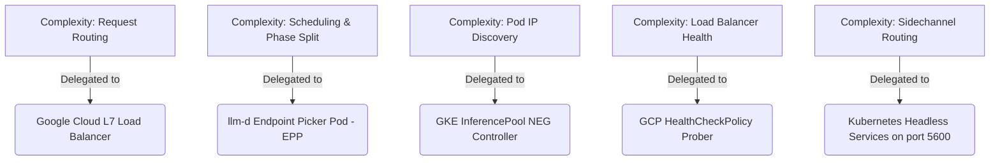
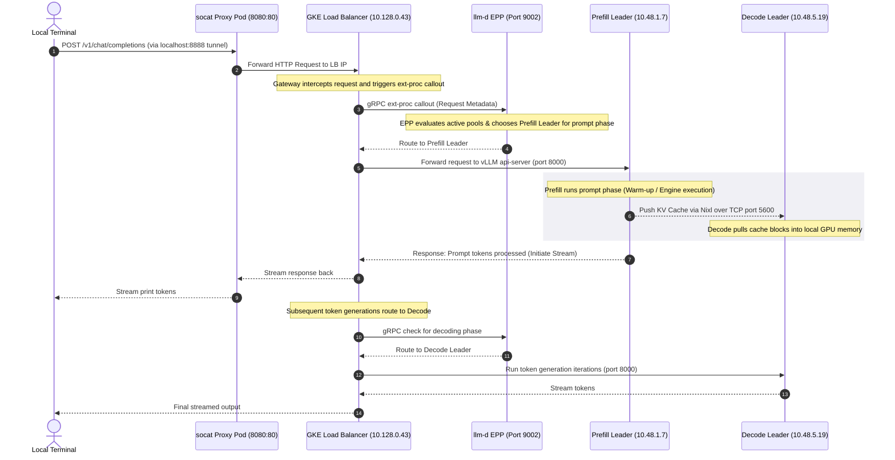
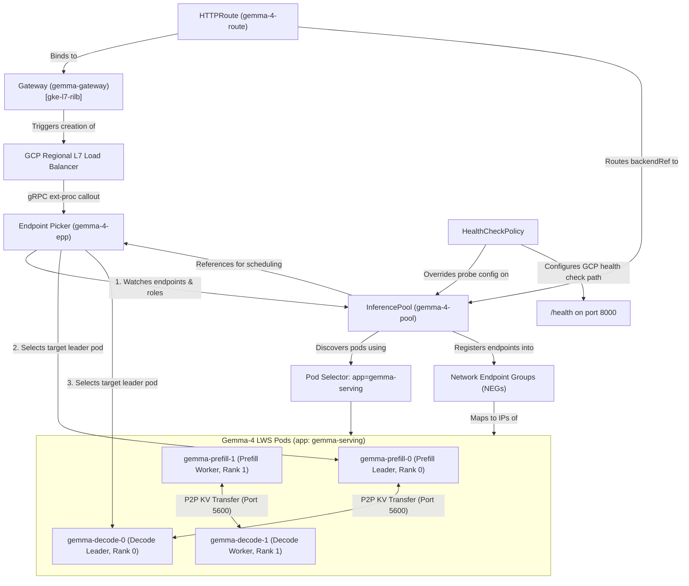
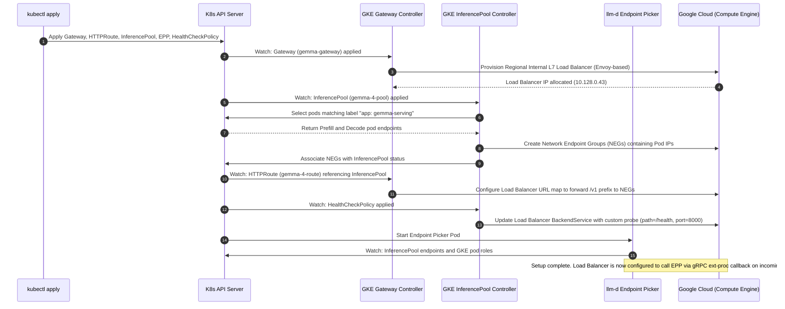

# Gemma 4 Disaggregated Serving: Architecture Comparison

This document details the architectural migration from custom sidecar routing (old iteration)
to GKE-native Gateway API and `llm-d` EPP (current iteration), explaining how complexities
were simplified and how requests flow through the new system.

---

## 1. Architectural Comparison Summary

| Feature / Component | Custom Sidecar Routing (`gemma-4-disagg-multi-nodes`) | GKE Native Gateway API (`gemma-4-disagg-multi-nodes-llmd`) |
| :--- | :--- | :--- |
| **HTTP Routing Engine** | Custom FastAPI: [router:L15-106][r_o1], [config:L13-100][r_o2]. | GCP L7 LB: [routing.yaml:L1-18][r_n1], [L51-72][r_n2]. |
| **Routing / Scheduling** | Hardcoded in FastAPI: [config:L48-97][s_o1]. | **Endpoint Picker (EPP)**: [routing.yaml:L74-113][s_n1], [L33-36][s_n2]. |
| **Model Node Tracking** | Headless DNS: [serving-lws.yaml:L1-15][t_o1], [router:L38-47][t_o2]. | GKE **`InferencePool`** in [routing.yaml:L20-37][t_n1] (NEGs). |
| **Health Checking** | Probes: [serving-lws.yaml:L90-97][h_o1], loops: [router:L48-56][h_o2]. | GKE **`HealthCheckPolicy`** in [routing.yaml:L157-174][h_n1] (/health). |
| **P2P Sidechannel Config** | Custom Pod IP env vars: [serving-lws.yaml:L63-69][p_o1], [L240-246][p_o2]. | Headless Services (port 5600): [serving-lws.yaml:L1-19][p_n1], [L175-193][p_n2]. |
| **Deployment Footprint** | 5 files, including custom Docker configmaps and routers. | 3 files, completely using standard, native resources. |

---

## 2. Who is Managing the Complexities Now

By migrating to the Gateway API, we eliminated all custom python sidecar proxies and scripts. The responsibilities are now distributed to robust infrastructure controllers:

1. **Google Cloud L7 Load Balancer:** Handles incoming HTTP client requests, SSL termination, and routes requests according to rules defined in `HTTPRoute`.
2. **llm-d Endpoint Picker (EPP):** Contains the core logic for disaggregated serving.
   It queries pod roles (`prefill`/`decode`) and health statistics (Prometheus metrics)
   to decide which exact pod should handle prompt processing and who should handle decoding.
3. **GKE InferencePool NEG Controller:** Dynamically registers running vLLM pods into Google Cloud Network Endpoint Groups (NEGs). The load balancer routes traffic directly to these NEGs.
4. **GCP HealthCheckPolicy Prober:** Automatically queries `/health` on all backend endpoints, stripping out unhealthy instances without needing manual readiness script interventions.

---

## 3. End-to-End Request Flow (llmd Iteration)

The following flow chart illustrates how a client completions request is processed through the GKE-native Gateway API and `llm-d` architecture:

---

## 4. Kubernetes Control Plane & Resource Association Flow

This section details how the Kubernetes resources defined in [llmd-routing.yaml](llmd-routing.yaml)
and [gemma-serving-lws.yaml](gemma-serving-lws.yaml) are configured and associated by GKE controllers
to establish the data path.

### Resource Relationship Diagram

The GKE Gateway controller and GKE InferencePool controller dynamically discover resources and translate them into Google Cloud L7 Load Balancer components:

### Detailed Description of Control Plane Interactions (Diagram Edges)

The lines (edges) in the relationship diagram above represent critical integration points that bind
the Kubernetes control plane to the physical GCP Load Balancer routing logic:

1. **`Gateway` $\rightarrow$ `GCP Regional L7 Load Balancer` (Provisioning):**
   GKE's Gateway Controller watches the `Gateway` resource with class `gke-l7-rilb`. It communicates with the Google Cloud Compute API to provision a regional, Envoy-managed Internal Application Load Balancer.

2. **`HTTPRoute` $\rightarrow$ `Gateway` (Binding):**
   The `HTTPRoute` binds its routing rules to the Gateway's listeners. Any HTTP traffic reaching the Load Balancer IP matching the path prefix rules (e.g., `/v1`) is forwarded to the designated backend.

3. **`InferencePool` $\rightarrow$ `NEG` (Endpoint Registration):**
   GKE's InferencePool controller automatically creates GCP **Network Endpoint Groups (NEGs)**.
   The controller watches the pod endpoints matching the selector `app: gemma-serving`. It
   dynamically registers the pod IP addresses and port `8000` as network endpoints in the NEGs,
   enabling the GCP Load Balancer to route traffic directly to the container interfaces
   bypassing Kubernetes kube-proxy.

4. **`HealthCheckPolicy` $\rightarrow$ `InferencePool` (Probe Customization):**
   GKE's Gateway controller translates `HealthCheckPolicy` specifications into GCP load balancer
   backend health checkers. It overrides the default Envoy health check probe to target the path
   `/health` on port `8000`, ensuring the load balancer only routes to active vLLM engines.

5. **`GCP Regional L7 Load Balancer` $\rightarrow$ `EPP` (gRPC ext-proc callout):**
   The load balancer resolves the EPP's address indirectly. The `HTTPRoute` specifies
   `InferencePool` as its backendRef. In turn, the `InferencePool` contains `spec.endpointPickerRef`
   pointing to the `gemma-4-epp` Service. GKE's load balancer controller translates this
   reference chain into an **Envoy External Processing (ext-proc)** filter on the Regional L7 Load
   Balancer, instructing Envoy to pause incoming client HTTP requests and execute gRPC callouts
   to EPP port `9002` for routing decisions.

6. **`EPP` $\rightarrow$ `InferencePool` (State Monitoring):**
   The EPP continuously monitors the InferencePool CRD, querying pod liveness and checking their GKE/LWS annotations to separate `prefill-leader`/`decode-leader` targets from stateless compute worker pods.

7. **`EPP` $\rightarrow$ `Prefill Leader` / `Decode Leader` (Scheduling Decisions):**
   Based on the request state (prefill phase vs subsequent token generation/decode phase),
   the EPP responds to the load balancer's ext-proc callback, instructing the load balancer
   to override the routing header and forward the request to the specific NEG endpoint of the
   chosen leader pod (`gemma-prefill-0` or `gemma-decode-0`).

### Control Plane Interaction & Initialization Sequence

The sequence below illustrates how the GKE control plane initializes when the manifests are applied:

[r_o1]: ../gemma-4-disagg-multi-nodes/gemma-global-router.yaml#L15-106
[r_o2]: ../gemma-4-disagg-multi-nodes/gemma-router-configmap.yaml#L13-100
[r_n1]: llmd-routing.yaml#L1-L18
[r_n2]: llmd-routing.yaml#L51-L72

[s_o1]: ../gemma-4-disagg-multi-nodes/gemma-router-configmap.yaml#L48-97
[s_n1]: llmd-routing.yaml#L74-L113
[s_n2]: llmd-routing.yaml#L33-L36

[t_o1]: ../gemma-4-disagg-multi-nodes/gemma-serving-lws.yaml#L1-15
[t_o2]: ../gemma-4-disagg-multi-nodes/gemma-global-router.yaml#L38-47
[t_n1]: llmd-routing.yaml#L20-L37

[h_o1]: ../gemma-4-disagg-multi-nodes/gemma-serving-lws.yaml#L90-97
[h_o2]: ../gemma-4-disagg-multi-nodes/gemma-global-router.yaml#L48-56
[h_n1]: llmd-routing.yaml#L157-L174

[p_o1]: ../gemma-4-disagg-multi-nodes/gemma-serving-lws.yaml#L63-69
[p_o2]: ../gemma-4-disagg-multi-nodes/gemma-serving-lws.yaml#L240-246
[p_n1]: gemma-serving-lws.yaml#L1-19
[p_n2]: gemma-serving-lws.yaml#L175-193
