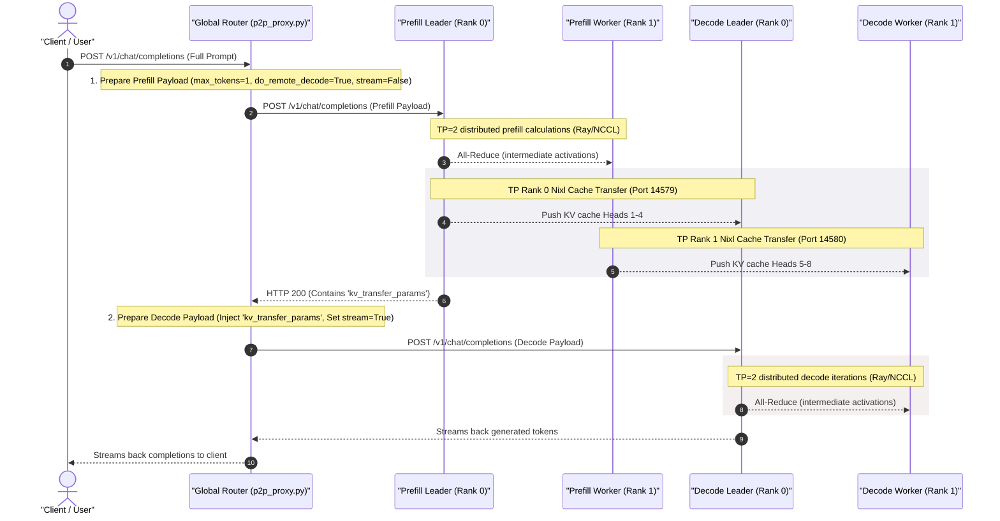

# Summary of Gemma 4 Disaggregated Serving (TP=2) Deployment on GKE

This document summarizes the architecture, configurations, and workarounds implemented to successfully
host **Gemma 4 (12B IT)** using disaggregated serving and **Tensor Parallelism (TP=2)** across multiple GKE nodes.

---

## 1. Request Flow & Multi-Node Architecture

In this deployment, both the Prefill and Decode clusters are configured as **LeaderWorkerSets (LWS)**
of size 2, sharding the model using **TP=2**. Because each GPU node in the pool hosts 1x NVIDIA L4 GPU,
the two tensor parallel workers reside on separate physical VM nodes:

```text
                       [ Client Request ]
                               │
                               ▼
                     [ Global Router Proxy ]
                        │              │
                        ▼ (Prefill)    ▼ (Decode)
              [ Prefill LWS ]        [ Decode LWS ]
               ┌───────────┐          ┌───────────┐
  Rank 0 ──►  │Leader Pod │  ──NCCL─►│Leader Pod │   ◄─── Node A (L4 GPU, Ray Head)
              └─────┬─────┘          └─────┬─────┘
                    │                      │
              ┌─────▼─────┐          ┌─────▼─────┐
  Rank 1 ──►  │Worker Pod │  ──NCCL─►│Worker Pod │   ◄─── Node B (L4 GPU, Ray Worker)
              └───────────┘          └───────────┘
```

1. **Ray Cluster:** The LWS Leader pod starts the Ray Head. The LWS Worker pod starts the Ray Worker process and joins the leader's GCS registry to form a single virtual Ray execution group of 2 GPUs.
2. **Disaggregated KV Transfer:**
   * **TP Rank 0 P2P Channel:** `gemma-prefill-0` (prefill leader) connects to `gemma-decode-0` (decode leader) over TCP port `14579`.
   * **TP Rank 1 P2P Channel:** `gemma-prefill-0-1` (prefill worker) connects to `gemma-decode-0-1` (decode worker) over TCP port `14580`.

---

## 2. Global Router P2P Proxy Request Flow

The `p2p_proxy.py` script acts as an orchestrator/router that implements a **two-stage request coordination loop** to enable actual disaggregated serving using vLLM's Nixl cache-sharing connector.

### The Workflow Diagram



### Step-by-Step Breakdown (Matching Diagram Steps)

#### Step 1: Client Request Received

The client initiates a request by sending a POST HTTP completions call containing the full prompt text
and parameters to the Global Router proxy (`p2p_proxy.py`) at `/v1/chat/completions`.

#### Step 2: Prefill Payload Dispatch

Upon intercepting the request, the Router prepares a modified payload to send to the **Prefill Leader Node (Rank 0)**:

* **Resolves Backend IP Address:** The router resolves the prefill leader's pod IP by calling Python's
  `socket.gethostbyname('gemma-prefill-0.gemma-prefill.default.svc.cluster.local')` inside a monitoring
  loop (defined in [gemma-global-router.yaml:L38-85](gemma-global-router.yaml#L38-L85)). If GKE restarts
  the prefill pod and it gets a new IP, the router terminates its proxy process and exits to trigger a
  clean container restart and lookup.
* **Checks Readiness:** The router verifies that the prefill engine is active by polling `/health` on port `8000` until it receives an HTTP `200 OK` response (defined in [gemma-global-router.yaml:L48-56](gemma-global-router.yaml#L48-L56)).
* **Limits Generation to 1 Token:** It overrides `max_tokens` (and `max_completion_tokens`) to `1` because prompt calculation is the sole responsibility of the prefiller (defined in [gemma-router-configmap.yaml:L54-58](gemma-router-configmap.yaml#L54-L58)).
* **Enables Nixl Producer Mode:** It injects `"do_remote_decode": True` into the `kv_transfer_params` block, instructing the vLLM engine to export the cache to the network (defined in [gemma-router-configmap.yaml:L60-64](gemma-router-configmap.yaml#L60-L64)).
* **Sends Synchronously:** It dispatches the request to the Prefill Leader Node with `stream=False` to wait for a blocking response (defined in [gemma-router-configmap.yaml:L69-80](gemma-router-configmap.yaml#L69-L80)).

#### Step 3: Distributed Prefill Activation Exchange

The Prefill Leader (Rank 0) and Prefill Worker (Rank 1) coordinate using Ray/NCCL to run the tensor parallel
prefill computation (defined in [gemma-serving-lws.yaml:L57-58](gemma-serving-lws.yaml#L57-L58) and worker connection
[L133](gemma-serving-lws.yaml#L133)). They perform All-Reduce calls across network sockets using NCCL TCP
configurations (defined in [gemma-serving-lws.yaml:L78-83](gemma-serving-lws.yaml#L78-L83)) to exchange activations
at the boundary of each transformer layer.

#### Step 4: Rank 0 Nixl Cache Transfer

Once prompt calculation completes, the Prefill Leader (Rank 0) initiates a Nixl P2P connection to
the Decode Leader (Rank 0) over TCP port `14579` and pushes the KV Cache for attention **Heads 1-4**
(Nixl connector setup defined in [gemma-serving-lws.yaml:L59](gemma-serving-lws.yaml#L59)).

#### Step 5: Rank 1 Nixl Cache Transfer

Concurrently, the Prefill Worker (Rank 1) initiates a Nixl P2P connection to the Decode Worker (Rank 1)
over TCP port `14580` and pushes the KV Cache for attention **Heads 5-8** (Nixl connector logic mapping
initiated via [gemma-serving-lws.yaml:L59](gemma-serving-lws.yaml#L59)).

#### Step 6: Connection Metadata Returned

The Prefill Leader returns a JSON payload containing the connection parameters (`kv_transfer_params`) to
the Router (configured in [gemma-serving-lws.yaml:L59](gemma-serving-lws.yaml#L59)), signaling that prompt
processing is finished and the KV cache is pushed.

#### Step 7: Decode Payload Dispatch

The Router extracts `kv_transfer_params` from Step 6, injects it into the original client request payload
(restoring the user's original `max_tokens`), and forwards the compiled payload to the **Decode Leader Node**
setting `stream=True` (defined in [gemma-router-configmap.yaml:L85-97](gemma-router-configmap.yaml#L85-L97)).

#### Step 8: Distributed Decode Activation Exchange

The Decode Leader and Decode Worker retrieve their sharded KV Cache blocks locally from their background memory
buffers (where they were already pushed by the prefiller in Steps 4 & 5) and load them into their active GPU
attention blocks (configured in [gemma-serving-lws.yaml:L236](gemma-serving-lws.yaml#L236)). This local load/injection
process is defined in `p2p_nccl_connector.py:L110`(vLLM implementation) and the buffer lookup is handled in
`p2p_nccl_engine.py:L308-335`(vLLM implementation). They then coordinate via Ray/NCCL to run autoregressive
generation iterations, performing intermediate All-Reduce activations exchange.

#### Step 9: Stream Return to Router

The Decode Leader streams the generated tokens back to the Router in real-time as they are decoded.

#### Step 10: Stream Return to Client

The Router proxies the incoming HTTP SSE token stream back to the Client in real-time, completing the response loop.

---

## 3. Key Manifest Configurations

The following configurations were applied to [gemma-serving-lws.yaml](gemma-serving-lws.yaml):

| Parameter | Type | Value / Scope | Purpose |
| :--- | :--- | :--- | :--- |
| `VLLM_USE_V1` | Env Var | `"0"` | Disables the new vLLM V1 core to fall back to the stable V0 core (bypassing Ray V2 executor and MQ deadlocks). |
| `VLLM_NIXL_SIDE_CHANNEL_HOST` | Env Var | `status.podIP` (Leader) / `"0.0.0.0"` (Worker) | Nixl socket host address (must be the real pod IP for peer nodes to connect). |
| `VLLM_NIXL_SIDE_CHANNEL_PORT` | Env Var | `"5600"` | Binds Nixl's TCP communication port. |
| `VLLM_DISABLE_REQUEST_ID_RANDOMIZATION` | Env Var | `"1"` | Bypasses vLLM request ID suffix randomization so prefill and decode use matching IDs. |
| `NCCL_SOCKET_IFNAME` | Env Var | `"eth0"` | Binds NCCL traffic to default GKE Pod network interfaces. |
| `NCCL_IB_DISABLE` | Env Var | `"1"` | Disables InfiniBand queries on non-IB GKE nodes. |
| `NCCL_P2P_DISABLE` | Env Var | `"1"` | Disables GPUDirect P2P over network since L4 GPUs reside on separate physical nodes. |
| `NCCL_NET_GDR_LEVEL` | Env Var | `"0"` | Forces NCCL transport over standard TCP sockets instead of RDMA. |
| `NCCL_DEBUG` | Env Var | `"TRACE"` | Enables detailed NCCL handshake tracing logs for debugging. |

---

## 4. Critical Workarounds & Configurations in Manifests

To run Gemma 4 across multiple L4 GPU nodes on GKE without shared infrastructure (like NFS), the
production manifests implement several critical workarounds and system configurations:

### 1. Distributed Model Preloading (NFS-Free weight loading)

> [!IMPORTANT]
> **The Challenge:**
> By default, vLLM's distributed loader only downloads model weights on Rank 0 (the leader),
> expecting other ranks to load weights from a shared network directory (NFS). GKE standard nodes do
> not share node storage, which causes worker pods to hang indefinitely or crash because they cannot
> find the weights.
>
> **The Manifest Implementation:**
> We execute an explicit Hugging Face download command on **both** the leader and worker templates
> inside [gemma-serving-lws.yaml:L128-L131](gemma-serving-lws.yaml#L128-L131) before starting Ray or vLLM:
> ```bash
> hf download google/gemma-4-12b-it model.safetensors config.json --token "$HF_TOKEN"
> ```
> This pre-populates the Hugging Face cache directory local to each VM node, enabling NFS-free
> distributed loading.

### 2. Side-Channel Host Bind (`VLLM_NIXL_SIDE_CHANNEL_HOST`)

> [!IMPORTANT]
> **The Challenge:**
> Nixl uses a side-channel server to negotiate GPU network handshakes. If left to default
> (`0.0.0.0` or localhost), the worker node cannot resolve the leader's network destination,
> causing NCCL initialization to time out.
>
> **The Manifest Implementation:**
> We dynamically bind `VLLM_NIXL_SIDE_CHANNEL_HOST` to the pod's real GKE Pod IP using Kubernetes
> field references inside the leader's env block of [gemma-serving-lws.yaml:L63-L66](gemma-serving-lws.yaml#L63-L66):
> ```yaml
> - name: VLLM_NIXL_SIDE_CHANNEL_HOST
>   valueFrom:
>     fieldRef:
>       fieldPath: status.podIP
> ```

### 3. Ray V0 Engine Core Fallback (`VLLM_USE_V1="0"`)

> [!IMPORTANT]
> **The Challenge:**
> The new vLLM V1 core uses Ray Executor V2, which leverages a shared-memory message queue
> broadcaster (`rpc_broadcast_mq`) for worker coordination. Shared memory cannot span physical VM
> instances, leading to communication deadlocks on multi-node groups.
>
> **The Manifest Implementation:**
> We fall back to the stable V0 engine core by setting this variable to `"0"` in all container
> environment blocks inside [gemma-serving-lws.yaml:L69-L70](gemma-serving-lws.yaml#L69-L70):
> ```yaml
> - name: VLLM_USE_V1
>   value: "0"
> ```
> This forces coordination to use stable Ray Actors over standard TCP network sockets.

### 4. NCCL Network Tuning for VPC Nodes

> [!IMPORTANT]
> **The Challenge:**
> Standard GKE node pools lack InfiniBand or NVLink interfaces across separate virtual machines. If
> NCCL attempts to use these high-speed interconnects, the handshake hangs.
>
> **The Manifest Implementation:**
> We configure env variables in all pod templates inside [gemma-serving-lws.yaml:L78-L87](gemma-serving-lws.yaml#L78-L87) to disable IB/P2P and bind traffic to the primary GKE ethernet interface:
> *   `NCCL_SOCKET_IFNAME="eth0"` (Binds to GKE default network interface)
> *   `NCCL_IB_DISABLE="1"` (Disables InfiniBand queries)
> *   `NCCL_P2P_DISABLE="1"` (Disables inter-node PCIe Peer-to-Peer access)

### 5. IPC Lock Security Capability

> [!NOTE]
> **The Manifest Implementation:**
> We grant `IPC_LOCK` capabilities in the container security context inside the
> manifest [gemma-serving-lws.yaml](gemma-serving-lws.yaml#L106-L109) to allow NCCL to
> lock shared memory pages directly, preventing page swaps and optimizing GPU
> memory bandwidth during distributed All-Reduce steps:
> ```yaml
> securityContext:
>   capabilities:
>     add:
>       - IPC_LOCK
> ```

### 6. Router DNS & Health Monitoring Loop

> [!IMPORTANT]
> **The Challenge:**
> In Kubernetes, the headless service DNS records for LWS leader pods (`gemma-prefill-0.gemma-prefill`)
> can resolve to new IP addresses upon pod restart/recreation. The global proxy must dynamically
> detect these IP shifts to avoid routing requests to stale network locations.
>
> **The Manifest Implementation:**
> The global router container in [gemma-global-router.yaml:L38-L85](gemma-global-router.yaml#L38-L85)
> executes a continuous background shell loop. It periodically queries DNS for prefill/decode IPs,
> validates HTTP health endpoints, and if an IP change is detected, kills the current proxy process
> and restarts it with the updated endpoints.

---

## 5. Automating Readiness via Kubernetes Probes & Workarounds

To automate inference readiness checks natively inside the GKE cluster, the following configuration layers have been added to the manifests:

### 1. Prefill / Decode Leaders ([gemma-serving-lws.yaml:L90-L97](gemma-serving-lws.yaml#L90-L97) & [L267-L274](gemma-serving-lws.yaml#L267-L274))

Added native `readinessProbe` blocks to monitor vLLM's `/health` endpoint:

```yaml
# Configured under spec.containers[name=prefill-leader / decode-leader]
readinessProbe:
  httpGet:
    path: /health
    port: 8000
  initialDelaySeconds: 30  # Prefill (60 for Decode)
  periodSeconds: 10        # Prefill (15 for Decode)
  timeoutSeconds: 5
  failureThreshold: 20
```

### 2. Service DNS Workaround (`publishNotReadyAddresses`)

* **The Blocker:** By default, CoreDNS only resolves headless service DNS entries
  (`gemma-decode-0.gemma-decode...`) once the pod is marked `Ready`. This created a circular
  deadlock: worker pods could not resolve the head IP to join Ray -> Ray cluster could not form
  -> vLLM could not warm up -> pod could not become `Ready`.
* **The Fix:** Configured `publishNotReadyAddresses: true` on both the prefill and decode headless
  services. Pod IPs are now published to DNS immediately on creation, allowing Ray nodes to bootstrap
  successfully.

### 3. Global Router Checks (`gemma-global-router.yaml`)

Modified the router's bash startup loop to query backend readiness `/health` directly via
`urllib.request` before spawning the fastapi proxy server. This prevents the proxy from
crash-looping during engine weight downloads:

```bash
# Wait until both backend engines respond with 200 OK
PREFILL_READY=$(python3 -c "import urllib.request; print(1 if urllib.request.urlopen('http://$PREFILL_IP:8000/health').getcode() == 200 else 0)" 2>/dev/null)
DECODE_READY=$(python3 -c "import urllib.request; print(1 if urllib.request.urlopen('http://$DECODE_IP:8000/health').getcode() == 200 else 0)" 2>/dev/null)
```

The router's own readiness probe evaluates `/status` on port 8080 and only exposes the ingress once
the proxy successfully connects.

---

## 6. Conceptual Deep Dive & FAQ

### Q1: Demystifying AI Inference Terms (Tensor Parallelism, All-Reduce, Cache Heads)

To understand disaggregated serving, it is helpful to visualize it using a real-world analogy: **The Multi-Artist Portrait Painting Factory**.

Imagine you run a factory that paints portraits. The painting process has two phases:

1. **The Prefill Stage (Layout Outline):** Reading the text description of the portrait and outlining the structure.
2. **The Decode Stage (Detail Shading):** Drawing the actual details step-by-step, one brush stroke (word) at a time.

---

#### 1. What is Tensor Parallelism (TP) and how it differs from Pipeline Parallelism

LLM models consist of dozens of sequential calculation layers (a deep neural network). To run these calculations across multiple GPUs, there are two distinct ways to split the work:

* **Pipeline Parallelism (PP - Division by Layers):**
  Think of this as an **assembly line**. If the model has 40 layers, GPU 0 holds Layers 1–20, and GPU 1 holds Layers 21–40. GPU 0 calculates the first half, hands the canvas to GPU 1, and then waits.
* **Tensor Parallelism (TP - Division WITHIN each Layer):**
  This is what we use in this deployment (`TP=2`). Instead of splitting the layers,
  **both GPUs hold all layers**. However, *inside* every single layer, the giant
  mathematical formulas (tensors) are sliced in half:
  * **Artist 1 (Leader, Rank 0)** holds the left half of the instructions for *every* layer.
  * **Artist 2 (Worker, Rank 1)** holds the right half of the instructions for *every* layer.
  * When an input instruction comes in, both artists calculate their respective halves
    of the layer in parallel, then synchronize their outputs. They do this collaboratively,
    layer by layer, all the way from Layer 1 to the end.

##### 🧮 Mathematical Example of TP=2

Suppose a single layer in the model performs a basic matrix multiplication:

$$Y = X \cdot W$$

Where $X$ is the input vector $[1, 2, 3, 4]$ and $W$ is the layer's weights matrix:

$$W = \begin{bmatrix}
1 & 5 & 9 & 13 \\
2 & 6 & 10 & 14 \\
3 & 7 & 11 & 15 \\
4 & 8 & 12 & 16
\end{bmatrix}$$

* **Without Parallelism:** A single GPU does the math and outputs $Y = [30, 70, 110, 150]$.
* **With TP=2 (Column Parallelism):** We slice the weights matrix $W$ vertically down the middle into two smaller matrices:
  * **GPU 0 (Rank 0)** gets the left columns: $W_0 = \begin{bmatrix} 1 & 5 \\ 2 & 6 \\ 3 & 7 \\ 4 & 8 \end{bmatrix}$
  * **GPU 1 (Rank 1)** gets the right columns: $W_1 = \begin{bmatrix} 9 & 13 \\ 10 & 14 \\ 11 & 15 \\ 12 & 16 \end{bmatrix}$

  Both GPUs multiply the input vector $X = [1, 2, 3, 4]$ in parallel:
  * **GPU 0 calculates:** $Y_0 = X \cdot W_0 = [30, 70]$
  * **GPU 1 calculates:** $Y_1 = X \cdot W_1 = [110, 150]$

  To get the final result, they perform a simple network coordination called **All-Gather** to merge their columns:
  $$Y = [Y_0, Y_1] = [30, 70, 110, 150]$$

#### 2. What are Activations and All-Reduce

* **Activations:** These are the intermediate drawings (tensors) that flow from one layer of the model to the next.
* **All-Reduce (The Handshake):** Because each artist only calculated their half of the canvas, their individual intermediate drawing is incomplete. Before they can start the next layer, they must coordinate:
  1. Artist 1 ($Out_0$) and Artist 2 ($Out_1$) swap their partial drawings.
  2. They sum (add) them together: $Total\_Activation = Out_0 + Out_1$.
  3. Now, **both** artists hold the exact same, fully merged activation vector on their canvas and can safely paint the next layer.

#### 3. How does the Prefill Leader distribute the calculation? Is it 50%-50%

* **Yes, it is exactly 50%-50%.**
* The model's tensor calculations are split symmetrically down the middle between the Leader (Rank 0) and Worker (Rank 1).
* The only difference is administrative: the Leader pod handles the external API request
  management (HTTP calls, tokenizing text inputs into numbers), while the Worker pod dedicates
  100% of its resources to compute tasks.

#### 4. Cache Heads - Demystifying Attention Heads and the KV Cache

To understand Cache Heads, we must break down the two core mechanisms behind them: **Multi-Head Attention** and the **KV Cache**.

##### A. What is an Attention Head

In LLMs, the **Self-Attention** mechanism determines how words relate to each other in a
sentence. Rather than having a single pathway try to figure out everything, modern models
use **Multi-Head Attention (MHA)**, running multiple independent attention calculations
in parallel. You can think of these as a **Reading Club of Specialists**.

> **📖 The Reading Club Analogy:**
> Take the sentence:
> `"The bank manager deposited the money, but he was worried it wasn't safe."`
>
> To fully comprehend this sentence, the model assigns different questions to **8 different Attention Heads (Specialists)**:
> * **Head 1 (Grammar Specialist):** Links subjects to verbs $\rightarrow$ `manager` $\leftrightarrow$ `deposited`.
> * **Head 2 (Pronoun Resolver):** Solves what pronoun refers to $\rightarrow$ `he` $\leftrightarrow$ `manager`.
> * **Head 3 (Object Tracker):** Tracks what pronouns represent $\rightarrow$ `it` $\leftrightarrow$ `money`.
> * **Head 4 (Sentiment Inspector):** Examines emotions and states $\rightarrow$ `worried` $\leftrightarrow$ `safe`.
>
> Each of these 8 heads calculates its own "attention map" independently.
> Under **TP=2**, the workload is split:
> * **Prefill Leader (GPU 0):** Computes Heads 1–4.
> * **Prefill Worker (GPU 1):** Computes Heads 5–8.

##### B. Why does the KV Cache hold the Attention Memory

To calculate attention, the model generates three vectors for every word (token):

* **Query ($Q$):** What is this word looking for? (e.g. `he` is looking for a male noun).
* **Key ($K$):** What attributes/identities does this word have? (e.g. `manager` has the key for a male noun).
* **Value ($V$):** What actual meaning does this word carry? (e.g. `manager` means "the person running the bank").
* *Calculation:* The attention score is derived by matching Queries ($Q$) against Keys ($K$), and multiplying by Values ($V$).

###### 🧮 Mathematical Example of $Q, K, V$ and Caching

Suppose we process the input sequence `"Once upon"`, where the model dimension is **$d_{model} = 2$** and we have **1 attention head**.

> **💡 Note on Model Dimension ($d_{model} = 2$):**
> In a real model like Gemma-4-12B, $d_{model}$ is **3,072** (meaning words are represented by lists of 3,072 numbers to capture deep context).
> We use a dimension of 2 here so the coordinates are simple 2D vectors that can easily be calculated by hand.

We use three projection matrices:

* $W_Q = \begin{bmatrix} 1 & 0 \\ 0 & 1 \end{bmatrix}$ (Query Projection)
* $W_K = \begin{bmatrix} 0 & 1 \\ 1 & 0 \end{bmatrix}$ (Key Projection)
* $W_V = \begin{bmatrix} 2 & 0 \\ 0 & 2 \end{bmatrix}$ (Value Projection)

> **💡 Where do these projection matrices come from?**
> These matrices are the **model weights**. They are learned parameters optimized during training to extract the best query, key, and value associations.
> They are loaded from the static model weight files (e.g., `.safetensors` files) into the GPU memory on startup and remain static during inference.

**Step 1: Processing "Once" ($x_1 = [1, 2]$)**

> **💡 How did we get the vector `[1, 2]`?**
> The raw word string `"Once"` is first processed by the Tokenizer and mapped to a unique integer ID (e.g. ID `1205`).
> The model then looks up **Row `1205`** of the **Embedding Table** (`model.embed_tokens`), which contains the learned coordinate vector `[1, 2]`.

1. *Calculate Vectors (via Matrix Multiplication):*
  * $Q_1 = x_1 \cdot W_Q = [1, 2] \cdot \begin{bmatrix} 1 & 0 \\ 0 & 1 \end{bmatrix} = [1, 2]$
  * $K_1 = x_1 \cdot W_K = [1, 2] \cdot \begin{bmatrix} 0 & 1 \\ 1 & 0 \end{bmatrix} = [(1\cdot0 + 2\cdot1), (1\cdot1 + 2\cdot0)] = [2, 1]$
  * $V_1 = x_1 \cdot W_V = [1, 2] \cdot \begin{bmatrix} 2 & 0 \\ 0 & 2 \end{bmatrix} = [(1\cdot2 + 2\cdot0), (1\cdot0 + 2\cdot2)] = [2, 4]$
2. *Attention Output:* Since it is the first token, it only attends to itself.
  * $\text{Score} = Q_1 \cdot K_1^T = [1, 2] \cdot \begin{bmatrix} 2 \\ 1 \end{bmatrix} = 4$.
  * $\text{Softmax Weight} = 1.0$.
  * $\text{Output} = 1.0 \cdot V_1 = [2, 4]$.
3. *Write to Cache:* We save $K_1$ and $V_1$ to memory:
  * $\text{Cache}_K = \begin{bmatrix} 2 & 1 \end{bmatrix}$, $\text{Cache}_V = \begin{bmatrix} 2 & 4 \end{bmatrix}$

> **💡 Why did a score of 4 result in a Softmax Weight of exactly 1.0?**
> Softmax normalizes a list of scores so they sum to 1.0. Because `"Once"` is the only word in the sequence, the score list has only one element: `[4]`.
> The Softmax calculation is $\frac{e^4}{e^4} = 1.0$. If a word has no competitors, it always gets 100% of the attention weight.

**Step 2: Generating the next token (Input: "Once upon")**

* The new token `"upon"` is mapped via Tokenizer ID and Embedding lookup to the vector **$x_2 = [3, 4]$**.
* *With KV Caching:* We do **not** recalculate projections for `"Once"`. We reuse $K_1$ and $V_1$ directly from the cache. We only calculate projections for the new token:
  * $Q_2 = x_2 \cdot W_Q = [3, 4]$
  * $K_2 = x_2 \cdot W_K = [4, 3]$
  * $V_2 = x_2 \cdot W_V = [6, 8]$
* *Update Cache:*
  * $\text{Cache}_K = \begin{bmatrix} 2 & 1 \\ 4 & 3 \end{bmatrix}$ (holds $K_1$ and $K_2$)
  * $\text{Cache}_V = \begin{bmatrix} 2 & 4 \\ 6 & 8 \end{bmatrix}$ (holds $V_1$ and $V_2$)
* *Attention Matching (using Query of "upon"):*
  * Match $Q_2$ with $K_1$ (Once): $Score_1 = Q_2 \cdot K_1^T = [3, 4] \cdot \begin{bmatrix} 2 \\ 1 \end{bmatrix} = 10$
  * Match $Q_2$ with $K_2$ (upon): $Score_2 = Q_2 \cdot K_2^T = [3, 4] \cdot \begin{bmatrix} 4 \\ 3 \end{bmatrix} = 24$
* *Softmax Weighting:* We apply Softmax to the score list `[10, 24]`. Since 24 is
  exponentially larger than 10, the weights split approximately into $0.05$ (for `"Once"`)
  and $0.95$ (for `"upon"`).
* *Final Output:*
  * $\text{Output} = 0.05 \cdot V_1 + 0.95 \cdot V_2 = 0.05 \cdot [2, 4] + 0.95 \cdot [6, 8] = [0.1, 0.2] + [5.7, 7.6] = [5.8, 7.8]$

By caching $K_1$ and $V_1$, the model completely avoided re-running projections for `"Once"`, saving 50% of the projection cost.

**Step 3: Mapping the Output Vector to a text word**

1. *Feed-Forward MLP:* The attention output `[5.8, 7.8]` goes through the MLP layers, where it is refined. Let's say the final layer output vector is:
   $$\text{Final Activation} = [6.0, 8.0]$$
2. *Language Model Head (Unembedding):* We multiply the final activation by the transpose of
   the **LM Head matrix** (which contains the static learned representation vectors for all
   vocabulary words).
  Let's assume our vocabulary has only 3 words:
  * ID `0`: `"Once"` $\rightarrow [1, 2]$
  * ID `1`: `"upon"` $\rightarrow [3, 4]$
  * ID `2`: `"a"` $\rightarrow [6, 8]$

  The dot product gives the match scores (Logits):
  * Logit for `"Once"` $= [6.0, 8.0] \cdot [1, 2]^T = (6\cdot1) + (8\cdot2) = 22$
  * Logit for `"upon"` $= [6.0, 8.0] \cdot [3, 4]^T = (6\cdot3) + (8\cdot4) = 50$
  * Logit for `"a"` $= [6.0, 8.0] \cdot [6, 8]^T = (6\cdot6) + (8\cdot8) = 100$
3. *Select Winner:* The logits are `[22, 50, 100]`. Applying Softmax/Argmax selects index **`2`** as the highest score winner.
4. *Detokenization:* Index `2` maps to the text string **`"a"`**. The word `"a"` is printed to the client, and `[6.0, 8.0]` is written to the cache for the next word calculation.

> **🔄 The Autoregressive Text Generation Loop:**
> When generating text, the model works one word at a time in a loop:
> * **Step 1:** Input: `"Once"` $\rightarrow$ Output: `"upon"`
> * **Step 2:** Input: `"Once upon"` $\rightarrow$ Output: `"a"`
> * **Step 3:** Input: `"Once upon a"` $\rightarrow$ Output: `"time"`
> Notice that in Step 3, the words `"Once"` and `"upon"` are processed again.
> Without caching, the model must re-run matrix multiplications to calculate the $K$ and $V$
> vectors for `"Once"` and `"upon"` at every single generation step, which is a waste of GPU
> compute since these past words never change.
>
> **💾 The Solution: The KV Cache:**
> The KV Cache stores the $K$ and $V$ vectors for all processed tokens so they never have to be computed again.
> * At **Step 3**, the model only calculates the Query ($Q$) vector for the single new word `"a"`.
> * It retrieves the Keys ($K$) and Values ($V$) for `"Once"` and `"upon"` directly from the **KV Cache**.
> * It performs the attention calculation between the new Query and the cached Keys/Values.
> * This drops the computational complexity from quadratic $O(N^2)$ to linear $O(N)$, speeding up text generation loops dramatically.

##### C. How are Cache Heads sharded in TP=2

Because the KV Cache grows with every generated word, it quickly becomes too large to fit on a single GPU. With **TP=2**, we slice the 8 Attention Heads down the middle:

* **Prefill Leader (GPU 0):** Computes and stores the KV Cache only for **Heads 1–4**.
* **Prefill Worker (GPU 1):** Computes and stores the KV Cache only for **Heads 5–8**.

These sharded segments of attention memory stored across separate GPUs are called **Cache Heads**.

#### 5. How do Decode Leader and Worker calculate and combine final results

* Decoding is done **autoregressively** (one token/word at a time).
* To generate the next token:
  1. The Decode Leader and Worker load their sharded cache heads (Heads 1-4 on Leader, Heads 5-8 on Worker).
  2. They compute attention calculations for the single new token.
  3. They run an **All-Reduce** to combine their partial activation vectors.
  4. They pass the combined activation through the MLP (Feed-Forward) layer.
  5. They run a final **All-Reduce** to merge the output.
  6. The Decode Leader (Rank 0) runs the final projection (Softmax) on the combined activation to pick the single highest probability token (e.g. the word "space").
  7. The Decode Leader streams the word back to the client and feeds it back as the input token for the next iteration loop.

---

### Q2: Division of Labor between Leader and Worker Pods in LWS

* **Leader Pod (`Rank 0`):** Acts as the cluster coordinator (runs Ray Head/GCS) and the external
  client gateway (exposes public HTTP ports). It handles tokenizer execution, request batching,
  and downloads the config files. It also runs GPU calculations for the Rank 0 tensor parallel shards.
* **Worker Pod (`Rank 1`):** Acts as a stateless compute node. It registers itself to the Ray Head and dedicates its GPU resources solely to executing the Rank 1 tensor parallel shards.

### Q3: Model Weights Downloading Requirement

* The leader and worker pods run on different physical VM instances in GKE, with separate local
  disk partitions (`hostPath` volumes). They both need to download the entire copy of the model
  weights (in safetensors format) to their local disk.
* vLLM's model weight sharding happens *in-memory* during engine startup. Both nodes must download
  the complete `.safetensors` files to local disk so that their respective loading threads can read
  the layer files and extract their rank's sharded parameters.

### Q4: Why must the Leader and Worker continuously exchange intermediate results during KV Cache generation

To understand why they need to exchange results constantly to generate the KV Cache, let's look at the mathematical pipeline of a single Layer and see exactly where the **All-Reduce** (exchange) happens.

Here is the step-by-step process of how **Layer 1** and **Layer 2** generate their KV Caches:

#### Step 1: Layer 1 Starts (Initial Prompt Input)

The prompt text enters the model. Let's call the input vector $X$. Both GPUs have a copy of the input $X$.

1. **Calculating KV Cache (Layer 1):**
  * **Leader GPU (Rank 0):** Multiplies input $X$ by its half of the weights matrix to generate the KV Cache for **Heads 1–4**.
  * **Worker GPU (Rank 1):** Multiplies input $X$ by its half of the weights matrix to generate the KV Cache for **Heads 5–8**.

   *At this moment, both GPUs have generated their 50% slice of the Layer 1 KV Cache. No exchange has happened yet.*

2. **Calculating the output of Layer 1:**
   To finish Layer 1, the model has to run the Feed-Forward (MLP) layers.
  * Rank 0 calculates its partial output: $Out_0$.
  * Rank 1 calculates its partial output: $Out_1$.
  * **The All-Reduce (Exchange):** Rank 0 and Rank 1 send their outputs to each other and add them together:
    $$Layer_1\_Output = Out_0 + Out_1$$

    *Both GPUs now hold the complete, unified $Layer_1\_Output$ vector.*

#### Step 2: Layer 2 Starts (Here is the Dependency!)

To generate the KV Cache for **Layer 2**, the input is no longer the original prompt $X$. **The input is now $Layer_1\_Output$.**

1. **Calculating KV Cache (Layer 2):**
  * **Leader GPU (Rank 0):** Multiplies $Layer_1\_Output$ by its weights to generate the Layer 2 KV Cache for **Heads 1–4**.
  * **Worker GPU (Rank 1):** Multiplies $Layer_1\_Output$ by its weights to generate the Layer 2 KV Cache for **Heads 5–8**.

#### The "Aha!" Moment - Why they must exchange

Look closely at **Step 2**:
To calculate its Layer 2 KV Cache, the Leader GPU (Rank 0) needs the full $Layer_1\_Output$.

But $Layer_1\_Output$ is composed of:
$$Out_0 \text{ (from Leader)} + Out_1 \text{ (from Worker)}$$

If the Leader and Worker did **not** exchange their intermediate results at the end of Layer 1:

* The Leader would not have $Out_1$.
* The Leader would have to calculate Layer 2 using only $Out_0$ (which is incorrect and incomplete).
* The resulting Layer 2 KV Cache would be completely wrong.

#### Mapping back to the Portrait Painting Analogy

* **Layer 1 Output:** The unified Face Outline.
* **Layer 2 KV Cache:** The Left Eye (Rank 0) and the Right Eye (Rank 1).
* **The Dependency:** You cannot place the left eye in the correct position (Layer 2 KV Cache) unless you know where the right side of the face outline ended. You must align the outline first.

### Q5: Distributed KV Cache Sharding Layout

No, **neither the leader nor the worker will ever have the complete KV Cache.**

Each pod only holds **its own 50% slice** of the KV Cache.

Here is how the KV Cache is split and why they never need to merge it:

#### 1. How the KV Cache is Split (By Attention Heads)

In modern AI models, the KV Cache is generated by the **Attention layers**. The model uses multiple "Attention Heads" (like multiple parallel eyes looking at the text).

For example, Gemma-4-12b has **8 Key/Value Attention Heads**. When we run `TP=2`:

* **Leader Pod (Rank 0):** Calculates and stores the KV Cache only for **Heads 1 to 4** (its 50% portion).
* **Worker Pod (Rank 1):** Calculates and stores the KV Cache only for **Heads 5 to 8** (its 50% portion).

They do not share these caches during the prefill calculation, because Rank 0's GPU only handles calculations for Heads 1–4, and Rank 1's GPU only handles Heads 5–8.

#### 2. Direct parallel transfer to the Decode Pods

Because we are running the Decode cluster with `TP=2` as well:

* **Decode Leader Pod** also only needs the KV Cache for **Heads 1 to 4**.
* **Decode Worker Pod** also only needs the KV Cache for **Heads 5 to 8**.

This creates a perfect match:

```text
PREFILL LAYER (TP=2)                        DECODE LAYER (TP=2)

Leader Pod (Rank 0)   ====================> Decode Leader Pod (Rank 0)
[Heads 1-4 Cache]       (Port 14579 TCP)    [Heads 1-4 Cache]

Worker Pod (Rank 1)   ====================> Decode Worker Pod (Rank 1)
[Heads 5-8 Cache]       (Port 14580 TCP)    [Heads 5-8 Cache]
```

At no point does the KV Cache need to be merged into a single complete block. This is the main
reason why disaggregated serving is so fast and efficient—we avoid the overhead of copying
and combining massive datasets across the network.

### Q6: Networking Technologies for Inter-Node Communication

* **NCCL (NVIDIA Collective Communications Library):** The industry-standard software library offering highly optimized collective primitives (All-Reduce, Broadcast) for NVIDIA GPUs.
* **RDMA (Remote Direct Memory Access):** A hardware network capability (utilizing InfiniBand or RoCE)
  allowing network cards to transfer VRAM data directly between physical servers without CPU/operating
  system kernel overhead. High-performance production clusters run **NCCL over GPUDirect RDMA**
  to minimize communication latency.
