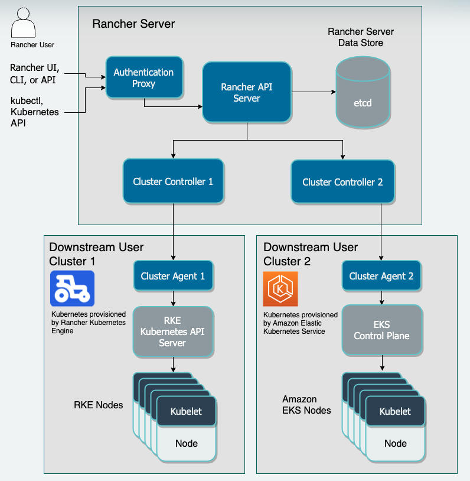
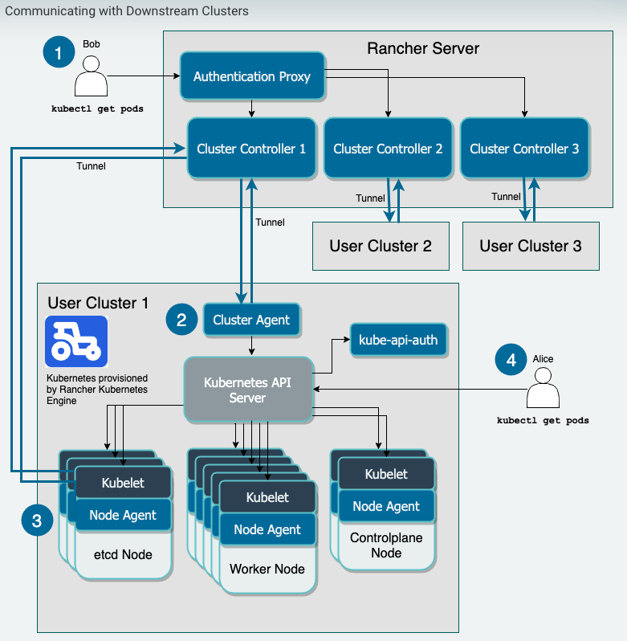
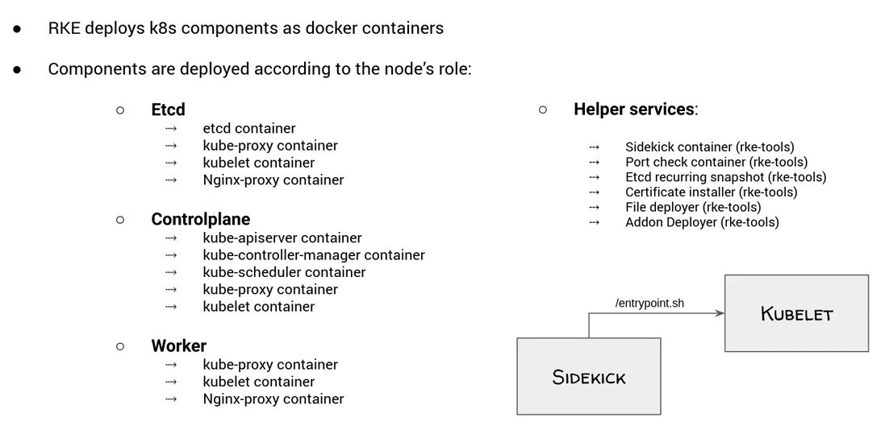

# Expore Rancher

## RKE Architecutre

Official link: [here](https://rancher.com/docs/rancher/v2.x/en/overview/architecture/)




### Components



## How RKE create a cluster

An experiement has been done against VMWare vSphere. A `Rancher Server` has been deployed on a VM within the vSphere
cluster as a Docker container. Requried resources are pre-configured, pre-installed on vSphere, so the environment is
ready to be used by Rancher to provision K8S cluster.

Official doc is [here](https://rancher.com/docs/rancher/v2.x/en/cluster-provisioning/rke-clusters/node-pools/vsphere/provisioning-vsphere-clusters/)

- RBAC related preparation on `Rancher Server` side for cluster provisioning
  - Prepare namespace
  - Prepare certs
  - Prepare roles and rolebindings
- Provision the node
  - Create and upload cloud-init.iso
  - Setup SSH
  - Install Docker
  - Copy certs to node
  - Generate and upload node config
- Provision cluster
  - Generate K8S certs
  - Deploy bunch of port listener and port checker containers to run ports checks. e.g control plan -> etcd port checks
  - Rebuild and update local kube config *****
  - [cert-deployer] container to deploy K8S certs
  - [file-deployer] container to deploy `/etc/kubernetes/kube-api-authn-webhook.yaml` and `/etc/kubernetes/audit-policy.yaml`
  - Pull K8S images
  - Building up etcd plane
    - Pull `rancher/coreos-etcd:v3.4.3-rancher1`
    - Start [etcd] container as the etcd plane
    - Check etcd health
  - Building up controller plane
    - Start [kube-apiserver] container from `rancher/hyperkube`
    - Start [kube-controller-manager] container from `rancher/hyperkube`
    - Start [kube-scheduler] container from `rancher/hyperkube`

    ``` bash
    root@master1:/home/ubuntu# docker ps | grep kube-apiserver
    982e3c4e744a        rancher/hyperkube:v1.17.6-rancher2                "/opt/rke-tools/entr…"   About an hour ago   Up About an hour                        kube-apiserver
    root@master1:/home/ubuntu# docker ps | grep kube-controller-manager
    a742b7eb4fe6        rancher/hyperkube:v1.17.6-rancher2                "/opt/rke-tools/entr…"   About an hour ago   Up About an hour                        kube-controller-manager
    root@master1:/home/ubuntu# docker ps | grep kube-scheduler
    dbd326547953        rancher/hyperkube:v1.17.6-rancher2                "/opt/rke-tools/entr…"   About an hour ago   Up About an hour                        kube-scheduler
    ```

    - Create default Role, ClusterRole, ServiceAccount
  - Building up worker plane
    - Start [kubelet] container from `rancher/hyperkube`
    - Start [kube-proxy] container from `rancher/hyperkube`

    ``` bash
    root@master1:/home/ubuntu# docker ps | grep kube-proxy
    69b07da569a4        rancher/hyperkube:v1.17.6-rancher2                "/opt/rke-tools/entr…"   About an hour ago   Up About an hour                        kube-proxy
    root@master1:/home/ubuntu# docker ps | grep kubelet
    ddc233b75151        rancher/hyperkube:v1.17.6-rancher2                "/opt/rke-tools/entr…"   About an hour ago   Up About an hour                        kubelet
    ```

  - Setting up network plugin
    ``` bash
    ~/tmp/rancher  kubectl get job rke-network-plugin-deploy-job -n kube-system -o yaml
    apiVersion: batch/v1
    kind: Job
    metadata:
    creationTimestamp: "2020-06-11T23:11:36Z"
    labels:
        controller-uid: 32dd1f95-dcba-4026-9e2c-15de8451b414
        job-name: rke-network-plugin-deploy-job
    name: rke-network-plugin-deploy-job
    namespace: kube-system
    resourceVersion: "525"
    selfLink: /apis/batch/v1/namespaces/kube-system/jobs/rke-network-plugin-deploy-job
    uid: 32dd1f95-dcba-4026-9e2c-15de8451b414
    spec:
    backoffLimit: 10
    completions: 1
    parallelism: 1
    selector:
        matchLabels:
        controller-uid: 32dd1f95-dcba-4026-9e2c-15de8451b414
    template:
        metadata:
        creationTimestamp: null
        labels:
            controller-uid: 32dd1f95-dcba-4026-9e2c-15de8451b414
            job-name: rke-network-plugin-deploy-job
        name: rke-deploy
        spec:
        affinity:
            nodeAffinity:
            requiredDuringSchedulingIgnoredDuringExecution:
                nodeSelectorTerms:
                - matchExpressions:
                - key: beta.kubernetes.io/os
                    operator: NotIn
                    values:
                    - windows
        containers:
        - command:
            - kubectl
            - apply
            - -f
            - /etc/config/rke-network-plugin.yaml
            image: rancher/hyperkube:v1.17.6-rancher2
            imagePullPolicy: IfNotPresent
            name: rke-network-plugin-pod
            resources: {}
            terminationMessagePath: /dev/termination-log
            terminationMessagePolicy: File
            volumeMounts:
            - mountPath: /etc/config
            name: config-volume
        dnsPolicy: ClusterFirst
        hostNetwork: true
        nodeName: master1
        restartPolicy: Never
        schedulerName: default-scheduler
        securityContext: {}
        serviceAccount: rke-job-deployer
        serviceAccountName: rke-job-deployer
        terminationGracePeriodSeconds: 30
        tolerations:
        - operator: Exists
        volumes:
        - configMap:
            defaultMode: 420
            items:
            - key: rke-network-plugin
                path: rke-network-plugin.yaml
            name: rke-network-plugin
            name: config-volume
    status:
    completionTime: "2020-06-11T23:12:06Z"
    conditions:
    - lastProbeTime: "2020-06-11T23:12:06Z"
        lastTransitionTime: "2020-06-11T23:12:06Z"
        status: "True"
        type: Complete
    startTime: "2020-06-11T23:11:36Z"
    succeeded: 1
    ```
  - Setting up coredns
  ``` bash
  ~/tmp/rancher  kubectl get jobs -A
  NAMESPACE     NAME                                COMPLETIONS   DURATION   AGE
  kube-system   rke-coredns-addon-deploy-job        1/1           6s         87m
  ```
  - Setting up metrics server
  ``` bash
  NAMESPACE     NAME                                COMPLETIONS   DURATION   AGE
  kube-system   rke-metrics-addon-deploy-job        1/1           11s        87m
  ```
  - Setting up nginx ingress controller
  ``` bash
  NAMESPACE     NAME                                COMPLETIONS   DURATION   AGE
  kube-system   rke-ingress-controller-deploy-job   1/1           9s         86m
  ```
  - Setting up user addons
- Finishing up the cluster provisoning
  - Installing Rancher CRDs
  - Starting agents
  - Removing the RBAC resources used by cluster provisioning
