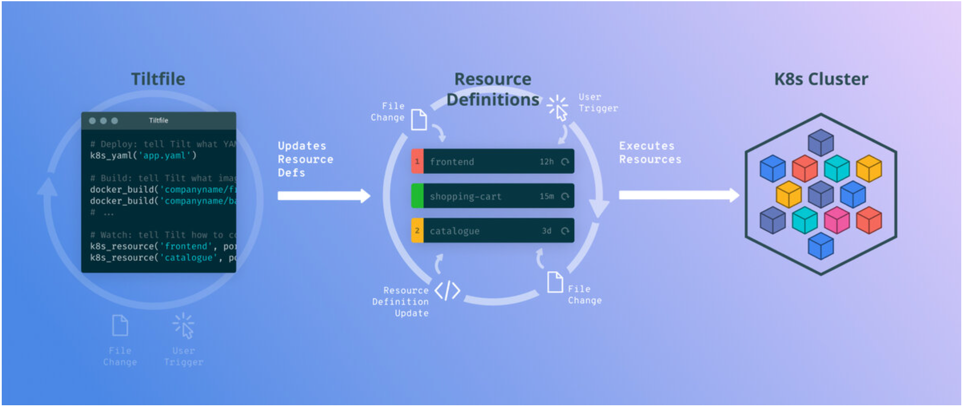

# Explore Tilt Dev's live updates

Official website: <https://tilt.dev>



## Install Tilt

Follow the official get started guide: <https://docs.tilt.dev/>

```shell
curl -fsSL https://raw.githubusercontent.com/tilt-dev/tilt/master/scripts/install.sh | bash
```

## Create a demo project and enable the live updates

### Explain the Tiltfile

```text
# Note: The inline comment might break the tilt processing
load('ext://restart_process', 'docker_build_with_restart')

docker_build_with_restart(
  'example-go-image', # The image name to be built
  '.',
  dockerfile='deployments/Dockerfile',
  # Above is similar to "docker build -f deployments/Dockerfile -t example-go-image --rm=true ."

  entrypoint=['tilt-dev'], # Tells tilt what command to re-execute
  live_update=[
    sync('./web', '/app/web'),
    # sync ./web dir to container /app/web, so that whenever there are changes in web dir on local, it will trigger the
    # build.
  ],
)

# Apply K8S YAML
k8s_yaml('deployments/deployment.yaml')
# Port forwarding
k8s_resource('example-go', port_forwards=8000) # example-go is the deployment name
```

### Test it out

* Run `tilt up`
* Open the Tilt UI
* Make changes to local `main.go` or `index.html` under web. You should be able to see the live updates