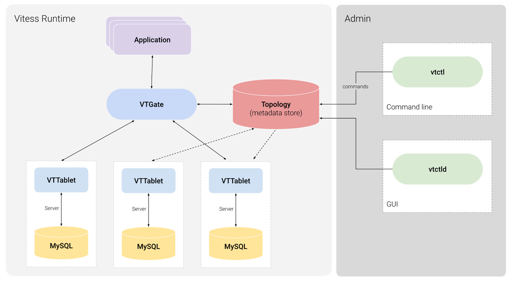

# Explore Vitess

## Why do we need Vitess

MySQL does not have a good support of **sharding**, **re-sharding**, **routing**.(MySQL cluster is not open source). In
addition, the performance of purely using MySQL is low: Client needs to establish connection for each query. 

## Architecture

- [Topology Service](https://vitess.io/docs/concepts/topology-service/):
  - It enables tablets to coordinate among themselves as a cluster.(A coordinator).
  - It enables Vitess to discover tablets, so it knows where to route queries.(For service discovery).
  - It stores Vitess configuration provided by the database administrator that is needed by many different servers in
    the cluster, and that must persist between server restarts.(For disaster recovery).
- [VTGate](https://vitess.io/docs/concepts/vtgate/): Stateless proxy to route queries.
- [VTTablet](https://vitess.io/docs/concepts/tablet/): Daemon agent running along with `mysqld` on the same machine.

## Try Vitess Operator on K8S

<https://vitess.io/docs/get-started/operator/>

## Pros and Cons

### Pros

- Query rewrite.
- Sharding mgmt for MySQL.
- Plug-in model for supporting topology service(Distributed lock manager, Repository for topology metadata): ETCD,
  ZooKeeper, Consul

### Cons

- Migration is painful because you have to modify schema.

## References

- [Vitess Architecture](https://vitess.io/docs/overview/architecture/)
- [Tech meetup: Vitess(Chinese version)](https://www.youtube.com/watch?v=GA8gcRFm6sQ&ab_channel=%E7%B3%BB%E7%BB%9F%E8%AE%BE%E8%AE%A1%E6%BC%AB%E8%B0%88)
- [Slack scale MySQL with Vitess](https://www.youtube.com/watch?v=aTItjMJE17c&ab_channel=CNCF%5BCloudNativeComputingFoundation%5D)
- [Linkedin scale MySQL with Vitess](https://www.youtube.com/watch?v=fbI6wIIKs50&ab_channel=Percona)
- [Vitess at HubSpot](https://www.youtube.com/watch?v=ZjTraLkMjYM&ab_channel=CNCF%5BCloudNativeComputingFoundation%5D)
