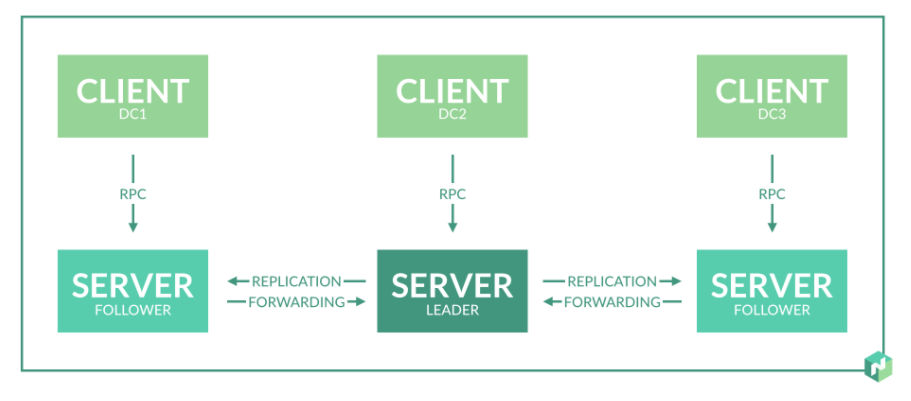
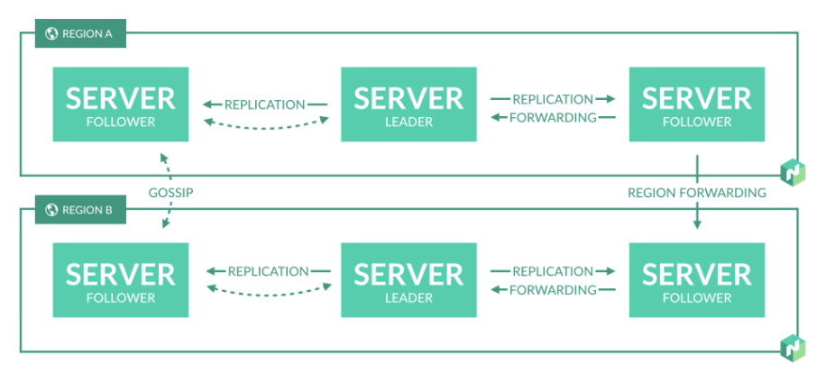
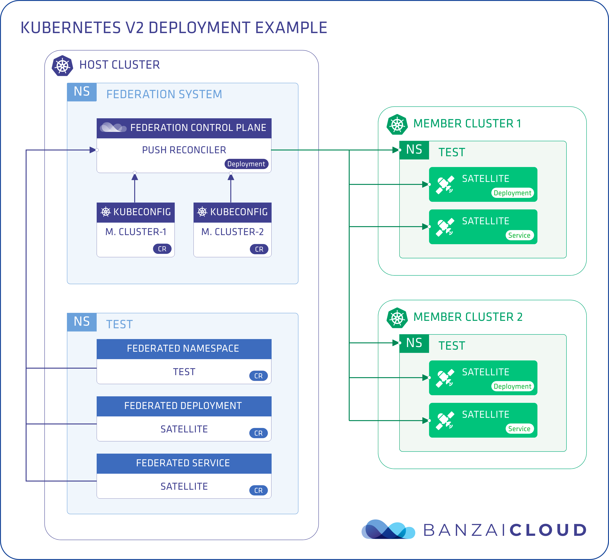
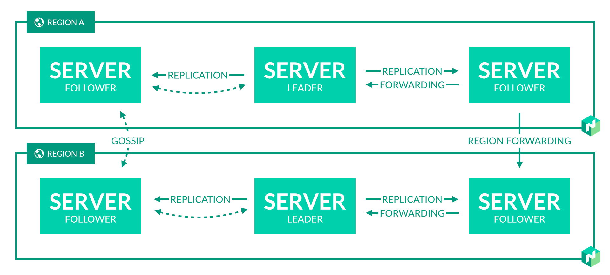
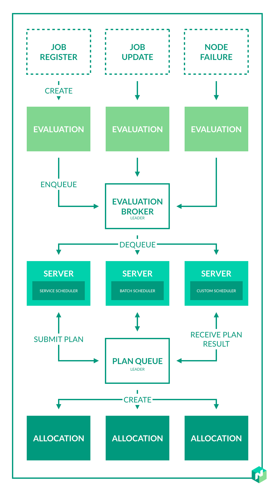

# Hashicorp Nomad

Nomad is a simple and flexible workload orchestrator to deploy and manage containers (docker, podman), non-containerized
applications (executable, Java), and virtual machines (qemu) across on-prem and clouds at scale.

Nomad provides several key features:

- Deploy Containers and Legacy Applications: Nomad’s flexibility as an orchestrator enables an organization to run containers,
  legacy, and batch applications together on the same infrastructure. Nomad brings core orchestration benefits to legacy
  applications without needing to containerize via pluggable task drivers.
- Simple & Reliable: Nomad runs as a single binary and is entirely self contained - combining resource management and scheduling
  into a single system. Nomad does not require any external services for storage or coordination. Nomad automatically handles
  application, node, and driver failures. Nomad is distributed and resilient, using leader election and state replication to
  provide high availability in the event of failures.
- Device Plugins & GPU Support: Nomad offers built-in support for GPU workloads such as machine learning (ML) and artificial
  intelligence (AI). Nomad uses device plugins to automatically detect and utilize resources from hardware devices such
  as GPU, FPGAs, and TPUs.
- Federation for Multi-Region, Multi-Cloud: Nomad was designed to support infrastructure at a global scale. Nomad supports 
 federation out-of-the-box and can deploy applications across multiple regions and clouds.
- Proven Scalability: Nomad is optimistically concurrent, which increases throughput and reduces latency for workloads.
  Nomad has been proven to scale to clusters of 10K+ nodes in real-world production environments.
- HashiCorp Ecosystem: Nomad integrates seamlessly with Terraform, Consul, Vault for provisioning, service discovery, and
  secrets management.

## Architecture

<https://www.nomadproject.io/docs/internals/architecture>

- Client is an agent like `kubelet` in K8S.
- Server is the brain like `apiserver` in K8S.

### Federation differences vs KubeFed

KubeFed: 

Nomad:

- Nomad(Decentralized architecture):
  - Clusters are independent(No share jobs, clients, states). Independent raft/consensus cluster.
  - Using gossip protocol to sync up.
- KubeFed(Centralized architecture):
  - One host cluster, multiple member cluster.

### Scheduler design(No lock or reservation mechanism)

<https://www.nomadproject.io/docs/internals/scheduling/scheduling>

1. A job submission triggers an evaluation.
2. The evaluation request is enqueued into a broker(single instance running on leader server).
   1. Provide priority ordering.
   2. Ensure at least once delivery.
3. Nomad server runs scheduling worker to process evaluations to generate allocation plan.
   1. Feasibility checking: Find a set of feasible nodes.
   2. Ranking: Score(**bin packing**) the nodes and find the best fit.
4. Submit the allocation plan to the leader server(plan queue).
   1. Server uses plan queue to prevent over-subscription or conflicts(concurrent issue).
5. After a plan is created, client picks it up and begin execution.

### Volumes

<https://www.nomadproject.io/docs/internals/plugins/csi>

- All requests go through server and then server talks to CSI node plugin

## References

- <https://github.com/hashicorp/nomad>
- <https://cloud.netapp.com/blog/cvo-blg-kubernetes-vs-nomad-understanding-the-tradeoffs>