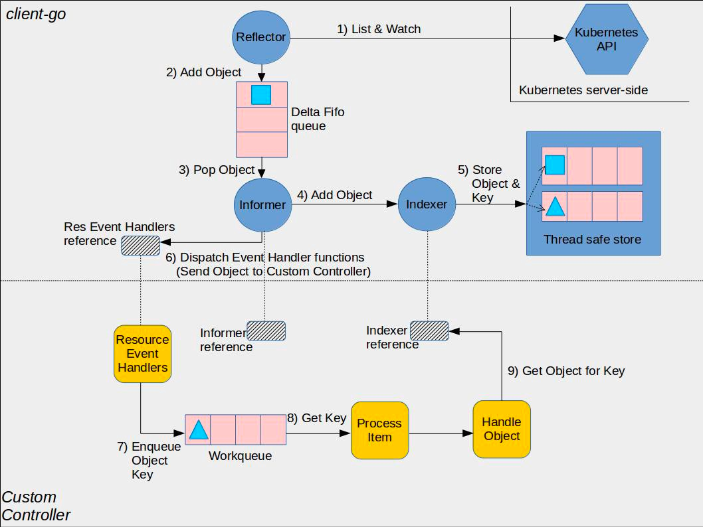
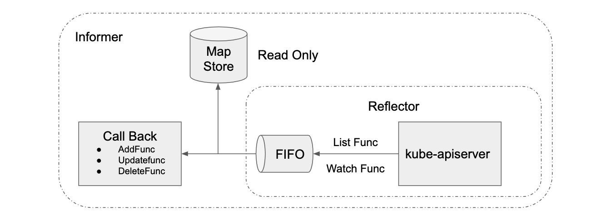

# List-Watch

**Declamation**: This note is not a walk-through of list-watch implementation, and some implementation
details might not be up-to-date. The source code could be found at <https://github.com/kubernetes/client-go/blob/master/tools/cache/listwatch.go>.

## What is list-watch

ETCD stores all the data, and apiserver is the only entrance if the client wants to perform any CRUD
operation. When client(kubelet, scheduler, controller-manager) needs to talk to apiserver, should
client pull? Or apiserver push?

- If client pull: 1) how frequent? 2) will it increase the pressure of apiserver?
- If apiserver push: 1) broadcast to everyone?

In K8S, the clients(kubelet/scheduler/controller-manager) use list-watch to get the real-time events
of the resources(pod/replicasets etc). And invoke the corresponding handler to process the event.

### List API

`GET /api/v1/pods`

### Watch API

`GET /api/v1/watch/pods`

### High level workflow





- Call list API to get a list of resources.
- Call watch API to watch the events of resources' CRUD.
- Add object to FIFO queue.
- Registered callback function process the object.

## How watch works

To watch a real-time event, it needs a long HTTP connection. K8S uses HTTP [chunked-transfer-encoding](https://en.wikipedia.org/wiki/Chunked_transfer_encoding).

- Client calls watch API.
- apiserver respond with `Transfer-Encoding: chunked` within the response header.

```shell
$ curl -i http://{kube-api-server-ip}:8080/api/v1/watch/pods?watch=yes
HTTP/1.1 200 OK
Content-Type: application/json
Transfer-Encoding: chunked
Date: Thu, 02 Jan 2019 20:22:59 GMT
Transfer-Encoding: chunked

{"type":"ADDED", "object":{"kind":"Pod","apiVersion":"v1",...}}
{"type":"ADDED", "object":{"kind":"Pod","apiVersion":"v1",...}}
{"type":"MODIFIED", "object":{"kind":"Pod","apiVersion":"v1",...}}
...
```

## Why list-watch is elegant

A good async messaging system, we need to consider:

- Reliability(no message lost)
- Real-time
- Ordering/concurrency
- Performance

Watch is more like edge-trigger with delta data. It guarantees the real-time.

List is more like level-trigger with full set of data. When there are connection issue on watch, it
guarantees the reliability. We could use very frequent list to achieve the close to real-time, but
it is too costy.

K8S uses resourceVersion to guarantee the ordering(concurrency).