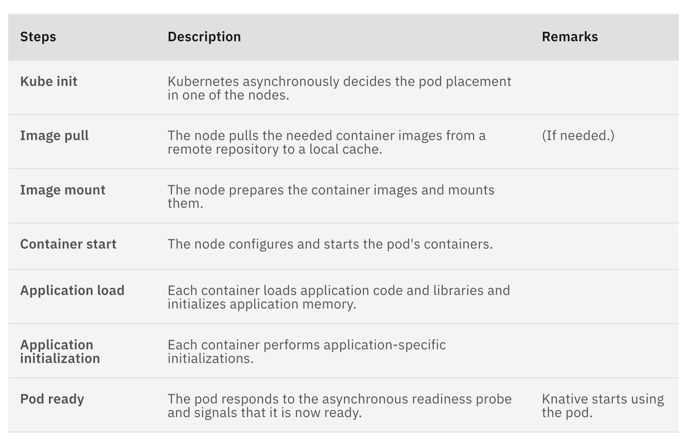
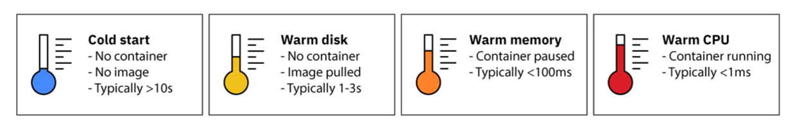

# Pod cold start performance

In Knative, it is possible to scale down K8S service to have 0 running pods when service is idle. But how fast we are to
bring a Pod back (from 0 to 1).

## Break down a Pod's cold start

Please read this [note](../how-pod-created-with-network-configured/readme.md) first to understand how Pod get created
with a networking configured.

The following is a table describes K8S process to ready a Pod. And all those steps take time.

## Scale from zero options

* Cold start: No images are pulled, container must be started from scratch. This typically takes 10-15 seconds.
* Warm disk start: Images are pulled or cached on node, container must be started from scratch. this typically takes
  several seconds.
* Warm memory start: Container has been paused, and needs to be resumed. This typically takes < 100ms.

## Tweak scaling performance

* Not scale to zero, have at least 1 Pod running.
* Scale down delay: Increase the time window before a downscaling decision is made. Prevent application from scaling
  down and scaling back up rapidly and repeatedly.
* Scale to zero pod retention period: Allow the last pod to remain a period of time after a scale-to-zero decision has
  been made.
* Asynchronous deferred invocation: Queue up the request to unblock user while waiting for Pod to get cold started.
* Cache application images on nodes.
* Tweak application to use light base image.

More details can be found in [this](https://www.youtube.com/watch?v=fv-TkMOM0bk&ab_channel=CNCF%5BCloudNativeComputingFoundation%5D)
KnativeCon talk.

## References

* <https://developer.ibm.com/articles/reducing-cold-start-times-in-knative/>
* <https://www.openfaas.com/blog/fine-tuning-the-cold-start/>
* <https://www.youtube.com/watch?v=fv-TkMOM0bk&ab_channel=CNCF%5BCloudNativeComputingFoundation%5D>