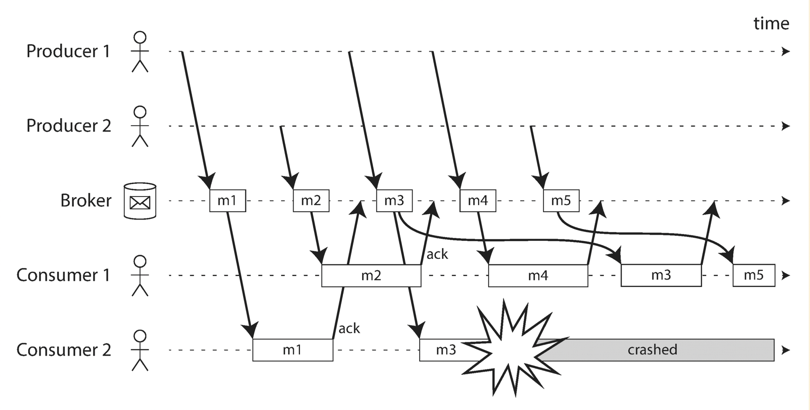
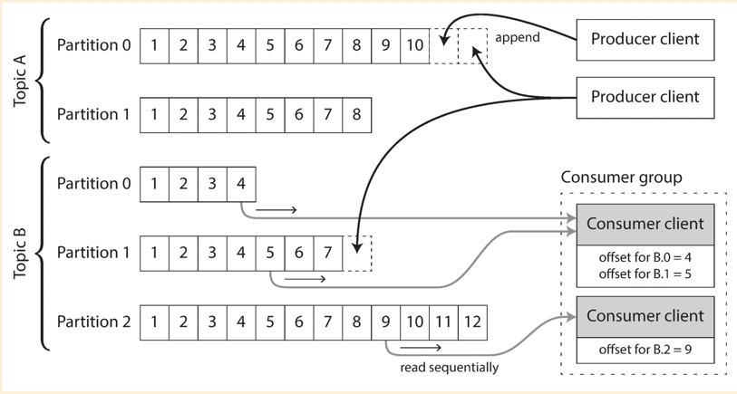
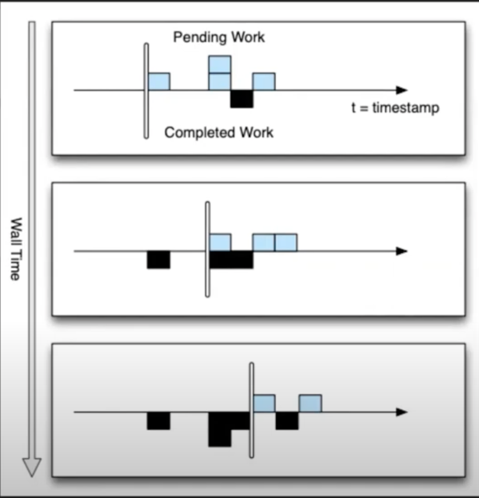

# Stream processing

## Why do we need stream processing

- In reality, data is usually unbounded.
- Batch process causes delay, i.e., the output will only be available next day if using daily batch process.
- A stream refers to data that is incrementally made available over time.

## Transmitting event streams

### Event

- Event is usually a small, self-contained, immutable object containing the details of something that happened at some PIT.
- Event could be encoded text string, JSON or binary format.

### Messaging system

Producer sends a message containing the event, which is then pushed to consumers.

- What happens if producer sends messages faster than consumer process them?
  - Drop messages.
  - Buffer messages in a queue.
  - Backpressure to block producer sends more messages.
  - Unix pipe and TCP uses fixed-size buffer once it is filled up, the sender is blocked until there is room to feed in
    more data.
- What happens if node crashes?
  - Might need to write to disk or replication. Sometimes have to trade performance for durability.

#### Direct messaging from producer to consumer

- Direct HTTP or RPC request to push messages to consumer over the network
- UDP multicast is mostly used for streaming stock market feeds.

It is the responsibility of application to handle the message lose and failure.

#### Messaging through broker(mindset: transient messaging)

A broker is essentially a data store system (could be in-memory or on disk or hybrid) where producer sends message to broker,
then broker pushes message to consumer, once the message is delivered/processed it will be deleted from broker. Producer
does not wait for consumer to get the message processed.

Well known products: RabbitMQ, ActiveMQ, Azure Service Bus, Google Cloud Pub/Sub.

##### Multi consumers

- Load balancing: Each message is sent to one of the consumers.
- Fan-out: Each message is sent to all consumers.

##### Delivery guarantee

- Based on ack from consumer. If no ack, broker assume the message is not delivered and may redeliver it. Consumer needs
  to be idempotent and handle the duplication.
- Redelivering message in load balancing mode might cause the message to be reordered from consumer side.

  

##### Message broker compares to database

- Databases keep data until it is explicitly deleted; Most message broker deletes message once it is successfully delivered
  to consumer.
- Message broker assumes the working set is relatively small (small queue). If in-memory queue cannot hold more message,
  message broker might spill message to disk, and the performance might degrade.
- Databases have secondary indexing; Message broker might only support subscribing to a subset of the topic.
- Databases support query; Message broker does not.

### Partitioned logs(mindset: permanent traceable/repeatable messaging)

The broker behinds this is also called log-based message broker.

- Producer sends message by appending it to the end of the log.
- Consumer receives the message by reading sequentially from the log.
  - Consumer maintains the offset.
  - Reading message does not delete it from the log.
  - Partition : Consumer client = m : 1 (single thread manner).
    - This will cause head-of-line blocking if one message is slow to be consumed.
    - Number of consumer client <= m.
- Log could be partitioned and hosted by different machines.
- A topic could be defined as a group of partitions.

Well known products: Apache Kafka, Amazon Kinesis Streams, Twitter's DistributedLog.

#### Offsets

- Consumer client maintains its own offset.
- Broker periodically records the offset of each consumer client offset(to handle consumer failure).

#### Disk space usage

- Log is segmented(might be implemented as ring-buffer on disk) and old segments are deleted or archived.
- If segments are archived or deleted before consumer reads from it, there would be a problem. But usually the buffer on
  disk is large enough to hold messages up to several days or even weeks.

#### Failure handling

- Log partition could be replicated (leader-based). A centralized service could be used to track where the partition/replica
  is. Old version of Kafka was using ZooKeeper, and its latest version replaced ZooKeeper with a self-managed metadata
  service([details](https://cwiki.apache.org/confluence/display/KAFKA/KIP-500%3A+Replace+ZooKeeper+with+a+Self-Managed+Metadata+Quorum)).
- Single consumer failure would not affect other consumers.
- Producer failure would not affect message broker or consumers.

## Databases and Streams

### Change data capture

Databases usually write the data change to its WAL, and a log-based message broker is well suited for transporting the change
log from the source database to the derived system. Facebook Wormhole is exactly implemented to capture the database logs
and replicated to remote system.

### Event sourcing

TBA

## Process streams

### Event time and processing time

The event occurrence time usually is not equal to the event processing time, network slowness or consumer failure could
cause the event received has an older timestamp than the backend server. The out-of-order events might cause a bad result in
stream analysis, i.e., google search query trend analysis.

#### Which time to use

- Event occurrence time
- Event sent to server time
- Event received by server time

Using above three timestamps, we could calculate the time drift and estimate the true time the event was actually occurred.

#### Define time window

- Have event occurrence time and server time, but need to have the consensus on a single view of time or time window.
  Apache Flink and Google MillWheel uses low-watermark as the single view of time for stream processing.
- For current processor, `myLowWatermark = min(time of my oldest pending work, low watermark from all upstream producers)
  

#### Type of time window

- Fixed window
  - Tumbling window: all the events with timestamps between `10:03:00` and `10:03:59` are grouped into one window, events
    between `10:04:00` and `10:04:59` into the next window.
- Floating window
  - Hopping window: a 5-minute window with a hop size of 1 minute would contain the events between `10:03:00` and `10:07:59`,
    then the next window would cover events between `10:04:00` and `10:08:59`, and so on.
  - Sliding window: a 5-minute sliding window would cover events at `10:03:39` and `10:08:12`.
- Session window: no fixed duration, window ends when session becomes inactive.

### Stream joins

#### Stream-stream join(window join)

Example: Calculate click-through rate of a URL, there will be two types of events: (a) Type in a search query, (b) Click
on the search result. We want to combine two types of events for calculation.

Challenges:

- Two events could be received at different point of time. Could be from few seconds to few hours(network partition).
- Two events could be received out of the order.

Solutions:

- Embed the search details in click event. This does not help to calculate the search results which are not clicked.
- Stream processor maintains a state:
  - In a particular time window, have `SessionID: Set of events(including search events and query events with no duplication)`

#### Stream-table join(stream enrichment)

Example: The input is a stream of activity events containing a user ID, and the output is a stream of activity events in
which the user ID has been augmented with profile information about the user.

Challenges:

- Database query for event enrichment is slow and likely to overload the database.

Solutions:

- Load enrichment data from cache, but cannot have strong consistency guarantee.

#### Table-table join(materialized view maintenance)

Example: Twitter user post/delete a tweet, follow/unfollow another user will get two tables involved.

- When user u sends a new tweet, it is added to the timeline of every user who is following u .
- When a user deletes a tweet, it is removed from all users’ timelines.
- When user u 1 starts following user u 2 , recent tweets by u 2 are added to u 1 ’s timeline.
- When user u 1 unfollows user u 2 , tweets by u 2 are removed from u 1 ’s timeline.

Challenges and Solutions: TBA

#### Time dependence of joins

Challenges:

- Join processing is not idempotent. Enrichment data might be updated from time to time.
- Multiple events could be delivered in different order.

Solutions:

- Using unique identifier + version. i.e., event-1:v1

### Fault tolerance in stream processing

- Micro-batching
  - Used by Spark Streaming.
  - One second is a micro-batch.
  - *Wait the micro-batch processing to finish before going to next.
- Checkpoint
  - Used by Apache Flink and Google MillWheel.
  - Periodically generate rolling checkpoint of state and write to durable storage.(Strong production and weak production).
  - Restart from last checkpoint if stream processor crashes.
- Recover the processor state
  - Kafka Streams replicate state changes by sending them to a dedicated Kafka topic with log compaction.
  - Flink periodically captures state snapshot and write to durable storage.
  - Rebuild state from input stream.

`Micro-batching or Checkpoint` + `Atomic distributed transaction or Idempotence` make sure the **exactly-once** semantics
of steam processing.