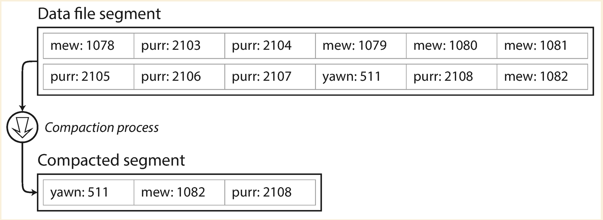
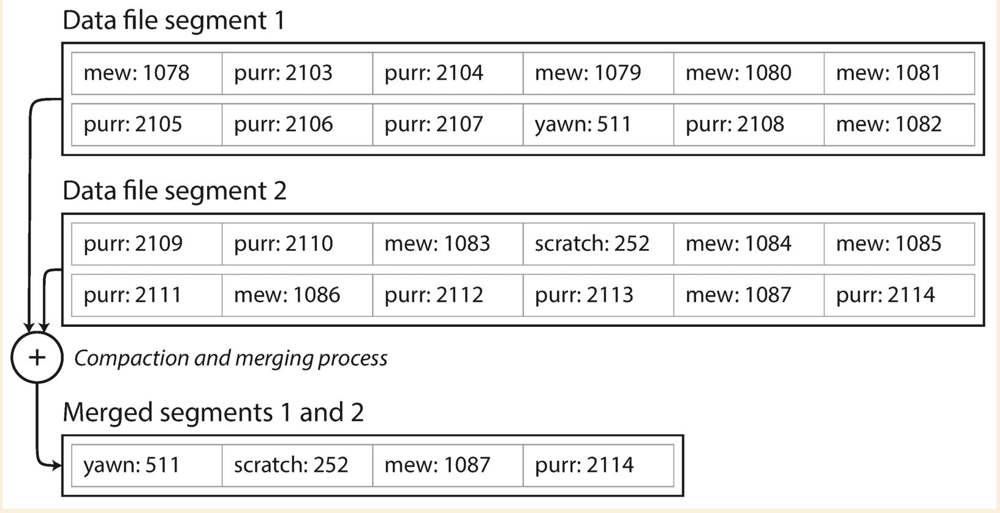

# Log structured storage

## Solution 1 (Simply append)

- On write: Append to log file
- On read: Serach in log file

### Analysis

- On write, simply append operation is efficient, but the log file could be huge
- On read, search in a log file for query is inefficient, especially data is large

### Improve on read

**Hash Index**: Maintain a **in-memory** hash table. `Key` is the index key and `Value` is the offset of the value in
file. So each time we want to read the data, we could get the file offset from hash table and find the starting offset
where the latest data is stored.

On read, get the offset from the hash table then read the data starting from the offset until `\n`

On write, append new record into log file, update the hash table to reflect the latest offset. So there will be two
operations: update `in-memory` hash table and append to log file

### Improve on write

- Append new data into separate log file (log segements)
- Async compaction and segements merging
- For deleting records, append a tombstone record and ignore old records on compaction and merging

On write, append new record into current log file (update current hash table) or into new log file
(create a new hash table). Each log segement has its own `in-memory` hash table, because new records are appended into
log file.

On read, search in the most recent `in-memory` hash table first and then the second most recent until find the key.

Compacting and merging log segements are performed in the background on previous log files and `in-memory` hash tables.
Because current ones are still serving the write operation.

### why we need compaction and merging

Compaction means throwing away duplicate keys in the log, and keeping only the most recent update for each key.

since compaction often makes segments much smaller (assuming that a key is overwritten several times on average within
one segment), we can also merge several segments together at the same time as performing the compaction,

### Crash recovery

`in-memory` hash table, it could be either rebuilt on system reboot (takes long time if log file is large) or restoring
the hash table from snapshot.

Crash could happend in between of the disk IO. File system crash recovery solution could help: <https://web.stanford.edu/~ouster/cgi-bin/cs140-winter13/lecture.php?topic=recovery>

### Remaining issues

- Data in log segment file is discrete
- Compacting and merging on segement files are not efficient
- Maintain the same number of `in-memory` hash tables as segement files
- Range queries are not efficient

## Solution 2 (SSTables and LSM-Trees)

- Make the segement file sorted by keys (Keep the recent data entry if keys are same)

  Benefits: Data in log segement file is sorted; Compacting and merging is easier (Merge sort)

- No need to maintain the same number of `in-memory` hash tables as segement files. Only maintain one table with the
  value of a particular key points to the head of sorted segment file address. Two keys in the `in-memory` hash table
  could represent a range, which makes the range query possible

### Analysis

#### On write

- Have a `in-memory` red-black or AVL tree data structure to hold the new data (the tree is sorted by keys)
- When hit the threshold of current tree, we write the tree onto disk as the **sorted segement file** (SSTable).
  Compacting and merging could happen in background
- Once data is written onto disk, update the `in-memory` hash table. Key and Value point to the first record in the sorted
  segment file

#### On read

- Look for `in-memory` red-black or AVL tree first
- If red-black or AVL tree does not have the record, we look the most recent sorted segement file
- For range query, we might need to look into multiple sorted segment files

### Improve on read

If the key we are looking for does not exist, we have to check the current `in-memory` red-black tree first and then
scan the SSTable on disk from most recent to oldest. Storage engines usually use
**`Bloom filters`** ([wiki](https://en.wikipedia.org/wiki/Bloom_filter)) to improve the performance.

### Crash recovery

It is possible that system crashes before writing `in-memory` red-black or AVL tree onto disk as the SSTable. We could
have a write ahead logging like journaling file system to track the changes before writing data into the `in-memory`
red-black or AVL tree.