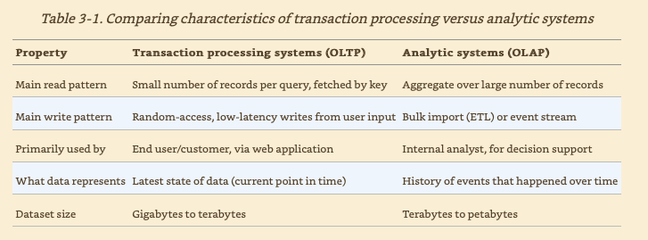

# OLTP VS OLAP

The telemetry data is usually sent to data warehouse for business analysis. One of the popular products is
[tableau](https://www.tableau.com/).

## Star schema (dimentional modeling)

When customers want to dump data into data warehouse, they usually have to define the data schemas. There usually have
a centralized table named `fact_table`, and `dimentional_tables` which the central table has references to.

## Pain from query against row oriented table

One of the pain BA has is the slowness of the query. Because BA usually queries from large set of data, and each query
has to load the entire row if the table is `row-oriented`. That is why we have introduced the
[column-oriented storage](./column-oriented-storage.md)