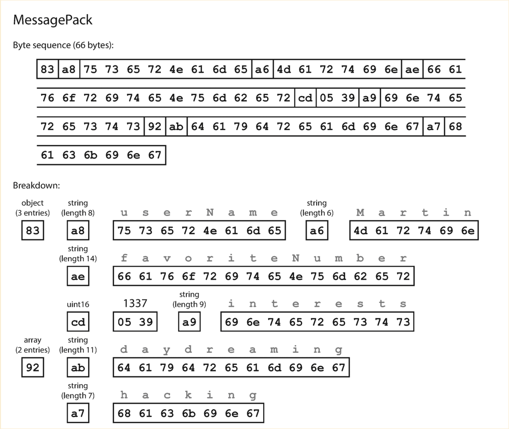
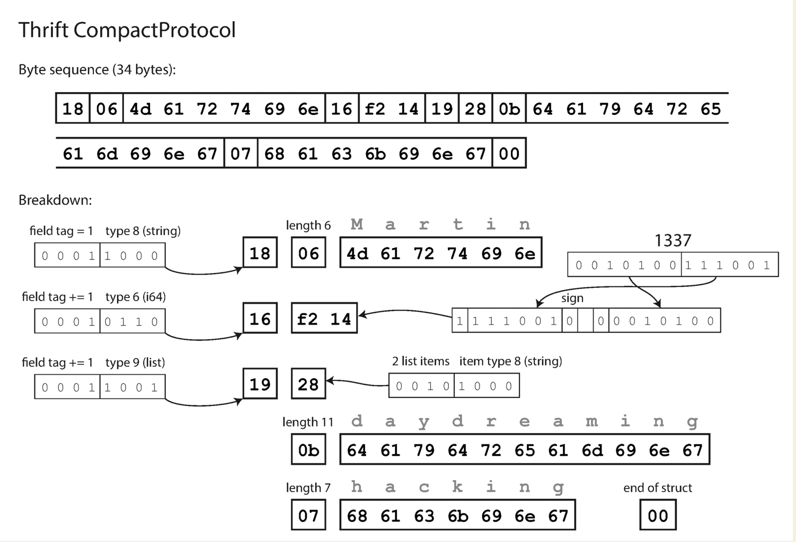
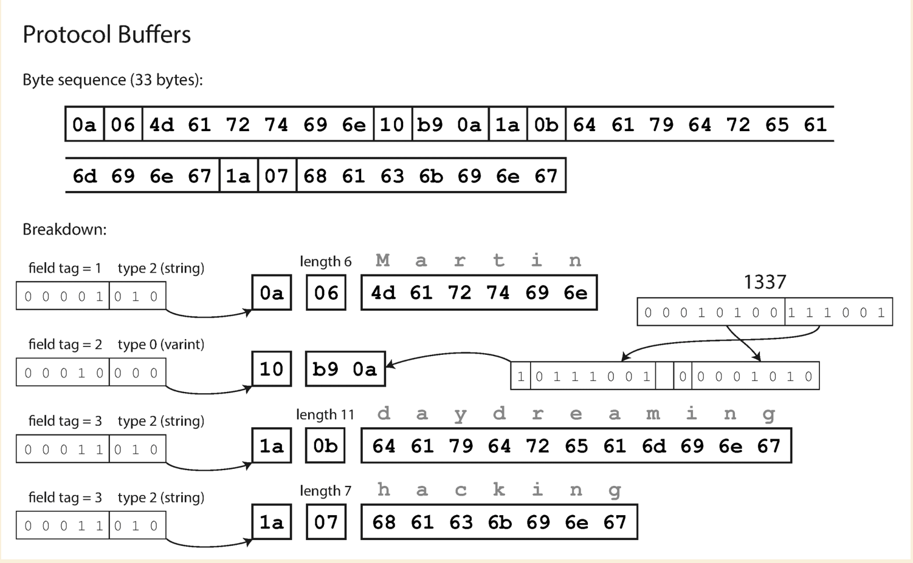
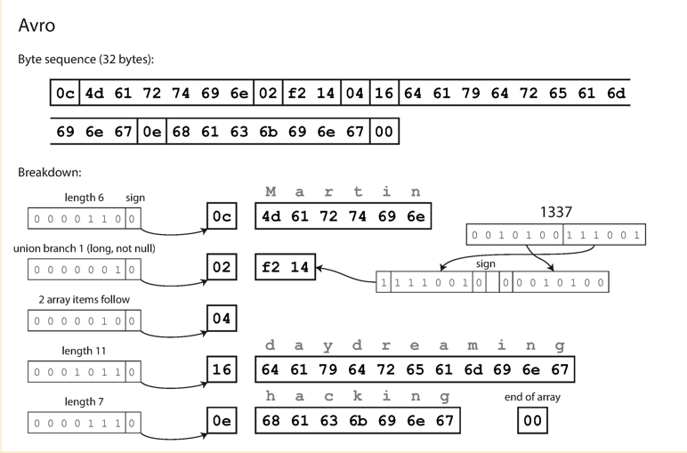
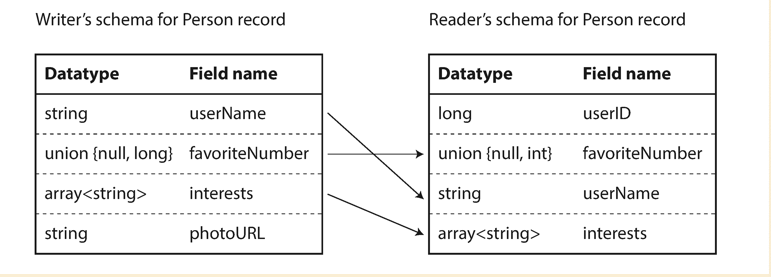
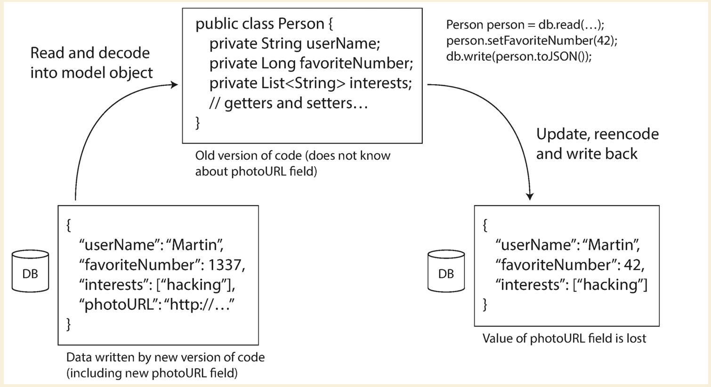

# Encoding and evolutiion

## Formats for encoding

- XML and CSV cannot distinguish between a number and a string
- JSON can distinguish numbers and strings, but cannot distinguish integers and floating numbers
- JSON and XML do not support binary strings, sometimes people use base64 encode the binary strings

### Binary encoding

JSON and XML are not compact and fast compared to binary formats. So people think of encode JSON or XML in binary format,
but they need to include all object field names within the encoded data since it does not use prescribed schema.

For example:

``` json
{
    "userName" : "Martin" ,
    "favoriteNumber" : 1337 ,
    "interests" : [ "daydreaming" , "hacking" ]
}
```



### Thrift and Protocal Buffers

- binary encoding libraries
- no field keys in the encoded data
- has tag, type, length and value for each field

``` thrift
struct Person {
    1 : required string userName,
    2 : optional i64 favoriteNumber,
    3 : optional list < string > interests
}
```




``` protobuf
message Person {
    required string user_name = 1 ;
    optional int64 favorite_number = 2 ;
    repeated string interests = 3 ;
}
```



#### New code has a new field added

``` protobuf
message Person {
    required string user_name = 1 ;
    optional int64 favorite_number = 2 ;
    repeated string interests = 3 ;
    optional int64 user_age = 4;
}
```

Old code can read the record that is written in new code by simply ignore the tag 4.

New code can read the record that is written in old code by simply setting the field 4 with its default value.
**Important: New field cannot be requried. The tags of old field cannot be changed.**

#### New code has removed a field

``` protobuf
message Person {
    required string user_name = 1 ;
    repeated string interests = 3 ;
}
```

Old code can read the record that is written in new code by simply setting the field 4 with its default value.

New code can read the record that is written in old code by simply ignore the tag 4.

#### Changing datatype

This operation might cause the value to lose prcision or get truncated.

### Avro

Avro is another binary encoding format that is differnt from Protobuf and Thrift. It also uses schema to specify the
data structure of data being encoded.

``` Avro
record Person {
    string userName ;
    union { null , long } favoriteNumber = null ;
    array < string > interests ; }
```

- No tag numbers in schema. The encoding simply consists of values concatenated together
- No `optional` or `requried` markers, it has `union` types and default values instead



If we do not have the tag number to identify each fields, the binary data can only be decoded in the correct order only
if the code reads the data uses exactly the same schema. **However Avro does not require the schema to be the same,
only requries they are compatible.**



- Avoro lib resolves the diffs by comparing the writer's schema and reader's schema side by side, and translate the data
  from writer's schema to reader's schema
- Reader looks for the field from writer's schema, if it does not exist then set the default value
- Writer's field which does not exsit in reader's schema, it will be ignored
- In order to guarantee the forward and backward compatibility, only fields with default values could be added or removed

### How does reader know the writer's schema

#### How does reader know the writer's schema - Thrift and Protobuf

**Writer**: Using protobuf as the example, writer has to define the schema in a `.proto` file which look like as below:

``` protobuf
syntax = "proto3";
package tutorial;

import "google/protobuf/timestamp.proto";

option go_package = "github.com/danniel1205/explore-protobuf/tutorialpb";

// [START messages]
message Person {
  string user_name = 1;
  int64 favorite_number = 2;  // Unique ID number for this person.
  repeated string interests = 3;
  google.protobuf.Timestamp last_updated = 4;
}
// [END messages]
```

**Reader**: Reader has to use the same schema or compatible schema in order to unmarshal the binary data properly.

#### How does reader know the writer's schema - Avro

- Include writer's schema once at the beginning of the file, like storing a large file with millions of records in Hadoop.
- For database, include a version number with the encoded record. The version number is the reference of a list of schema
  versions in database.
- For sending data over network, negotiate the schema version on connection setup and then use it for the lifetime of
  the connection.

Above might apply to `thrift` and `protobuf` as well.

### Dynamic generated schemas

We have a relational database, and want to dump its contents into file or transfer over network, using binary format is
a better way. Generate a `Avro` schema from database schema is easier than `thrift` and `protobuf` which has tag numbers
in their schema. The reasons are:

- Easily map columns into `Avro` schema
- Schema revolution is easier to be handled
  - `Avro` does not have to care about the tag numbers
  - `Thrift` and `Protobuf` need to generate the tag numbers manually and handle it carefully if a new column is added
    in a database table

### Merits of Schemas

`Protobuf`, `Thrift` and `Avro` all use schema to describe a binary encoding format.

- Can be more compat, can omit field name from the encoded data
- Having a database of schemas allow you to check forward and backward compatibility of schema changes before anything
  is deployed
- The generated code from a schema is useful. Like `Protobuf` generats code from `.proto` file

### Modes of dataflow

#### Dataflow through databases

The process that writes to the database encodes the data. The process that reads from the database decodes the data.

Usually there are multiple processes accessing the database, some of them could have the new version of schema, while
others have the old version. The most important **rule** is to keep the field that does not belong to current version
of schema intact!

See the following diagram for more details. We SHOULD NOT remove the `photoURL` after writing the data back.


#### Dataflow through service calls

- Servers and clients of a service or mutiple microservices have multiple versions. So we need to make sure the schemas
  are compatible across versions.
- A network request is unpredictable. `package lost`, `request timeout`, `network latency`. We need to handle this
  carefully, simply `retry` might cause the action to be performed multiple times.
- Data types of parameters need to be translated between different programming languages.
- Handle the upgrade of the service in prior to clients, which means the schamas need to be backward and forward compatible.

#### Dataflow through asynchronous message passing

The asynchronous messaage passing system uses a `message broker` to receive and deliver messages. The messages are usually
one way, the sender usually does not expect to receive a reply on the message sent. (RPC is a request/response dataflow)

There are several advantages using `message broker`:

- messages could be buffered
- auto redeliver the message.
- sender does not need to know the IP address of receiver
- one message could be sent to multiple receivers

### Additional refs

- <https://developers.google.com/protocol-buffers/docs/gotutorial>
