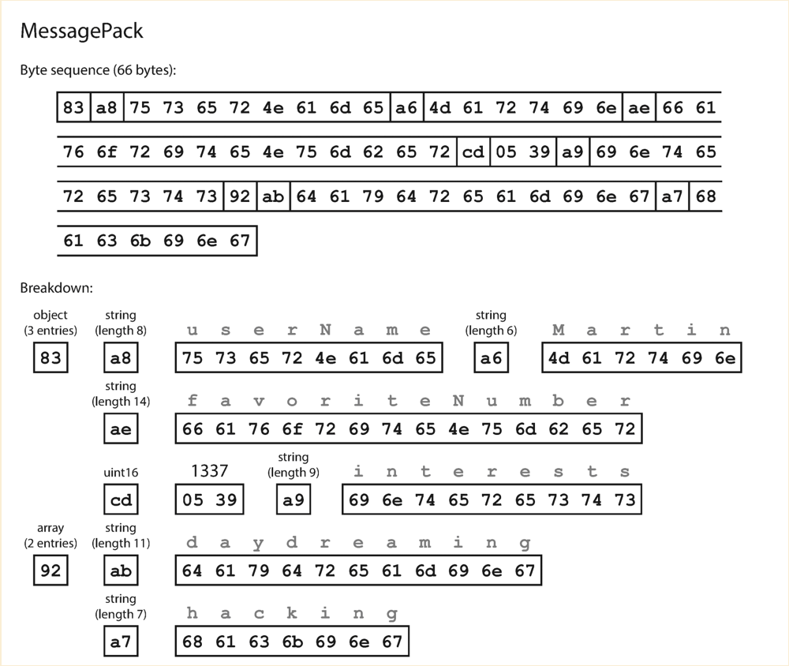
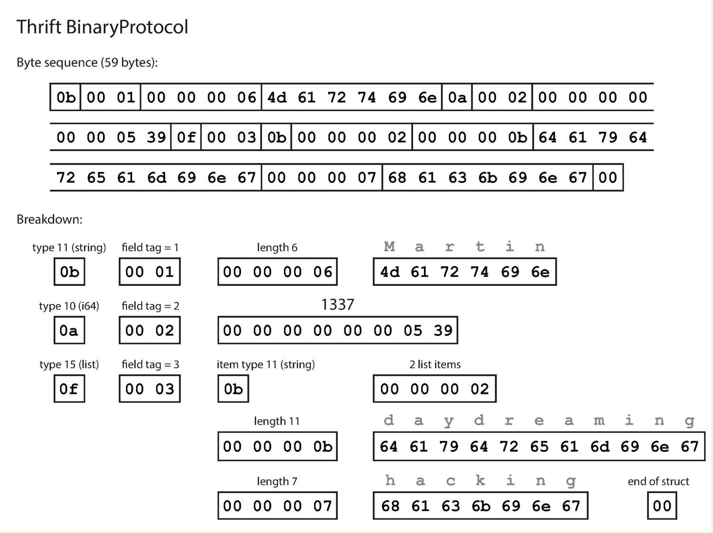
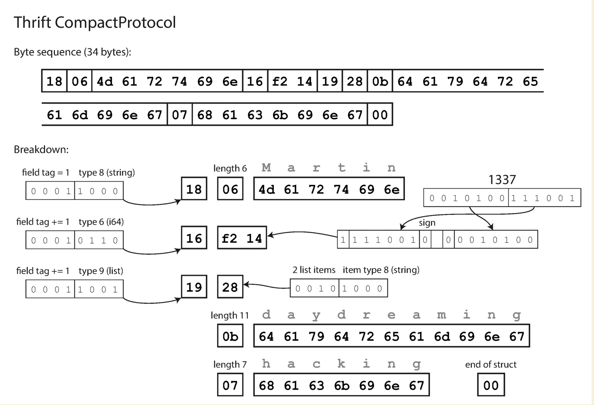
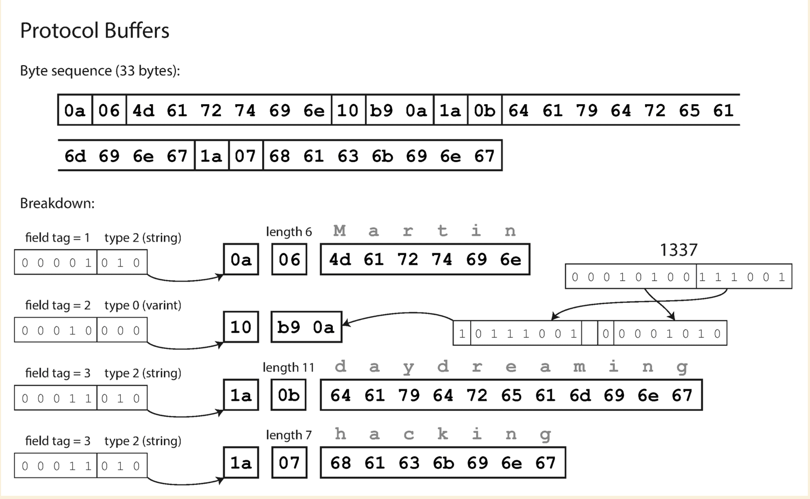

# Encoding and evolutiion

## Formats for encoding

- XML and CSV cannot distinguish between a number and a string
- JSON can distinguish numbers and strings, but cannot distinguish integers and floating numbers
- JSON and XML do not support binary strings, sometimes people use base64 encode the binary strings

### Binary encoding

JSON and XML are not compact and fast compared to binary formats. So people think of encode JSON or XML in binary format, but they need to include all object field names within the encoded data since it does not use prescribed schema.

For example:

``` json
{
    "userName" : "Martin" ,
    "favoriteNumber" : 1337 ,
    "interests" : [ "daydreaming" , "hacking" ]
}
```



### Thrift and Protocal Buffers

- binary encoding libraries
- no field keys in the encoded data
- has tag, type, length and value for each field

``` thrift
struct Person {
    1 : required string userName,
    2 : optional i64 favoriteNumber,
    3 : optional list < string > interests
}
```




``` protobuf
message Person {
    required string user_name = 1 ;
    optional int64 favorite_number = 2 ;
    repeated string interests = 3 ;
}
```



#### New code has a new field added

``` protobuf
message Person {
    required string user_name = 1 ;
    optional int64 favorite_number = 2 ;
    repeated string interests = 3 ;
    optional int64 user_age = 4;
}
```

Old code can read the record that is written in new code by simply ignore the tag 4.

New code can read the record that is written in old code by simply setting the field 4 with its default value. **Important: New field cannot be requried. The tags of old field cannot be changed.**

#### New code has removed a field

``` protobuf
message Person {
    required string user_name = 1 ;
    repeated string interests = 3 ;
}
```

Old code can read the record that is written in new code by simply setting the field 4 with its default value.

New code can read the record that is written in old code by simply ignore the tag 4.

#### Changing datatype

This operation might cause the value to lose prcision or get truncated.

### Avro

### Merits of Schemas
