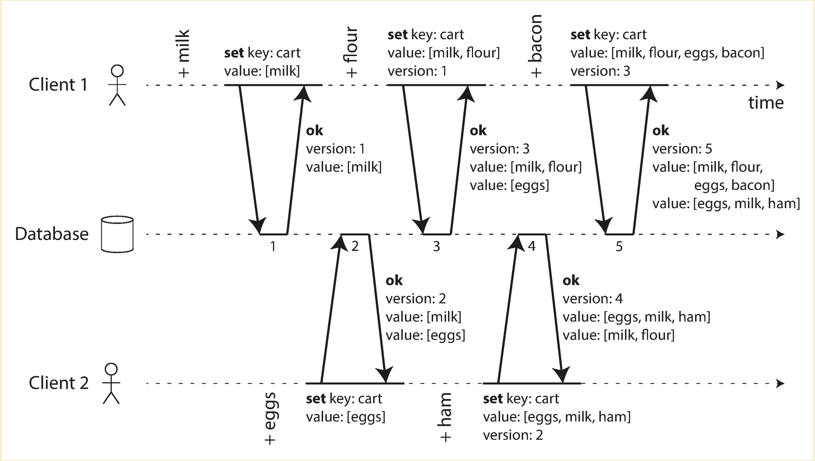

# How to handle concurrent write

In distributed system, concurrent writes to the same data are quite often. We want to handle it properly to fullfil the
following requirements:

- The data in the system needs to be consistent among all replicas.
- The data in the system needs to reflect user desired change.
- The repeatedly read requests against the system return the consistent latest written data.

## Single Machine

### Last write wins

The last write to the database is treated as the latest data. So no matter who reaches database will overwrite the value.

- `The data in the system needs to be consistent among all replicas` : Yes

  Since there is only 1 replica, so the data is always consistent.

- `The data in the system needs to reflect user desired change` : No

  When user set `apple:5`, it could read `apple:1` back if the request sets `apple:1` arrives the database last.

- `The repeatedly read requests against the system return the consistent latest written data` : Yes

  Since the single database will always have the latest data written by client unless there are other requests set the
  newer data.

How could we improve to make the data stored in system reflects user desired change ? In another word, we do not want to
lost user input, so `Last write wins` does not fit any more.

### Involve version for each write

Server tracks an increment only version number, so concurrent write requests could be easily detected if the incoming
request has the version smaller than the one server expects.

#### Reject the write which version is smaller than server expect

If we reject the write request which has smaller version number, client knows there is a write conflict and could retry
the writes. By doing this, all three properties above are fulfilled.

#### Accept the write which version is smaller than server expect, but track the conflicts and let client to solve it

For shopping cart app, the concurrent writes could be solved as below:

By doing this, we are not only returning the latest written data, but also returnning other versions with the conflicts,
and let client code to merge the conflicts.

## Multiple Machines

- `The data in the system needs to be consistent among all replicas` : Eventual consistency

  If we have a distributed system with multiple machines, we are kind of giving up the strict consistency, because we
  have one node handles write requests and multiple nodes handle read requests in the case of leader based. Making nodes
  to be synchronized could not be done immediately.

- `The repeatedly read requests against the system return the consistent latest written data` : Eventual consistency

  The same reason as above

If we want to garantee the strict consistency, we have to direct write and read requests to the same nodes/partition.

### Leader based

- `The data in the system needs to reflect user desired change` : Yes

  Using [this solution](#involve-version-for-each-write).

### Leaderless

- `The data in the system needs to reflect user desired change` : Yes

  Using `version vector` could have this supported.

#### Version vector

[Blog](https://riak.com/posts/technical/vector-clocks-revisited/index.html?p=9545.html#equalvv)

The version based solution mentioned above might not work in leaderless case where all nodes could take write requests.
If letting each node to have its own copy of the version, it is hard to make all versions among nodes consistent.
If we have a central versionning system, should this kind of system distributed or single machine based ? So we are
going to have a different solution for this - `version vector`.

